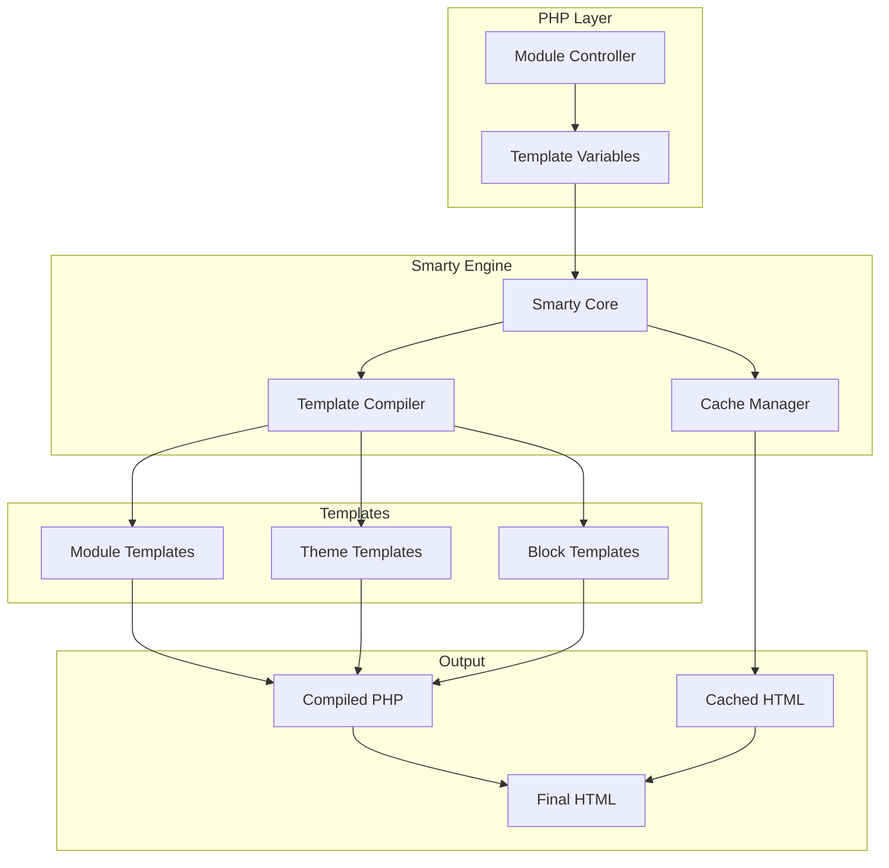
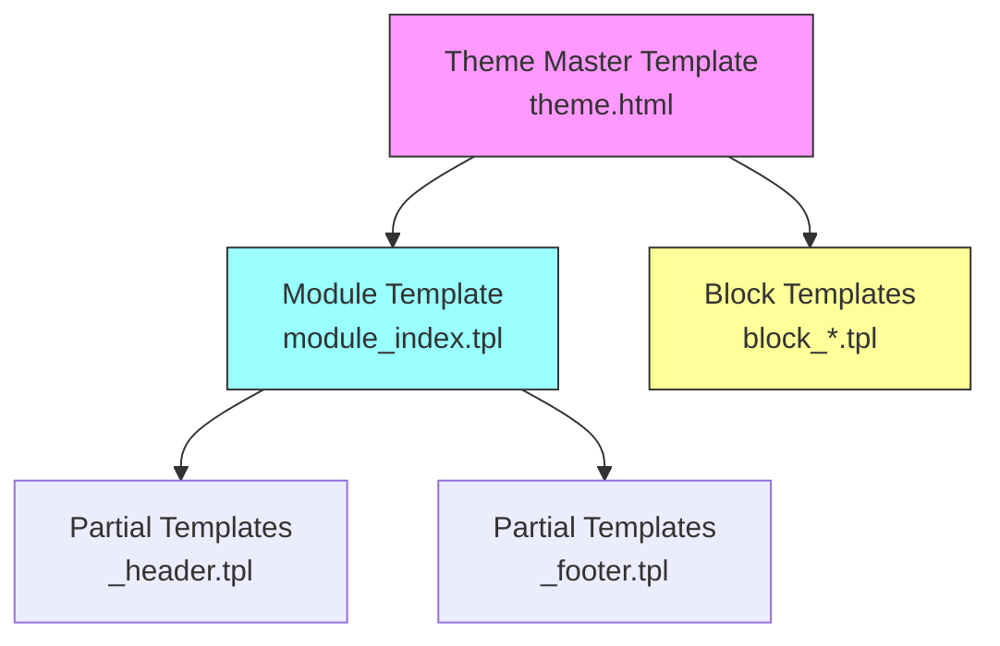
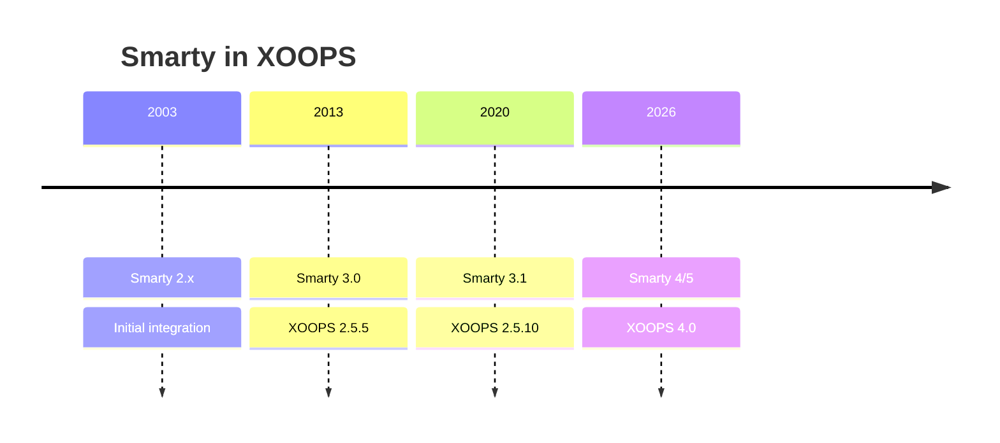

# ADR-003: Mesin template (Smarty)

> Catatan Keputusan Arsitektur untuk adopsi mesin template Smarty oleh XOOPS.

---

## Status

**Diterima** - Keputusan core sejak XOOPS 2.0

**Berkembang** - Migrasi ke Smarty 4/5 direncanakan untuk XOOPS 4.0

---

## Konteks

XOOPS memerlukan solusi templating yang akan:

1. Pisahkan presentasi dari logika bisnis
2. Izinkan desainer theme bekerja tanpa sepengetahuan PHP
3. Mendukung warisan template dan menyertakannya
4. Menyediakan cache untuk kinerja
5. Aktifkan template yang dapat disesuaikan pengguna
6. Mendukung internasionalisasi

---

## Diagram Keputusan



---

## Keputusan

Kami akan menggunakan **Smarty** sebagai mesin template karena:

### 1. Pemisahan Kekhawatiran

```php
// PHP (Controller) - Business logic
$items = $itemHandler->getPublishedItems();
$xoopsTpl->assign('items', $items);

// Smarty (View) - Presentation
// templates/items.tpl
```

```smarty
{* Smarty template - No PHP logic *}
<{foreach item=item from=$items}>
    <article>
        <h2><{$item.title}></h2>
        <p><{$item.summary}></p>
    </article>
<{/foreach}>
```

### 2. Pembatas XOOPS

XOOPS menggunakan `<{` dan `}>` bukan `{` `}` standar:

```smarty
{* Standard Smarty *}
{$variable}

{* XOOPS Smarty - Avoids JavaScript conflicts *}
<{$variable}>
```

### 3. Hierarki template



### 4. Penyimpanan template

- **Database**: template khusus yang disimpan untuk kemampuan pengembalian
- **Sistem File**: template asli di direktori module
- **Cache**: template yang dikompilasi untuk kinerja

---

## Konfigurasi Smarty

```php
// XOOPS Smarty initialization
$xoopsTpl = new XoopsTpl();

// Custom delimiters
$xoopsTpl->left_delim = '<{';
$xoopsTpl->right_delim = '}>';

// Caching
$xoopsTpl->caching = XOOPS_TEMPLATE_CACHE;
$xoopsTpl->cache_lifetime = 3600;

// Security
$xoopsTpl->security_policy = new Smarty_Security($xoopsTpl);
$xoopsTpl->security_policy->php_functions = [];
$xoopsTpl->security_policy->php_modifiers = ['escape', 'count'];
```

---

## Fitur template yang Digunakan

### Variabel

```smarty
{* Simple variable *}
<{$title}>

{* Object property *}
<{$item.title}>

{* With modifier *}
<{$content|truncate:200:'...'}>

{* Escaped output *}
<{$userInput|escape:'html'}>
```

### Struktur Kontrol

```smarty
{* Conditional *}
<{if $isAdmin}>
    <a href="admin.php">Admin</a>
<{elseif $isUser}>
    <a href="profile.php">Profile</a>
<{else}>
    <a href="login.php">Login</a>
<{/if}>

{* Loop *}
<{foreach item=item from=$items name=itemloop}>
    <{$smarty.foreach.itemloop.index}>: <{$item.title}>
<{/foreach}>
```

### Termasuk

```smarty
{* Include another template *}
<{include file="db:mymodule_header.tpl"}>

{* Include with variables *}
<{include file="db:mymodule_item.tpl" item=$currentItem}>

{* Include from theme *}
<{include file="file:$theme_path/partials/sidebar.tpl"}>
```

---

## Konsekuensi

### Positif

1. **Ramah desainer**: Sintaks mirip HTML
2. **Caching**: Caching template bawaan
3. **Keamanan**: isolasi kode PHP
4. **Fleksibilitas**: Pengubah, fungsi, plugin
5. **Kustomisasi**: Pengguna dapat memodifikasi template
6. **Komunitas**: Ekosistem Smarty yang besar

### Negatif

1. **Kurva pembelajaran**: Sintaks khusus Smarty
2. **Overhead**: Diperlukan langkah kompilasi
3. **Debugging**: Kesalahan template bisa jadi samar
4. **Masalah versi**: Mengganggu perubahan antar versi

### Mitigasi

- **Pembelajaran**: Dokumentasi komprehensif
- **Kinerja**: Caching yang agresif
- **Debugging**: Konsol debug, hapus pesan kesalahan
- **Versi**: Lapisan kompatibilitas di XOOPS

---

## Riwayat Versi



---

## Migrasi: Smarty 3 ke 4/5

### Perubahan yang Dapat Mengganggu

```smarty
{* Smarty 3 - Deprecated *}
<{php}>echo date('Y');<{/php}>

{* Smarty 4+ - Use modifiers or assign from PHP *}
<{$current_year}>

{* Smarty 3 - {section} deprecated *}
<{section name=i loop=$items}>
    <{$items[i].title}>
<{/section}>

{* Smarty 4+ - Use {foreach} *}
<{foreach $items as $item}>
    <{$item.title}>
<{/foreach}>
```

### Lapisan Kompatibilitas

XOOPS menyediakan lapisan kompatibilitas untuk transisi yang lancar:

```php
// XoopsTpl extends Smarty with compatibility methods
class XoopsTpl extends Smarty
{
    public function assign($tpl_var, $value = null)
    {
        // Handles both Smarty 3 and 4 syntax
        return parent::assign($tpl_var, $value);
    }
}
```

---

## Alternatif Dipertimbangkan

### 1. Ranting
**Kelebihan**: Ekosistem Symfony yang modern
**Kekurangan**: Sintaks yang berbeda, upaya migrasi
**Keputusan**: Kemungkinan opsi masa depan untuk XOOPS 3.x

### 2. Bilah (Laravel)
**Kelebihan**: Sintaksnya bersih, populer
**Kekurangan**: Khusus Laravel
**Keputusan**: Tidak cocok untuk penggunaan mandiri

### 3. template PHP asli
**Kelebihan**: Tidak ada kurva belajar, cepat
**Kekurangan**: Risiko keamanan, tidak ada pemisahan
**Keputusan**: Ditolak karena mudah dirawat

---

## Keputusan Terkait

- ADR-001: Arsitektur Modular
- ADR-002: Abstraksi Basis Data

---

## Referensi

- Dokumentasi Smarty: https://www.smarty.net/docs/en/
- Panduan Sistem template XOOPS
- Pola MVC dalam Aplikasi Web

---

#xoops #architecture #adr #smarty #templates #design-decision
