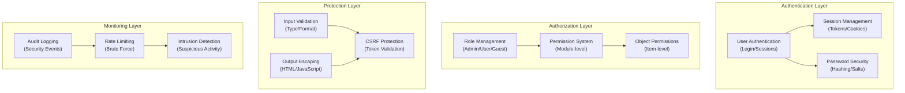

# ADR-004: Arsitektur Sistem Keamanan

> Arsitektur keamanan komprehensif untuk CMS XOOPS yang melindungi dari ancaman modern.

---

## Status

**Diterima** - Lapisan keamanan core sejak XOOPS 2.5

---

## Konteks

### Pernyataan Masalah

XOOPS membutuhkan sistem keamanan yang kuat yang:

1. **Melindungi dari kerentanan web yang umum** (OWASP Top 10)
2. **Menyediakan kontrol izin terperinci** di seluruh module
3. **Memungkinkan otentikasi pengguna yang aman** dengan standar modern
4. **Mencegah pelanggaran data** dan akses tidak sah
5. **Mendukung kontrol akses multi-level** (admin, moderator, pengguna, tamu)
6. **Terintegrasi dengan semua module** dengan lancar

### Ancaman Saat Ini

Serangan web modern meliputi:

- **SQL Injection** - SQL berbahaya di input pengguna
- **XSS (Cross-Site Scripting)** - Memasukkan JavaScript ke dalam halaman
- **CSRF (Pemalsuan Permintaan Lintas Situs)** - Pengiriman formulir tidak sah
- **Bypass otentikasi** - Penanganan session/password yang lemah
- **Bypass otorisasi** - Peningkatan hak istimewa
- **Paparan data** - Data sensitif di URL, log, atau cache

### Persyaratan Keamanan XOOPS

1. Otentikasi pengguna dan manajemen sesi
2. Kontrol akses berbasis peran (RBAC)
3. Sistem izin untuk module dan objek
4. Validasi masukan dan pelolosan keluaran
5. Perlindungan terhadap serangan umum
6. Audit pencatatan peristiwa keamanan
7. Penanganan kata sandi yang aman
8. Perlindungan token CSRF

---

## Keputusan

### Arsitektur Keamanan core



---

## Komponen Keamanan

### 1. Sistem Otentikasi

**Proses Login Pengguna:**

```php
<?php
// 1. Validate credentials
$user = $userHandler->findByLogin($username);
if (!$user || !password_verify($password, $user->getVar('pass'))) {
    throw new AuthenticationException('Invalid credentials');
}

// 2. Check if account is active
if (!$user->getVar('uactive')) {
    throw new AuthenticationException('Account inactive');
}

// 3. Create secure session
session_regenerate_id(true);
$_SESSION['uid'] = $user->getVar('uid');
$_SESSION['token'] = bin2hex(random_bytes(32));
$_SESSION['created'] = time();

// 4. Log the login
$this->auditLog('USER_LOGIN', $user->getVar('uid'));
```

**Keamanan Kata Sandi:**

```php
<?php
// Use password_hash (not MD5 or SHA1)
$hashed = password_hash($password, PASSWORD_BCRYPT, [
    'cost' => 12, // High cost = slow brute force
]);

// Verify password
if (!password_verify($inputPassword, $hashed)) {
    throw new Exception('Invalid password');
}

// Rehash if algorithm or cost changed
if (password_needs_rehash($hashed, PASSWORD_BCRYPT, ['cost' => 12])) {
    $newHash = password_hash($password, PASSWORD_BCRYPT, ['cost' => 12]);
    $user->setVar('pass', $newHash);
    $userHandler->insert($user);
}
```

### 2. Manajemen Sesi

**Penanganan Sesi Aman:**

```php
<?php
// Session configuration
ini_set('session.cookie_httponly', true);  // No JS access
ini_set('session.cookie_secure', true);     // HTTPS only
ini_set('session.cookie_samesite', 'Strict'); // CSRF protection
ini_set('session.gc_maxlifetime', 3600);   // 1 hour timeout
ini_set('session.sid_length', 64);         // 64-char session ID

// Validate session
function validateSession() {
    // Check timeout
    if (time() - $_SESSION['created'] > 3600) {
        session_destroy();
        throw new SessionExpiredException();
    }

    // Validate user agent (prevent session hijacking)
    if ($_SESSION['user_agent'] !== $_SERVER['HTTP_USER_AGENT']) {
        throw new SessionInvalidException();
    }

    // Validate IP (optional, can be too strict)
    if (!in_array($_SERVER['REMOTE_ADDR'], $_SESSION['ips'])) {
        $_SESSION['ips'][] = $_SERVER['REMOTE_ADDR'];
    }
}
```

### 3. Otorisasi (RBAC)

**Kontrol Akses Berbasis Peran:**

```php
<?php
class XoopsUser {
    public function hasPermission(string $permissionName): bool
    {
        // Get user groups
        $groups = $this->getGroups();

        // Check if any group has permission
        foreach ($groups as $groupId) {
            if ($this->checkGroupPermission($groupId, $permissionName)) {
                return true;
            }
        }

        return false;
    }

    /**
     * User groups and their permissions
     * Admin: Full access
     * Moderator: Content management
     * User: Create own content
     * Guest: Read-only access
     */
    private function checkGroupPermission(int $groupId, string $permission): bool
    {
        $permissions = [
            1 => ['admin_access'],                 // Admin group
            2 => ['moderate_content', 'edit_own'], // Moderator group
            3 => ['create_content', 'edit_own'],   // User group
            4 => [],                               // Guest group (no permissions)
        ];

        return in_array($permission, $permissions[$groupId] ?? []);
    }
}
```

### 4. Validasi Masukan

**Mencegah Kesalahan Injeksi dan Jenis SQL:**

```php
<?php
// Always use prepared statements
$sql = 'SELECT * FROM users WHERE id = ?';
$result = $db->query($sql, [$userId]); // ✅ Safe

// Input validation
function validateUserInput(array $data): array
{
    return [
        'email' => filter_var($data['email'] ?? '', FILTER_VALIDATE_EMAIL),
        'age' => filter_var($data['age'] ?? 0, FILTER_VALIDATE_INT),
        'website' => filter_var($data['website'] ?? '', FILTER_VALIDATE_URL),
        'title' => substr(trim($data['title'] ?? ''), 0, 255),
    ];
}

// XOOPS Safe Input class
$safe = \Xmf\Request::getHtmlRequest('var_name', '');
$int = \Xmf\Request::getInt('page', 1);
```

### 5. Keluaran Keluar

**Mencegah Serangan XSS:**

```php
<?php
// In PHP templates
echo htmlspecialchars($userInput, ENT_QUOTES, 'UTF-8');

// In Smarty templates (automatic escaping)
<{$user_input}>  {* Escaped by default *}
<{$html|escape:false}>  {* Only when needed *}

// JavaScript context
<script>
var message = "<{$userMessage|escape:'javascript'}>";
</script>

// URL context
<a href="<{$url|escape:'url'}>">Link</a>
```

### 6. Perlindungan CSRF

**Pencegahan Pemalsuan Permintaan Lintas Situs:**

```php
<?php
// Generate CSRF token
session_start();
if (empty($_SESSION['csrf_token'])) {
    $_SESSION['csrf_token'] = bin2hex(random_bytes(32));
}

// In forms
<form method="POST">
    <input type="hidden" name="csrf_token" value="<{$csrf_token}>">
    <button type="submit">Submit</button>
</form>

// Validate token
if ($_SERVER['REQUEST_METHOD'] === 'POST') {
    if (hash_equals($_SESSION['csrf_token'], $_POST['csrf_token'] ?? '')) {
        // Process form
    } else {
        throw new InvalidTokenException('CSRF token invalid');
    }
}
```

---

## Konsekuensi

### Efek Positif

1. **Perlindungan Komprehensif** - Mencakup kelas kerentanan utama
2. **Keamanan Berlapis** - Pertahanan berlapis
3. **RBAC Fleksibel** - Kontrol izin yang terperinci
4. **Jejak Audit** - Melacak peristiwa keamanan
5. **Standar Industri** - Sesuai dengan rekomendasi OWASP
6. **Integrasi module** - module mudah menggunakan API keamanan

### Efek Negatif

1. **Kompleksitas** - Dibutuhkan lebih banyak kode dan konfigurasi
2. **Kinerja** - Hashing dan validasi menambah overhead
3. **Pengalaman Pengguna** - Keamanan terkadang merepotkan
4. **Pemeliharaan** - Memerlukan pembaruan keamanan berkelanjutan
5. **Diperlukan Pelatihan** - Pengembang harus mengikuti praktik

### Risiko dan Mitigasi

| Resiko | Keparahan | Mitigasi |
|------|----------|-----------|
| Pengembang mengabaikan keamanan | Tinggi | Tinjauan kode, pelatihan keamanan |
| Kerentanan baru ditemukan | Sedang | Audit keamanan rutin, pembaruan |
| Dampak kinerja | Rendah | Optimalkan jalur panas, caching |
| Izin yang terlalu rumit | Sedang | Dokumentasi yang jelas, contoh |

---

## Praktik Terbaik Keamanan

### Untuk Pengembang module

```php
<?php
// ✅ DO: Use prepared statements
$result = $db->prepare('SELECT * FROM table WHERE id = ?')->execute([$id]);

// ❌ DON'T: Concatenate queries
$result = $db->query("SELECT * FROM table WHERE id = $id");

// ✅ DO: Escape output
echo htmlspecialchars($user_input, ENT_QUOTES, 'UTF-8');

// ❌ DON'T: Output raw user data
echo $user_input;

// ✅ DO: Check permissions
if (!$user->hasPermission('edit_content')) {
    throw new PermissionException();
}

// ❌ DON'T: Trust user roles directly
if ($_POST['is_admin']) {
    // Make user admin - SECURITY HOLE!
}

// ✅ DO: Validate input types
$page = (int)$_GET['page'];

// ❌ DON'T: Use untrusted values directly
$sql .= " LIMIT " . $_GET['limit'];
```

---

## Alternatif Dipertimbangkan

### OAuth/OpenID Hubungkan

**Mengapa tidak dipilih pada awalnya:** Terlalu rumit untuk lingkungan hosting bersama, namun bagus untuk integrasi di masa mendatang dengan sistem autentikasi eksternal.

### Otentikasi Dua Faktor (2FA)

**Status:** Diterima sebagai ekstensi, bukan persyaratan core, lihat ADR-006

### Cookie Sesi khusus HTTP

**Status:** Diimplementasikan - mencegah akses JavaScript ke data sesi

---

## Keputusan Terkait

- ADR-001: Arsitektur Modular - module menerapkan keamanan
- ADR-005: Sistem Izin module
- ADR-006: Otentikasi Dua Faktor (masa depan)

---

## Referensi

### Standar Keamanan

- [OWASP 10 Teratas](https://owasp.org/www-project-top-ten/)
- [Kerangka Keamanan Siber NIST](https://www.nist.gov/cyberframework)
- [25 Teratas CWE](https://cwe.mitre.org/top25/)

### PHP Keamanan- [Panduan Keamanan PHP](https://www.php.net/manual/en/security.php)
- [Dokumentasi password_hash()](https://www.php.net/manual/en/function.password-hash.php)
- [Keamanan Sesi](https://www.php.net/manual/en/session.security.php)

### Alat

- [OWASP ZAP](https://www.zaproxy.org/) - Pengujian keamanan
- [Snyk](https://snyk.io/) - Pemindaian kerentanan
- [SonarQube](https://www.sonarqube.org/) - Kualitas kode

---

## Daftar Periksa Implementasi

- [ ] Sistem otentikasi pengguna
- [ ] Manajemen sesi
- [ ] Pencirian kata sandi (bcrypt)
- [ ] Kontrol akses berbasis peran
- [ ] Izin module
- [ ] Kerangka validasi masukan
- [ ] Keluaran keluar (PHP + Smarty)
- [ ] Perlindungan token CSRF
- [ ] Pencatatan audit keamanan
- [ ] Pembatasan tarif
- [ ] Header keamanan

---

## Riwayat Versi

| Versi | Tanggal | Perubahan |
|---------|------|---------|
| 1.0.0 | 28-01-2024 | Dokumen awal |

---

#xoops #adr #keamanan #arsitektur #autentikasi #otorisasi #rbac
