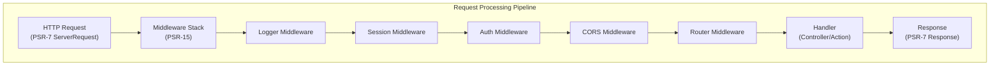

# ADR-005: Pola Middleware PSR-15 untuk XOOPS 4.0

> Mengadopsi handler permintaan server HTTP PSR-15 (middleware) untuk saluran pemrosesan permintaan yang lebih baik.

:::hati-hati[Proposal XOOPS 4.0 — Tidak Tersedia di 2.5.x]
ADR ini menjelaskan **arsitektur yang diusulkan untuk XOOPS 4.0**. Middleware PSR-15 **tidak tersedia di XOOPS 2.5.x**. module 2.5.x saat ini menggunakan pola Pengontrol Halaman dengan bootstrap `mainfile.php`. Lihat Arsitektur XOOPS untuk siklus hidup permintaan saat ini.
:::

---

## Status

**Diusulkan** - Sedang dievaluasi untuk rilis XOOPS 4.0

---

## Konteks

### Pendekatan Saat Ini

XOOPS 2.5 menggunakan pendekatan penanganan permintaan monolitik:

```php
// Current: Sequential processing
require_once 'mainfile.php';
// → Kernel initialization
// → User authentication
// → Module loading
// → Page rendering

// All in one flow, mixed concerns
```

### Masalah dengan Pendekatan Saat Ini

1. **Kekhawatiran Campuran** - Otentikasi, logging, perutean semuanya saling terkait
2. **Sulit untuk Diuji** - Sulit untuk menguji unit setiap langkah pemrosesan permintaan
3. **Sulit untuk Diperpanjang** - module hanya dapat dihubungkan melalui preload/events
4. **Pemisahan Buruk** - Logika pemrosesan permintaan tersebar di seluruh basis kode
5. **Tidak Dapat Dikomposisi** - Tidak dapat dengan mudah merangkai atau menyusun ulang langkah pemrosesan

### Apa itu Middleware PSR-15?

PSR-15 mendefinisikan antarmuka standar untuk middleware HTTP:

```php
<?php
interface RequestHandlerInterface {
    public function handle(ServerRequestInterface $request): ResponseInterface;
}

interface MiddlewareInterface {
    public function process(
        ServerRequestInterface $request,
        RequestHandlerInterface $handler
    ): ResponseInterface;
}
```

**Rantai Peralatan Tengah:**

```
Request
  ↓
[Logger] → logs request
  ↓
[Auth] → validates user session
  ↓
[CORS] → checks cross-origin
  ↓
[Router] → dispatches to handler
  ↓
[Handler] → generates response
  ↓
Response
```

---

## Keputusan

### Mengadopsi Tumpukan Middleware PSR-15 untuk XOOPS 4.0

Menerapkan pipeline pemrosesan permintaan berbasis middleware mengikuti standar PSR-15.

### Ikhtisar Arsitektur



### Komponen core Middleware

#### 1. Middleware Aplikasi (Lapisan core)

```php
<?php
declare(strict_types=1);

namespace XoopsCore;

use Psr\Http\Message\ResponseInterface;
use Psr\Http\Message\ServerRequestInterface;
use Psr\Http\Server\MiddlewareInterface;
use Psr\Http\Server\RequestHandlerInterface;

class SessionMiddleware implements MiddlewareInterface
{
    public function process(
        ServerRequestInterface $request,
        RequestHandlerInterface $handler
    ): ResponseInterface {
        // 1. Retrieve session (or start new)
        $sessionId = $request->getCookieParams()['PHPSESSID'] ?? null;
        $session = $this->sessionManager->load($sessionId);

        // 2. Attach session to request
        $request = $request->withAttribute('session', $session);

        // 3. Pass to next middleware
        $response = $handler->handle($request);

        // 4. Set session cookie if needed
        if ($session->isModified()) {
            $response = $response->withAddedHeader(
                'Set-Cookie',
                'PHPSESSID=' . $session->getId() . '; HttpOnly; SameSite=Strict'
            );
        }

        return $response;
    }
}
```

#### 2. Middleware Otentikasi

```php
<?php
class AuthMiddleware implements MiddlewareInterface
{
    public function process(
        ServerRequestInterface $request,
        RequestHandlerInterface $handler
    ): ResponseInterface {
        // Get session from previous middleware
        $session = $request->getAttribute('session');

        // Authenticate user from session
        $user = $this->authenticate($session);

        // Attach user to request
        $request = $request->withAttribute('user', $user);

        return $handler->handle($request);
    }

    private function authenticate(?Session $session): User
    {
        if ($session && $session->has('uid')) {
            return $this->userRepository->findById($session->get('uid'));
        }

        return new AnonymousUser();
    }
}
```

#### 3. Otorisasi Middleware

```php
<?php
class AuthorizationMiddleware implements MiddlewareInterface
{
    public function __construct(private AuthorizationChecker $checker)
    {
    }

    public function process(
        ServerRequestInterface $request,
        RequestHandlerInterface $handler
    ): ResponseInterface {
        $user = $request->getAttribute('user');
        $route = $request->getAttribute('route');

        // Check if user has permission for this route
        if (!$this->checker->isGranted($user, $route)) {
            return new JsonResponse(
                ['error' => 'Unauthorized'],
                403
            );
        }

        return $handler->handle($request);
    }
}
```

#### 4. module Middleware

```php
<?php
// Modules can provide their own middleware
class PublisherAccessMiddleware implements MiddlewareInterface
{
    public function process(
        ServerRequestInterface $request,
        RequestHandlerInterface $handler
    ): ResponseInterface {
        $user = $request->getAttribute('user');

        // Module-specific access control
        if (!$user->hasPermission('publisher_view')) {
            return new HtmlResponse('Access denied', 403);
        }

        return $handler->handle($request);
    }
}
```

### Contoh Implementasi

```php
<?php
// bootstrap.php - Application setup

use Psr\Http\Message\ServerRequestInterface;
use Psr\Http\Server\RequestHandlerInterface;
use Xoops\Core\Middleware\{
    LoggerMiddleware,
    SessionMiddleware,
    AuthMiddleware,
    CorsMiddleware,
    ErrorHandlingMiddleware
};

// Create middleware pipeline
$middlewareStack = [
    // 1. Error handling (outermost)
    new ErrorHandlingMiddleware(),

    // 2. Logging
    new LoggerMiddleware($logger),

    // 3. CORS handling
    new CorsMiddleware($corsConfig),

    // 4. Session management
    new SessionMiddleware($sessionManager),

    // 5. Authentication
    new AuthMiddleware($userRepository),

    // 6. Authorization
    new AuthorizationMiddleware($authChecker),

    // 7. Routing and dispatching
    new RoutingMiddleware($router),

    // 8. Module middleware (dynamic)
    ...$this->loadModuleMiddleware(),
];

// Process request through middleware stack
$request = ServerRequestFactory::fromGlobals();
$dispatcher = new MiddlewareDispatcher($middlewareStack);
$response = $dispatcher->dispatch($request);

// Send response
http_response_code($response->getStatusCode());
foreach ($response->getHeaders() as $name => $values) {
    foreach ($values as $value) {
        header("$name: $value", false);
    }
}
echo $response->getBody();
```

### Integrasi module

module dapat menyediakan middleware:

```php
<?php
// Publisher module - xoops_version.php

$modversion['middleware'] = [
    'PublisherAccessMiddleware' => true,      // Auto-load
    'PublisherLogMiddleware' => true,
];

// Or custom:
$modversion['middleware_factory'] = function() {
    return [
        new PublisherCacheMiddleware(),
        new PublisherPermissionMiddleware(),
    ];
};
```

---

## Konsekuensi

### Efek Positif

1. **Pemisahan Kekhawatiran** - Setiap middleware menangani satu tanggung jawab
2. **Testabilitas** - Mudah untuk menguji unit masing-masing komponen middleware
3. **Komposabilitas** - Middleware dapat dicampur dan disusun ulang
4. **Sesuai Standar** - Menggunakan standar PSR-15 dan PSR-7
5. **Ekstensibilitas** - module dapat dengan mudah menambahkan middleware khusus
6. **Debugging** - Hapus aliran permintaan melalui pipa
7. **Kinerja** - Dapat mengoptimalkan lapisan middleware tertentu
8. **Interoperabilitas** - Dapat menggunakan middleware PSR-15 pihak ketiga

### Efek Negatif

1. **Kurva Pembelajaran** - Pengembang harus memahami PSR-15
2. **Performance Overhead** - Lebih banyak pemanggilan fungsi dalam pipeline
3. **Kompleksitas** - Lebih banyak bagian yang bergerak dibandingkan pendekatan monolitik
4. **Upaya Migrasi** - Memerlukan pemfaktoran ulang kode yang ada
5. **Dependensi** - Membutuhkan pustaka HTTP PSR-7

### Risiko dan Mitigasi

| Resiko | Keparahan | Mitigasi |
|------|----------|-----------|
| Rantai middleware yang kompleks | Sedang | Dokumentasi yang jelas, contoh |
| Penurunan kinerja | Sedang | Tolok ukur, optimalkan jalur panas |
| penyalahgunaan pengembang | Sedang | Tinjauan kode, panduan praktik terbaik |
| Perubahan yang dapat mengganggu migrasi | Tinggi | Periode penghentian, pembantu |
| Masalah pemesanan middleware | Sedang | Hapus grafik ketergantungan |

---

## Rencana Implementasi

### Fase 1: Fondasi (Q2 2026)

- [ ] Menerapkan pembungkus pesan HTTP PSR-7
- [ ] Buat MiddlewareDispatcher
- [ ] Menerapkan middleware core (sesi, autentikasi)
- [ ] Perbarui kernel untuk menggunakan middleware

### Fase 2: Integrasi (Q3 2026)

- [ ] Migrasi fungsionalitas yang ada ke middleware
- [ ] Tambahkan dukungan middleware module
- [ ] Membuat utilitas pengujian middleware
- [ ] Tulis dokumentasi yang komprehensif

### Fase 3: Migrasi (Q4 2026)

- [ ] Menyediakan lapisan kompatibilitas untuk kode lama
- [ ] module bantuan diperbarui ke middleware baru
- [ ] Pengoptimalan kinerja
- [ ] Audit keamanan

### Fase 4: Rilis (Q1 2027)- [ ] Rilis XOOPS 4.0 dengan middleware
- [ ] Tidak lagi menggunakan sistem preload/hook yang lama
- [ ] Masukan dan pembaruan komunitas

---

## Kriteria Keberhasilan

- [ ] Semua fungsi core dimigrasikan ke middleware
- [ ] 90%+ cakupan pengujian untuk middleware
- [ ] Dokumentasi lengkap dengan contoh
- [ ] Kinerja dalam 10% dari versi sebelumnya
- [ ] module berhasil menggunakan sistem middleware baru
- [ ] Tingkat adopsi komunitas >80%

---

## Praktik Terbaik Middleware

### Lakukan

- Jaga agar middleware tetap fokus (tanggung jawab tunggal)
- Gunakan kekekalan (buat request/response baru)
- Tangani kesalahan dengan baik
- Ketergantungan dokumen
- Tambahkan petunjuk tipe
- Tulis tes untuk middleware
- Gunakan antarmuka PSR-15 standar

### Jangan

- Jangan memodifikasi objek request/response yang dibagikan
- Jangan mengakses global secara langsung
- Jangan membuat ketergantungan pada pesanan middleware
- Jangan menangkap semua pengecualian
- Jangan mencampurkan logika bisnis dengan middleware
- Jangan membuat middleware melakukan terlalu banyak hal

---

## Contoh

### Middleware Khusus

```php
<?php
// Example: Rate limiting middleware

use Psr\Http\Message\ResponseInterface;
use Psr\Http\Message\ServerRequestInterface;
use Psr\Http\Server\MiddlewareInterface;
use Psr\Http\Server\RequestHandlerInterface;

class RateLimitMiddleware implements MiddlewareInterface
{
    public function __construct(
        private RateLimiter $limiter,
        private int $limit = 100,
        private int $window = 3600
    ) {
    }

    public function process(
        ServerRequestInterface $request,
        RequestHandlerInterface $handler
    ): ResponseInterface {
        $user = $request->getAttribute('user');
        $identifier = $user->getId() ?? $request->getClientIp();

        // Check rate limit
        $remaining = $this->limiter->check($identifier, $this->limit, $this->window);

        if ($remaining < 0) {
            return new JsonResponse(
                ['error' => 'Rate limit exceeded'],
                429
            );
        }

        // Add rate limit headers
        $response = $handler->handle($request);
        return $response
            ->withAddedHeader('X-RateLimit-Limit', (string)$this->limit)
            ->withAddedHeader('X-RateLimit-Remaining', (string)$remaining);
    }
}
```

---

## Keputusan Terkait

- ADR-001: Arsitektur Modular - Fondasi
- ADR-004: Sistem Keamanan - Menggunakan middleware untuk autentikasi
- ADR-006: Otentikasi Dua Faktor - Dapat berupa middleware

---

## Referensi

### Standar PSR

- [PSR-7: Antarmuka Pesan HTTP](https://www.php-fig.org/psr/psr-7/)
- [PSR-15: handler Permintaan Server HTTP](https://www.php-fig.org/psr/psr-15/)

### Kerangka Middleware

- [Slim Framework](https://www.slimframework.com/) - Contoh Middleware
- [Zend Ekspresif] (https://docs.zendframework.com/zend-expressive/) - Kerangka kerja PSR-15
- [Guzzle](https://docs.guzzlephp.org/) - middleware klien HTTP

### Alat

- [RelayPHP](https://relayphp.com/) - Pustaka Middleware
- [PSR-15 Middleware](https://github.com/middlewares) - Koleksi middleware

---

## Riwayat Versi

| Versi | Tanggal | Perubahan |
|---------|------|---------|
| 1.0.0 | 28-01-2024 | Usulan awal |

---

#xoops #adr #psr-15 #middleware #architecture #psr-7
