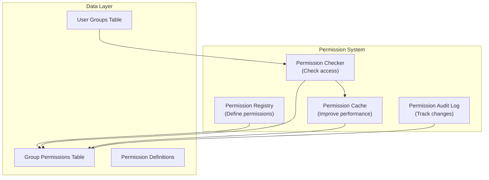

# ADR-006: Sistem Izin module

> Sistem izin hierarki yang terperinci untuk module XOOPS yang memungkinkan kontrol akses granular.

---

## Status

**Diterima** - Diimplementasikan di XOOPS 2.5.x dan diperluas di XOOPS 4.0

---

## Konteks

### Pernyataan Masalah

module XOOPS memerlukan kontrol izin fleksibel yang memungkinkan:

1. **Izin tingkat module** - Bisakah pengguna mengakses module ini?
2. **Izin tingkat objek** - Bisakah pengguna mengakses item khusus ini?
3. **Izin tingkat tindakan** - Bisakah pengguna melakukan tindakan ini?
4. **Izin khusus** - Bisakah module menentukan izinnya sendiri?

### Keadaan Saat Ini

XOOPS 2.5 menggunakan sistem XoopsGroupPermission:

```php
<?php
$perm_handler = xoops_getHandler('groupperm');
$isAllowed = $perm_handler->checkRight(
    'modulename',
    'action',
    $itemId,
    $groupId
);
```

### Tantangan

1. **Kueri Kompleks** - Pemeriksaan izin memerlukan penggabungan basis data
2. **Hierarki Terbatas** - Sulit membuat grup izin
3. **Caching Buruk** - Tidak ada cache izin bawaan
4. **Variasi module** - Setiap module diimplementasikan secara berbeda
5. **Kinerja** - Beberapa kueri DB untuk pemeriksaan izin

---

## Keputusan

### Menerapkan Sistem Izin Hierarki

Buat sistem izin cache terstandar yang mendukung:

1. **Izin Hierarki** - Warisan dari grup induk
2. **Akses Berbasis Peran** - Memetakan izin ke peran (admin, moderator, pengguna, tamu)
3. **Izin Objek** - Kontrol terperinci per item
4. **Caching** - Izin cache untuk mengurangi kueri
5. **Izin Khusus** - module menentukan sendiri
6. **Jejak Audit** - Izin log berubah

### Hirarki Izin

```
User
  └── Group 1 (Admin)
      └── Permission: admin_module
      └── Permission: edit_all_items
      └── Permission: delete_all_items
  └── Group 2 (Moderator)
      └── Permission: moderate_comments
      └── Permission: edit_own_items
  └── Group 3 (User)
      └── Permission: view_published_items
      └── Permission: edit_own_items
  └── Group 4 (Guest)
      └── Permission: view_published_items
```

### Arsitektur



---

## Komponen core

### 1. Definisi Izin

```php
<?php
// Module defines its permissions in xoops_version.php

$modversion['permissions'] = [
    [
        'name' => 'module_view',
        'description' => 'Can view module',
        'level' => 'module',
    ],
    [
        'name' => 'item_view',
        'description' => 'Can view items',
        'level' => 'item',
    ],
    [
        'name' => 'item_create',
        'description' => 'Can create items',
        'level' => 'item',
    ],
    [
        'name' => 'item_edit',
        'description' => 'Can edit items',
        'level' => 'item',
    ],
    [
        'name' => 'item_delete',
        'description' => 'Can delete items',
        'level' => 'item',
    ],
    [
        'name' => 'admin_manage',
        'description' => 'Can manage module',
        'level' => 'admin',
    ],
];

// Default permissions by group
$modversion['group_permissions'] = [
    // Admin group gets all permissions
    '1' => [
        'module_view' => 1,
        'item_view' => 1,
        'item_create' => 1,
        'item_edit' => 1,
        'item_delete' => 1,
        'admin_manage' => 1,
    ],
    // User group
    '3' => [
        'module_view' => 1,
        'item_view' => 1,
        'item_create' => 1,
        'item_edit' => 0,
        'item_delete' => 0,
        'admin_manage' => 0,
    ],
    // Guest group
    '4' => [
        'module_view' => 1,
        'item_view' => 1,
        'item_create' => 0,
        'item_edit' => 0,
        'item_delete' => 0,
        'admin_manage' => 0,
    ],
];
```

### 2. Pemeriksa Izin

```php
<?php
declare(strict_types=1);

namespace XoopsCore\Permission;

class PermissionChecker
{
    private PermissionCache $cache;
    private PermissionRepository $repository;

    public function hasPermission(
        User $user,
        string $permissionName,
        ?int $itemId = null
    ): bool {
        // Check cache first
        $cacheKey = "perm_{$user->getId()}_{$permissionName}_{$itemId}";
        if ($this->cache->has($cacheKey)) {
            return $this->cache->get($cacheKey);
        }

        $hasPermission = false;

        // Check all user groups
        foreach ($user->getGroups() as $group) {
            if ($this->checkGroupPermission($group, $permissionName, $itemId)) {
                $hasPermission = true;
                break;
            }
        }

        // Cache result
        $this->cache->set($cacheKey, $hasPermission, 3600);

        // Log high-level access checks
        if ($hasPermission && $this->shouldAuditLog($permissionName)) {
            $this->auditLog('PERMISSION_CHECKED', [
                'user_id' => $user->getId(),
                'permission' => $permissionName,
                'item_id' => $itemId,
                'result' => 'ALLOWED',
            ]);
        }

        return $hasPermission;
    }

    private function checkGroupPermission(
        Group $group,
        string $permissionName,
        ?int $itemId = null
    ): bool {
        $sql = 'SELECT COUNT(*) FROM ' . $this->table . '
                WHERE groupid = ?
                AND permission = ?
                AND itemid = ?
                AND granted = 1';

        $stmt = $this->db->prepare($sql);
        $stmt->execute([$group->getId(), $permissionName, $itemId ?? 0]);

        return $stmt->fetchColumn() > 0;
    }
}
```

### 3. Tingkat Izin

```php
<?php
// Different permission levels with different scopes

class PermissionLevel
{
    // Module-level: Affects entire module
    public const LEVEL_MODULE = 'module';

    // Admin-level: Admin panel access
    public const LEVEL_ADMIN = 'admin';

    // Item-level: Specific objects/items
    public const LEVEL_ITEM = 'item';

    // Field-level: Specific object fields
    public const LEVEL_FIELD = 'field';

    // Action-level: Specific actions/operations
    public const LEVEL_ACTION = 'action';
}
```

### 4. Izin Tingkat Objek

```php
<?php
// Fine-grained control for specific items

class Item extends XoopsObject
{
    /**
     * Check if user can view this item
     */
    public function canView(User $user): bool
    {
        // Public items anyone can view
        if ($this->getVar('status') === 'published') {
            return true;
        }

        // Owner can always view their items
        if ($this->getVar('user_id') === $user->getId()) {
            return true;
        }

        // Check group permissions
        $permChecker = xoops_getActiveModule()->getPermissionChecker();
        return $permChecker->hasPermission(
            $user,
            'item_view',
            $this->getVar('id')
        );
    }

    public function canEdit(User $user): bool
    {
        // Owner can edit their items
        if ($this->getVar('user_id') === $user->getId()) {
            return $permChecker->hasPermission($user, 'item_edit', $this->getVar('id'));
        }

        // Check if user can edit all items
        return $permChecker->hasPermission($user, 'item_edit_all', $this->getVar('id'));
    }

    public function canDelete(User $user): bool
    {
        return $permChecker->hasPermission($user, 'item_delete', $this->getVar('id'));
    }
}
```

### 5. Penggunaan di Pengendali

```php
<?php
// Example: Article controller

class ArticleController
{
    private PermissionChecker $permChecker;

    public function view(int $id, User $user): Response
    {
        $article = $this->repository->find($id);

        // Check permission
        if (!$article->canView($user)) {
            throw new AccessDeniedException('Cannot view this article');
        }

        return new HtmlResponse($this->renderArticle($article));
    }

    public function edit(int $id, User $user): Response
    {
        $article = $this->repository->find($id);

        // Check permission
        if (!$article->canEdit($user)) {
            throw new AccessDeniedException('Cannot edit this article');
        }

        // Handle form submission
        if ($this->request->isMethod('POST')) {
            $article->setVar('title', $this->request->getPost('title'));
            $article->setVar('content', $this->request->getPost('content'));
            $this->repository->insert($article);

            $this->auditLog('ARTICLE_EDITED', ['id' => $id, 'user_id' => $user->getId()]);

            // Invalidate permission cache
            $this->permChecker->clearCache($user->getId());

            return new RedirectResponse('/article/' . $id);
        }

        return new HtmlResponse($this->renderForm($article));
    }

    public function delete(int $id, User $user): Response
    {
        $article = $this->repository->find($id);

        if (!$article->canDelete($user)) {
            throw new AccessDeniedException('Cannot delete this article');
        }

        $this->repository->delete($article);

        $this->auditLog('ARTICLE_DELETED', ['id' => $id, 'user_id' => $user->getId()]);

        // Invalidate cache
        $this->permChecker->clearCache($user->getId());

        return new JsonResponse(['success' => true]);
    }
}
```

---

## Konsekuensi

### Efek Positif

1. **Kontrol Granular** - Manajemen izin yang disempurnakan
2. **Terstandarisasi** - Konsisten di seluruh module
3. **Cached** - Peningkatan kinerja dengan caching
4. **Dapat Diaudit** - Lacak siapa yang mengubah apa
5. **Fleksibel** - Mendukung izin khusus
6. **Scalable** - Menangani hierarki izin yang rumit
7. **Dapat Diuji** - Mudah untuk diuji unitnya

### Efek Negatif

1. **Kompleksitas** - Lebih banyak kode untuk dikelola
2. **Overhead Basis Data** - Lebih banyak tabel dan gabungan
3. **Pembatalan Cache** - Harus menghapus cache saat ada perubahan
4. **Kurva Pembelajaran** - Pengembang harus memahami sistem
5. **Kinerja** - Jika cache tidak dikonfigurasi dengan benar

### Risiko dan Mitigasi

| Resiko | Keparahan | Mitigasi |
|------|----------|-----------|
| Izin yang terlalu rumit | Sedang | Defaultnya bagus, dokumentasi |
| Cache data basi | Tinggi | TTL, pembatalan cerdas |
| Regresi kinerja | Sedang | Tolok ukur, optimalkan kueri |
| Lewati izin | Tinggi | Audit keamanan, tes |

---

## Pola Desain Izin

### Pola 1: Izin Berbasis Pemilik

```php
<?php
// User can edit their own items but not others'

public function canEdit(User $user): bool
{
    // Owner can always edit
    if ($this->isOwner($user)) {
        return true;
    }

    // Check group permissions for editing others' items
    return $this->permChecker->hasPermission($user, 'edit_all_items');
}

private function isOwner(User $user): bool
{
    return $this->getVar('user_id') === $user->getId();
}
```

### Pola 2: Izin Berbasis Status

```php
<?php
// Different permissions based on status

public function canView(User $user): bool
{
    switch ($this->getVar('status')) {
        case 'published':
            // Anyone with module permission can view
            return $this->permChecker->hasPermission($user, 'item_view');

        case 'draft':
            // Only owner or admin can view
            return $this->isOwner($user) ||
                   $this->permChecker->hasPermission($user, 'admin_manage');

        case 'archived':
            // Only admin can view
            return $this->permChecker->hasPermission($user, 'admin_manage');

        default:
            return false;
    }
}
```

### Pola 3: Izin Berbasis Peran

```php
<?php
// Check against specific roles

public function hasAdminRole(User $user): bool
{
    return $user->getGroups()->contains('admin_group');
}

public function hasModeratorRole(User $user): bool
{
    return $user->getGroups()->contains('moderator_group') ||
           $this->hasAdminRole($user);
}

public function canModerate(User $user): bool
{
    return $this->hasModeratorRole($user);
}
```

---

## Keputusan Terkait

- ADR-001: Arsitektur Modular - module menentukan izin
- ADR-004: Sistem Keamanan - Landasan keamanan
- ADR-005: Middleware - Dapat menerapkan izin

---

## Referensi

### Model Izin

- [RBAC (Kontrol Akses Berbasis Peran)](https://en.wikipedia.org/wiki/Role-based_access_control)
- [ABAC (Kontrol Akses Berbasis Atribut)](https://en.wikipedia.org/wiki/Attribute-based_access_control)
- [ACL (Daftar Kontrol Akses)](https://en.wikipedia.org/wiki/Access-control_list)

### Implementasi

- [Keamanan Symfony](https://symfony.com/doc/current/security.html)
- [Otorisasi Laravel](https://laravel.com/docs/authorization)

---

## Daftar Periksa Implementasi

- [ ] Tentukan tingkat izin standar
- [ ] Buat kelas PermissionChecker
- [ ] Menerapkan strategi caching
- [ ] Tambahkan pencatatan audit
- [ ] Membuat fungsi pembantu
- [ ] Tulis tes komprehensif
- [ ] Dokumen untuk pengembang
- [ ] Perbarui semua module
- [ ] Pengoptimalan kinerja
- [ ] Tinjauan keamanan

---

## Riwayat Versi

| Versi | Tanggal | Perubahan |
|---------|------|---------|
| 1.0.0 | 28-01-2024 | Dokumen awal |

---

#xoops #adr #izin #otorisasi #rbac #keamanan
