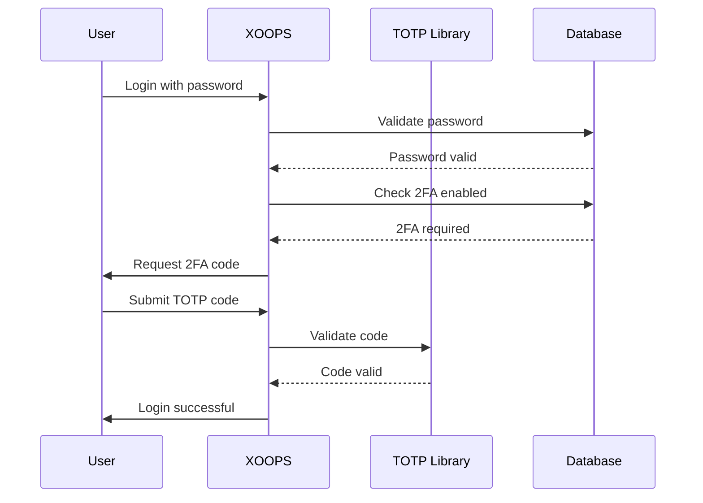

## Status

Diusulkan

## Konteks

XOOPS memerlukan peningkatan keamanan untuk otentikasi pengguna. Otentikasi dua faktor (2FA) memberikan lapisan keamanan tambahan selain kata sandi, melindungi akun bahkan jika kata sandi dibobol.

Pertimbangan utama:
- Kompatibilitas mundur dengan otentikasi yang ada
- Dukungan untuk beberapa metode 2FA
- Pengalaman pengguna selama pengaturan dan login
- Mekanisme pemulihan untuk perangkat yang hilang
- Integrasi dengan sistem izin yang ada

## Keputusan

Kami akan menerapkan TOTP (Kata Sandi Satu Kali Berbasis Waktu) sebagai metode 2FA utama dengan dukungan untuk kode cadangan.

### Pendekatan Implementasi



### Skema Basis Data

```sql
CREATE TABLE `{PREFIX}_users_2fa` (
    `user_id` INT(11) NOT NULL,
    `secret` VARCHAR(32) NOT NULL,
    `enabled` TINYINT(1) DEFAULT 0,
    `backup_codes` TEXT,
    `last_used` INT(11),
    `created` INT(11) NOT NULL,
    PRIMARY KEY (`user_id`),
    FOREIGN KEY (`user_id`) REFERENCES `{PREFIX}_users`(`uid`)
);
```

### Antarmuka Layanan

```php
interface TwoFactorAuthInterface
{
    public function enable(int $userId): TwoFactorSetup;
    public function disable(int $userId): void;
    public function verify(int $userId, string $code): bool;
    public function generateBackupCodes(int $userId): array;
    public function isEnabled(int $userId): bool;
}
```

### Integrasi Middleware

```php
class TwoFactorMiddleware implements MiddlewareInterface
{
    public function process(
        ServerRequestInterface $request,
        RequestHandlerInterface $handler
    ): ResponseInterface {
        $session = $request->getAttribute('session');

        if ($session->has('pending_2fa_user_id')) {
            // User needs to complete 2FA
            if ($this->isVerificationRequest($request)) {
                return $handler->handle($request);
            }
            return new RedirectResponse('/2fa/verify');
        }

        return $handler->handle($request);
    }
}
```

## Konsekuensi

### Positif

- Keamanan akun meningkat secara signifikan
- Kompatibilitas TOTP standar industri (Google Authenticator, Authy, dll.)
- Kode cadangan mencegah penguncian akun
- Opsional per pengguna - tidak memaksa adopsi
- Middleware PSR-15 memungkinkan integrasi yang bersih

### Negatif

- Langkah login tambahan memengaruhi pengalaman pengguna
- Pengguna harus mengelola aplikasi pengautentikasi
- Perangkat yang hilang memerlukan proses pemulihan
- Penyimpanan dan kueri database tambahan
- Membutuhkan ketergantungan perpustakaan kriptografi

### Jalur Migrasi

1. Tambahkan tabel database untuk data 2FA
2. Mengimplementasikan layanan TOTP dengan ketergantungan perpustakaan
3. Tambahkan middleware ke rantai otentikasi
4. Buat UI pengaturan dan verifikasi
5. Opsi Admin untuk mewajibkan 2FA untuk grup tertentu

## Alternatif Dipertimbangkan

### OTP berbasis SMS

Ditolak karena:
- Kerentanan pertukaran SIM
- Biaya SMS gateway
- Kompleksitas verifikasi nomor telepon
- Masalah privasi

### Kunci Keamanan Perangkat Keras (WebAuthn)

Ditunda untuk ADR mendatang:
- Implementasi yang lebih kompleks
- Dukungan browser terbatas secara historis
- Biaya pengguna lebih tinggi
- Bisa ditambahkan bersama TOTP nanti

### OTP berbasis email

Ditolak karena:
- Kompromi akun email menggagalkan tujuan
- Keterlambatan pengiriman berdampak pada UX
- Masalah filter spam

## Referensi

- [RFC 6238 - TOTP](https://tools.ietf.org/html/rfc6238)
- [Format Kunci Google Authenticator](https://github.com/google/google-authenticator/wiki/Key-Uri-Format)
- ../../02-Core-Concepts/Security/Security-Best-Practices - Pedoman keamanan
- ../../02-Core-Concepts/Users-Permissions/Authentication - Dokumentasi sistem autentikasi
