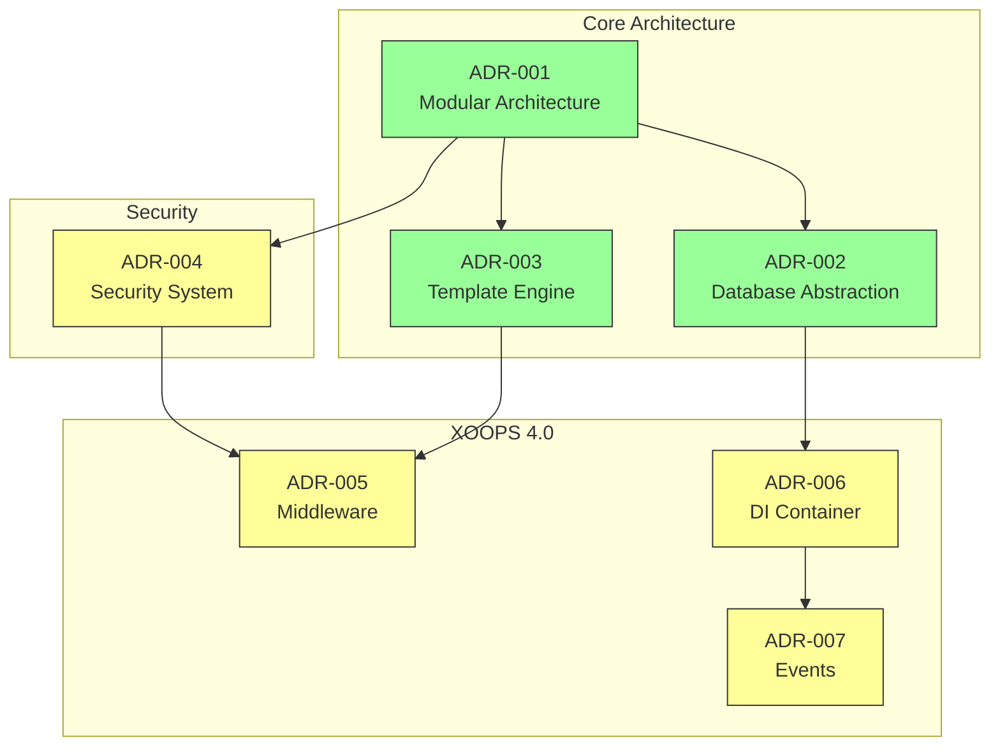
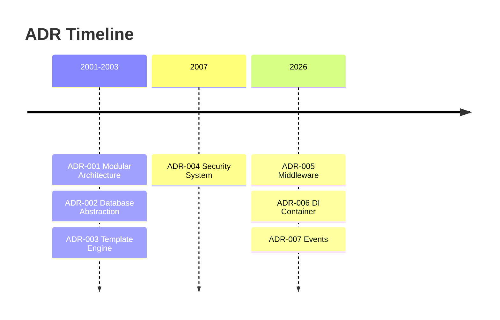

# 📋 Indeks Catatan Keputusan Arsitektur

> Indeks komprehensif keputusan arsitektur yang membentuk XOOPS CMS.

---

## Apa itu ADR?

Architecture Decision Records (ADRs) mendokumentasikan keputusan arsitektur penting yang dibuat selama pengembangan XOOPS. Mereka menangkap konteks, keputusan, dan konsekuensi dari setiap pilihan, memberikan konteks sejarah yang berharga bagi pengelola dan kontributor.

---

## Legenda Status ADR

| Status | Arti |
|--------|---------|
| **Diusulkan** | Dalam pembahasan, belum diterima |
| **Diterima** | Keputusan telah diadopsi |
| **Tidak berlaku lagi** | Tidak lagi direkomendasikan |
| **Digantikan** | Digantikan oleh ADR |

---

## ADR saat ini

### Keputusan Dasar

| ADR | Judul | Status | Dampak |
|-----|-------|--------|--------|
| ADR-001 | Arsitektur Modular | Diterima | core |
| ADR-002 | Akses Database Berorientasi Objek | Diterima | core |
| ADR-003 | Mesin template Smarty | Diterima | core |

### ADR yang direncanakan (XOOPS 4.0)

| ADR | Judul | Status | Dampak |
|-----|-------|--------|--------|
| ADR-004 | Desain Sistem Keamanan | Diusulkan | Keamanan |
| ADR-005 | Perangkat Tengah PSR-15 | Diusulkan | Arsitektur |
| ADR-006 | Wadah Injeksi Ketergantungan | Diusulkan | Arsitektur |
| ADR-007 | Desain Ulang Sistem Acara | Diusulkan | Arsitektur |

---

## Hubungan ADR



---

## Garis Waktu



---

## Membuat ADR Baru

Saat mengusulkan keputusan arsitektur baru:

1. Salin template ADR
2. Isi semua bagian
3. Kirim sebagai Permintaan Tarik
4. Diskusikan Masalah di GitHub
5. Perbarui status setelah keputusan

### Struktur template ADR

```markdown
# ADR-XXX: Title

## Status
Proposed | Accepted | Deprecated | Superseded

## Context
What is the issue motivating this decision?

## Decision
What is the change that we're proposing?

## Consequences
What becomes easier or harder as a result?

## Alternatives Considered
What other options were evaluated?
```

---

## 🔗 Dokumentasi Terkait

- Konsep core
- Pedoman Berkontribusi
- Peta Jalan XOOPS 4.0

---

#xoops #adr #architecture #index #decisions
