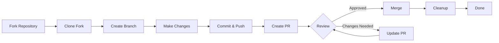

> Panduan ini memandu Anda melalui proses lengkap berkontribusi ke XOOPS, mulai dari penyiapan awal hingga permintaan penarikan gabungan.

---

## Prasyarat

Sebelum Anda mulai berkontribusi, pastikan Anda memiliki:

- **Git** diinstal dan dikonfigurasi
- **akun GitHub** (gratis)
- **PHP 7.4+** untuk pengembangan XOOPS
- **Komposer** untuk manajemen ketergantungan
- Pengetahuan dasar tentang alur kerja Git
- Keakraban dengan Kode Etik

---

## Langkah 1: Buat Cabang pada Repositori

### Di Antarmuka Web GitHub

1. Navigasikan ke repositori (mis., `XOOPS/XoopsCore27`)
2. Klik tombol **Fork** di pojok kanan atas
3. Pilih tempat untuk bercabang (akun pribadi Anda)
4. Tunggu hingga percabangan selesai

### Mengapa Garpu?

- Anda mendapatkan salinan Anda sendiri untuk dikerjakan
- Pengelola tidak perlu mengelola banyak cabang
- Anda memiliki kendali penuh atas garpu Anda
- Permintaan Tarik merujuk pada fork Anda dan repo upstream

---

## Langkah 2: Kloning Garpu Anda Secara Lokal

```bash
# Clone your fork (replace YOUR_USERNAME)
git clone https://github.com/YOUR_USERNAME/XoopsCore27.git
cd XoopsCore27

# Add upstream remote to track original repository
git remote add upstream https://github.com/XOOPS/XoopsCore27.git

# Verify remotes are set correctly
git remote -v
# origin    https://github.com/YOUR_USERNAME/XoopsCore27.git (fetch)
# origin    https://github.com/YOUR_USERNAME/XoopsCore27.git (push)
# upstream  https://github.com/XOOPS/XoopsCore27.git (fetch)
# upstream  https://github.com/XOOPS/XoopsCore27.git (nofetch)
```

---

## Langkah 3: Siapkan Lingkungan Pengembangan

### Instal Dependensi

```bash
# Install Composer dependencies
composer install

# Install development dependencies
composer install --dev

# For module development
cd modules/mymodule
composer install
```

### Konfigurasikan Git

```bash
# Set your Git identity
git config user.name "Your Name"
git config user.email "your.email@example.com"

# Optional: Set global Git config
git config --global user.name "Your Name"
git config --global user.email "your.email@example.com"
```

### Jalankan Tes

```bash
# Make sure tests pass in clean state
./vendor/bin/phpunit

# Run specific test suite
./vendor/bin/phpunit --testsuite unit
```

---

## Langkah 4: Buat Cabang Fitur

### Konvensi Penamaan Cabang

Ikuti pola ini: `<type>/<description>`

**Jenis:**
- `feature/` - Fitur baru
- `fix/` - Perbaikan bug
- `docs/` - Dokumentasi saja
- `refactor/` - Pemfaktoran ulang kode
- `test/` - Uji tambahan
- `chore/` - Pemeliharaan, perkakas

**Contoh:**
```bash
# Feature branch
git checkout -b feature/add-two-factor-auth

# Bug fix branch
git checkout -b fix/prevent-xss-in-forms

# Documentation branch
git checkout -b docs/update-api-guide

# Always branch from upstream/main (or develop)
git checkout -b feature/my-feature upstream/main
```

### Selalu Perbarui Cabang

```bash
# Before you start work, sync with upstream
git fetch upstream
git merge upstream/main

# Later, if upstream has changed
git fetch upstream
git rebase upstream/main
```

---

## Langkah 5: Lakukan Perubahan

### Praktek Pembangunan

1. **Tulis kode** mengikuti Standar PHP
2. **Tes tulis** untuk fungsi baru
3. **Perbarui dokumentasi** jika diperlukan
4. **Jalankan linter** dan pemformat kode

### Pemeriksaan Kualitas Kode

```bash
# Run all tests
./vendor/bin/phpunit

# Run with coverage
./vendor/bin/phpunit --coverage-html coverage/

# Run PHP CS Fixer
./vendor/bin/php-cs-fixer fix --dry-run

# Run PHPStan static analysis
./vendor/bin/phpstan analyse class/ src/
```

### Lakukan Perubahan yang Baik

```bash
# Check what you changed
git status
git diff

# Stage specific files
git add class/MyClass.php
git add tests/MyClassTest.php

# Or stage all changes
git add .

# Commit with descriptive message
git commit -m "feat(auth): add two-factor authentication support"
```

---

## Langkah 6: Jaga agar Cabang tetap Sinkron

Saat mengerjakan fitur Anda, cabang utama mungkin maju:

```bash
# Fetch latest changes from upstream
git fetch upstream

# Option A: Rebase (preferred for clean history)
git rebase upstream/main

# Option B: Merge (simpler but adds merge commits)
git merge upstream/main

# If conflicts occur, resolve them then:
git add .
git rebase --continue  # or git merge --continue
```

---

## Langkah 7: Dorong ke Garpu Anda

```bash
# Push your branch to your fork
git push origin feature/my-feature

# On subsequent pushes
git push

# If you rebased, you might need force push (use carefully!)
git push --force-with-lease origin feature/my-feature
```

---

## Langkah 8: Buat Permintaan Tarik

### Di Antarmuka Web GitHub

1. Buka cabang Anda di GitHub
2. Anda akan melihat notifikasi untuk membuat PR dari cabang Anda
3. Klik **"Bandingkan & tarik permintaan"**
4. Atau klik secara manual **"Permintaan penarikan baru"** dan pilih cabang Anda

### Judul dan Deskripsi PR

**Format Judul:**
```
<type>(<scope>): <subject>
```

Contoh:
```
feat(auth): add two-factor authentication
fix(forms): prevent XSS in text input
docs: update installation guide
refactor(core): improve performance
```

**Template Deskripsi:**

```markdown
## Description
Brief explanation of what this PR does.

## Changes
- Changed X from A to B
- Added feature Y
- Fixed bug Z

## Type of Change
- [ ] New feature (adds new functionality)
- [ ] Bug fix (fixes an issue)
- [ ] Breaking change (API/behavior change)
- [ ] Documentation update

## Testing
- [ ] Added tests for new functionality
- [ ] All existing tests pass
- [ ] Manual testing performed

## Screenshots (if applicable)
Include before/after screenshots for UI changes.

## Related Issues
Closes #123
Related to #456

## Checklist
- [ ] Code follows style guidelines
- [ ] Self-reviewed own code
- [ ] Commented complex code
- [ ] Updated documentation
- [ ] No new warnings generated
- [ ] Tests pass locally
```

### Daftar Periksa Tinjauan Humas

Sebelum mengirimkan, pastikan:

- [ ] Kode mengikuti Standar PHP
- [ ] Tes disertakan dan lulus
- [ ] Dokumentasi diperbarui (jika diperlukan)
- [ ] Tidak ada konflik penggabungan
- [ ] Pesan komit jelas
- [ ] Masalah terkait dirujuk
- [ ] Deskripsi PR dirinci
- [ ] Tidak ada kode debug atau log konsol

---

## Langkah 9: Tanggapi Masukan

### Selama Peninjauan Kode

1. **Baca komentar dengan cermat** - Pahami masukannya
2. **Ajukan pertanyaan** - Jika kurang jelas, mintalah klarifikasi
3. **Diskusikan alternatif** - Debatkan pendekatan dengan penuh hormat
4. **Lakukan perubahan yang diminta** - Perbarui cabang Anda
5. **Force-push update commit** - Jika menulis ulang riwayat

```bash
# Make changes
git add .
git commit --amend  # Modify last commit
git push --force-with-lease origin feature/my-feature

# Or add new commits
git commit -m "Address feedback on PR review"
git push origin feature/my-feature
```

### Harapkan Iterasi

- Kebanyakan PR memerlukan beberapa putaran peninjauan
- Bersabarlah dan konstruktif
- Lihat umpan balik sebagai kesempatan belajar
- Pengelola mungkin menyarankan refactors

---

## Langkah 10: Gabungkan dan Bersihkan

### Setelah Persetujuan

Setelah pengelola menyetujui dan menggabungkan:

1. **Penggabungan otomatis GitHub** atau penggabungan klik pengelola
2. **Cabang Anda dihapus** (biasanya otomatis)
3. **Perubahan terjadi di bagian hulu**

### Pembersihan Lokal

```bash
# Switch to main branch
git checkout main

# Update main with merged changes
git fetch upstream
git merge upstream/main

# Delete local feature branch
git branch -d feature/my-feature

# Delete from your fork (if not auto-deleted)
git push origin --delete feature/my-feature
```

---

## Diagram Alur Kerja



---

## Skenario Umum

### Sinkronisasi Sebelum Memulai

```bash
# Always start fresh
git fetch upstream
git checkout -b feature/new-thing upstream/main
```

### Menambahkan Lebih Banyak Komit

```bash
# Just push again
git add .
git commit -m "feat: additional changes"
git push origin feature/new-thing
```

### Memperbaiki Kesalahan

```bash
# Last commit has wrong message
git commit --amend -m "Correct message"
git push --force-with-lease

# Revert to previous state (careful!)
git reset --soft HEAD~1  # Keep changes
git reset --hard HEAD~1  # Discard changes
```

### Menangani Konflik Penggabungan

```bash
# Rebase and resolve conflicts
git fetch upstream
git rebase upstream/main

# Edit conflicted files to resolve
# Then continue
git add .
git rebase --continue
git push --force-with-lease
```

---

## Praktik Terbaik

### Lakukan

- Jaga agar cabang tetap fokus pada satu isu
- Buatlah komitmen yang kecil dan logis
- Tulis pesan komit deskriptif
- Perbarui cabang Anda sesering mungkin
- Uji sebelum mendorong
- Perubahan dokumen
- Responsif terhadap umpan balik

### Jangan- Bekerja langsung di cabang main/master
- Campurkan perubahan yang tidak terkait dalam satu PR
- Komit file yang dihasilkan atau node_modules
- Paksa dorongan setelah PR dipublikasikan (gunakan --force-with-lease)
- Abaikan umpan balik peninjauan kode
- Buat PR besar (pecah menjadi PR yang lebih kecil)
- Melakukan data sensitif (kunci API, kata sandi)

---

## Tips Sukses

### Berkomunikasi

- Ajukan pertanyaan dalam masalah sebelum mulai bekerja
- Mintalah panduan tentang perubahan yang kompleks
- Diskusikan pendekatan dalam deskripsi PR
- Tanggapi umpan balik dengan segera

### Ikuti Standar

- Tinjau Standar PHP
- Periksa pedoman Pelaporan Masalah
- Baca Ikhtisar Berkontribusi
- Ikuti Pedoman Permintaan Tarik

### Pelajari Basis Kode

- Baca pola kode yang ada
- Pelajari implementasi serupa
- Memahami arsitektur
- Periksa Konsep core

---

## Dokumentasi Terkait

- Kode Etik
- Pedoman Permintaan Tarik
- Pelaporan Masalah
- Standar Pengkodean PHP
- Ikhtisar Kontribusi

---

#xoops #git #github #kontribusi #alur kerja #pull-request
