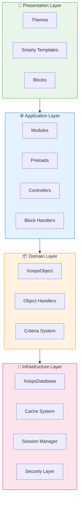
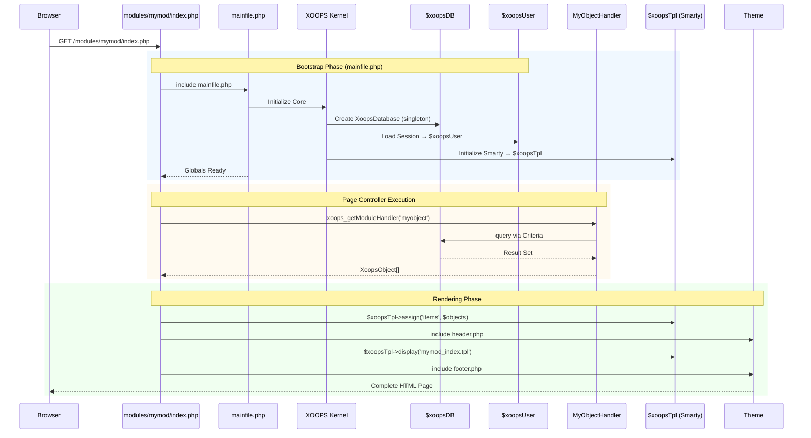

:::catatan[Tentang Dokumen Ini]
Halaman ini menjelaskan **arsitektur konseptual** XOOPS yang berlaku untuk versi saat ini (2.5.x) dan versi mendatang (4.0.x). Beberapa diagram menunjukkan visi desain berlapis.

**Untuk detail khusus versi:**
- **XOOPS 2.5.x Hari ini:** Menggunakan `mainfile.php`, global (`$xoopsDB`, `$xoopsUser`), preloads, dan pola handler
- **XOOPS 4.0 Target:** Middleware PSR-15, kontainer DI, router - lihat [Peta Jalan](../../07-XOOPS-4.0/XOOPS-4.0-Roadmap.md)
:::

Dokumen ini memberikan gambaran komprehensif tentang arsitektur sistem XOOPS, menjelaskan bagaimana berbagai komponen bekerja sama untuk menciptakan sistem manajemen konten yang fleksibel dan dapat diperluas.

## Ikhtisar

XOOPS mengikuti arsitektur modular yang memisahkan masalah menjadi beberapa lapisan berbeda. Sistem ini dibangun berdasarkan beberapa prinsip core:

- **Modularitas**: Fungsionalitas disusun menjadi module independen yang dapat diinstal
- **Ekstensibilitas**: Sistem dapat diperluas tanpa mengubah kode core
- **Abstraksi**: Lapisan database dan presentasi diabstraksi dari logika bisnis
- **Keamanan**: Mekanisme keamanan bawaan melindungi dari kerentanan umum

## Lapisan Sistem



### 1. Lapisan Presentasi

Lapisan presentasi menangani rendering antarmuka pengguna menggunakan mesin template Smarty.

**Komponen Utama:**
- **theme**: Gaya dan tata letak visual
- **Smarty Template**: Render konten dinamis
- **block**: Widget konten yang dapat digunakan kembali

### 2. Lapisan Aplikasi

Lapisan aplikasi berisi logika bisnis, pengontrol, dan fungsionalitas module.

**Komponen Utama:**
- **module**: Paket fungsionalitas mandiri
- **Penanganan**: Kelas manipulasi data
- **Preload**: Pemroses dan hook acara

### 3. Lapisan Domain

Lapisan domain berisi objek dan aturan bisnis core.

**Komponen Utama:**
- **XoopsObject**: Kelas dasar untuk semua objek domain
- **Penanganan**: Operasi CRUD untuk objek domain

### 4. Lapisan Infrastruktur

Lapisan infrastruktur menyediakan layanan core seperti akses database dan caching.

## Permintaan Siklus Hidup

Memahami siklus hidup permintaan sangat penting untuk pengembangan XOOPS yang efektif.

### XOOPS 2.5.x Aliran Pengontrol Halaman

XOOPS 2.5.x saat ini menggunakan pola **Pengontrol Halaman** di mana setiap file PHP menangani permintaannya sendiri. Global (`$xoopsDB`, `$xoopsUser`, `$xoopsTpl`, dll.) diinisialisasi selama bootstrap dan tersedia selama eksekusi.



### Kunci Global di 2.5.x

| Global | Ketik | Diinisialisasi | Tujuan |
|--------|------|-------------|---------|
| `$xoopsDB` | `XoopsDatabase` | tali sepatu | Koneksi database (tunggal) |
| `$xoopsUser` | `XoopsUser\|null` | Beban sesi | Pengguna yang masuk saat ini |
| `$xoopsTpl` | `XoopsTpl` | template init | Mesin template Smarty |
| `$xoopsModule` | `XoopsModule` | Pemuatan module | Konteks module saat ini |
| `$xoopsConfig` | `array` | Konfigurasi memuat | Konfigurasi sistem |

:::catatan[Perbandingan XOOPS 4.0]
Di XOOPS 4.0, pola Pengontrol Halaman diganti dengan **PSR-15 Middleware Pipeline** dan pengiriman berbasis router. Globals diganti dengan injeksi ketergantungan. Lihat [Kontrak Mode Hibrid](../../07-XOOPS-4.0/Specifications/Hybrid-Mode-Contract.md) untuk jaminan kompatibilitas selama migrasi.
:::

### 1. Fase Bootstrap

```php
// mainfile.php is the entry point
include_once XOOPS_ROOT_PATH . '/mainfile.php';

// Core initialization
$xoops = Xoops::getInstance();
$xoops->boot();
```

**Langkah-langkah:**
1. Konfigurasi beban (`mainfile.php`)
2. Inisialisasi pemuat otomatis
3. Atur penanganan kesalahan
4. Membangun koneksi database
5. Muat sesi pengguna
6. Inisialisasi mesin template Smarty

### 2. Fase Perutean

```php
// Request routing to appropriate module
$module = $GLOBALS['xoopsModule'];
$controller = $module->getController();
$controller->dispatch($request);
```

**Langkah-langkah:**
1. Parsing permintaan URL
2. Identifikasi module target
3. Muat konfigurasi module
4. Periksa izin
5. Rutekan ke pengendali yang sesuai

### 3. Tahap Eksekusi

```php
// Controller execution
$data = $handler->getObjects($criteria);
$xoopsTpl->assign('items', $data);
```

**Langkah-langkah:**
1. Jalankan logika pengontrol
2. Berinteraksi dengan lapisan data
3. Proses aturan bisnis
4. Siapkan data tampilan### 4. Fase Rendering

```php
// Template rendering
include XOOPS_ROOT_PATH . '/header.php';
$xoopsTpl->display('db:module_template.tpl');
include XOOPS_ROOT_PATH . '/footer.php';
```

**Langkah-langkah:**
1. Terapkan tata letak theme
2. Render template module
3. block proses
4. Respon keluaran

## Komponen core

### XoopsObject

Kelas dasar untuk semua objek data di XOOPS.

```php
<?php
class MyModuleItem extends XoopsObject
{
    public function __construct()
    {
        $this->initVar('id', XOBJ_DTYPE_INT, null, false);
        $this->initVar('title', XOBJ_DTYPE_TXTBOX, '', true, 255);
        $this->initVar('content', XOBJ_DTYPE_TXTAREA, '', false);
        $this->initVar('created', XOBJ_DTYPE_INT, time(), false);
    }
}
```

**Metode Utama:**
- `initVar()` - Tentukan properti objek
- `getVar()` - Ambil nilai properti
- `setVar()` - Tetapkan nilai properti
- `assignVars()` - Penetapan massal dari array

### XoopsPersistableObjectHandler

Menangani operasi CRUD untuk instance XoopsObject.

```php
<?php
class MyModuleItemHandler extends XoopsPersistableObjectHandler
{
    public function __construct(\XoopsDatabase $db)
    {
        parent::__construct($db, 'mymodule_items', 'MyModuleItem', 'id', 'title');
    }

    public function getActiveItems($limit = 10)
    {
        $criteria = new CriteriaCompo();
        $criteria->add(new Criteria('status', 1));
        $criteria->setSort('created');
        $criteria->setOrder('DESC');
        $criteria->setLimit($limit);

        return $this->getObjects($criteria);
    }
}
```

**Metode Utama:**
- `create()` - Membuat instance objek baru
- `get()` - Ambil objek berdasarkan ID
- `insert()` - Simpan objek ke database
- `delete()` - Hapus objek dari database
- `getObjects()` - Ambil banyak objek
- `getCount()` - Menghitung objek yang cocok

### Struktur module

Setiap module XOOPS mengikuti struktur direktori standar:

```
modules/mymodule/
├── class/                  # PHP classes
│   ├── MyModuleItem.php
│   └── MyModuleItemHandler.php
├── include/                # Include files
│   ├── common.php
│   └── functions.php
├── templates/              # Smarty templates
│   ├── mymodule_index.tpl
│   └── mymodule_item.tpl
├── admin/                  # Admin area
│   ├── index.php
│   └── menu.php
├── language/               # Translations
│   └── english/
│       ├── main.php
│       └── modinfo.php
├── sql/                    # Database schema
│   └── mysql.sql
├── xoops_version.php       # Module info
├── index.php               # Module entry
└── header.php              # Module header
```

## Kontainer Injeksi Ketergantungan

Pengembangan XOOPS modern dapat memanfaatkan injeksi ketergantungan untuk kemampuan pengujian yang lebih baik.

### Implementasi Kontainer Dasar

```php
<?php
class XoopsDependencyContainer
{
    private array $services = [];

    public function register(string $name, callable $factory): void
    {
        $this->services[$name] = $factory;
    }

    public function resolve(string $name): mixed
    {
        if (!isset($this->services[$name])) {
            throw new \InvalidArgumentException("Service not found: $name");
        }

        $factory = $this->services[$name];

        if (is_callable($factory)) {
            return $factory($this);
        }

        return $factory;
    }

    public function has(string $name): bool
    {
        return isset($this->services[$name]);
    }
}
```

### Kontainer yang Kompatibel dengan PSR-11

```php
<?php
namespace Xmf\Di;

use Psr\Container\ContainerInterface;

class BasicContainer implements ContainerInterface
{
    protected array $definitions = [];

    public function set(string $id, mixed $value): void
    {
        $this->definitions[$id] = $value;
    }

    public function get(string $id): mixed
    {
        if (!$this->has($id)) {
            throw new \InvalidArgumentException("Service not found: $id");
        }

        $entry = $this->definitions[$id];

        if (is_callable($entry)) {
            return $entry($this);
        }

        return $entry;
    }

    public function has(string $id): bool
    {
        return isset($this->definitions[$id]);
    }
}
```

### Contoh Penggunaan

```php
<?php
// Service registration
$container = new XoopsDependencyContainer();

$container->register('database', function () {
    return XoopsDatabaseFactory::getDatabaseConnection();
});

$container->register('userHandler', function ($c) {
    return new XoopsUserHandler($c->resolve('database'));
});

// Service resolution
$userHandler = $container->resolve('userHandler');
$user = $userHandler->get($userId);
```

## Poin Ekstensi

XOOPS menyediakan beberapa mekanisme ekstensi:

### 1. Pramuat

Pramuat memungkinkan module untuk terhubung ke peristiwa core.

```php
<?php
// modules/mymodule/preloads/core.php
class MymoduleCorePreload extends XoopsPreloadItem
{
    public static function eventCoreHeaderEnd($args)
    {
        // Execute when header processing ends
    }

    public static function eventCoreFooterStart($args)
    {
        // Execute when footer processing starts
    }
}
```

### 2. Plugin

Plugin memperluas fungsionalitas spesifik dalam module.

```php
<?php
// modules/mymodule/plugins/notify.php
class MymoduleNotifyPlugin
{
    public function onItemCreate($item)
    {
        // Send notification when item is created
    }
}
```

### 3. Filter

Filter mengubah data saat melewati sistem.

```php
<?php
// Content filter example
$myts = MyTextSanitizer::getInstance();
$content = $myts->displayTarea($rawContent, 1, 1, 1);
```

## Praktik Terbaik

### Organisasi Kode

1. **Gunakan namespace** untuk kode baru:
   
   ```php
   namespace XoopsModules\MyModule;

   class Item extends \XoopsObject
   {
       // Implementation
   }
   
   ```

2. **Ikuti pemuatan otomatis PSR-4**:
   
   ```json
   {
       "autoload": {
           "psr-4": {
               "XoopsModules\\MyModule\\": "class/"
           }
       }
   }
   
   ```

3. **Kekhawatiran terpisah**:
   - Logika domain di `class/`
   - Presentasi di `templates/`
   - Pengontrol di root module

### Performa

1. **Gunakan caching** untuk operasi yang mahal
2. **Pemuatan lambat** sumber daya jika memungkinkan
3. **Minimalkan kueri database** menggunakan pengelompokan kriteria
4. **Optimalkan template** dengan menghindari logika yang rumit

### Keamanan

1. **Validasi semua input** menggunakan `Xmf\Request`
2. **Output escape** dalam template
3. **Gunakan pernyataan yang telah disiapkan** untuk kueri database
4. **Periksa izin** sebelum operasi sensitif

## Dokumentasi Terkait

- [Pola Desain](Design-Patterns.md) - Pola desain yang digunakan di XOOPS
- [Lapisan Basis Data](../Database/Database-Layer.md) - Detail abstraksi basis data
- [Smarty Basics](../Templates/Smarty-Basics.md) - Dokumentasi sistem template
- [Praktik Terbaik Keamanan](../Security/Security-Best-Practices.md) - Pedoman keamanan

---

#xoops #arsitektur #core #desain #desain sistem
