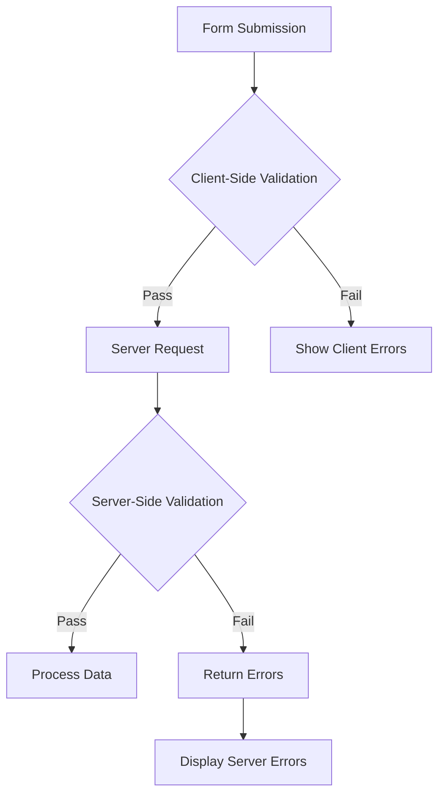

## Ikhtisar

XOOPS menyediakan validasi sisi klien dan sisi server untuk input formulir. Panduan ini mencakup teknik validasi, validator bawaan, dan implementasi validasi khusus.

## Arsitektur Validasi



## Validasi Sisi Server

### Menggunakan XoopsFormValidator

```php
use Xoops\Core\Form\Validator;

$validator = new Validator();

$validator->addRule('username', 'required', 'Username is required');
$validator->addRule('username', 'minLength:3', 'Username must be at least 3 characters');
$validator->addRule('username', 'maxLength:50', 'Username cannot exceed 50 characters');
$validator->addRule('email', 'email', 'Please enter a valid email address');
$validator->addRule('password', 'minLength:8', 'Password must be at least 8 characters');

if (!$validator->validate($_POST)) {
    $errors = $validator->getErrors();
    // Handle errors
}
```

### Aturan Validasi Bawaan

| Aturan | Deskripsi | Contoh |
|------|-------------|---------|
| `required` | Bidang wajib diisi | `required` |
| `email` | Format email yang valid | `email` |
| `url` | Format URL yang valid | `url` |
| `numeric` | Nilai numerik saja | `numeric` |
| `integer` | Hanya nilai integer | `integer` |
| `minLength` | Panjang string minimum | `minLength:3` |
| `maxLength` | Panjang string maksimum | `maxLength:100` |
| `min` | Nilai numerik minimum | `min:1` |
| `max` | Nilai numerik maksimum | `max:100` |
| `regex` | Pola regex khusus | `regex:/^[a-z]+$/` |
| `in` | Nilai dalam daftar | `in:draft,published,archived` |
| `date` | Format tanggal valid | `date` |
| `alpha` | Hanya huruf | `alpha` |
| `alphanumeric` | Huruf dan angka | `alphanumeric` |

### Aturan Validasi Khusus

```php
$validator->addCustomRule('unique_username', function($value) {
    $memberHandler = xoops_getHandler('member');
    $criteria = new \CriteriaCompo();
    $criteria->add(new \Criteria('uname', $value));
    return $memberHandler->getUserCount($criteria) === 0;
}, 'Username already exists');

$validator->addRule('username', 'unique_username');
```

## Permintaan Validasi

### Sanitasi Masukan

```php
use Xoops\Core\Request;

// Get sanitized values
$username = Request::getString('username', '', 'POST');
$email = Request::getEmail('email', '', 'POST');
$age = Request::getInt('age', 0, 'POST');
$price = Request::getFloat('price', 0.0, 'POST');
$tags = Request::getArray('tags', [], 'POST');

// With validation
$username = Request::getString('username', '', 'POST', [
    'minLength' => 3,
    'maxLength' => 50
]);
```

### XSS Pencegahan

```php
use Xoops\Core\Text\Sanitizer;

$sanitizer = Sanitizer::getInstance();

// Sanitize HTML content
$cleanContent = $sanitizer->sanitizeForDisplay($userContent);

// Strip all HTML
$plainText = $sanitizer->stripHtml($userContent);

// Allow specific tags
$content = $sanitizer->sanitizeForDisplay($userContent, [
    'allowedTags' => '<p><br><strong><em><a>'
]);
```

## Validasi Sisi Klien

### Atribut Validasi HTML5

```php
// Required field
$element->setExtra('required');

// Pattern validation
$element->setExtra('pattern="[a-zA-Z0-9]+" title="Alphanumeric only"');

// Length constraints
$element->setExtra('minlength="3" maxlength="50"');

// Numeric constraints
$element->setExtra('min="1" max="100"');
```

### Validasi JavaScript

```javascript
document.getElementById('myForm').addEventListener('submit', function(e) {
    const username = document.getElementById('username').value;
    const errors = [];

    if (username.length < 3) {
        errors.push('Username must be at least 3 characters');
    }

    if (!/^[a-zA-Z0-9_]+$/.test(username)) {
        errors.push('Username can only contain letters, numbers, and underscores');
    }

    if (errors.length > 0) {
        e.preventDefault();
        displayErrors(errors);
    }
});
```

## Perlindungan CSRF

### Pembuatan Token

```php
// Generate token in form
$form->addElement(new \XoopsFormHiddenToken());

// This adds a hidden field with security token
```

### Verifikasi Token

```php
use Xoops\Core\Security;

if (!Security::checkReferer()) {
    die('Invalid request origin');
}

if (!Security::checkToken()) {
    die('Invalid security token');
}
```

## Validasi Pengunggahan File

```php
use Xoops\Core\Uploader;

$uploader = new Uploader(
    uploadDir: XOOPS_UPLOAD_PATH . '/images/',
    allowedMimeTypes: ['image/jpeg', 'image/png', 'image/gif'],
    maxFileSize: 2 * 1024 * 1024, // 2MB
    maxWidth: 1920,
    maxHeight: 1080
);

if ($uploader->fetchMedia('image_upload')) {
    if ($uploader->upload()) {
        $savedFile = $uploader->getSavedFileName();
    } else {
        $errors[] = $uploader->getErrors();
    }
}
```

## Tampilan Kesalahan

### Kesalahan Pengumpulan

```php
$errors = [];

if (empty($username)) {
    $errors['username'] = 'Username is required';
}

if (!filter_var($email, FILTER_VALIDATE_EMAIL)) {
    $errors['email'] = 'Invalid email format';
}

if (!empty($errors)) {
    // Store in session for display after redirect
    $_SESSION['form_errors'] = $errors;
    $_SESSION['form_data'] = $_POST;
    header('Location: ' . $_SERVER['HTTP_REFERER']);
    exit;
}
```

### Menampilkan Kesalahan

```smarty
{if $errors}
<div class="alert alert-danger">
    <ul>
        {foreach $errors as $field => $message}
        <li>{$message}</li>
        {/foreach}
    </ul>
</div>
{/if}
```

## Praktik Terbaik

1. **Selalu validasi sisi server** - Validasi sisi klien dapat dilewati
2. **Gunakan kueri berparameter** - Cegah injeksi SQL
3. **Sanitasi keluaran** - Mencegah serangan XSS
4. **Validasi unggahan file** - Periksa jenis dan ukuran MIME
5. **Gunakan token CSRF** - Mencegah pemalsuan permintaan lintas situs
6. **Batas batas pengiriman** - Mencegah penyalahgunaan

## Dokumentasi Terkait

- Referensi Elemen Bentuk
- Ikhtisar Formulir
- Praktik Terbaik Keamanan
