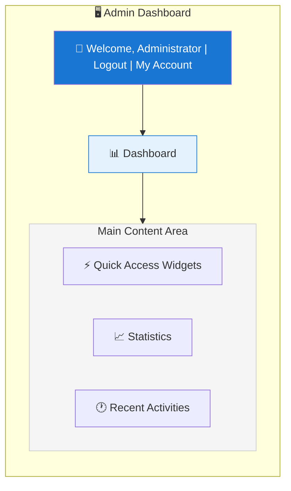
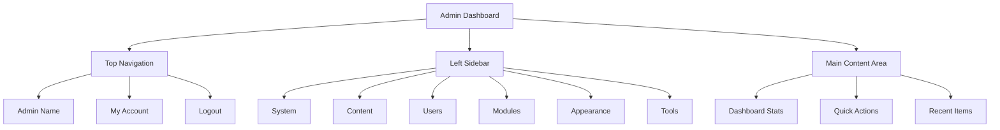

# Ikhtisar Panel Admin XOOPS

Panduan lengkap untuk menavigasi dan menggunakan dasbor administrator XOOPS.

## Mengakses Panel Admin

### Admin Masuk

Buka browser Anda dan navigasikan ke:

```
http://your-domain.com/xoops/admin/
```

Atau jika XOOPS berada di root:

```
http://your-domain.com/admin/
```

Masukkan kredensial administrator Anda:

```
Username: [Your admin username]
Password: [Your admin password]
```

### Setelah Masuk

Anda akan melihat dasbor admin utama:



## Tata Letak Panel Admin



## Komponen Dasbor

### Bilah Atas

Bilah atas berisi kontrol penting:

| Elemen | Tujuan |
|---|---|
| **Logo Admin** | Klik untuk kembali ke dasbor |
| **Pesan Selamat Datang** | Menampilkan nama admin yang login |
| **Akun Saya** | Edit profil admin dan kata sandi |
| **Bantuan** | Akses dokumentasi |
| **Keluar** | Keluar dari panel admin |

### Bilah Sisi Navigasi Kiri

Menu utama disusun berdasarkan fungsi:

```
├── System
│   ├── Dashboard
│   ├── Preferences
│   ├── Admin Users
│   ├── Groups
│   ├── Permissions
│   ├── Modules
│   └── Tools
├── Content
│   ├── Pages
│   ├── Categories
│   ├── Comments
│   └── Media Manager
├── Users
│   ├── Users
│   ├── User Requests
│   ├── Online Users
│   └── User Groups
├── Modules
│   ├── Modules
│   ├── Module Settings
│   └── Module Updates
├── Appearance
│   ├── Themes
│   ├── Templates
│   ├── Blocks
│   └── Images
└── Tools
    ├── Maintenance
    ├── Email
    ├── Statistics
    ├── Logs
    └── Backups
```

### Area Konten Utama

Menampilkan informasi dan kontrol untuk bagian yang dipilih:

- Formulir untuk konfigurasi
- Tabel data dengan daftar
- Grafik dan statistik
- Tombol tindakan cepat
- Teks bantuan dan keterangan alat

### Widget Dasbor

Akses cepat ke informasi penting:

- **Informasi Sistem:** Versi PHP, versi MySQL, versi XOOPS
- **Statistik Cepat:** Jumlah pengguna, total postingan, module terpasang
- **Aktivitas Terkini:** Login terbaru, perubahan konten, kesalahan
- **Status Server:** CPU, memori, penggunaan disk
- **Pemberitahuan:** Peringatan sistem, pembaruan tertunda

## Fungsi Admin core

### Manajemen Sistem

**Lokasi:** Sistem > [Berbagai Pilihan]

#### Preferensi

Konfigurasikan pengaturan sistem dasar:

```
System > Preferences > [Settings Category]
```

Kategori:
- Pengaturan Umum (nama situs, zona waktu)
- Pengaturan Pengguna (pendaftaran, profil)
- Pengaturan Email (konfigurasi SMTP)
- Pengaturan Cache (opsi caching)
- Pengaturan URL (URL ramah)
- Meta Tag (pengaturan SEO)

Lihat Konfigurasi Dasar dan Pengaturan Sistem.

#### Pengguna Admin

Kelola akun administrator:

```
System > Admin Users
```

Fungsi:
- Tambahkan administrator baru
- Edit profil admin
- Ubah kata sandi admin
- Hapus akun admin
- Tetapkan izin admin

### Manajemen Konten

**Lokasi:** Konten > [Berbagai Pilihan]

#### Pages/Articles

Kelola konten situs:

```
Content > Pages (or your module)
```

Fungsi:
- Buat halaman baru
- Edit konten yang ada
- Hapus halaman
- Publish/unpublish
- Tetapkan kategori
- Kelola revisi

#### Kategori

Atur konten:

```
Content > Categories
```

Fungsi:
- Buat hierarki kategori
- Edit kategori
- Hapus kategori
- Tetapkan ke halaman

#### Komentar

Komentar pengguna yang moderat:

```
Content > Comments
```

Fungsi:
- Lihat semua komentar
- Setujui komentar
- Sunting komentar
- Hapus spam
- Blokir pemberi komentar

### Manajemen Pengguna

**Lokasi:** Pengguna > [Berbagai Pilihan]

#### Pengguna

Kelola akun pengguna:

```
Users > Users
```

Fungsi:
- Lihat semua pengguna
- Buat pengguna baru
- Edit profil pengguna
- Hapus akun
- Atur ulang kata sandi
- Ubah status pengguna
- Tetapkan ke grup

#### Pengguna Daring

Pantau pengguna aktif:

```
Users > Online Users
```

Pertunjukan:
- Saat ini pengguna online
- Waktu aktivitas terakhir
- alamat IP
- Lokasi pengguna (jika dikonfigurasi)

#### Grup Pengguna

Kelola peran dan izin pengguna:

```
Users > Groups
```

Fungsi:
- Buat grup khusus
- Tetapkan izin grup
- Tetapkan pengguna ke grup
- Hapus grup

### Manajemen module

**Lokasi:** module > [Berbagai Pilihan]

#### module

Instal dan konfigurasikan module:

```
Modules > Modules
```

Fungsi:
- Lihat module yang diinstal
- module Enable/disable
- Perbarui module
- Konfigurasikan pengaturan module
- Instal module baru
- Lihat detail module

#### Periksa Pembaruan

```
Modules > Modules > Check for Updates
```

Menampilkan:
- Pembaruan module yang tersedia
- Catatan Perubahan
- Unduh dan instal opsi

### Manajemen Penampilan

**Lokasi:** Penampilan > [Berbagai Pilihan]

#### theme

Kelola theme situs:

```
Appearance > Themes
```

Fungsi:
- Lihat theme yang diinstal
- Tetapkan theme default
- Unggah theme baru
- Hapus theme
- Pratinjau theme
- Konfigurasi theme

#### block

Kelola block konten:

```
Appearance > Blocks
```
Fungsi:
- Buat block khusus
- Edit konten block
- Atur block di halaman
- Atur visibilitas block
- Hapus block
- Konfigurasikan cache block

#### template

Kelola template (lanjutan):

```
Appearance > Templates
```

Untuk pengguna dan pengembang tingkat lanjut.

### Alat Sistem

**Lokasi:** Sistem > Alat

#### Modus Pemeliharaan

Cegah akses pengguna selama pemeliharaan:

```
System > Maintenance Mode
```

Konfigurasikan:
- Pemeliharaan Enable/disable
- Pesan pemeliharaan khusus
- Alamat IP yang diizinkan (untuk pengujian)

#### Manajemen Basis Data

```
System > Database
```

Fungsi:
- Periksa konsistensi basis data
- Jalankan pembaruan basis data
- Perbaikan meja
- Optimalkan basis data
- Ekspor struktur basis data

#### Log Aktivitas

```
System > Logs
```

Memantau:
- Aktivitas pengguna
- Tindakan administratif
- Acara sistem
- Log kesalahan

## Tindakan Cepat

Tugas umum yang dapat diakses dari dasbor:

```
Quick Links:
├── Create New Page
├── Add New User
├── Create Content Block
├── Upload Image
├── Send Mass Email
├── Update All Modules
└── Clear Cache
```

## Pintasan Keyboard Panel Admin

Navigasi cepat:

| Pintasan | Aksi |
|---|---|
| `Ctrl+H` | Pergi untuk membantu |
| `Ctrl+D` | Buka dasbor |
| `Ctrl+Q` | Pencarian cepat |
| `Ctrl+L` | Keluar |

## Manajemen Akun Pengguna

### Akun Saya

Akses profil administrator Anda:

1. Klik "Akun Saya" di kanan atas
2. Edit informasi profil:
   - Alamat email
   - Nama asli
   - Informasi pengguna
   - Avatar

### Ubah Kata Sandi

Ubah kata sandi admin Anda:

1. Buka **Akun Saya**
2. Klik "Ganti Kata Sandi"
3. Masukkan kata sandi saat ini
4. Masukkan kata sandi baru (dua kali)
5. Klik "Simpan"

**Kiat Keamanan:**
- Gunakan kata sandi yang kuat (16+ karakter)
- Sertakan huruf besar, huruf kecil, angka, simbol
- Ubah kata sandi setiap 90 hari
- Jangan pernah membagikan kredensial admin

### Keluar

Keluar dari panel admin:

1. Klik "Keluar" di kanan atas
2. Anda akan diarahkan ke halaman login

## Statistik Panel Admin

### Statistik Dasbor

Ikhtisar singkat tentang metrik situs:

| Metrik | Nilai |
|--------|-------|
| Pengguna Daring | 12 |
| Jumlah Pengguna | 256 |
| Jumlah Postingan | 1.234 |
| Jumlah Komentar | 5.678 |
| Jumlah module | 8 |

### Status Sistem

Informasi server dan kinerja:

| Komponen | Version/Value |
|-----------|---------------|
| Versi XOOPS | 2.5.11 |
| Versi PHP | 8.2.x |
| Versi MySQL | 8.0.x |
| Beban Server | 0,45, 0,42 |
| Waktu Aktif | 45 hari |

### Aktivitas Terkini

Garis waktu kejadian terkini:

```
12:45 - Admin login
12:30 - New user registered
12:15 - Page published
12:00 - Comment posted
11:45 - Module updated
```

## Sistem Pemberitahuan

### Peringatan Admin

Terima pemberitahuan untuk:

- Pendaftaran pengguna baru
- Komentar menunggu moderasi
- Upaya login gagal
- Kesalahan sistem
- Pembaruan module tersedia
- Masalah basis data
- Peringatan ruang disk

Konfigurasikan peringatan:

**Sistem > Preferensi > Pengaturan Email**

```
Notify Admin on Registration: Yes
Notify Admin on Comments: Yes
Notify Admin on Errors: Yes
Alert Email: admin@your-domain.com
```

## Tugas Admin Umum

### Buat Halaman Baru

1. Buka **Konten > Halaman** (atau module yang relevan)
2. Klik "Tambahkan Halaman Baru"
3. Isi:
   - Judul
   - Konten
   - Deskripsi
   - Kategori
   - Metadata
4. Klik "Terbitkan"

### Kelola Pengguna

1. Buka **Pengguna > Pengguna**
2. Lihat daftar pengguna dengan:
   - Nama pengguna
   - Surel
   - Tanggal pendaftaran
   - Masuk terakhir
   - Status

3. Klik nama pengguna untuk:
   - Sunting profil
   - Ubah kata sandi
   - Sunting grup
   - Pengguna Block/unblock

### Konfigurasikan module

1. Buka **module > module**
2. Temukan module dalam daftar
3. Klik nama module
4. Klik "Preferensi" atau "Pengaturan"
5. Konfigurasikan opsi module
6. Simpan perubahan

### Buat block Baru

1. Buka **Penampilan > block**
2. Klik "Tambahkan block Baru"
3. Masukkan:
   - Blokir judul
   - Blokir konten (HTML diperbolehkan)
   - Posisi di halaman
   - Visibilitas (semua halaman atau spesifik)
   - module (jika ada)
4. Klik "Kirim"

## Bantuan Panel Admin

### Dokumentasi Bawaan

Akses bantuan dari panel admin:

1. Klik tombol "Bantuan" di bilah atas
2. Bantuan peka konteks untuk halaman saat ini
3. Tautan ke dokumentasi
4. Pertanyaan yang sering diajukan

### Sumber Daya Eksternal

- Situs Resmi XOOPS: https://xoops.org/
- Forum Komunitas: https://xoops.org/modules/newbb/
- Repositori module: https://xoops.org/modules/repository/
- Bugs/Issues: https://github.com/XOOPS/XoopsCore/issues

## Menyesuaikan Panel Admin

### theme Admin

Pilih theme antarmuka admin:

**Sistem > Preferensi > Pengaturan Umum**

```
Admin Theme: [Select theme]
```

theme yang tersedia:
- Bawaan (ringan)
- Mode gelap
- theme khusus

### Kustomisasi Dasbor

Pilih widget mana yang muncul:

**Dasbor > Sesuaikan**Pilih:
- Informasi sistem
- Statistik
- Aktivitas terkini
- Tautan cepat
- Widget khusus

## Izin Panel Admin

Tingkat admin yang berbeda memiliki izin yang berbeda:

| Peran | Kemampuan |
|---|---|
| **Webmaster** | Akses penuh ke semua fungsi admin |
| **Admin** | Fungsi admin terbatas |
| **Moderator** | Hanya moderasi konten |
| **Penyunting** | Pembuatan dan pengeditan konten |

Kelola izin:

**Sistem > Izin**

## Praktik Terbaik Keamanan untuk Panel Admin

1. **Kata Sandi Kuat:** Gunakan kata sandi 16+ karakter
2. **Perubahan Reguler:** Ubah kata sandi setiap 90 hari
3. **Akses Monitor:** Periksa log "Pengguna Admin" secara rutin
4. **Batasi Akses:** Ganti nama folder admin untuk keamanan tambahan
5. **Gunakan HTTPS:** Selalu akses admin melalui HTTPS
6. **Daftar Putih IP:** Membatasi akses admin ke IP tertentu
7. **Logout Reguler:** Logout setelah selesai
8. **Keamanan Browser:** Hapus cache browser secara teratur

Lihat Konfigurasi Keamanan.

## Mengatasi Masalah Panel Admin

### Tidak Dapat Mengakses Panel Admin

**Solusi:**
1. Verifikasi kredensial login
2. Hapus cache dan cookie browser
3. Coba browser lain
4. Periksa apakah jalur folder admin sudah benar
5. Verifikasi izin file pada folder admin
6. Periksa koneksi database di mainfile.php

### Halaman Admin Kosong

**Solusi:**
```bash
# Check PHP errors
tail -f /var/log/apache2/error.log

# Enable debug mode temporarily
sed -i "s/define('XOOPS_DEBUG', 0)/define('XOOPS_DEBUG', 1)/" /var/www/html/xoops/mainfile.php

# Check file permissions
ls -la /var/www/html/xoops/admin/
```

### Panel Admin Lambat

**Solusi:**
1. Hapus cache: **Sistem > Alat > Hapus Cache**
2. Optimalkan basis data: **Sistem > Basis Data > Optimalkan**
3. Periksa sumber daya server: `htop`
4. Tinjau kueri lambat di MySQL

### module Tidak Muncul

**Solusi:**
1. Verifikasi module yang terpasang: **module > module**
2. Periksa module diaktifkan
3. Verifikasi izin yang diberikan
4. Periksa apakah file module ada
5. Tinjau log kesalahan

## Langkah Selanjutnya

Setelah membiasakan diri dengan panel admin:

1. Buat halaman pertama Anda
2. Siapkan grup pengguna
3. Pasang module tambahan
4. Konfigurasikan pengaturan dasar
5. Menerapkan keamanan

---

**Tag:** #admin-panel #dashboard #navigasi #memulai

**Artikel Terkait:**
- ../Configuration/Basic-Configuration
- ../Configuration/System-Settings
- Membuat-Halaman-Pertama-Anda
- Mengelola-Pengguna
- Instalasi-module
