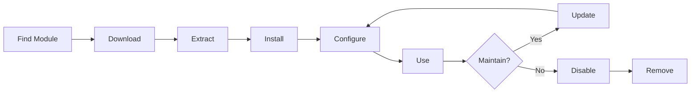

# Memasang dan Mengelola module XOOPS

Pelajari cara memperluas fungsionalitas XOOPS dengan menginstal dan mengonfigurasi module.

## Memahami module XOOPS

### Apa itu module?

module adalah ekstensi yang menambahkan fungsionalitas ke XOOPS:

| Ketik | Tujuan | Contoh |
|---|---|---|
| **Konten** | Kelola tipe konten tertentu | Berita, Blog, Tiket |
| **Komunitas** | Interaksi pengguna | Forum, Komentar, Ulasan |
| **ecommerce** | Menjual produk | Belanja, Keranjang, Pembayaran |
| **Media** | Tangani files/images | Galeri, Unduhan, Video |
| **Utilitas** | Alat dan Pembantu | Email, Cadangan, Analisis |

### module core vs. Opsional

| module | Ketik | Termasuk | Dapat dilepas |
|---|---|---|---|
| **Sistem** | core | Ya | Tidak |
| **Pengguna** | core | Ya | Tidak |
| **Profil** | Direkomendasikan | Ya | Ya |
| **PM (Pesan Pribadi)** | Direkomendasikan | Ya | Ya |
| **Saluran WF** | Opsional | Sering | Ya |
| **Berita** | Opsional | Tidak | Ya |
| **Forum** | Opsional | Tidak | Ya |

## Siklus Hidup module



## Menemukan module

### Repositori module XOOPS

Repositori module XOOPS resmi:

**Kunjungi:** https://xoops.org/modules/repository/

```
Directory > Modules > [Browse Categories]
```

Jelajahi berdasarkan kategori:
- Manajemen Konten
- Komunitas
- eCommerce
- Multimedia
- Pengembangan
- Administrasi Situs

### Mengevaluasi module

Sebelum menginstal, periksa:

| Kriteria | Apa yang Harus Diperhatikan |
|---|---|
| **Kompatibilitas** | Bekerja dengan versi XOOPS Anda |
| **Peringkat** | Ulasan dan penilaian pengguna yang bagus |
| **Pembaruan** | Baru-baru ini dipelihara |
| **Unduhan** | Populer dan banyak digunakan |
| **Persyaratan** | Kompatibel dengan server Anda |
| **Lisensi** | GPL atau sumber terbuka serupa |
| **Dukungan** | Pengembang dan komunitas aktif |

### Membaca Informasi module

Setiap daftar module menunjukkan:

```
Module Name: [Name]
Version: [X.X.X]
Requires: XOOPS [Version]
Author: [Name]
Last Update: [Date]
Downloads: [Number]
Rating: [Stars]
Description: [Brief description]
Compatibility: PHP [Version], MySQL [Version]
```

## Memasang module

### Metode 1: Instalasi Panel Admin

**Langkah 1: Akses Bagian module**

1. Masuk ke panel admin
2. Navigasikan ke **module > module**
3. Klik **"Instal module Baru"** atau **"Jelajahi module"**

**Langkah 2: Unggah module**

Opsi A - Unggah Langsung:
1. Klik **"Pilih File"**
2. Pilih file module .zip dari komputer
3. Klik **"Unggah"**

Opsi B - URL Unggah:
1. Tempel module URL
2. Klik **"Unduh dan Instal"**

**Langkah 3: Tinjau Info module**

```
Module Name: [Name shown]
Version: [Version]
Author: [Author info]
Description: [Full description]
Requirements: [PHP/MySQL versions]
```

Tinjau dan klik **"Lanjutkan dengan Instalasi"**

**Langkah 4: Pilih Jenis Penginstalan**

```
☐ Fresh Install (New installation)
☐ Update (Upgrade existing)
☐ Delete Then Install (Replace existing)
```

Pilih opsi yang sesuai.

**Langkah 5: Konfirmasi Pemasangan**

Tinjau konfirmasi akhir:
```
Module will be installed to: /modules/modulename/
Database: xoops_db
Proceed? [Yes] [No]
```

Klik **"Ya"** untuk mengonfirmasi.

**Langkah 6: Instalasi Selesai**

```
Installation successful!

Module: [Module Name]
Version: [Version]
Tables created: [Number]
Files installed: [Number]

[Go to Module Settings]  [Return to Modules]
```

### Metode 2: Instalasi Manual (Lanjutan)

Untuk instalasi manual atau pemecahan masalah:

**Langkah 1: Unduh module**

1. Unduh module .zip dari repositori
2. Ekstrak ke `/var/www/html/xoops/modules/modulename/`

```bash
# Extract module
unzip module_name.zip
cp -r module_name /var/www/html/xoops/modules/

# Set permissions
chmod -R 755 /var/www/html/xoops/modules/module_name
```

**Langkah 2: Jalankan Skrip Instalasi**

```
Visit: http://your-domain.com/xoops/modules/module_name/admin/index.php?op=install
```

Atau melalui panel admin (Sistem > module > Perbarui DB).

**Langkah 3: Verifikasi Instalasi**

1. Buka **module > module** di admin
2. Cari module Anda dalam daftar
3. Verifikasi bahwa itu ditampilkan sebagai "Aktif"

## Konfigurasi module

### Akses Pengaturan module

1. Buka **module > module**
2. Temukan module Anda
3. Klik pada nama module
4. Klik **"Preferensi"** atau **"Pengaturan"**

### Pengaturan module Umum

Sebagian besar module menawarkan:

```
Module Status: [Enabled/Disabled]
Display in Menu: [Yes/No]
Module Weight: [1-999] (display order)
Visible To Groups: [Checkboxes for user groups]
```

### Opsi Khusus module

Setiap module memiliki pengaturan unik. Contoh:

**module Berita:**
```
Items Per Page: 10
Show Author: Yes
Allow Comments: Yes
Moderation Required: Yes
```

**module Forum:**
```
Topics Per Page: 20
Posts Per Page: 15
Maximum Attachment Size: 5MB
Enable Signatures: Yes
```

**module Galeri:**
```
Images Per Page: 12
Thumbnail Size: 150x150
Maximum Upload: 10MB
Watermark: Yes/No
```

Tinjau dokumentasi module Anda untuk opsi spesifik.

### Simpan Konfigurasi

Setelah menyesuaikan pengaturan:

1. Klik **"Kirim"** atau **"Simpan"**
2. Anda akan melihat konfirmasi:
   
   ```
   Settings saved successfully!
   
   ```

## Mengelola block module

Banyak module membuat "block" - area konten seperti widget.

### Lihat block module

1. Buka **Penampilan > block**
2. Cari block dari module Anda
3. Kebanyakan module menampilkan "[Nama module] - [Deskripsi block]"

### Konfigurasikan Blok1. Klik pada nama block
2. Sesuaikan:
   - Blokir judul
   - Visibilitas (semua halaman atau spesifik)
   - Posisi di halaman (kiri, tengah, kanan)
   - Kelompok pengguna yang dapat melihat
3. Klik **"Kirim"**

### Tampilan block di Beranda

1. Buka **Penampilan > block**
2. Temukan block yang Anda inginkan
3. Klik **"Edit"**
4. Tetapkan:
   - **Dapat dilihat oleh:** Pilih grup
   - **Posisi:** Pilih kolom (left/center/right)
   - **Halaman:** Beranda atau semua halaman
5. Klik **"Kirim"**

## Memasang Contoh module Tertentu

### Memasang module Berita

**Sempurna untuk:** Postingan blog, pengumuman

1. Unduh module Berita dari repositori
2. Unggah melalui **module > module > Instal**
3. Konfigurasikan di **module > Berita > Preferensi**:
   - Cerita per halaman: 10
   - Izinkan komentar: Ya
   - Setuju sebelum diterbitkan: Ya
4. Buat block untuk berita terbaru
5. Mulailah menerbitkan cerita!

### Memasang module Forum

**Sempurna untuk:** Diskusi komunitas

1. Unduh module Forum
2. Instal melalui panel admin
3. Buat kategori forum di module
4. Konfigurasikan pengaturan:
   - Topics/page: 20
   - Posts/page: 15
   - Aktifkan moderasi: Ya
5. Tetapkan izin grup pengguna
6. Buat block untuk topik terbaru

### Memasang module Galeri

**Sempurna untuk:** Pameran gambar

1. Unduh module Galeri
2. Instal dan konfigurasikan
3. Buat album foto
4. Unggah gambar
5. Tetapkan izin untuk viewing/uploading
6. Tampilkan galeri di website

## Memperbarui module

### Periksa Pembaruan

```
Admin Panel > Modules > Modules > Check for Updates
```

Ini menunjukkan:
- Pembaruan module yang tersedia
- Versi terkini vs. baru
- Catatan Changelog/release

### Perbarui module

1. Buka **module > module**
2. Klik module dengan pembaruan yang tersedia
3. Klik tombol **"Perbarui"**
4. Pilih **"Perbarui" dari Jenis Instalasi**
5. Ikuti wizard instalasi
6. module diperbarui!

### Catatan Pembaruan Penting

Sebelum memperbarui:

- [ ] Cadangan basis data
- [ ] File module cadangan
- [ ] Tinjau log perubahan
- [ ] Uji pada server staging terlebih dahulu
- [ ] Catat setiap modifikasi khusus

Setelah memperbarui:
- [ ] Verifikasi fungsionalitas
- [ ] Periksa pengaturan module
- [ ] Ulasan untuk warnings/errors
- [ ] Hapus cache

## Izin module

### Tetapkan Akses Grup Pengguna

Kontrol grup pengguna mana yang dapat mengakses module:

**Lokasi:** Sistem > Izin

Untuk setiap module, konfigurasikan:

```
Module: [Module Name]

Admin Access: [Select groups]
User Access: [Select groups]
Read Permission: [Groups allowed to view]
Write Permission: [Groups allowed to post]
Delete Permission: [Administrators only]
```

### Tingkat Izin Umum

```
Public Content (News, Pages):
├── Admin Access: Webmaster
├── User Access: All logged-in users
└── Read Permission: Everyone

Community Features (Forum, Comments):
├── Admin Access: Webmaster, Moderators
├── User Access: All logged-in users
└── Write Permission: All logged-in users

Admin Tools:
├── Admin Access: Webmaster only
└── User Access: Disabled
```

## Menonaktifkan dan Menghapus module

### Nonaktifkan module (Simpan File)

Simpan module tetapi sembunyikan dari situs:

1. Buka **module > module**
2. Temukan module
3. Klik nama module
4. Klik **"Nonaktifkan"** atau atur status menjadi Tidak Aktif
5. module disembunyikan tetapi data disimpan

Aktifkan kembali kapan saja:
1. Klik module
2. Klik **"Aktifkan"**

### Hapus module Sepenuhnya

Hapus module dan datanya:

1. Buka **module > module**
2. Temukan module
3. Klik **"Copot"** atau **"Hapus"**
4. Konfirmasi: "Hapus module dan semua data?"
5. Klik **"Ya"** untuk mengonfirmasi

**Peringatan:** Menghapus instalasi akan menghapus semua data module!

### Instal Ulang Setelah Uninstall

Jika Anda menghapus instalasi module:
- File module dihapus
- Tabel database dihapus
- Semua data hilang
- Harus diinstal ulang untuk digunakan kembali
- Dapat memulihkan dari cadangan

## Mengatasi Masalah Instalasi module

### module Tidak Muncul Setelah Instalasi

**Gejala:** module terdaftar tetapi tidak terlihat di situs

**Solusi:**
```
1. Check module is "Active" (Modules > Modules)
2. Enable module blocks (Appearance > Blocks)
3. Verify user permissions (System > Permissions)
4. Clear cache (System > Tools > Clear Cache)
5. Check .htaccess doesn't block module
```

### Kesalahan Instalasi : “Tabel Sudah Ada”

**Gejala:** Kesalahan saat instalasi module

**Solusi:**
```
1. Module partially installed before
2. Try "Delete then Install" option
3. Or uninstall first, then install fresh
4. Check database for existing tables:
   mysql> SHOW TABLES LIKE 'xoops_module%';
```

### module Ketergantungan Hilang

**Gejala:** module tidak dapat dipasang - memerlukan module lain

**Solusi:**
```
1. Note required modules from error message
2. Install required modules first
3. Then install the module
4. Install in correct order
```

### Halaman Kosong Saat Mengakses module

**Gejala:** module dimuat tetapi tidak menunjukkan apa pun

**Solusi:**
```
1. Enable debug mode in mainfile.php:
   define('XOOPS_DEBUG', 1);

2. Check PHP error log:
   tail -f /var/log/php_errors.log

3. Verify file permissions:
   chmod -R 755 /var/www/html/xoops/modules/modulename

4. Check database connection in module config

5. Disable module and reinstall
```

### module Merusak Situs

**Gejala:** Penginstalan module merusak situs web

**Solusi:**
```
1. Disable the problematic module immediately:
   Admin > Modules > [Module] > Disable

2. Clear cache:
   rm -rf /var/www/html/xoops/cache/*
   rm -rf /var/www/html/xoops/templates_c/*

3. Restore from backup if needed

4. Check error logs for root cause

5. Contact module developer
```

## Pertimbangan Keamanan module

### Hanya Instal dari Sumber Tepercaya

```
✓ Official XOOPS Repository
✓ GitHub official XOOPS modules
✓ Trusted module developers
✗ Unknown websites
✗ Unverified sources
```

### Periksa Izin module

Setelah instalasi:

1. Tinjau kode module untuk aktivitas mencurigakan
2. Periksa tabel database apakah ada anomali
3. Pantau perubahan file
4. Selalu perbarui module
5. Hapus module yang tidak digunakan

### Izin Praktik Terbaik

```
Module directory: 755 (readable, not writable by web server)
Module files: 644 (readable only)
Module data: Protected by database
```

## Sumber Daya Pengembangan module

### Pelajari Pengembangan module- Dokumentasi Resmi: https://xoops.org/
- Repositori GitHub: https://github.com/XOOPS/
- Forum Komunitas: https://xoops.org/modules/newbb/
- Panduan Pengembang: Tersedia di folder dokumen

## Praktik Terbaik untuk module

1. **Instal Satu Per Satu:** Pantau konflik
2. **Tes Setelah Penginstalan:** Verifikasi fungsionalitas
3. **Konfigurasi Kustom Dokumen:** Catat pengaturan Anda
4. **Terus Diperbarui:** Segera instal pembaruan module
5. **Hapus yang Tidak Digunakan:** Hapus module yang tidak diperlukan
6. **Backup Sebelum:** Selalu backup sebelum menginstal
7. **Baca Dokumentasi:** Periksa instruksi module
8. **Bergabung dengan Komunitas:** Minta bantuan jika diperlukan

## Daftar Periksa Instalasi module

Untuk setiap instalasi module:

- [ ] Teliti dan baca ulasan
- [ ] Verifikasi kompatibilitas versi XOOPS
- [ ] Cadangkan database dan file
- [ ] Unduh versi terbaru
- [ ] Instal melalui panel admin
- [ ] Konfigurasikan pengaturan
- [ ] block Create/position
- [ ] Tetapkan izin pengguna
- [ ] Uji fungsionalitas
- [ ] Konfigurasi dokumen
- [ ] Jadwal pembaruan

## Langkah Selanjutnya

Setelah menginstal module:

1. Buat konten untuk module
2. Siapkan grup pengguna
3. Jelajahi fitur admin
4. Optimalkan kinerja
5. Pasang module tambahan sesuai kebutuhan

---

**Tag:** #module #instalasi #ekstensi #manajemen

**Artikel Terkait:**
- Ikhtisar Panel-Admin
- Mengelola-Pengguna
- Membuat-Halaman-Pertama-Anda
- ../Configuration/System-Settings
