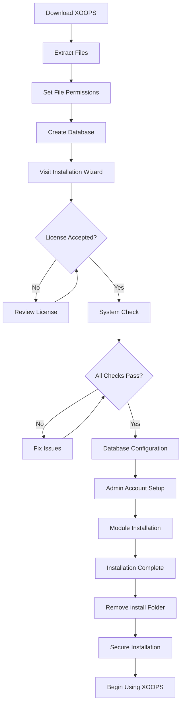

# Panduan Instalasi XOOPS Lengkap

Panduan ini memberikan panduan komprehensif untuk menginstal XOOPS dari awal menggunakan wizard instalasi.

## Prasyarat

Sebelum memulai instalasi, pastikan Anda memiliki:

- Akses ke server web Anda melalui FTP atau SSH
- Akses administrator ke server database Anda
- Nama domain terdaftar
- Persyaratan server diverifikasi
- Alat cadangan tersedia

## Proses Instalasi



## Instalasi Langkah demi Langkah

### Langkah 1: Unduh XOOPS

Unduh versi terbaru dari [https://xoops.org/](https://xoops.org/):

```bash
# Using wget
wget https://xoops.org/download/xoops-2.5.8.zip

# Using curl
curl -O https://xoops.org/download/xoops-2.5.8.zip
```

### Langkah 2: Ekstrak File

Ekstrak arsip XOOPS ke root web Anda:

```bash
# Navigate to web root
cd /var/www/html

# Extract XOOPS
unzip xoops-2.5.8.zip

# Rename folder (optional, but recommended)
mv xoops-2.5.8 xoops
cd xoops
```

### Langkah 3: Tetapkan Izin File

Tetapkan izin yang tepat untuk direktori XOOPS:

```bash
# Make directories writable (755 for dirs, 644 for files)
find . -type d -exec chmod 755 {} \;
find . -type f -exec chmod 644 {} \;

# Make specific directories writable by web server
chmod 777 uploads/
chmod 777 templates_c/
chmod 777 var/
chmod 777 cache/

# Secure mainfile.php after installation
chmod 644 mainfile.php
```

### Langkah 4: Buat Basis Data

Buat database baru untuk XOOPS menggunakan MySQL:

```sql
-- Create database
CREATE DATABASE xoops_db CHARACTER SET utf8mb4 COLLATE utf8mb4_unicode_ci;

-- Create user
CREATE USER 'xoops_user'@'localhost' IDENTIFIED BY 'secure_password_here';

-- Grant privileges
GRANT ALL PRIVILEGES ON xoops_db.* TO 'xoops_user'@'localhost';
FLUSH PRIVILEGES;
```

Atau menggunakan phpMyAdmin:

1. Masuk ke phpMyAdmin
2. Klik tab "Database".
3. Masukkan nama basis data: `xoops_db`
4. Pilih susunan "utf8mb4_unicode_ci".
5. Klik "Buat"
6. Buat user dengan nama yang sama dengan database
7. Berikan semua hak istimewa

### Langkah 5: Jalankan Wizard Instalasi

Buka browser Anda dan navigasikan ke:

```
http://your-domain.com/xoops/install/
```

#### Tahap Pemeriksaan Sistem

Wizard memeriksa konfigurasi server Anda:

- PHP versi >= 5.6.0
- MySQL/MariaDB tersedia
- Ekstensi PHP yang diperlukan (GD, PDO, dll.)
- Izin direktori
- Konektivitas basis data

**Jika pemeriksaan gagal:**

Lihat bagian #Masalah-Instalasi-Umum untuk solusinya.

#### Konfigurasi Basis Data

Masukkan kredensial basis data Anda:

```
Database Host: localhost
Database Name: xoops_db
Database User: xoops_user
Database Password: [your_secure_password]
Table Prefix: xoops_
```

**Catatan Penting:**
- Jika host database Anda berbeda dengan localhost (misalnya server jarak jauh), masukkan nama host yang benar
- Awalan tabel membantu jika menjalankan beberapa instance XOOPS dalam satu database
- Gunakan kata sandi yang kuat dengan campuran huruf besar-kecil, angka, dan simbol

#### Pengaturan Akun Admin

Buat akun administrator Anda:

```
Admin Username: admin (or choose custom)
Admin Email: admin@your-domain.com
Admin Password: [strong_unique_password]
Confirm Password: [repeat_password]
```

**Praktik Terbaik:**
- Gunakan nama pengguna yang unik, bukan "admin"
- Gunakan kata sandi dengan 16+ karakter
- Simpan kredensial di pengelola kata sandi yang aman
- Jangan pernah membagikan kredensial admin

#### Instalasi module

Pilih module default untuk diinstal:

- **module Sistem** (wajib) - Fungsi core XOOPS
- **module Pengguna** (wajib) - Manajemen pengguna
- **module Profil** (disarankan) - Profil pengguna
- **module PM (Pesan Pribadi)** (disarankan) - Pesan internal
- **module Saluran WF** (opsional) - Manajemen konten

Pilih semua module yang direkomendasikan untuk instalasi lengkap.

### Langkah 6: Selesaikan Instalasi

Setelah semua langkah, Anda akan melihat layar konfirmasi:

```
Installation Complete!

Your XOOPS installation is ready to use.
Admin Panel: http://your-domain.com/xoops/admin/
User Panel: http://your-domain.com/xoops/
```

### Langkah 7: Amankan Instalasi Anda

#### Hapus Folder Instalasi

```bash
# Remove the install directory (CRITICAL for security)
rm -rf /var/www/html/xoops/install/

# Or rename it
mv /var/www/html/xoops/install/ /var/www/html/xoops/install.bak
```

**PERINGATAN:** Jangan biarkan folder instalasi dapat diakses dalam produksi!

#### Amankan mainfile.php

```bash
# Make mainfile.php read-only
chmod 644 /var/www/html/xoops/mainfile.php

# Set ownership
chown www-data:www-data /var/www/html/xoops/mainfile.php
```

#### Tetapkan Izin File yang Benar

```bash
# Recommended production permissions
find . -type f -name "*.php" -exec chmod 644 {} \;
find . -type d -exec chmod 755 {} \;

# Writable directories for web server
chmod 777 uploads/ var/ cache/ templates_c/
```

#### Aktifkan HTTPS/SSL

Konfigurasikan SSL di server web Anda (nginx atau Apache).

**Untuk Apache:**
```apache
<VirtualHost *:443>
    ServerName your-domain.com
    DocumentRoot /var/www/html/xoops

    SSLEngine on
    SSLCertificateFile /etc/ssl/certs/your-cert.crt
    SSLCertificateKeyFile /etc/ssl/private/your-key.key

    # Force HTTPS redirect
    <IfModule mod_rewrite.c>
        RewriteEngine On
        RewriteCond %{HTTPS} off
        RewriteRule ^(.*)$ https://%{HTTP_HOST}%{REQUEST_URI} [L,R=301]
    </IfModule>
</VirtualHost>
```

## Konfigurasi Pasca Instalasi

### 1. Akses Panel Admin

Arahkan ke:
```
http://your-domain.com/xoops/admin/
```

Masuk dengan kredensial admin Anda.

### 2. Konfigurasikan Pengaturan Dasar

Konfigurasikan yang berikut ini:

- Nama situs dan deskripsi
- Alamat email Admin
- Zona waktu dan format tanggal
- Optimasi mesin pencari

### 3. Uji Instalasi

- [ ] Kunjungi beranda
- [ ] Periksa pemuatan module
- [ ] Verifikasi pendaftaran pengguna berfungsi
- [ ] Uji fungsi panel admin
- [ ] Konfirmasikan SSL/HTTPS berfungsi

### 4. Jadwalkan Pencadangan

Siapkan pencadangan otomatis:

```bash
# Create backup script (backup.sh)
#!/bin/bash
DATE=$(date +%Y%m%d_%H%M%S)
BACKUP_DIR="/backups/xoops"
XOOPS_DIR="/var/www/html/xoops"

# Backup database
mysqldump -u xoops_user -p[password] xoops_db > $BACKUP_DIR/db_$DATE.sql

# Backup files
tar -czf $BACKUP_DIR/files_$DATE.tar.gz $XOOPS_DIR

echo "Backup completed: $DATE"
```

Jadwalkan dengan cron:
```bash
# Daily backup at 2 AM
0 2 * * * /usr/local/bin/backup.sh
```

## Masalah Umum Instalasi

### Masalah: Kesalahan Izin Ditolak

**Gejala:** "Izin ditolak" saat mengunggah atau membuat file

**Solusi:**
```bash
# Check web server user
ps aux | grep apache  # For Apache
ps aux | grep nginx   # For Nginx

# Fix permissions (replace www-data with your web server user)
chown -R www-data:www-data /var/www/html/xoops
chmod -R 755 /var/www/html/xoops
chmod 777 uploads/ var/ cache/ templates_c/
```

### Masalah: Koneksi Basis Data Gagal

**Gejala:** "Tidak dapat terhubung ke server database"**Solusi:**
1. Verifikasi kredensial database di wizard instalasi
2. Periksa MySQL/MariaDB sedang berjalan:
   
   ```bash
   service mysql status  # or mariadb
   
   ```
3. Verifikasi database yang ada:
   
   ```sql
   SHOW DATABASES;
   
   ```
4. Uji koneksi dari baris perintah:
   
   ```bash
   mysql -h localhost -u xoops_user -p xoops_db
   
   ```

### Masalah: Layar Putih Kosong

**Gejala:** Mengunjungi XOOPS menunjukkan halaman kosong

**Solusi:**
1. Periksa log kesalahan PHP:
   
   ```bash
   tail -f /var/log/apache2/error.log
   
   ```
2. Aktifkan mode debug di mainfile.php:
   
   ```php
   define('XOOPS_DEBUG', 1);
   
   ```
3. Periksa izin file pada mainfile.php dan file konfigurasi
4. Pastikan ekstensi PHP-MySQL sudah terpasang

### Masalah: Tidak Dapat Menulis ke Direktori Upload

**Gejala:** Fitur unggahan gagal, "Tidak dapat menulis ke unggahan/"

**Solusi:**
```bash
# Check current permissions
ls -la uploads/

# Fix permissions
chmod 777 uploads/
chown www-data:www-data uploads/

# For specific files
chmod 644 uploads/*
```

### Masalah: Ekstensi PHP Hilang

**Gejala:** Pemeriksaan sistem gagal karena ekstensi tidak ada (GD, MySQL, dll.)

**Solusi (Ubuntu/Debian):**
```bash
# Install PHP GD library
apt-get install php-gd

# Install PHP MySQL support
apt-get install php-mysql

# Restart web server
systemctl restart apache2  # or nginx
```

**Solusi (CentOS/RHEL):**
```bash
# Install PHP GD library
yum install php-gd

# Install PHP MySQL support
yum install php-mysql

# Restart web server
systemctl restart httpd
```

### Masalah: Proses Instalasi Lambat

**Gejala:** Waktu wizard penginstalan habis atau berjalan sangat lambat

**Solusi:**
1. Tingkatkan batas waktu PHP di php.ini:
   
   ```ini
   max_execution_time = 300  # 5 minutes
   
   ```
2. Tingkatkan MySQL max_allowed_packet:
   
   ```sql
   SET GLOBAL max_allowed_packet = 256M;
   
   ```
3. Periksa sumber daya server:
   
   ```bash
   free -h  # Check RAM
   df -h    # Check disk space
   
   ```

### Masalah: Panel Admin Tidak Dapat Diakses

**Gejala:** Tidak dapat mengakses panel admin setelah instalasi

**Solusi:**
1. Verifikasikan pengguna admin ada di database:
   
   ```sql
   SELECT * FROM xoops_users WHERE uid = 1;
   
   ```
2. Hapus cache dan cookie browser
3. Periksa apakah folder sesi dapat ditulisi:
   
   ```bash
   chmod 777 var/
   
   ```
4. Pastikan aturan htaccess tidak memblokir akses admin

## Daftar Periksa Verifikasi

Setelah instalasi, verifikasi:

- [x] Beranda XOOPS dimuat dengan benar
- [x] Panel Admin dapat diakses di /xoops/admin/
- [x] SSL/HTTPS berfungsi
- [x] Folder instalasi dihapus atau tidak dapat diakses
- [x] Izin file aman (644 untuk file, 755 untuk direktori)
- [x] Pencadangan basis data dijadwalkan
- [x] module dimuat tanpa kesalahan
- [x] Sistem registrasi pengguna berfungsi
- [x] Fungsi unggah file berfungsi
- [x] Notifikasi email terkirim dengan benar

## Langkah Selanjutnya

Setelah instalasi selesai:

1. Baca panduan Konfigurasi Dasar
2. Amankan instalasi Anda
3. Jelajahi panel admin
4. Pasang module tambahan
5. Siapkan grup pengguna dan izin

---

**Tag:** #instalasi #penyiapan #persiapan #pemecahan masalah

**Artikel Terkait:**
- Persyaratan Server
- Peningkatan-XOOPS
- ../Configuration/Security-Configuration
