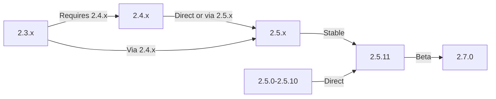

Panduan ini mencakup peningkatan XOOPS dari versi lama ke rilis terbaru sambil menjaga data dan penyesuaian Anda.

> **Informasi Versi**
> - **Stabil:** XOOPS 2.5.11
> - **Beta:** XOOPS 2.7.0 (pengujian)
> - **Masa Depan:** XOOPS 4.0 (dalam pengembangan - lihat Peta Jalan)

## Daftar Periksa Pra-Peningkatan

Sebelum memulai peningkatan, verifikasi:

- [ ] Versi XOOPS saat ini didokumentasikan
- [ ] Target versi XOOPS teridentifikasi
- [ ] Pencadangan sistem penuh selesai
- [ ] Cadangan basis data terverifikasi
- [ ] Daftar module yang terpasang dicatat
- [ ] Modifikasi khusus didokumentasikan
- [ ] Lingkungan pengujian tersedia
- [ ] Jalur pemutakhiran dicentang (beberapa versi melewatkan rilis perantara)
- [ ] Sumber daya server diverifikasi (ruang disk, memori cukup)
- [ ] Mode pemeliharaan diaktifkan

## Panduan Jalur Peningkatan

Jalur peningkatan yang berbeda bergantung pada versi saat ini:



**Penting:** Jangan pernah melewatkan versi utama. Jika mengupgrade dari 2.3.x, upgrade dulu ke 2.4.x, lalu ke 2.5.x.

## Langkah 1: Selesaikan Pencadangan Sistem

### Pencadangan Basis Data

Gunakan mysqldump untuk membuat cadangan database:

```bash
# Full database backup
mysqldump -u xoops_user -p xoops_db > /backups/xoops_db_backup_$(date +%Y%m%d_%H%M%S).sql

# Compressed backup
mysqldump -u xoops_user -p xoops_db | gzip > /backups/xoops_db_backup_$(date +%Y%m%d_%H%M%S).sql.gz
```

Atau menggunakan phpMyAdmin:

1. Pilih basis data XOOPS Anda
2. Klik tab "Ekspor".
3. Pilih format "SQL".
4. Pilih "Simpan sebagai file"
5. Klik "Pergi"

Verifikasi file cadangan:

```bash
# Check backup size
ls -lh /backups/xoops_db_backup*.sql

# Verify backup integrity (uncompressed)
head -20 /backups/xoops_db_backup_*.sql

# Verify compressed backup
zcat /backups/xoops_db_backup_*.sql.gz | head -20
```

### Pencadangan Sistem File

Cadangkan semua file XOOPS:

```bash
# Compressed file backup
tar -czf /backups/xoops_files_$(date +%Y%m%d_%H%M%S).tar.gz /var/www/html/xoops

# Uncompressed (faster, requires more disk space)
tar -cf /backups/xoops_files_$(date +%Y%m%d_%H%M%S).tar /var/www/html/xoops

# Show backup progress
tar -czf /backups/xoops_files_$(date +%Y%m%d_%H%M%S).tar.gz --verbose /var/www/html/xoops | tail
```

Simpan cadangan dengan aman:

```bash
# Secure backup storage
chmod 600 /backups/xoops_*
ls -lah /backups/

# Optional: Copy to remote storage
scp /backups/xoops_* user@backup-server:/secure/backups/
```

### Uji Pemulihan Cadangan

**KRITIS:** Selalu uji pekerjaan pencadangan Anda:

```bash
# Verify tar archive contents
tar -tzf /backups/xoops_files_*.tar.gz | head -20

# Extract to test location
mkdir /tmp/restore_test
cd /tmp/restore_test
tar -xzf /backups/xoops_files_*.tar.gz

# Verify key files exist
ls -la xoops/mainfile.php
ls -la xoops/install/
```

## Langkah 2: Aktifkan Mode Pemeliharaan

Cegah pengguna mengakses situs selama peningkatan:

### Opsi 1: Panel Admin XOOPS

1. Masuk ke panel admin
2. Buka Sistem > Pemeliharaan
3. Aktifkan "Mode Pemeliharaan Situs"
4. Atur pesan pemeliharaan
5. Simpan

### Opsi 2: Mode Perawatan Manual

Buat file pemeliharaan di root web:

```html
<!-- /var/www/html/maintenance.html -->
<!DOCTYPE html>
<html>
<head>
    <title>Under Maintenance</title>
    <style>
        body { font-family: Arial; text-align: center; padding: 50px; }
        h1 { color: #333; }
        p { color: #666; margin: 20px 0; }
    </style>
</head>
<body>
    <h1>Site Under Maintenance</h1>
    <p>We're currently upgrading our site.</p>
    <p>Expected time: approximately 30 minutes.</p>
    <p>Thank you for your patience!</p>
</body>
</html>
```

Konfigurasikan Apache untuk menampilkan halaman pemeliharaan:

```apache
# In .htaccess or vhost config
ErrorDocument 503 /maintenance.html

# Redirect all traffic to maintenance page
<IfModule mod_rewrite.c>
    RewriteEngine On
    RewriteCond %{REMOTE_ADDR} !^192\.168\.1\.100$  # Your IP
    RewriteRule ^(.*)$ - [R=503,L]
</IfModule>
```

## Langkah 3: Unduh Versi Baru

Unduh XOOPS dari situs resmi:

```bash
# Download latest version
cd /tmp
wget https://xoops.org/download/xoops-2.5.8.zip

# Verify checksum (if provided)
sha256sum xoops-2.5.8.zip
# Compare with official SHA256 hash

# Extract to temporary location
unzip xoops-2.5.8.zip
cd xoops-2.5.8
```

## Langkah 4: Persiapan File Pra-Peningkatan

### Identifikasi Modifikasi Khusus

Periksa file core yang disesuaikan:

```bash
# Look for modified files (files with newer mtime)
find /var/www/html/xoops -type f -newer /var/www/html/xoops/install.php

# Check for custom themes
ls /var/www/html/xoops/themes/
# Note any custom themes

# Check for custom modules
ls /var/www/html/xoops/modules/
# Note any custom modules created by you
```

### Dokumen Status Saat Ini

Buat laporan peningkatan:

```bash
cat > /tmp/upgrade_report.txt << EOF
=== XOOPS Upgrade Report ===
Date: $(date)
Current Version: 2.5.6
Target Version: 2.5.8

=== Installed Modules ===
$(ls /var/www/html/xoops/modules/)

=== Custom Modifications ===
[Document any custom theme or module modifications]

=== Themes ===
$(ls /var/www/html/xoops/themes/)

=== Plugin Status ===
[List any custom code modifications]

EOF
```

## Langkah 5: Gabungkan File Baru dengan Instalasi Saat Ini

### Strategi: Pertahankan File Khusus

Ganti file core XOOPS tetapi pertahankan:
- `mainfile.php` (konfigurasi basis data Anda)
- theme khusus di `themes/`
- module khusus di `modules/`
- Unggahan pengguna di `uploads/`
- Data situs di `var/`

### Proses Penggabungan Manual

```bash
# Set variables
XOOPS_OLD="/var/www/html/xoops"
XOOPS_NEW="/tmp/xoops-2.5.8"
BACKUP="/backups/pre-upgrade"

# Create pre-upgrade backup in place
mkdir -p $BACKUP
cp -r $XOOPS_OLD/* $BACKUP/

# Copy new files (but preserve sensitive files)
# Copy everything except protected directories
rsync -av --exclude='mainfile.php' \
    --exclude='modules/custom*' \
    --exclude='themes/custom*' \
    --exclude='uploads' \
    --exclude='var' \
    --exclude='cache' \
    --exclude='templates_c' \
    $XOOPS_NEW/ $XOOPS_OLD/

# Verify critical files preserved
ls -la $XOOPS_OLD/mainfile.php
```

### Menggunakan upgrade.php (Jika Tersedia)

Beberapa versi XOOPS menyertakan skrip peningkatan otomatis:

```bash
# Copy new files with installer
cp -r /tmp/xoops-2.5.8/* /var/www/html/xoops/

# Run upgrade wizard
# Visit: http://your-domain.com/xoops/upgrade/
```

### Izin File Setelah Penggabungan

Kembalikan izin yang tepat:

```bash
# Set ownership
chown -R www-data:www-data /var/www/html/xoops

# Set directory permissions
find /var/www/html/xoops -type d -exec chmod 755 {} \;

# Set file permissions
find /var/www/html/xoops -type f -exec chmod 644 {} \;

# Make writable directories
chmod 777 /var/www/html/xoops/cache
chmod 777 /var/www/html/xoops/templates_c
chmod 777 /var/www/html/xoops/uploads
chmod 777 /var/www/html/xoops/var

# Secure mainfile.php
chmod 644 /var/www/html/xoops/mainfile.php
```

## Langkah 6: Migrasi Basis Data

### Tinjau Perubahan Basis Data

Periksa catatan rilis XOOPS untuk perubahan struktur database:

```bash
# Extract and review SQL migration files
find /tmp/xoops-2.5.8 -name "*.sql" -type f
# Document all .sql files found
```

### Jalankan Pembaruan Basis Data

### Opsi 1: Pembaruan Otomatis (jika tersedia)

Gunakan panel admin:

1. Masuk ke admin
2. Buka **Sistem > Basis Data**
3. Klik "Periksa Pembaruan"
4. Tinjau perubahan yang tertunda
5. Klik "Terapkan Pembaruan"

### Opsi 2: Pembaruan Basis Data Manual

Jalankan migrasi file SQL:

```bash
# Connect to database
mysql -u xoops_user -p xoops_db

# View pending changes (varies by version)
SELECT * FROM xoops_config WHERE conf_name LIKE '%version%';

# Run migration scripts manually if needed
SOURCE /tmp/xoops-2.5.8/migrate_2.5.6_to_2.5.8.sql;
```

### Verifikasi Basis Data

Verifikasi integritas database setelah pembaruan:

```sql
-- Check database consistency
REPAIR TABLE xoops_users;
OPTIMIZE TABLE xoops_users;

-- Verify key tables exist
SHOW TABLES LIKE 'xoops_%';

-- Check row counts (should increase or stay same)
SELECT COUNT(*) FROM xoops_users;
SELECT COUNT(*) FROM xoops_posts;
```

## Langkah 7: Verifikasi Peningkatan

### Pemeriksaan Beranda

Kunjungi beranda XOOPS Anda:

```
http://your-domain.com/xoops/
```

Diharapkan: Halaman dimuat tanpa kesalahan, ditampilkan dengan benar

### Pemeriksaan Panel Admin

Akses admin:

```
http://your-domain.com/xoops/admin/
```

Verifikasi:
- [ ] Panel admin dimuat
- [ ] Navigasi berfungsi
- [ ] Dasbor ditampilkan dengan benar
- [ ] Tidak ada kesalahan basis data dalam log

### Verifikasi module

Periksa module yang terpasang:

1. Buka **module > module** di admin
2. Pastikan semua module masih terpasang
3. Periksa pesan kesalahan apa pun
4. Aktifkan semua module yang dinonaktifkan

### Pemeriksaan Berkas Log

Tinjau log sistem untuk menemukan kesalahan:

```bash
# Check web server error log
tail -50 /var/log/apache2/error.log

# Check PHP error log
tail -50 /var/log/php_errors.log

# Check XOOPS system log (if available)
# In admin panel: System > Logs
```

### Uji Fungsi core- [ ] Pengguna login/logout berfungsi
- [ ] Pendaftaran pengguna berfungsi
- [ ] Fungsi pengunggahan file
- [ ] Notifikasi email terkirim
- [ ] Fungsi pencarian berfungsi
- [ ] Admin berfungsi operasional
- [ ] Fungsi module utuh

## Langkah 8: Pembersihan Pasca Peningkatan

### Hapus File Sementara

```bash
# Remove extraction directory
rm -rf /tmp/xoops-2.5.8

# Clear template cache (safe to delete)
rm -rf /var/www/html/xoops/templates_c/*

# Clear site cache
rm -rf /var/www/html/xoops/cache/*
```

### Hapus Mode Pemeliharaan

Aktifkan kembali akses situs normal:

```apache
# Remove maintenance mode redirect from .htaccess
# Or delete maintenance.html file
rm /var/www/html/maintenance.html
```

### Perbarui Dokumentasi

Perbarui catatan peningkatan Anda:

```bash
# Document successful upgrade
cat >> /tmp/upgrade_report.txt << EOF

=== Upgrade Results ===
Status: SUCCESS
Upgrade Date: $(date)
New Version: 2.5.8
Duration: [time in minutes]

Post-Upgrade Tests:
- [x] Homepage loads
- [x] Admin panel accessible
- [x] Modules functional
- [x] User registration works
- [x] Database optimized

EOF
```

## Pemecahan Masalah Peningkatan

### Masalah: Layar Putih Kosong Setelah Peningkatan

**Gejala:** Beranda tidak menunjukkan apa pun

**Solusi:**
```bash
# Check PHP errors
tail -f /var/log/apache2/error.log

# Enable debug mode temporarily
echo "define('XOOPS_DEBUG', 1);" >> /var/www/html/xoops/mainfile.php

# Check file permissions
ls -la /var/www/html/xoops/mainfile.php

# Restore from backup if needed
cp /backups/xoops_files_*.tar.gz /tmp/
cd /tmp && tar -xzf xoops_files_*.tar.gz
```

### Masalah: Kesalahan Koneksi Basis Data

**Gejala:** Pesan "Tidak dapat terhubung ke database".

**Solusi:**
```bash
# Verify database credentials in mainfile.php
grep -i "database\|host\|user" /var/www/html/xoops/mainfile.php

# Test connection
mysql -h localhost -u xoops_user -p xoops_db -e "SELECT 1"

# Check MySQL status
systemctl status mysql

# Verify database still exists
mysql -u xoops_user -p -e "SHOW DATABASES" | grep xoops
```

### Masalah: Panel Admin Tidak Dapat Diakses

**Gejala:** Tidak dapat mengakses /xoops/admin/

**Solusi:**
```bash
# Check .htaccess rules
cat /var/www/html/xoops/.htaccess

# Verify admin files exist
ls -la /var/www/html/xoops/admin/

# Check mod_rewrite enabled
apache2ctl -M | grep rewrite

# Restart web server
systemctl restart apache2
```

### Masalah: module Tidak Dapat Dimuat

**Gejala:** module menunjukkan kesalahan atau dinonaktifkan

**Solusi:**
```bash
# Verify module files exist
ls /var/www/html/xoops/modules/

# Check module permissions
ls -la /var/www/html/xoops/modules/*/

# Check module configuration in database
mysql -u xoops_user -p xoops_db -e "SELECT * FROM xoops_modules WHERE module_status = 0"

# Reactivate modules in admin panel
# System > Modules > Click module > Update Status
```

### Masalah: Kesalahan Izin Ditolak

**Gejala:** "Izin ditolak" saat mengunggah atau menyimpan

**Solusi:**
```bash
# Check file ownership
ls -la /var/www/html/xoops/ | head -20

# Fix ownership
chown -R www-data:www-data /var/www/html/xoops

# Fix directory permissions
find /var/www/html/xoops -type d -exec chmod 755 {} \;

# Make cache/uploads writable
chmod 777 /var/www/html/xoops/cache
chmod 777 /var/www/html/xoops/templates_c
chmod 777 /var/www/html/xoops/uploads
chmod 777 /var/www/html/xoops/var
```

### Masalah: Pemuatan Halaman Lambat

**Gejala:** Halaman dimuat dengan sangat lambat setelah peningkatan versi

**Solusi:**
```bash
# Clear all caches
rm -rf /var/www/html/xoops/cache/*
rm -rf /var/www/html/xoops/templates_c/*

# Optimize database
mysql -u xoops_user -p xoops_db << EOF
OPTIMIZE TABLE xoops_users;
OPTIMIZE TABLE xoops_posts;
OPTIMIZE TABLE xoops_config;
ANALYZE TABLE xoops_users;
EOF

# Check PHP error log for warnings
grep -i "deprecated\|warning" /var/log/php_errors.log | tail -20

# Increase PHP memory/execution time temporarily
# Edit php.ini:
memory_limit = 256M
max_execution_time = 300
```

## Prosedur Kembalikan

Jika pemutakhiran gagal total, pulihkan dari cadangan:

### Pulihkan Basis Data

```bash
# Restore from backup
mysql -u xoops_user -p xoops_db < /backups/xoops_db_backup_YYYYMMDD_HHMMSS.sql

# Or from compressed backup
gunzip < /backups/xoops_db_backup_YYYYMMDD_HHMMSS.sql.gz | mysql -u xoops_user -p xoops_db

# Verify restoration
mysql -u xoops_user -p xoops_db -e "SELECT COUNT(*) FROM xoops_users"
```

### Pulihkan Sistem File

```bash
# Stop web server
systemctl stop apache2

# Remove current installation
rm -rf /var/www/html/xoops/*

# Extract backup
cd /var/www/html
tar -xzf /backups/xoops_files_YYYYMMDD_HHMMSS.tar.gz

# Fix permissions
chown -R www-data:www-data xoops/
find xoops -type d -exec chmod 755 {} \;
find xoops -type f -exec chmod 644 {} \;
chmod 777 xoops/cache xoops/templates_c xoops/uploads xoops/var

# Start web server
systemctl start apache2

# Verify restoration
# Visit http://your-domain.com/xoops/
```

## Daftar Periksa Verifikasi Peningkatan

Setelah pemutakhiran selesai, verifikasi:

- [ ] Versi XOOPS diperbarui (periksa admin > Info sistem)
- [ ] Beranda dimuat tanpa kesalahan
- [ ] Semua module berfungsi
- [ ] Login pengguna berfungsi
- [ ] Panel admin dapat diakses
- [ ] Pengunggahan file berfungsi
- [ ] Notifikasi email berfungsi
- [ ] Integritas basis data diverifikasi
- [ ] Izin file benar
- [ ] Mode pemeliharaan dihapus
- [ ] Cadangan diamankan dan diuji
- [ ] Kinerja dapat diterima
- [ ] SSL/HTTPS berfungsi
- [ ] Tidak ada pesan kesalahan di log

## Langkah Selanjutnya

Setelah peningkatan berhasil:

1. Perbarui semua module khusus ke versi terbaru
2. Tinjau catatan rilis untuk fitur-fitur yang tidak digunakan lagi
3. Pertimbangkan untuk mengoptimalkan kinerja
4. Perbarui pengaturan keamanan
5. Uji semua fungsi secara menyeluruh
6. Jaga keamanan file cadangan

---

**Tag:** #upgrade #pemeliharaan #cadangan #migrasi basis data

**Artikel Terkait:**
- ../../06-Publisher-Module/User-Guide/Installation
- Persyaratan Server
- ../Configuration/Basic-Configuration
- ../Configuration/Security-Configuration
