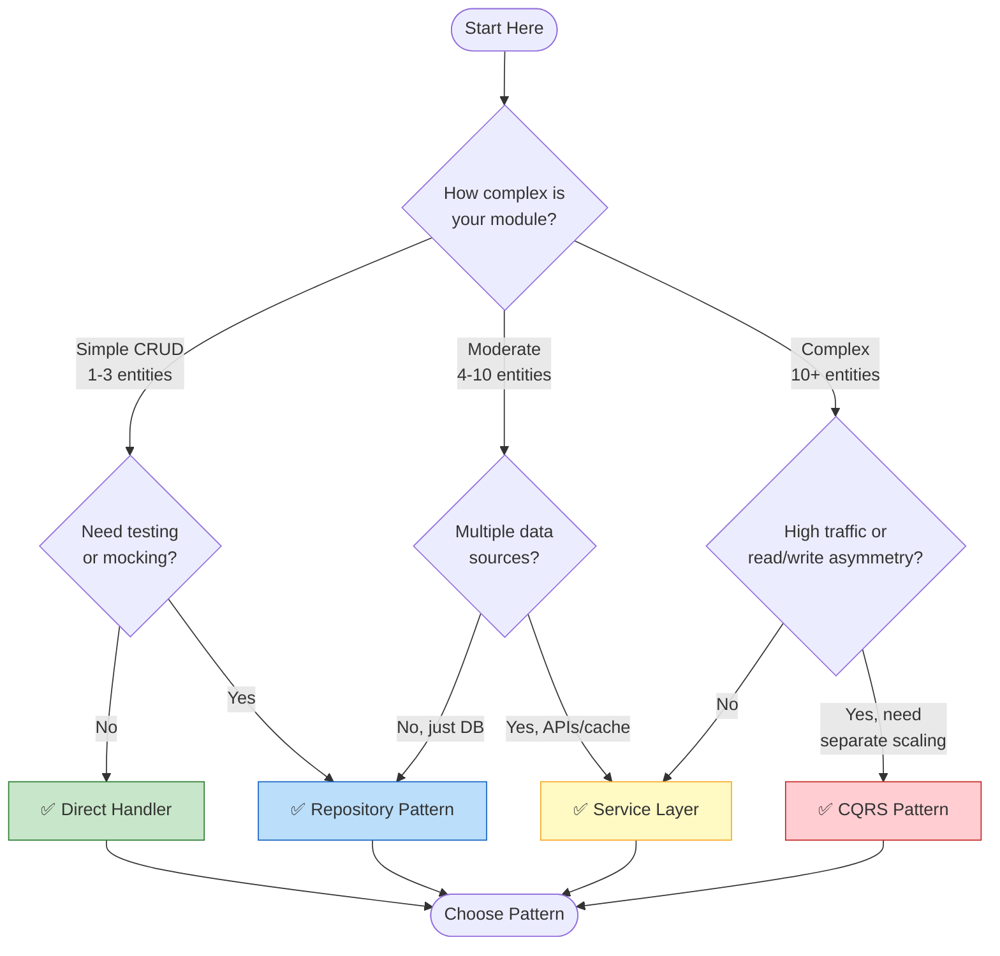
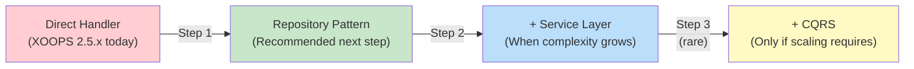

<span class="version-badge version-25x">2.5.x ✅</span> <span class="version-badge version-40x">4.0.x ✅</span>

> **Pola mana yang harus saya gunakan?** Pohon keputusan ini membantu Anda memilih antara handler langsung, Pola Repositori, Lapisan Layanan, dan CQRS.

---

## Pohon Keputusan Cepat



---

## Perbandingan Pola

| Kriteria | handler Langsung | Repositori | Lapisan Layanan | CQRS |
|----------|---------------|------------|---------------|------|
| **Kompleksitas** | ⭐ | ⭐⭐ | ⭐⭐⭐ | ⭐⭐⭐⭐⭐ |
| **Kemampuan untuk diuji** | ❌ Keras | ✅ Bagus | ✅ Hebat | ✅ Hebat |
| **Fleksibilitas** | ❌ Rendah | ✅ Sedang | ✅ Tinggi | ✅ Sangat Tinggi |
| **XOOPS 2.5.x** | ✅ Asli | ✅ Bekerja | ✅ Bekerja | ⚠️ Kompleks |
| **XOOPS 4.0** | ⚠️ Tidak berlaku lagi | ✅ Direkomendasikan | ✅ Direkomendasikan | ✅ Untuk skala |
| **Ukuran Tim** | 1 pengembang | 1-3 pengembang | 2-5 pengembang | 5+ pengembang |
| **Pemeliharaan** | ❌ Lebih Tinggi | ✅ Sedang | ✅ Lebih Rendah | ⚠️ Memerlukan keahlian |

---

## Kapan Menggunakan Setiap Pola

### ✅ Pengendali Langsung (`XoopsPersistableObjectHandler`)

**Terbaik untuk:** module sederhana, prototipe cepat, pembelajaran XOOPS

```php
// Simple and direct - good for small modules
$handler = xoops_getModuleHandler('article', 'news');
$articles = $handler->getObjects(new Criteria('status', 1));
```

**Pilih ini ketika:**
- Membangun module sederhana dengan 1-3 tabel database
- Membuat prototipe cepat
- Anda satu-satunya pengembang dan tidak memerlukan tes
- module tidak akan berkembang secara signifikan

**Keterbatasan:**
- Sulit untuk diuji unitnya (ketergantungan global)
- Kopling ketat ke lapisan database XOOPS
- Logika bisnis cenderung bocor ke pengontrol

---

### ✅ Pola Repositori

**Terbaik untuk:** Sebagian besar module, tim yang menginginkan kemampuan pengujian

```php
// Abstraction allows mocking for tests
interface ArticleRepositoryInterface {
    public function findPublished(): array;
    public function save(Article $article): void;
}

class XoopsArticleRepository implements ArticleRepositoryInterface {
    private $handler;

    public function __construct() {
        $this->handler = xoops_getModuleHandler('article', 'news');
    }

    public function findPublished(): array {
        return $this->handler->getObjects(new Criteria('status', 1));
    }
}
```

**Pilih ini ketika:**
- Anda ingin menulis unit test
- Anda mungkin mengubah sumber data nanti (DB → API)
- Bekerja dengan 2+ pengembang
- Membangun module untuk distribusi

**Jalur peningkatan:** Ini adalah pola yang direkomendasikan untuk persiapan XOOPS 4.0.

---

### ✅ Lapisan Layanan

**Terbaik untuk:** module dengan logika bisnis yang kompleks

```php
// Service coordinates multiple repositories and contains business rules
class ArticlePublicationService {
    public function __construct(
        private ArticleRepositoryInterface $articles,
        private NotificationServiceInterface $notifications,
        private CacheInterface $cache
    ) {}

    public function publish(int $articleId): void {
        $article = $this->articles->find($articleId);
        $article->setStatus('published');
        $article->setPublishedAt(new DateTime());

        $this->articles->save($article);
        $this->notifications->notifySubscribers($article);
        $this->cache->invalidate("article:{$articleId}");
    }
}
```

**Pilih ini ketika:**
- Operasi menjangkau berbagai sumber data
- Aturan bisnis itu rumit
- Anda memerlukan manajemen transaksi
- Beberapa bagian aplikasi melakukan hal yang sama

**Jalur peningkatan:** Gabungkan dengan Repositori untuk arsitektur yang tangguh.

---

### ⚠️ CQRS (Pemisahan Tanggung Jawab Permintaan Perintah)

**Terbaik untuk:** module skala tinggi dengan asimetri read/write

```php
// Commands modify state
class PublishArticleCommand {
    public function __construct(
        public readonly int $articleId,
        public readonly int $publisherId
    ) {}
}

// Queries read state (can use denormalized read models)
class GetPublishedArticlesQuery {
    public function __construct(
        public readonly int $limit = 10
    ) {}
}
```

**Pilih ini ketika:**
- Jumlah membaca jauh melebihi jumlah menulis (100:1 atau lebih)
- Anda memerlukan penskalaan yang berbeda untuk membaca vs menulis
- Persyaratan reporting/analytics yang kompleks
- Sumber acara akan menguntungkan domain Anda

**Peringatan:** CQRS menambah kompleksitas yang signifikan. Kebanyakan module XOOPS tidak memerlukannya.

---

## Jalur Peningkatan yang Direkomendasikan



### Langkah 1: Bungkus handler dalam Repositori (2-4 jam)

1. Buat antarmuka untuk kebutuhan akses data Anda
2. Implementasikan menggunakan handler yang ada
3. Suntikkan repositori alih-alih memanggil `xoops_getModuleHandler()` secara langsung

### Langkah 2: Tambahkan Lapisan Layanan Bila Diperlukan (1-2 hari)

1. Ketika logika bisnis muncul di pengontrol, ekstrak ke Layanan
2. Layanan menggunakan repositori, bukan handler secara langsung
3. Pengontrol menjadi tipis (rute → layanan → respons)

### Langkah 3: Pertimbangkan CQRS Saja Jika (jarang)

1. Anda mendapatkan jutaan bacaan per hari
2. Model baca dan tulis berbeda nyata
3. Anda memerlukan sumber acara untuk jalur audit
4. Anda memiliki tim yang berpengalaman dengan CQRS

---

## Kartu Referensi Cepat

| Pertanyaan | Jawaban |
|----------|--------|
| **"Saya hanya perlu data save/load"** | handler Langsung |
| **"Saya ingin menulis tes"** | Pola Repositori |
| **"Saya memiliki aturan bisnis yang rumit"** | Lapisan Layanan |
| **"Saya perlu menskalakan pembacaan secara terpisah"** | CQRS |
| **"Saya sedang mempersiapkan XOOPS 4.0"** | Repositori + Lapisan Layanan |

---

## Dokumentasi Terkait

- [Panduan Pola Repositori](Patterns/Repository-Pattern.md)
- [Panduan Pola Lapisan Layanan](Patterns/Service-Layer-Pattern.md)
- [Panduan Pola CQRS](../07-XOOPS-4.0/Implementation-Guides/CQRS-Pattern-Guide.md) *(lanjutan)*
- [Kontrak Mode Hibrid](../07-XOOPS-4.0/Specifications/Hybrid-Mode-Contract.md)

---

#pola #akses data #pohon keputusan #praktik terbaik #xoops
