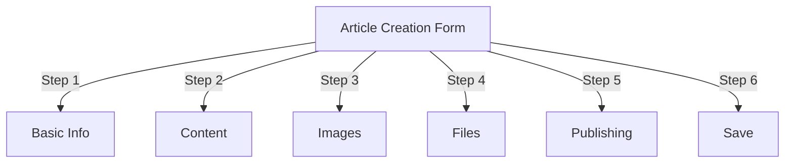
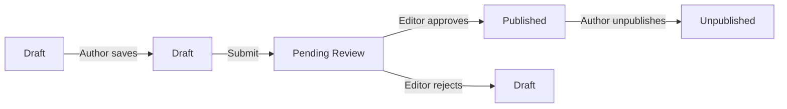
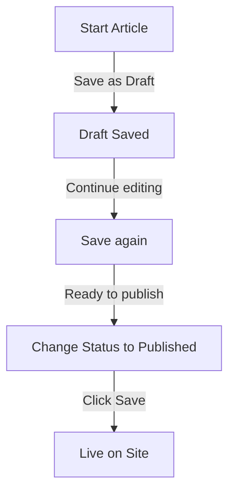

# Membuat Artikel di Publisher

> Panduan langkah demi langkah untuk membuat, mengedit, memformat, dan menerbitkan artikel di module Publisher.

---

## Akses Manajemen Artikel

### Navigasi Panel Admin

```
Admin Panel
└── Modules
    └── Publisher
        └── Articles
            ├── Create New
            ├── Edit
            ├── Delete
            └── Publish
```

### Jalur Tercepat

1. Masuk sebagai **Administrator**
2. Klik **module** di bilah admin
3. Temukan **Penerbit**
4. Klik tautan **Admin**
5. Klik **Artikel** di menu sebelah kiri
6. Klik tombol **Tambahkan Artikel**

---

## Formulir Pembuatan Artikel

### Informasi Dasar

Saat membuat artikel baru, isi bagian berikut:



---

## Langkah 1: Informasi Dasar

### Bidang yang Wajib Diisi

#### Judul Artikel

```
Field: Title
Type: Text input (required)
Max length: 255 characters
Example: "Top 5 Tips for Better Photography"
```

**Pedoman:**
- Deskriptif dan spesifik
- Sertakan kata kunci untuk SEO
- Hindari HURUF BESAR SEMUA
- Simpan di bawah 60 karakter untuk tampilan terbaik

#### Pilih Kategori

```
Field: Category
Type: Dropdown (required)
Options: List of created categories
Example: Photography > Tutorials
```

**Kiat:**
- Induk dan subkategori tersedia
- Pilih kategori yang paling relevan
- Hanya satu kategori per artikel
- Bisa diubah nanti

#### Subjudul Artikel (Opsional)

```
Field: Subtitle
Type: Text input (optional)
Max length: 255 characters
Example: "Learn photography fundamentals in 5 easy steps"
```

**Gunakan untuk:**
- Ringkasan judul
- Teks penggoda
- Judul diperpanjang

### Deskripsi Artikel

#### Deskripsi Singkat

```
Field: Short Description
Type: Textarea (optional)
Max length: 500 characters
```

**Tujuan:**
- Teks pratinjau artikel
- Ditampilkan dalam daftar kategori
- Digunakan dalam hasil pencarian
- Deskripsi meta untuk SEO

**Contoh:**
```
"Discover essential photography techniques that will transform your photos
from ordinary to extraordinary. This comprehensive guide covers composition,
lighting, and exposure settings."
```

#### Konten Lengkap

```
Field: Article Body
Type: WYSIWYG Editor (required)
Max length: Unlimited
Format: HTML
```

Area konten artikel utama dengan pengeditan teks kaya.

---

## Langkah 2: Memformat Konten

### Menggunakan Editor WYSIWYG

#### Pemformatan Teks

```
Bold:           Ctrl+B or click [B] button
Italic:         Ctrl+I or click [I] button
Underline:      Ctrl+U or click [U] button
Strikethrough:  Alt+Shift+D or click [S] button
Subscript:      Ctrl+, (comma)
Superscript:    Ctrl+. (period)
```

#### Struktur Judul

Buat hierarki dokumen yang tepat:

```html
<h1>Article Title</h1>      <!-- Use once at top -->
<h2>Main Section</h2>        <!-- For major sections -->
<h3>Subsection</h3>          <!-- For subtopics -->
<h4>Sub-subsection</h4>      <!-- For details -->
```

**Di Editor:**
- Klik tarik-turun **Format**
- Pilih level judul (H1-H6)
- Ketik judul Anda

#### Daftar

**Daftar Tidak Berurutan (Poin):**

```markdown
• Point one
• Point two
• Point three
```

Langkah-langkah dalam editor:
1. Klik tombol daftar poin [≡].
2. Ketik setiap poin
3. Tekan Enter untuk item berikutnya
4. Tekan Backspace dua kali untuk mengakhiri daftar

**Daftar Pesanan (Bernomor):**

```markdown
1. First step
2. Second step
3. Third step
```

Langkah-langkah dalam editor:
1. Klik [1.] Tombol daftar bernomor
2. Ketik setiap item
3. Tekan Enter untuk selanjutnya
4. Tekan Backspace dua kali untuk mengakhiri

**Daftar Bersarang:**

```markdown
1. Main point
   a. Sub-point
   b. Sub-point
2. Next point
```

Langkah-langkah:
1. Buat daftar pertama
2. Tekan Tab untuk membuat indentasi
3. Buat item bersarang
4. Tekan Shift+Tab untuk membuat indentasi

#### Tautan

**Tambahkan Hyperlink:**

1. Pilih teks untuk ditautkan
2. Klik tombol **[🔗] Tautan**
3. Masukkan URL: `https://example.com`
4. Opsional: Tambahkan title/target
5. Klik **Masukkan Tautan**

**Hapus Tautan:**

1. Klik di dalam teks tertaut
2. Klik tombol **[🔗] Hapus Tautan**

#### Kode & Kutipan

**Blockquote:**

```
"This is an important quote from an expert"
- Attribution
```

Langkah-langkah:
1. Ketikkan teks kutipan
2. Klik tombol **[❝] Blockquote**
3. Teks diindentasi dan diberi gaya

**block Kode:**

```python
def hello_world():
    print("Hello, World!")
```

Langkah-langkah:
1. Klik **Format → Kode**
2. Tempel kode
3. Pilih bahasa (opsional)
4. Kode ditampilkan dengan sorotan sintaksis

---

## Langkah 3: Menambahkan Gambar

### Gambar Unggulan (Gambar Pahlawan)

```
Field: Featured Image / Main Image
Type: Image upload
Format: JPG, PNG, GIF, WebP
Max size: 5 MB
Recommended: 600x400 px
```

**Untuk Mengunggah:**

1. Klik tombol **Unggah Gambar**
2. Pilih gambar dari komputer
3. Crop/resize jika diperlukan
4. Klik **Gunakan Gambar Ini**

**Penempatan Gambar:**
- Ditampilkan di bagian atas artikel
- Digunakan dalam daftar kategori
- Ditampilkan di arsip
- Digunakan untuk berbagi sosial

### Gambar Sebaris

Sisipkan gambar ke dalam teks artikel:

1. Posisikan kursor di editor tempat gambar seharusnya berada
2. Klik tombol **[🖼️] Gambar** di toolbar
3. Pilih opsi unggah:
   - Unggah gambar baru
   - Pilih dari galeri
   - Masukkan gambar URL
4. Konfigurasikan:
   
   ```
   Image Size:
   - Width: 300-600 px
   - Height: Auto (maintains ratio)
   - Alignment: Left/Center/Right
   
   ```
5. Klik **Sisipkan Gambar**

**Bungkus Teks di Sekitar Gambar:**

Di editor setelah memasukkan:

```html
<!-- Image floats left, text wraps around -->

```

### Galeri Gambar

Buat galeri multi-gambar:

1. Klik tombol **Galeri** (jika tersedia)
2. Unggah banyak gambar:
   - Satu klik: Tambahkan satu
   - Seret & lepas: Tambahkan beberapa
3. Atur urutan dengan menyeret
4. Tetapkan keterangan untuk setiap gambar
5. Klik **Buat Galeri**

---

## Langkah 4: Melampirkan File

### Tambahkan Lampiran File

```
Field: File Attachments
Type: File upload (multiple allowed)
Supported: PDF, DOC, XLS, ZIP, etc.
Max per file: 10 MB
Max per article: 5 files
```

**Untuk Melampirkan:**

1. Klik tombol **Tambahkan File**
2. Pilih file dari komputer
3. Opsional: Tambahkan deskripsi file
4. Klik **Lampirkan File**
5. Ulangi untuk beberapa file

**Contoh Berkas:**
- Panduan PDF
- Spreadsheet Excel
- Dokumen kata
- Arsip ZIP
- Kode sumber

### Kelola File Terlampir

**Edit Berkas:**1. Klik nama file
2. Edit deskripsi
3. Klik **Simpan**

**Hapus Berkas:**

1. Temukan file dalam daftar
2. Klik ikon **[×] Hapus**
3. Konfirmasikan penghapusan

---

## Langkah 5: Penerbitan & Status

### Status Artikel

```
Field: Status
Type: Dropdown
Options:
  - Draft: Not published, only author sees
  - Pending: Waiting for approval
  - Published: Live on site
  - Archived: Old content
  - Unpublished: Was published, now hidden
```

**Alur Kerja Status:**



### Opsi Penerbitan

#### Publikasikan Segera

```
Status: Published
Start Date: Today (auto-filled)
End Date: (leave blank for no expiration)
```

#### Jadwal untuk Nanti

```
Status: Scheduled
Start Date: Future date/time
Example: February 15, 2024 at 9:00 AM
```

Artikel akan otomatis terbit pada waktu yang ditentukan.

#### Tetapkan Kedaluwarsa

```
Enable Expiration: Yes
Expiration Date: Future date
Action: Archive/Hide/Delete
Example: April 1, 2024 (article auto-archives)
```

### Opsi Visibilitas

```yaml
Show Article:
  - Display on front page: Yes/No
  - Show in category: Yes/No
  - Include in search: Yes/No
  - Include in recent articles: Yes/No

Featured Article:
  - Mark as featured: Yes/No
  - Featured section position: (number)
```

---

## Langkah 6: SEO & Metadata

### Pengaturan SEO

```
Field: SEO Settings (Expand section)
```

#### Deskripsi Meta

```
Field: Meta Description
Type: Text (160 characters recommended)
Used by: Search engines, social media

Example:
"Learn photography fundamentals in 5 easy steps.
Discover composition, lighting, and exposure techniques."
```

#### Kata Kunci Meta

```
Field: Meta Keywords
Type: Comma-separated list
Max: 5-10 keywords

Example: Photography, Tutorial, Composition, Lighting, Exposure
```

#### URL Siput

```
Field: URL Slug (auto-generated from title)
Type: Text
Format: lowercase, hyphens, no spaces

Auto: "top-5-tips-for-better-photography"
Edit: Change before publishing
```

#### Buka Tag Grafik

Dibuat secara otomatis dari info artikel:
- Judul
- Deskripsi
- Gambar unggulan
- Artikel URL
- Tanggal publikasi

Digunakan oleh Facebook, LinkedIn, WhatsApp, dll.

---

## Langkah 7: Komentar & Interaksi

### Pengaturan Komentar

```yaml
Allow Comments:
  - Enable: Yes/No
  - Default: Inherit from preferences
  - Override: Specific to this article

Moderate Comments:
  - Require approval: Yes/No
  - Default: Inherit from preferences
```

### Pengaturan Peringkat

```yaml
Allow Ratings:
  - Enable: Yes/No
  - Scale: 5 stars (default)
  - Show average: Yes/No
  - Show count: Yes/No
```

---

## Langkah 8: Opsi Lanjutan

### Penulis & Byline

```
Field: Author
Type: Dropdown
Default: Current user
Options: All users with author permission

Display:
  - Show author name: Yes/No
  - Show author bio: Yes/No
  - Show author avatar: Yes/No
```

### Sunting Kunci

```
Field: Edit Lock
Purpose: Prevent accidental changes

Lock Article:
  - Locked: Yes/No
  - Lock reason: "Final version"
  - Unlock date: (optional)
```

### Riwayat Revisi

Versi artikel yang disimpan otomatis:

```
View Revisions:
  - Click "Revision History"
  - Shows all saved versions
  - Compare versions
  - Restore previous version
```

---

## Menyimpan & Menerbitkan

### Simpan Alur Kerja



### Simpan Artikel

**Simpan otomatis:**
- Dipicu setiap 60 detik
- Menyimpan sebagai draf secara otomatis
- Menampilkan "Terakhir disimpan: 2 menit yang lalu"

**Penyimpanan Manual:**
- Klik **Simpan & Lanjutkan** untuk terus mengedit
- Klik **Simpan & Lihat** untuk melihat versi yang dipublikasikan
- Klik **Simpan** untuk menyimpan dan menutup

### Publikasikan Artikel

1. Tetapkan **Status**: Diterbitkan
2. Tetapkan **Tanggal Mulai**: Sekarang (atau tanggal mendatang)
3. Klik **Simpan** atau **Terbitkan**
4. Pesan konfirmasi muncul
5. Artikel ditayangkan (atau dijadwalkan)

---

## Mengedit Artikel yang Sudah Ada

### Akses Editor Artikel

1. Buka **Admin → Penerbit → Artikel**
2. Temukan artikel dalam daftar
3. Klik **Edit** icon/button
4. Lakukan perubahan
5. Klik **Simpan**

### Pengeditan Massal

Edit beberapa artikel sekaligus:

```
1. Go to Articles list
2. Select articles (checkboxes)
3. Choose "Bulk Edit" from dropdown
4. Change selected field
5. Click "Update All"

Available for:
  - Status
  - Category
  - Featured (Yes/No)
  - Author
```

### Pratinjau Artikel

Sebelum diterbitkan:

1. Klik tombol **Pratinjau**
2. Lihat sebagaimana pembaca akan melihat
3. Periksa pemformatan
4. Uji tautan
5. Kembali ke editor untuk menyesuaikan

---

## Manajemen Artikel

### Lihat Semua Artikel

**Tampilan Daftar Artikel:**

```
Admin → Publisher → Articles

Columns:
  - Title
  - Category
  - Author
  - Status
  - Created date
  - Modified date
  - Actions (Edit, Delete, Preview)

Sorting:
  - By title (A-Z)
  - By date (newest/oldest)
  - By status (Published/Draft)
  - By category
```

### Filter Artikel

```
Filter Options:
  - By category
  - By status
  - By author
  - By date range
  - Search by title

Example: Show all "Draft" articles by "John" in "News" category
```

### Hapus Artikel

**Penghapusan Sementara (Disarankan):**

1. Ubah **Status**: Tidak dipublikasikan
2. Klik **Simpan**
3. Artikel disembunyikan tetapi tidak dihapus
4. Dapat dikembalikan lagi nanti

**Penghapusan Sulit:**

1. Pilih artikel dalam daftar
2. Klik tombol **Hapus**
3. Konfirmasikan penghapusan
4. Artikel dihapus secara permanen

---

## Praktik Terbaik Konten

### Menulis Artikel Berkualitas

```
Structure:
  ✓ Compelling title
  ✓ Clear subtitle/description
  ✓ Engaging opening paragraph
  ✓ Logical sections with headers
  ✓ Supporting visuals
  ✓ Conclusion/summary
  ✓ Call-to-action

Length:
  - Blog posts: 500-2000 words
  - News: 300-800 words
  - Guides: 2000-5000 words
  - Minimum: 300 words
```

### Optimasi SEO

```
Title Optimization:
  ✓ Include primary keyword
  ✓ Keep under 60 characters
  ✓ Put keyword near beginning
  ✓ Be descriptive and specific

Content Optimization:
  ✓ Use headings (H1, H2, H3)
  ✓ Include keyword in heading
  ✓ Use bold for important terms
  ✓ Add descriptive links
  ✓ Include images with alt text

Meta Description:
  ✓ Include primary keyword
  ✓ 155-160 characters
  ✓ Action-oriented
  ✓ Unique per article
```

### Tip Memformat

```
Readability:
  ✓ Short paragraphs (2-4 sentences)
  ✓ Bullet points for lists
  ✓ Subheadings every 300 words
  ✓ Generous whitespace
  ✓ Line breaks between sections

Visual Appeal:
  ✓ Featured image at top
  ✓ Inline images in content
  ✓ Alt text on all images
  ✓ Code blocks for technical
  ✓ Blockquotes for emphasis
```

---

## Pintasan Papan Ketik

### Pintasan Penyunting

```
Bold:               Ctrl+B
Italic:             Ctrl+I
Underline:          Ctrl+U
Link:               Ctrl+K
Save Draft:         Ctrl+S
```

### Pintasan Teks

```
-- →  (dash to em dash)
... → … (three dots to ellipsis)
(c) → © (copyright)
(r) → ® (registered)
(tm) → ™ (trademark)
```

---

## Tugas Umum

### Salin Artikel

1. Buka artikel
2. Klik tombol **Duplikat** atau **Klon**
3. Artikel disalin sebagai draft
4. Edit judul dan konten
5. Publikasikan

### Jadwalkan Artikel

1. Buat artikel
2. Tetapkan **Tanggal Mulai**: date/time Masa Depan
3. Tetapkan **Status**: Diterbitkan
4. Klik **Simpan**
5. Artikel diterbitkan secara otomatis

### Penerbitan Batch

1. Buat artikel sebagai draft
2. Tetapkan tanggal penerbitan
3. Artikel diterbitkan secara otomatis pada waktu yang dijadwalkan
4. Pantau dari tampilan "Terjadwal".

### Berpindah Antar Kategori

1. Sunting artikel
2. Ubah tarik-turun **Kategori**
3. Klik **Simpan**
4. Artikel muncul di kategori baru

---

## Pemecahan masalah

### Masalah: Tidak dapat menyimpan artikel

**Solusi:**
```
1. Check form for required fields
2. Verify category is selected
3. Check PHP memory limit
4. Try saving as draft first
5. Clear browser cache
```

### Masalah: Gambar tidak ditampilkan

**Solusi:**
```
1. Verify image upload succeeded
2. Check image file format (JPG, PNG)
3. Verify image path in database
4. Check upload directory permissions
5. Try re-uploading image
```

### Masalah: Toolbar editor tidak muncul

**Solusi:**
```
1. Clear browser cache
2. Try different browser
3. Disable browser extensions
4. Check JavaScript console for errors
5. Verify editor plugin installed
```

### Masalah: Artikel tidak dipublikasikan

**Solusi:**
```
1. Verify Status = "Published"
2. Check Start Date is today or earlier
3. Verify permissions allow publishing
4. Check category is published
5. Clear module cache
```

---

## Panduan Terkait

- Panduan Konfigurasi
- Manajemen Kategori
- Pengaturan Izin
- template Khusus

---

## Langkah Selanjutnya

- Buat Artikel pertama Anda
- Atur Kategori
- Konfigurasikan Izin
- Tinjau Kustomisasi template

---

#penerbit #artikel #konten #kreasi #format #editing #xoops
