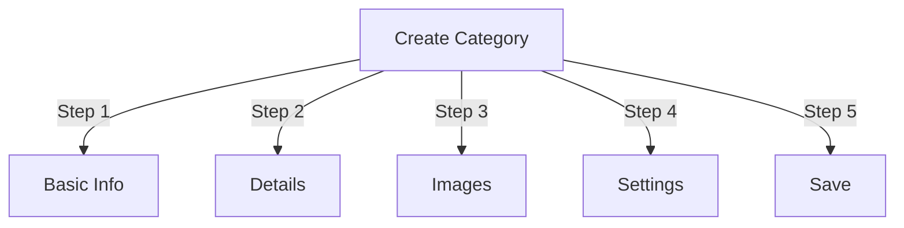

# Mengelola Kategori di Penerbit

> Panduan lengkap untuk membuat, mengatur hierarki, dan mengelola kategori dalam module Publisher.

---

## Kategori Dasar-Dasar

### Apakah Kategori itu?

Kategori mengatur artikel ke dalam kelompok logis:

```
Example Structure:

  News (Main Category)
    ├── Technology
    ├── Sports
    └── Entertainment

  Tutorials (Main Category)
    ├── Photography
    │   ├── Basics
    │   └── Advanced
    └── Writing
        └── Blogging
```

### Manfaat Struktur Kategori yang Baik

```
✓ Better user navigation
✓ Organized content
✓ Improved SEO
✓ Easier content management
✓ Better editorial workflow
```

---

## Akses Manajemen Kategori

### Navigasi Panel Admin

```
Admin Panel
└── Modules
    └── Publisher
        └── Categories
            ├── Create New
            ├── Edit
            ├── Delete
            ├── Permissions
            └── Organize
```

### Akses Cepat

1. Masuk sebagai **Administrator**
2. Buka **Admin → module**
3. Klik **Penerbit → Admin**
4. Klik **Kategori** di menu sebelah kiri

---

## Membuat Kategori

### Formulir Pembuatan Kategori



### Langkah 1: Informasi Dasar

#### Nama Kategori

```
Field: Category Name
Type: Text input (required)
Max length: 100 characters
Uniqueness: Should be unique
Example: "Photography"
```

**Pedoman:**
- Deskriptif dan tunggal atau jamak secara konsisten
- Dikapitalisasi dengan benar
- Hindari karakter khusus
- Buatlah cukup singkat

#### Deskripsi Kategori

```
Field: Description
Type: Textarea (optional)
Max length: 500 characters
Used in: Category listing pages, category blocks
```

**Tujuan:**
- Menjelaskan konten kategori
- Muncul di atas artikel kategori
- Membantu pengguna memahami ruang lingkup
- Digunakan untuk deskripsi meta SEO

**Contoh:**
```
"Photography tips, tutorials, and inspiration for
all skill levels. From composition basics to advanced
lighting techniques, master your craft."
```

### Langkah 2: Kategori Induk

#### Buat Hirarki

```
Field: Parent Category
Type: Dropdown
Options: None (root), or existing categories
```

**Contoh Hierarki:**

```
Flat Structure:
  News
  Tutorials
  Reviews

Nested Structure:
  News
    Technology
    Business
    Sports
  Tutorials
    Photography
      Basics
      Advanced
    Writing
```

**Buat Subkategori:**

1. Klik tarik-turun **Kategori Induk**
2. Pilih induk (misalnya, "Berita")
3. Isi nama kategori
4. Simpan
5. Kategori baru muncul sebagai anak-anak

### Langkah 3: Kategori Gambar

#### Unggah Gambar Kategori

```
Field: Category Image
Type: Image upload (optional)
Format: JPG, PNG, GIF, WebP
Max size: 5 MB
Recommended: 300x200 px (or your theme size)
```

**Untuk Mengunggah:**

1. Klik tombol **Unggah Gambar**
2. Pilih gambar dari komputer
3. Crop/resize jika diperlukan
4. Klik **Gunakan Gambar Ini**

**Di Mana Digunakan:**
- Halaman daftar kategori
- Header block kategori
- Breadcrumb (beberapa theme)
- Berbagi media sosial

### Langkah 4: Pengaturan Kategori

#### Pengaturan Tampilan

```yaml
Status:
  - Enabled: Yes/No
  - Hidden: Yes/No (hidden from menus, still accessible)

Display Options:
  - Show description: Yes/No
  - Show image: Yes/No
  - Show article count: Yes/No
  - Show subcategories: Yes/No

Layout:
  - Items per page: 10-50
  - Display order: Date/Title/Author
  - Display direction: Ascending/Descending
```

#### Izin Kategori

```yaml
Who Can View:
  - Anonymous: Yes/No
  - Registered: Yes/No
  - Specific groups: Configure per group

Who Can Submit:
  - Registered: Yes/No
  - Specific groups: Configure per group
  - Author must have: "submit articles" permission
```

### Langkah 5: Pengaturan SEO

#### Tag Meta

```
Field: Meta Description
Type: Text (160 characters)
Purpose: Search engine description

Field: Meta Keywords
Type: Comma-separated list
Example: photography, tutorials, tips, techniques
```

#### Konfigurasi URL

```
Field: URL Slug
Type: Text
Auto-generated from category name
Example: "photography" from "Photography"
Can be customized before saving
```

### Simpan Kategori

1. Isi semua bidang yang wajib diisi:
   - Nama Kategori ✓
   - Deskripsi (disarankan)
2. Opsional: Unggah gambar, atur SEO
3. Klik **Simpan Kategori**
4. Pesan konfirmasi muncul
5. Kategori sekarang tersedia

---

## Hirarki Kategori

### Membuat Struktur Bersarang

```
Step-by-step example: Create News → Technology subcategory

1. Go to Categories admin
2. Click "Add Category"
3. Name: "News"
4. Parent: (leave blank - this is root)
5. Save
6. Click "Add Category" again
7. Name: "Technology"
8. Parent: "News" (select from dropdown)
9. Save
```

### Lihat Pohon Hirarki

```
Categories view shows tree structure:

📁 News
  📄 Technology
  📄 Sports
  📄 Entertainment
📁 Tutorials
  📄 Photography
    📄 Basics
    📄 Advanced
  📄 Writing
```

Klik perluas panah ke subkategori show/hide.

### Atur Ulang Kategori

#### Pindahkan Kategori

1. Buka daftar Kategori
2. Klik **Edit** pada kategori
3. Ubah **Kategori Induk**
4. Klik **Simpan**
5. Kategori dipindahkan ke posisi baru

#### Susun Ulang Kategori

Jika tersedia, gunakan drag-and-drop:

1. Buka daftar Kategori
2. Klik dan tarik kategori
3. Turun di posisi baru
4. Pesanan disimpan secara otomatis

#### Hapus Kategori

**Opsi 1: Hapus Sementara (Sembunyikan)**

1. Sunting kategori
2. Setel **Status**: Dinonaktifkan
3. Klik **Simpan**
4. Kategori disembunyikan tetapi tidak dihapus

**Opsi 2: Hapus Keras**

1. Buka daftar Kategori
2. Klik **Hapus** pada kategori
3. Pilih tindakan untuk artikel:
   
   ```
   ☐ Move articles to parent category
   ☐ Move articles to root (News)
   ☐ Delete all articles in category
   
   ```
4. Konfirmasikan penghapusan

---

## Kategori Operasi

### Sunting Kategori

1. Buka **Admin → Penerbit → Kategori**
2. Klik **Edit** pada kategori
3. Ubah bidang:
   - Nama
   - Deskripsi
   - Kategori orang tua
   - Gambar
   - Pengaturan
4. Klik **Simpan**

### Edit Izin Kategori

1. Buka Kategori
2. Klik **Izin** pada kategori (atau klik kategori lalu klik Izin)
3. Konfigurasikan grup:

```
For each group:
  ☐ View articles in this category
  ☐ Submit articles to this category
  ☐ Edit own articles
  ☐ Edit all articles
  ☐ Approve/Moderate articles
  ☐ Manage category
```

4. Klik **Simpan Izin**

### Tetapkan Gambar Kategori

**Unggah gambar baru:**

1. Sunting kategori
2. Klik **Ubah Gambar**
3. Unggah atau pilih gambar
4.Crop/resize
5. Klik **Gunakan Gambar**
6. Klik **Simpan Kategori**

**Hapus gambar:**

1. Sunting kategori
2. Klik **Hapus Gambar** (jika tersedia)
3. Klik **Simpan Kategori**

---

## Izin Kategori

### Matriks Izin

```
                 Anonymous  Registered  Editor  Admin
View category        ✓         ✓         ✓       ✓
Submit article       ✗         ✓         ✓       ✓
Edit own article     ✗         ✓         ✓       ✓
Edit all articles    ✗         ✗         ✓       ✓
Moderate articles    ✗         ✗         ✓       ✓
Manage category      ✗         ✗         ✗       ✓
```

### Tetapkan Izin Tingkat Kategori

#### Kontrol Akses Per Kategori

1. Buka daftar **Kategori**
2. Pilih kategori
3. Klik **Izin**
4. Untuk setiap grup, pilih izin:

```
Example: News category
  Anonymous:   View only
  Registered:  Submit articles
  Editors:     Approve articles
  Admins:      Full control
```

5. Klik **Simpan**

#### Izin Tingkat Lapangan

Kontrol bidang formulir mana yang dapat digunakan pengguna see/edit:

```
Example: Limit field visibility for Registered users

Registered users can see/edit:
  ✓ Title
  ✓ Description
  ✓ Content
  ✗ Author (auto-set to current user)
  ✗ Scheduled date (only editors)
  ✗ Featured (only admins)
```
**Konfigurasi di:**
- Izin Kategori
- Cari bagian "Visibilitas Bidang".

---

## Praktik Terbaik untuk Kategori

### Struktur Kategori

```
✓ Keep hierarchy 2-3 levels deep
✗ Don't create too many top-level categories
✗ Don't create categories with one article

✓ Use consistent naming (plural or singular)
✗ Don't use vague names ("Stuff", "Other")

✓ Create categories for articles that exist
✗ Don't create empty categories in advance
```

### Pedoman Penamaan

```
Good names:
  "Photography"
  "Web Development"
  "Travel Tips"
  "Business News"

Avoid:
  "Articles" (too vague)
  "Content" (redundant)
  "News&Updates" (inconsistent)
  "PHOTOGRAPHY STUFF" (formatting)
```

### Kiat Organisasi

```
By Topic:
  News
    Technology
    Sports
    Entertainment

By Type:
  Tutorials
    Video
    Text
    Interactive

By Audience:
  For Beginners
  For Experts
  Case Studies

Geographic:
  North America
    United States
    Canada
  Europe
```

---

## block Kategori

### block Kategori Penerbit

Tampilkan daftar kategori di situs Anda:

1. Buka **Admin → block**
2. Temukan **Penerbit - Kategori**
3. Klik **Edit**
4. Konfigurasikan:

```
Block Title: "News Categories"
Show subcategories: Yes/No
Show article count: Yes/No
Height: (pixels or auto)
```

5. Klik **Simpan**

### Kategori Artikel block

Tampilkan artikel terbaru dari kategori tertentu:

1. Buka **Admin → block**
2. Temukan **Penerbit - Kategori Artikel**
3. Klik **Edit**
4. Pilih:

```
Category: News (or specific category)
Number of articles: 5
Show images: Yes/No
Show description: Yes/No
```

5. Klik **Simpan**

---

## Analisis Kategori

### Lihat Statistik Kategori

Dari Admin Kategori:

```
Each category shows:
  - Total articles: 45
  - Published: 42
  - Draft: 2
  - Pending approval: 1
  - Total views: 5,234
  - Latest article: 2 hours ago
```

### Lihat Lalu Lintas Kategori

Jika analitik diaktifkan:

1. Klik nama kategori
2. Klik tab **Statistik**
3. Lihat:
   - Tampilan halaman
   - Artikel populer
   - Tren lalu lintas
   - Istilah pencarian yang digunakan

---

## Kategori template

### Sesuaikan Tampilan Kategori

Jika menggunakan template khusus, setiap kategori dapat mengganti:

```
publisher_category.tpl
  ├── Category header
  ├── Category description
  ├── Category image
  ├── Article listing
  └── Pagination
```

**Untuk menyesuaikan:**

1. Salin file template
2. Ubah HTML/CSS
3. Tetapkan ke kategori di admin
4. Kategori menggunakan template khusus

---

## Tugas Umum

### Membuat Hirarki Berita

```
Admin → Publisher → Categories
1. Create "News" (parent)
2. Create "Technology" (parent: News)
3. Create "Sports" (parent: News)
4. Create "Entertainment" (parent: News)
```

### Pindahkan Artikel Antar Kategori

1. Buka **Artikel** admin
2. Pilih artikel (kotak centang)
3. Pilih **"Ubah Kategori"** dari tarik-turun tindakan massal
4. Pilih kategori baru
5. Klik **Perbarui Semua**

### Sembunyikan Kategori Tanpa Menghapus

1. Sunting kategori
2. Setel **Status**: Disabled/Hidden
3. Simpan
4. Kategori tidak ditampilkan di menu (masih dapat diakses melalui URL)

### Buat Kategori untuk Draf

```
Best Practice:

Create "In Review" category
  ├── Purpose: Articles awaiting approval
  ├── Permissions: Hidden from public
  ├── Only admins/editors can see
  ├── Move articles here until approved
  └── Move to "News" when published
```

---

## Kategori Import/Export

### Ekspor Kategori

Jika tersedia:

1. Buka admin **Kategori**
2. Klik **Ekspor**
3. Pilih format: CSV/JSON/XML
4. Unduh filenya
5. Cadangan disimpan

### Impor Kategori

Jika tersedia:

1. Siapkan file dengan kategori
2. Buka admin **Kategori**
3. Klik **Impor**
4. Unggah berkas
5. Pilih strategi pembaruan:
   - Buat yang baru saja
   - Perbarui yang ada
   - Ganti semuanya
6. Klik **Impor**

---

## Kategori Pemecahan Masalah

### Masalah: Subkategori tidak muncul

**Solusi:**
```
1. Verify parent category status is "Enabled"
2. Check permissions allow viewing
3. Verify subcategories have status "Enabled"
4. Clear cache: Admin → Tools → Clear Cache
5. Check theme shows subcategories
```

### Masalah: Tidak dapat menghapus kategori

**Solusi:**
```
1. Category must have no articles
2. Move or delete articles first:
   Admin → Articles
   Select articles in category
   Change category to another
3. Then delete empty category
4. Or choose "move articles" option when deleting
```

### Masalah: Gambar kategori tidak muncul

**Solusi:**
```
1. Verify image uploaded successfully
2. Check image file format (JPG, PNG)
3. Verify upload directory permissions
4. Check theme displays category images
5. Try re-uploading image
6. Clear browser cache
```

### Masalah: Izin tidak berlaku

**Solusi:**
```
1. Check group permissions in Category
2. Check global Publisher permissions
3. Check user belongs to configured group
4. Clear session cache
5. Log out and log back in
6. Check permission modules installed
```

---

## Daftar Periksa Praktik Terbaik Kategori

Sebelum menerapkan kategori:

- [ ] Hirarki sedalam 2-3 level
- [ ] Setiap kategori memiliki 5+ artikel
- [ ] Nama kategori konsisten
- [ ] Izin sesuai
- [ ] Gambar kategori dioptimalkan
- [ ] Deskripsi selesai
- [ ] Metadata SEO terisi
- [ ] URL ramah
- [ ] Kategori diuji pada front-end
- [ ] Dokumentasi diperbarui

---

## Panduan Terkait

- Pembuatan Artikel
- Manajemen Izin
- Konfigurasi module
- Panduan Instalasi

---

## Langkah Selanjutnya

- Buat Artikel dalam kategori
- Konfigurasikan Izin
- Sesuaikan dengan template Khusus

---

#penerbit #kategori #organisasi #hierarki #manajemen #xoops
