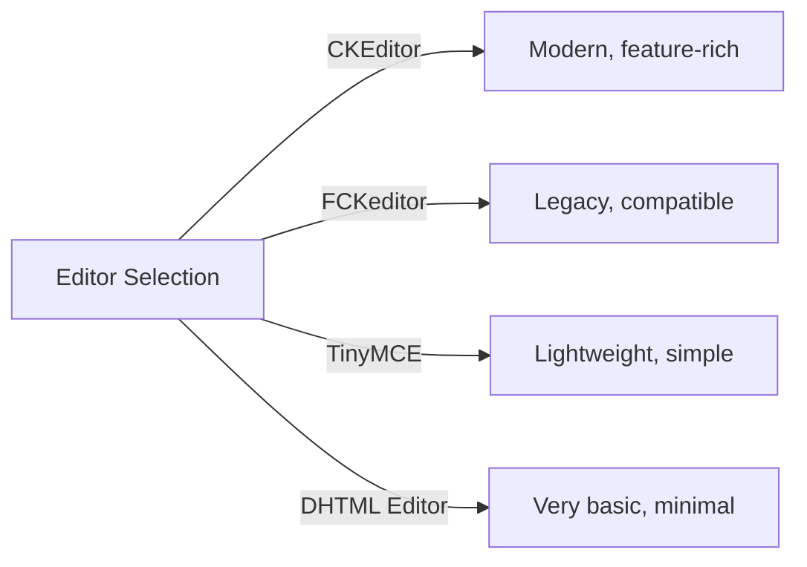
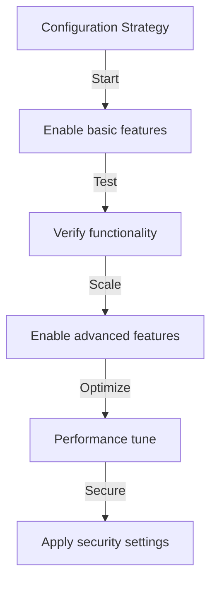

# Konfigurasi Dasar Penerbit

> Konfigurasikan pengaturan module Publisher, preferensi, dan opsi umum untuk instalasi XOOPS Anda.

---

## Mengakses Konfigurasi

### Navigasi Panel Admin

```
XOOPS Admin Panel
└── Modules
    └── Publisher
        ├── Preferences
        ├── Settings
        └── Configuration
```

1. Masuk sebagai **Administrator**
2. Buka **Panel Admin → module**
3. Temukan module **Penerbit**
4. Klik tautan **Preferensi** atau **Admin**

---

## Pengaturan Umum

### Konfigurasi Akses

```
Admin Panel → Modules → Publisher
```

Klik **ikon roda gigi** atau **Setelan** untuk opsi berikut:

#### Opsi Tampilan

| Pengaturan | Pilihan | Bawaan | Deskripsi |
|---------|---------|---------|-------------|
| **Item per halaman** | 5-50 | 10 | Artikel ditampilkan dalam daftar |
| **Tampilkan remah roti** | Yes/No | Ya | Tampilan jejak navigasi |
| **Gunakan halaman** | Yes/No | Ya | Buat paginasi daftar panjang |
| **Tanggal tayang** | Yes/No | Ya | Tampilkan tanggal artikel |
| **Tampilkan kategori** | Yes/No | Ya | Tampilkan kategori artikel |
| **Tampilkan penulis** | Yes/No | Ya | Tampilkan penulis artikel |
| **Tampilkan tampilan** | Yes/No | Ya | Tampilkan jumlah penayangan artikel |

**Contoh Konfigurasi:**

```yaml
Items Per Page: 15
Show Breadcrumb: Yes
Use Paging: Yes
Show Date: Yes
Show Category: Yes
Show Author: Yes
Show Views: Yes
```

#### Opsi Penulis

| Pengaturan | Bawaan | Deskripsi |
|---------|---------|-------------|
| **Tampilkan nama penulis** | Ya | Menampilkan nama asli atau nama pengguna |
| **Gunakan nama pengguna** | Tidak | Tampilkan nama pengguna, bukan nama |
| **Tampilkan email penulis** | Tidak | Tampilkan email kontak penulis |
| **Tampilkan avatar penulis** | Ya | Tampilkan avatar pengguna |

---

## Konfigurasi Penyunting

### Pilih Editor WYSIWYG

Penerbit mendukung banyak editor:

#### Editor yang Tersedia



### CKEditor (Disarankan)

**Terbaik untuk:** Sebagian besar pengguna, browser modern, fitur lengkap

1. Buka **Preferensi**
2. Atur **Editor**: CKEditor
3. Konfigurasikan opsi:

```
Editor: CKEditor 4.x
Toolbar: Full
Height: 400px
Width: 100%
Remove plugins: []
Add plugins: [mathjax, codesnippet]
```

### FCKeditor

**Terbaik untuk:** Kompatibilitas, sistem lama

```
Editor: FCKeditor
Toolbar: Default
Custom config: (optional)
```

### KecilMCE

**Terbaik untuk:** Jejak minimal, pengeditan dasar

```
Editor: TinyMCE
Plugins: [paste, table, link, image]
Toolbar: minimal
```

---

## Pengaturan File & Unggah

### Konfigurasikan Direktori Unggah

```
Admin → Publisher → Preferences → Upload Settings
```

#### Pengaturan Jenis File

```yaml
Allowed File Types:
  Images:
    - jpg
    - jpeg
    - gif
    - png
    - webp
  Documents:
    - pdf
    - doc
    - docx
    - xls
    - xlsx
    - ppt
    - pptx
  Archives:
    - zip
    - rar
    - 7z
  Media:
    - mp3
    - mp4
    - webm
    - mov
```

#### Batas Ukuran File

| Jenis File | Ukuran Maks | Catatan |
|-----------|----------|-------|
| **Gambar** | 5MB | Per file gambar |
| **Dokumen** | 10MB | PDF, file Office |
| **Media** | 50MB | File Video/audio |
| **Semua file** | 100MB | Total per unggahan |

**Konfigurasi:**

```
Max Image Upload Size: 5 MB
Max Document Upload Size: 10 MB
Max Media Upload Size: 50 MB
Total Upload Size: 100 MB
Max Files per Article: 5
```

### Mengubah Ukuran Gambar

Penerbit secara otomatis mengubah ukuran gambar untuk konsistensi:

```yaml
Thumbnail Size:
  Width: 150
  Height: 150
  Mode: Crop/Resize

Category Image Size:
  Width: 300
  Height: 200
  Mode: Resize

Article Featured Image:
  Width: 600
  Height: 400
  Mode: Resize
```

---

## Pengaturan Komentar & Interaksi

### Konfigurasi Komentar

```
Preferences → Comments Section
```

#### Opsi Komentar

```yaml
Allow Comments:
  - Enabled: Yes/No
  - Default: Yes
  - Per-article override: Yes

Comment Moderation:
  - Moderate comments: Yes/No
  - Moderate guest comments only: Yes/No
  - Spam filter: Enabled
  - Max comments per day: (unlimited)

Comment Display:
  - Display format: Threaded/Flat
  - Comments per page: 10
  - Date format: Full date/Time ago
  - Show comment count: Yes/No
```

### Konfigurasi Peringkat

```yaml
Allow Ratings:
  - Enabled: Yes/No
  - Default: Yes
  - Per-article override: Yes

Rating Options:
  - Rating scale: 5 stars (default)
  - Allow user to rate own: No
  - Show average rating: Yes
  - Show rating count: Yes
```

---

## Pengaturan SEO & URL

### Optimasi Mesin Pencari

```
Preferences → SEO Settings
```

#### Konfigurasi URL

```yaml
SEO URLs:
  - Enabled: No (set to Yes for SEO URLs)
  - URL rewriting: None/Apache mod_rewrite/IIS rewrite

URL Format:
  - Category: /category/news
  - Article: /article/welcome-to-site
  - Archive: /archive/2024/01

Meta Description:
  - Auto-generate: Yes
  - Max length: 160 characters

Meta Keywords:
  - Auto-generate: Yes
  - From: Article tags, title
```

### Aktifkan URL SEO (Lanjutan)

**Prasyarat:**
- Apache dengan `mod_rewrite` diaktifkan
- Dukungan `.htaccess` diaktifkan

**Langkah Konfigurasi:**

1. Buka **Preferensi → Pengaturan SEO**
2. Setel **URL SEO**: Ya
3. Setel **URL Penulisan Ulang**: Apache mod_rewrite
4. Verifikasi file `.htaccess` ada di folder Publisher

**Konfigurasi .htaccess:**

```apache
<IfModule mod_rewrite.c>
    RewriteEngine On
    RewriteBase /modules/publisher/

    # Category rewrites
    RewriteRule ^category/([0-9]+)-(.*)\.html$ index.php?op=showcategory&categoryid=$1 [L,QSA]

    # Article rewrites
    RewriteRule ^article/([0-9]+)-(.*)\.html$ index.php?op=showitem&itemid=$1 [L,QSA]

    # Archive rewrites
    RewriteRule ^archive/([0-9]+)/([0-9]+)/$ index.php?op=archive&year=$1&month=$2 [L,QSA]
</IfModule>
```

---

## Tembolok & Kinerja

### Konfigurasi Cache

```
Preferences → Cache Settings
```

```yaml
Enable Caching:
  - Enabled: Yes
  - Cache type: File (or Memcache)

Cache Lifetime:
  - Category lists: 3600 seconds (1 hour)
  - Article lists: 1800 seconds (30 minutes)
  - Single article: 7200 seconds (2 hours)
  - Recent articles block: 900 seconds (15 minutes)

Cache Clear:
  - Manual clear: Available in admin
  - Auto-clear on article save: Yes
  - Clear on category change: Yes
```

### Hapus Tembolok

**Hapus Cache Manual:**

1. Buka **Admin → Penerbit → Alat**
2. Klik **Hapus Cache**
3. Pilih jenis cache yang akan dihapus:
   - [ ] Cache kategori
   - [ ] Tembolok artikel
   - [ ] Blokir tembolok
   - [ ] Semua tembolok
4. Klik **Hapus Pilihan**

**Baris Perintah:**

```bash
# Clear all Publisher cache
php /path/to/xoops/admin/cache_manage.php publisher

# Or directly delete cache files
rm -rf /path/to/xoops/var/cache/publisher/*
```

---

## Pemberitahuan & Alur Kerja

### Pemberitahuan Email

```
Preferences → Notifications
```

```yaml
Notify Admin on New Article:
  - Enabled: Yes
  - Recipient: Admin email
  - Include summary: Yes

Notify Moderators:
  - Enabled: Yes
  - On new submission: Yes
  - On pending articles: Yes

Notify Author:
  - On approval: Yes
  - On rejection: Yes
  - On comment: No (optional)
```

### Alur Kerja Pengiriman

```yaml
Require Approval:
  - Enabled: Yes
  - Editor approval: Yes
  - Admin approval: No

Draft Save:
  - Auto-save interval: 60 seconds
  - Save local versions: Yes
  - Revision history: Last 5 versions
```

---

## Pengaturan Konten

### Penerbitan Default

```
Preferences → Content Settings
```

```yaml
Default Article Status:
  - Draft/Published: Draft
  - Featured by default: No
  - Auto-publish time: None

Default Visibility:
  - Public/Private: Public
  - Show on front page: Yes
  - Show in categories: Yes

Scheduled Publishing:
  - Enabled: Yes
  - Allow per-article: Yes

Content Expiration:
  - Enabled: No
  - Auto-archive old: No
  - Archive after days: (unlimited)
```

### Opsi Konten WYSIWYG

```yaml
Allow HTML:
  - In articles: Yes
  - In comments: No

Allow Embedded Media:
  - Videos (iframe): Yes
  - Images: Yes
  - Plugins: No

Content Filtering:
  - Strip tags: No
  - XSS filter: Yes (recommended)
```

---

## Pengaturan Mesin Pencari

### Konfigurasikan Integrasi Pencarian

```
Preferences → Search Settings
```

```yaml
Enable Article Indexing:
  - Include in site search: Yes
  - Index type: Full text/Title only

Search Options:
  - Search in titles: Yes
  - Search in content: Yes
  - Search in comments: Yes

Meta Tags:
  - Auto generate: Yes
  - OG tags (social): Yes
  - Twitter cards: Yes
```

---

## Pengaturan Lanjutan

### Mode Debug (Khusus Pengembangan)

```
Preferences → Advanced
```

```yaml
Debug Mode:
  - Enabled: No (only for development!)

Development Features:
  - Show SQL queries: No
  - Log errors: Yes
  - Error email: admin@example.com
```

### Optimasi Basis Data

```
Admin → Tools → Optimize Database
```

```bash
# Manual optimization
mysql> OPTIMIZE TABLE publisher_items;
mysql> OPTIMIZE TABLE publisher_categories;
mysql> OPTIMIZE TABLE publisher_comments;
```

---

## Kustomisasi module### template theme

```
Preferences → Display → Templates
```

Pilih kumpulan template:
- Bawaan
- Klasik
- Modern
- Gelap
- Adat

Setiap template mengontrol:
- Tata letak artikel
- Daftar kategori
- Tampilan arsip
- Tampilan komentar

---

## Kiat Konfigurasi

### Praktik Terbaik



1. **Mulai Sederhana** - Aktifkan fitur core terlebih dahulu
2. **Uji Setiap Perubahan** - Verifikasi sebelum melanjutkan
3. **Aktifkan Caching** - Meningkatkan kinerja
4. **Cadangkan Terlebih Dahulu** - Ekspor pengaturan sebelum perubahan besar
5. **Monitor Log** - Periksa log kesalahan secara berkala

### Optimasi Kinerja

```yaml
For Better Performance:
  - Enable caching: Yes
  - Cache lifetime: 3600 seconds
  - Limit items per page: 10-15
  - Compress images: Yes
  - Minify CSS/JS: Yes (if available)
```

### Pengerasan Keamanan

```yaml
For Better Security:
  - Moderate comments: Yes
  - Disable HTML in comments: Yes
  - XSS filtering: Yes
  - File type whitelist: Strict
  - Max upload size: Reasonable limit
```

---

## Pengaturan Export/Import

### Konfigurasi Cadangan

```
Admin → Tools → Export Settings
```

**Untuk mencadangkan konfigurasi saat ini:**

1. Klik **Ekspor Konfigurasi**
2. Simpan file `.cfg` yang diunduh
3. Simpan di tempat yang aman

**Untuk memulihkan:**

1. Klik **Impor Konfigurasi**
2. Pilih file `.cfg`
3. Klik **Pulihkan**

---

## Panduan Konfigurasi Terkait

- Manajemen Kategori
- Pembuatan Artikel
- Konfigurasi Izin
- Panduan Instalasi

---

## Pemecahan Masalah Konfigurasi

### Setelan Tidak Dapat Disimpan

**Solusi:**
1. Periksa izin direktori di `/var/config/`
2. Verifikasi akses tulis PHP
3. Periksa log kesalahan PHP untuk mengetahui adanya masalah
4. Hapus cache browser dan coba lagi

### Editor Tidak Muncul

**Solusi:**
1. Pastikan plugin editor telah diinstal
2. Periksa konfigurasi editor XOOPS
3. Coba opsi editor lain
4. Periksa konsol browser untuk kesalahan JavaScript

### Masalah Kinerja

**Solusi:**
1. Aktifkan cache
2. Kurangi item per halaman
3. Kompres gambar
4. Periksa optimasi database
5. Tinjau log kueri yang lambat

---

## Langkah Selanjutnya

- Konfigurasikan Izin Grup
- Buat Artikel pertama Anda
- Atur Kategori
- Tinjau template Khusus

---

#penerbit #konfigurasi #preferensi #pengaturan #xoops
