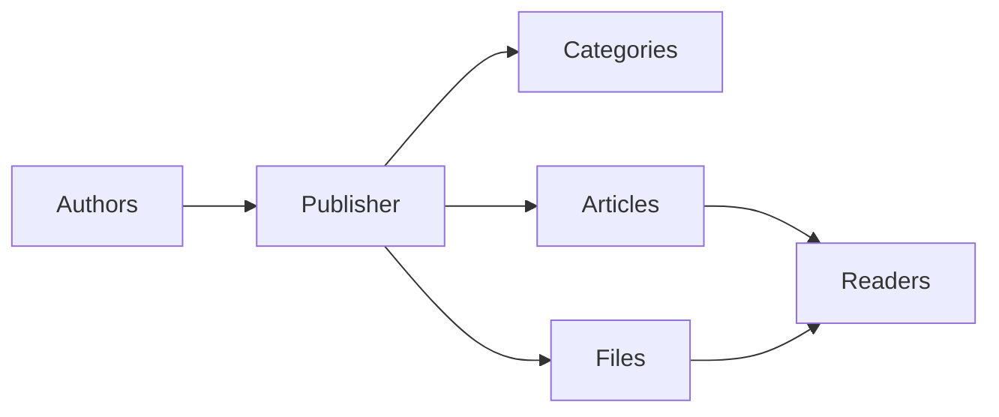
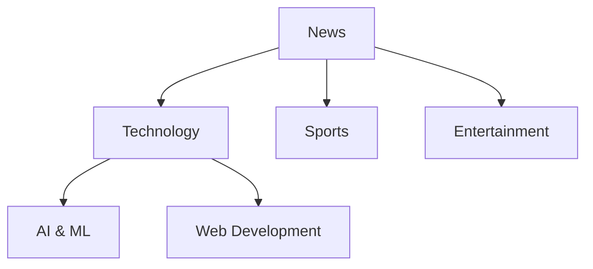
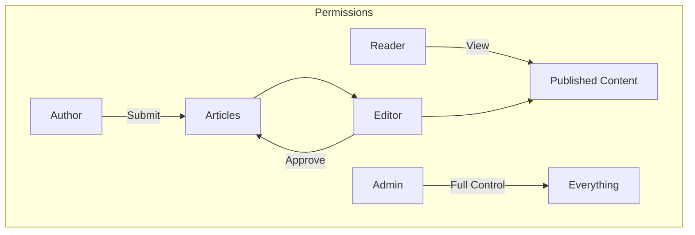
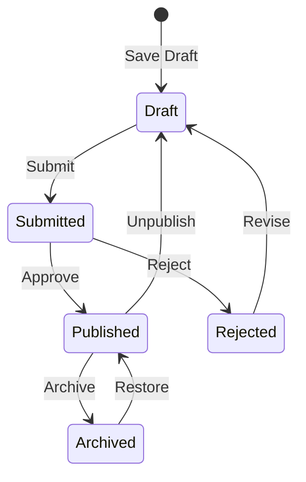

# Memulai dengan Penerbit

> Panduan langkah demi langkah untuk menyiapkan dan menggunakan module Publisher news/blog.

---

## Apa itu Penerbit?

Publisher adalah module manajemen konten utama untuk XOOPS, dirancang untuk:

- **Situs Berita** - Publikasikan artikel dengan kategori
- **Blog** - Blogging pribadi atau multi-penulis``
- **Dokumentasi** - Basis pengetahuan terorganisir
- **Portal Konten** - Konten media campuran



---

## Pengaturan Cepat

### Langkah 1: Instal Penerbit

1. Unduh dari [GitHub](https://github.com/XoopsModules25x/publisher)
2. Unggah ke `modules/publisher/`
3. Buka Admin → module → Instal

### Langkah 2: Buat Kategori



1. Admin → Penerbit → Kategori
2. Klik "Tambah Kategori"
3. Isi:
   - **Nama**: Nama kategori
   - **Deskripsi**: Isi kategori ini
   - **Gambar**: Gambar kategori opsional
4. Tetapkan izin (siapa yang bisa submit/view)
5. Simpan

### Langkah 3: Konfigurasikan Pengaturan

1. Admin → Penerbit → Preferensi
2. Pengaturan utama yang perlu dikonfigurasi:

| Pengaturan | Direkomendasikan | Deskripsi |
|---------|-------------|-------------|
| Item per halaman | 10-20 | Artikel di indeks |
| Penyunting | TinyMCE/CKEditor | Editor teks kaya |
| Izinkan peringkat | Ya | Umpan balik pembaca |
| Izinkan komentar | Ya | Diskusi |
| Setujui otomatis | Tidak | Kontrol editorial |

### Langkah 4: Buat Artikel Pertama Anda

1. Menu utama → Penerbit → Kirim Artikel
2. Isi formulir:
   - **Judul**: Judul artikel
   - **Kategori**: Dimana tempatnya
   - **Ringkasan**: Deskripsi singkat
   - **Isi**: Konten artikel lengkap
3. Tambahkan elemen opsional:
   - Gambar unggulan
   - Lampiran berkas
   - Pengaturan SEO
4. Kirim untuk ditinjau atau dipublikasikan

---

## Peran Pengguna



### Pembaca
- Lihat artikel yang diterbitkan
- Nilai dan komentar
- Cari konten

### Penulis
- Kirim artikel baru
- Edit artikel sendiri
- Lampirkan file

### Penyunting
- Pengiriman Approve/reject
- Edit artikel apa pun
- Kelola kategori

### Administrator
- Kontrol module penuh
- Konfigurasikan pengaturan
- Kelola izin

---

## Menulis Artikel

### Editor Artikel

```
┌─────────────────────────────────────────────────────┐
│ Title: [Your Article Title                        ] │
├─────────────────────────────────────────────────────┤
│ Category: [Select Category          ▼]              │
├─────────────────────────────────────────────────────┤
│ Summary:                                            │
│ ┌─────────────────────────────────────────────────┐ │
│ │ Brief description shown in listings...          │ │
│ └─────────────────────────────────────────────────┘ │
├─────────────────────────────────────────────────────┤
│ Body:                                               │
│ ┌─────────────────────────────────────────────────┐ │
│ │ [B] [I] [U] [Link] [Image] [Code]               │ │
│ ├─────────────────────────────────────────────────┤ │
│ │                                                  │ │
│ │ Full article content goes here...               │ │
│ │                                                  │ │
│ └─────────────────────────────────────────────────┘ │
├─────────────────────────────────────────────────────┤
│ [Submit] [Preview] [Save Draft]                     │
└─────────────────────────────────────────────────────┘
```

### Praktik Terbaik

1. **Judul yang menarik** - Judul yang jelas dan menarik
2. **Ringkasan yang bagus** - Pikat pembaca untuk mengklik
3. **Konten terstruktur** - Gunakan judul, daftar, gambar
4. **Kategori yang tepat** - Membantu pembaca menemukan konten
5. **Optimasi SEO** - Kata kunci dalam judul dan konten

---

## Mengelola Konten

### Alur Status Artikel



### Deskripsi Status

| Status | Deskripsi |
|--------|-------------|
| Draf | Pekerjaan sedang berlangsung |
| Dikirim | Menunggu ulasan |
| Diterbitkan | Langsung di situs |
| Kedaluwarsa | Tanggal kedaluwarsa yang sudah lewat |
| Ditolak | Perlu revisi |
| Diarsipkan | Dihapus dari daftar |

---

## Navigasi

### Mengakses Penerbit

- **Menu Utama** → Penerbit
- **Langsung URL**: `yoursite.com/modules/publisher/`

### Halaman Utama

| Halaman | URL | Tujuan |
|------|-----|---------|
| Indeks | `/modules/publisher/` | Daftar artikel |
| Kategori | `/modules/publisher/category.php?id=X` | Kategori artikel |
| Artikel | `/modules/publisher/item.php?itemid=X` | Artikel tunggal |
| Kirim | `/modules/publisher/submit.php` | Artikel baru |
| Cari | `/modules/publisher/search.php` | Temukan artikel |

---

## block

Penerbit menyediakan beberapa block untuk situs Anda:

### Artikel Terbaru
Menampilkan artikel terbaru yang diterbitkan

### Menu Kategori
Navigasi berdasarkan kategori

### Artikel Populer
Konten yang paling banyak dilihat

### Artikel Acak
Pamerkan konten acak

### Sorotan
Artikel unggulan

---

## Dokumentasi Terkait

- Membuat dan Mengedit Artikel
- Mengelola Kategori
- Memperluas Penerbit

---

#xoops #publisher #panduan pengguna #memulai #cms
