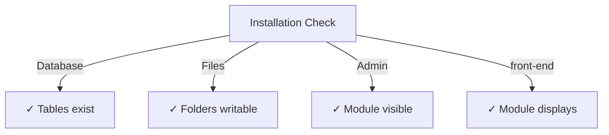

# Panduan Instalasi Penerbit

> Petunjuk lengkap untuk menginstal dan mengkonfigurasi module Publisher untuk XOOPS CMS.

---

## Persyaratan Sistem

### Persyaratan Minimum

| Persyaratan | Versi | Catatan |
|-------------|---------|-------|
| XOOPS | 2.5.10+ | Platform CMS core |
| PHP | 7.1+ | PHP 8.x direkomendasikan |
| MySQL | 5.7+ | Server basis data |
| Server Web | Apache/Nginx | Dengan dukungan penulisan ulang |

### Ekstensi PHP

```
- PDO (PHP Data Objects)
- pdo_mysql or mysqli
- mb_string (multibyte strings)
- curl (for external content)
- json
- gd (image processing)
```

### Ruang Disk

- **File module**: ~5 MB
- **Direktori cache**: disarankan 50+ MB
- **Unggah direktori**: Sesuai kebutuhan konten

---

## Daftar Periksa Pra-Instalasi

Sebelum menginstal Publisher, verifikasi:

- [ ] core XOOPS diinstal dan dijalankan
- [ ] Akun admin memiliki izin manajemen module
- [ ] Cadangan basis data dibuat
- [ ] Izin file memungkinkan akses tulis ke direktori `/modules/`
- [ ] Batas memori PHP minimal 128 MB
- [ ] Batas ukuran upload file sesuai (min 10 MB)

---

## Langkah Instalasi

### Langkah 1: Unduh Publisher

#### Opsi A: Dari GitHub (Disarankan)

```bash
# Navigate to modules directory
cd /path/to/xoops/htdocs/modules/

# Clone the repository
git clone https://github.com/XoopsModules25x/publisher.git

# Verify download
ls -la publisher/
```

#### Opsi B: Unduhan Manual

1. Kunjungi [Rilis Penerbit GitHub](https://github.com/XoopsModules25x/publisher/releases)
2. Download file `.zip` terbaru
3. Ekstrak ke `modules/publisher/`

### Langkah 2: Tetapkan Izin File

```bash
# Set proper ownership
chown -R www-data:www-data /path/to/xoops/htdocs/modules/publisher

# Set directory permissions (755)
find publisher -type d -exec chmod 755 {} \;

# Set file permissions (644)
find publisher -type f -exec chmod 644 {} \;

# Make scripts executable
chmod 755 publisher/admin/index.php
chmod 755 publisher/index.php
```

### Langkah 3: Instal melalui Admin XOOPS

1. Masuk ke **Panel Admin XOOPS** sebagai administrator
2. Navigasikan ke **Sistem → module**
3. Klik **Instal module**
4. Temukan **Penerbit** dalam daftar
5. Klik tombol **Instal**
6. Tunggu hingga instalasi selesai (menampilkan tabel database yang dibuat)

```
Installation Progress:
✓ Tables created
✓ Configuration initialized
✓ Permissions set
✓ Cache cleared
Installation Complete!
```

---

## Pengaturan Awal

### Langkah 1: Akses Admin Penerbit

1. Buka **Panel Admin → module**
2. Temukan module **Penerbit**
3. Klik tautan **Admin**
4. Anda sekarang berada di Administrasi Penerbit

### Langkah 2: Konfigurasikan Preferensi module

1. Klik **Preferensi** di menu sebelah kiri
2. Konfigurasikan pengaturan dasar:

```
General Settings:
- Editor: Select your WYSIWYG editor
- Items per page: 10
- Show breadcrumb: Yes
- Allow comments: Yes
- Allow ratings: Yes

SEO Settings:
- SEO URLs: No (enable later if needed)
- URL rewriting: None

Upload Settings:
- Max upload size: 5 MB
- Allowed file types: jpg, png, gif, pdf, doc, docx
```

3. Klik **Simpan Pengaturan**

### Langkah 3: Buat Kategori Pertama

1. Klik **Kategori** di menu sebelah kiri
2. Klik **Tambahkan Kategori**
3. Isi formulir:

```
Category Name: News
Description: Latest news and updates
Image: (optional) Upload category image
Parent Category: (leave blank for top-level)
Status: Enabled
```

4. Klik **Simpan Kategori**

### Langkah 4: Verifikasi Instalasi

Periksa indikator ini:



#### Pemeriksaan Basis Data

```bash
mysql -u xoops_user -p xoops_database
mysql> SHOW TABLES LIKE 'publisher%';

# Should show tables:
# - publisher_categories
# - publisher_items
# - publisher_comments
# - publisher_files
```

#### Pemeriksaan Bagian Depan

1. Kunjungi beranda XOOPS Anda
2. Cari block **Penerbit** atau **Berita**
3. Harus menampilkan artikel terbaru

---

## Konfigurasi Setelah Instalasi

### Pemilihan Editor

Penerbit mendukung banyak editor WYSIWYG:

| Penyunting | Kelebihan | Kontra |
|--------|------|------|
| FCKeditor | Kaya fitur | Lebih tua, lebih besar |
| CKEditor | Standar modern | Kompleksitas konfigurasi |
| KecilMCE | Ringan | Fitur terbatas |
| Penyunting DHTML | Dasar | Sangat mendasar |

**Untuk mengganti editor:**

1. Buka **Preferensi**
2. Gulir ke pengaturan **Editor**
3. Pilih dari dropdown
4. Simpan dan uji

### Unggah Pengaturan Direktori

```bash
# Create upload directories
mkdir -p /path/to/xoops/uploads/publisher/
mkdir -p /path/to/xoops/uploads/publisher/categories/
mkdir -p /path/to/xoops/uploads/publisher/images/
mkdir -p /path/to/xoops/uploads/publisher/files/

# Set permissions
chmod 755 /path/to/xoops/uploads/publisher/
chmod 755 /path/to/xoops/uploads/publisher/*
```

### Konfigurasikan Ukuran Gambar

Di Preferensi, atur ukuran thumbnail:

```
Category image size: 300 x 200 px
Article image size: 600 x 400 px
Thumbnail size: 150 x 100 px
```

---

## Langkah Pasca Instalasi

### 1. Tetapkan Izin Grup

1. Buka **Izin** di menu admin
2. Konfigurasikan akses untuk grup:
   - Anonim: Lihat saja
   - Pengguna Terdaftar: Kirim artikel
   - Editor: artikel Approve/edit
   - Admin: Akses penuh

### 2. Konfigurasikan Visibilitas module

1. Buka **block** di admin XOOPS
2. Temukan block Penerbit:
   - Penerbit - Artikel Terbaru
   - Penerbit - Kategori
   - Penerbit - Arsip
3. Konfigurasikan visibilitas block per halaman

### 3. Impor Konten Uji (Opsional)

Untuk pengujian, impor artikel sampel:

1. Buka **Admin Penerbit → Impor**
2. Pilih **Contoh Konten**
3. Klik **Impor**

### 4. Aktifkan URL SEO (Opsional)

Untuk URL yang mudah ditelusuri:

1. Buka **Preferensi**
2. Setel **URL SEO**: Ya
3. Aktifkan penulisan ulang **.htaccess**
4. Verifikasi file `.htaccess` ada di folder Publisher

```apache
# .htaccess example
<IfModule mod_rewrite.c>
    RewriteEngine On
    RewriteBase /modules/publisher/
    RewriteRule ^category/([0-9]+)-(.*)\.html$ index.php?op=showcategory&categoryid=$1 [L]
    RewriteRule ^article/([0-9]+)-(.*)\.html$ index.php?op=showitem&itemid=$1 [L]
</IfModule>
```

---

## Mengatasi Masalah Instalasi

### Masalah: module tidak muncul di admin

**Solusi:**
```bash
# Check file permissions
ls -la /path/to/xoops/modules/publisher/

# Check xoops_version.php exists
ls /path/to/xoops/modules/publisher/xoops_version.php

# Verify PHP syntax
php -l /path/to/xoops/modules/publisher/xoops_version.php
```
### Masalah: Tabel database tidak dibuat

**Solusi:**
1. Periksa pengguna MySQL memiliki hak istimewa CREATE TABLE
2. Periksa log kesalahan basis data:
   
   ```bash
   mysql> SHOW WARNINGS;
   
   ```
3. Impor SQL secara manual:
   
   ```bash
   mysql -u user -p database < modules/publisher/sql/mysql.sql
   
   ```

### Masalah: Pengunggahan file gagal

**Solusi:**
```bash
# Check directory exists and is writable
stat /path/to/xoops/uploads/publisher/

# Fix permissions
chmod 777 /path/to/xoops/uploads/publisher/

# Verify PHP settings
php -i | grep upload_max_filesize
```

### Masalah: Kesalahan "Halaman tidak ditemukan".

**Solusi:**
1. Periksa apakah file `.htaccess` ada
2. Pastikan Apache `mod_rewrite` diaktifkan:
   
   ```bash
   a2enmod rewrite
   systemctl restart apache2
   
   ```
3. Periksa `AllowOverride All` di konfigurasi Apache

---

## Tingkatkan dari Versi Sebelumnya

### Dari Penerbit 1.x ke 2.x

1. **Cadangan instalasi saat ini:**
   
   ```bash
   cp -r modules/publisher/ modules/publisher-backup/
   mysqldump -u user -p database > publisher-backup.sql
   
   ```

2. **Unduh Penerbit 2.x**

3. **Menimpa file:**
   
   ```bash
   rm -rf modules/publisher/
   unzip publisher-2.0.zip -d modules/
   
   ```

4. **Jalankan pembaruan:**
   - Buka **Admin → Penerbit → Perbarui**
   - Klik **Perbarui Basis Data**
   - Tunggu sampai selesai

5. **Verifikasi:**
   - Periksa semua artikel ditampilkan dengan benar
   - Verifikasi izin utuh
   - Uji unggahan file

---

## Pertimbangan Keamanan

### Izin Berkas

```
- Core files: 644 (readable by web server)
- Directories: 755 (browseable by web server)
- Upload directories: 755 or 777
- Config files: 600 (not readable by web)
```

### Nonaktifkan Akses Langsung ke File Sensitif

Buat `.htaccess` di direktori unggahan:

```apache
<FilesMatch "\.(php|phtml|php3|php4|php5|phtml)$">
    Deny from all
</FilesMatch>
```

### Keamanan Basis Data

```bash
# Use strong password
ALTER USER 'publisher_user'@'localhost' IDENTIFIED BY 'strong_password_here';

# Grant minimal permissions
GRANT SELECT, INSERT, UPDATE, DELETE ON publisher_db.* TO 'publisher_user'@'localhost';
FLUSH PRIVILEGES;
```

---

## Daftar Periksa Verifikasi

Setelah instalasi, verifikasi:

- [ ] module muncul di daftar module admin
- [ ] Dapat mengakses bagian admin Penerbit
- [ ] Dapat membuat kategori
- [ ] Dapat membuat artikel
- [ ] Artikel ditampilkan di front-end
- [ ] Pengunggahan file berfungsi
- [ ] Gambar ditampilkan dengan benar
- [ ] Izin diterapkan dengan benar
- [ ] Tabel database dibuat
- [ ] Direktori cache dapat ditulis

---

## Langkah Selanjutnya

Setelah instalasi berhasil:

1. Baca Panduan Konfigurasi Dasar
2. Buat Artikel pertama Anda
3. Atur Izin Grup
4. Tinjauan Manajemen Kategori

---

## Dukungan & Sumber Daya

- **Masalah GitHub**: [Masalah Penerbit](https://github.com/XoopsModules25x/publisher/issues)
- **Forum XOOPS**: [Dukungan Komunitas](https://www.xoops.org/modules/newbb/)
- **GitHub Wiki**: [Bantuan Instalasi](https://github.com/XoopsModules25x/publisher/wiki)

---

#publisher #installation #setup #xoops #module #configuration
