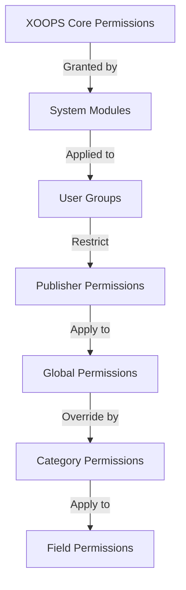

# Pengaturan Izin Penerbit

> Panduan lengkap untuk mengonfigurasi izin grup, kontrol akses, dan mengelola akses pengguna di Publisher.

---

## Dasar-Dasar Izin

### Apa itu Izin?

Izin mengontrol apa yang dapat dilakukan oleh kelompok pengguna yang berbeda di Publisher:

```
Who can:
  - View articles
  - Submit articles
  - Edit articles
  - Approve articles
  - Manage categories
  - Configure settings
```

### Tingkat Izin

```
Anonymous
  └── View published articles only

Registered Users
  ├── View articles
  ├── Submit articles (pending approval)
  └── Edit own articles

Editors/Moderators
  ├── All registered permissions
  ├── Approve articles
  ├── Edit all articles
  └── Manage some categories

Administrators
  └── Full access to everything
```

---

## Manajemen Izin Akses

### Navigasikan ke Izin

```
Admin Panel
└── Modules
    └── Publisher
        ├── Permissions
        ├── Category Permissions
        └── Group Management
```

### Akses Cepat

1. Masuk sebagai **Administrator**
2. Buka **Admin → module**
3. Klik **Penerbit → Admin**
4. Klik **Izin** di menu sebelah kiri

---

## Izin Global

### Izin Tingkat module

Kontrol akses ke module dan fitur Penerbit:

```
Permissions configuration view:
┌─────────────────────────────────────┐
│ Permission             │ Anon │ Reg │ Editor │ Admin │
├────────────────────────┼──────┼─────┼────────┼───────┤
│ View articles          │  ✓   │  ✓  │   ✓    │  ✓   │
│ Submit articles        │  ✗   │  ✓  │   ✓    │  ✓   │
│ Edit own articles      │  ✗   │  ✓  │   ✓    │  ✓   │
│ Edit all articles      │  ✗   │  ✗  │   ✓    │  ✓   │
│ Approve articles       │  ✗   │  ✗  │   ✓    │  ✓   │
│ Manage categories      │  ✗   │  ✗  │   ✗    │  ✓   │
│ Access admin panel     │  ✗   │  ✗  │   ✓    │  ✓   │
└─────────────────────────────────────┘
```

### Deskripsi Izin

| Izin | Pengguna | Efek |
|------------|-------|--------|
| **Lihat artikel** | Semua grup | Dapat melihat artikel yang dipublikasikan di front-end |
| **Kirim artikel** | Terdaftar+ | Dapat membuat artikel baru (menunggu persetujuan) |
| **Edit artikel sendiri** | Terdaftar+ | Bisakah edit/delete artikelnya sendiri |
| **Edit semua artikel** | Editor+ | Dapat mengedit artikel pengguna mana pun |
| **Hapus artikel sendiri** | Terdaftar+ | Dapat menghapus artikel sendiri yang belum diterbitkan |
| **Hapus semua artikel** | Editor+ | Dapat menghapus artikel apa pun |
| **Setujui artikel** | Editor+ | Dapat mempublikasikan artikel yang tertunda |
| **Kelola kategori** | Admin | Membuat, mengedit, menghapus kategori |
| **Akses Admin** | Editor+ | Akses antarmuka admin |

---

## Konfigurasikan Izin Global

### Langkah 1: Akses Pengaturan Izin

1. Buka **Admin → module**
2. Temukan **Penerbit**
3. Klik **Izin** (atau tautan Admin lalu Izin)
4. Anda melihat matriks izin

### Langkah 2: Tetapkan Izin Grup

Untuk setiap grup, konfigurasikan apa yang dapat mereka lakukan:

#### Pengguna Anonim

```yaml
Anonymous Group Permissions:
  View articles: ✓ YES
  Submit articles: ✗ NO
  Edit articles: ✗ NO
  Delete articles: ✗ NO
  Approve articles: ✗ NO
  Manage categories: ✗ NO
  Admin access: ✗ NO

Result: Anonymous users can only view published content
```

#### Pengguna Terdaftar

```yaml
Registered Group Permissions:
  View articles: ✓ YES
  Submit articles: ✓ YES (with approval required)
  Edit own articles: ✓ YES
  Edit all articles: ✗ NO
  Delete own articles: ✓ YES (drafts only)
  Delete all articles: ✗ NO
  Approve articles: ✗ NO
  Manage categories: ✗ NO
  Admin access: ✗ NO

Result: Registered users can contribute content after approval
```

#### Grup Editor

```yaml
Editors Group Permissions:
  View articles: ✓ YES
  Submit articles: ✓ YES
  Edit own articles: ✓ YES
  Edit all articles: ✓ YES
  Delete own articles: ✓ YES
  Delete all articles: ✓ YES
  Approve articles: ✓ YES
  Manage categories: ✓ LIMITED
  Admin access: ✓ YES
  Configure settings: ✗ NO

Result: Editors manage content but not settings
```

#### Administrator

```yaml
Admins Group Permissions:
  ✓ FULL ACCESS to all features

  - All editor permissions
  - Manage all categories
  - Configure all settings
  - Manage permissions
  - Install/uninstall
```

### Langkah 3: Simpan Izin

1. Konfigurasikan izin masing-masing grup
2. Centang kotak untuk tindakan yang diperbolehkan
3. Hapus centang pada kotak untuk tindakan yang ditolak
4. Klik **Simpan Izin**
5. Pesan konfirmasi muncul

---

## Izin Tingkat Kategori

### Tetapkan Akses Kategori

Kontrol siapa yang dapat view/submit ke kategori tertentu:

```
Admin → Publisher → Categories
→ Select category → Permissions
```

### Matriks Izin Kategori

```
                 Anonymous  Registered  Editor  Admin
View category        ✓         ✓         ✓       ✓
Submit to category   ✗         ✓         ✓       ✓
Edit own in category ✗         ✓         ✓       ✓
Edit all in category ✗         ✗         ✓       ✓
Approve in category  ✗         ✗         ✓       ✓
Manage category      ✗         ✗         ✗       ✓
```

### Konfigurasikan Izin Kategori

1. Buka admin **Kategori**
2. Temukan kategori
3. Klik tombol **Izin**
4. Untuk setiap grup, pilih:
   - [ ] Lihat kategori ini
   - [ ] Kirim artikel
   - [ ] Edit artikel sendiri
   - [ ] Edit semua artikel
   - [ ] Menyetujui artikel
   - [ ] Kelola kategori
5. Klik **Simpan**

### Contoh Izin Kategori

#### Kategori Berita Publik

```
Anonymous: View only
Registered: View + Submit (pending approval)
Editors: Approve + Edit
Admins: Full control
```

#### Kategori Pembaruan Internal

```
Anonymous: No access
Registered: View only
Editors: Submit + Approve
Admins: Full control
```

#### Kategori Blog Tamu

```
Anonymous: View only
Registered: Submit (pending approval)
Editors: Approve
Admins: Full control
```

---

## Izin Tingkat Lapangan

### Kontrol Visibilitas Bidang Formulir

Batasi bidang formulir mana yang dapat digunakan pengguna see/edit:

```
Admin → Publisher → Permissions → Fields
```

### Opsi Bidang

```yaml
Visible Fields for Registered Users:
  ✓ Title
  ✓ Description
  ✓ Content (body)
  ✓ Featured image
  ✓ Category
  ✓ Tags
  ✗ Author (auto-set)
  ✗ Publication date (editors only)
  ✗ Scheduled date (editors only)
  ✗ Featured flag (editors only)
  ✗ Permissions (admins only)
```

### Contoh

#### Pengiriman Terbatas untuk Terdaftar

Pengguna terdaftar melihat lebih sedikit opsi:

```
Available fields:
  - Title ✓
  - Description ✓
  - Content ✓
  - Featured image ✓
  - Category ✓

Hidden fields:
  - Author (auto-current user)
  - Publication date (editors decide)
  - Scheduled date (admins only)
  - Featured status (editors choose)
```

#### Formulir Lengkap untuk Editor

Editor melihat semua opsi:

```
Available fields:
  - All basic fields
  - All metadata
  - Author selection ✓
  - Publication date/time ✓
  - Scheduled date ✓
  - Featured status ✓
  - Expiration date ✓
  - Permissions ✓
```

---

## Konfigurasi Grup Pengguna

### Buat Grup Khusus

1. Buka **Admin → Pengguna → Grup**
2. Klik **Buat Grup**
3. Masukkan detail grup:

```
Group Name: "Community Bloggers"
Group Description: "Users who contribute blog content"
Type: Regular group
```

4. Klik **Simpan Grup**
5. Kembali ke izin Penerbit
6. Tetapkan izin untuk grup baru

### Contoh Grup

```
Suggested Groups for Publisher:

Group: Contributors
  - Regular members who submit articles
  - Can edit own articles
  - Cannot approve articles

Group: Reviewers
  - Can see submitted articles
  - Can approve/reject articles
  - Cannot delete others' articles

Group: Editors
  - Can edit any article
  - Can approve articles
  - Can moderate comments
  - Can manage some categories

Group: Publishers
  - Can edit any article
  - Can publish directly (no approval)
  - Can manage all categories
  - Can configure settings
```

---

## Hierarki Izin

### Alur Izin



### Warisan Izin

```
Base: Global module permissions
  ↓
Category: Overrides for specific categories
  ↓
Field: Further restricts available fields
  ↓
User: Has permission if ALL levels allow
```

**Contoh:**

```
User wants to edit article:
1. User group must have "edit articles" permission (global)
2. Category must allow editing (category level)
3. Field restrictions must allow (if applicable)
4. User must be author OR editor (for own vs all)

If ANY level denies → Permission denied
```

---

## Persetujuan Izin Alur Kerja

### Konfigurasikan Persetujuan Pengiriman

Kontrol apakah artikel memerlukan persetujuan:

```
Admin → Publisher → Preferences → Workflow
```

#### Opsi Persetujuan

```yaml
Submission Workflow:
  Require Approval: Yes

  For Registered Users:
    - New articles: Draft (pending approval)
    - Editors must approve
    - User can edit while pending
    - After approval: User can still edit

  For Editors:
    - New articles: Publish directly (optional)
    - Skip approval queue
    - Or always require approval
```

#### Konfigurasi Per Grup

1. Buka Preferensi
2. Temukan "Alur Kerja Pengiriman"
3. Untuk setiap kelompok, tetapkan:

```
Group: Registered Users
  Require approval: ✓ YES
  Default status: Draft
  Can modify while pending: ✓ YES

Group: Editors
  Require approval: ✗ NO
  Default status: Published
  Can modify published: ✓ YES
```

4. Klik **Simpan**

---

## Artikel Sedang

### Menyetujui Artikel yang Tertunda

Untuk pengguna dengan izin "menyetujui artikel":1. Buka **Admin → Penerbit → Artikel**
2. Filter berdasarkan **Status**: Tertunda
3. Klik artikel untuk mengulas
4. Periksa kualitas konten
5. Tetapkan **Status**: Diterbitkan
6. Opsional: Tambahkan catatan editorial
7. Klik **Simpan**

### Tolak Artikel

Jika artikel tidak memenuhi standar:

1. Buka artikel
2. Atur **Status**: Draf
3. Tambahkan alasan penolakan (dalam komentar atau email)
4. Klik **Simpan**
5. Kirim pesan ke penulis menjelaskan penolakan

### Komentar Sedang

Jika memoderasi komentar:

1. Buka **Admin → Penerbit → Komentar**
2. Filter berdasarkan **Status**: Tertunda
3. Tinjau komentar
4. Pilihan:
   - Setuju: Klik **Setuju**
   - Tolak: Klik **Hapus**
   - Edit: Klik **Edit**, perbaiki, simpan
5. Klik **Simpan**

---

## Kelola Akses Pengguna

### Lihat Grup Pengguna

Lihat pengguna mana yang termasuk dalam grup:

```
Admin → Users → User Groups

For each user:
  - Primary group (one)
  - Secondary groups (multiple)

Permissions apply from all groups (union)
```

### Tambahkan Pengguna ke Grup

1. Buka **Admin → Pengguna**
2. Temukan pengguna
3. Klik **Edit**
4. Pada **Grup**, centang grup yang akan ditambahkan
5. Klik **Simpan**

### Ubah Izin Pengguna

Untuk pengguna individu (jika didukung):

1. Buka Admin pengguna
2. Temukan pengguna
3. Klik **Edit**
4. Cari penggantian izin individual
5. Konfigurasikan sesuai kebutuhan
6. Klik **Simpan**

---

## Skenario Izin Umum

### Skenario 1: Buka Blog

Izinkan siapa pun mengirimkan:

```
Anonymous: View
Registered: Submit, edit own, delete own
Editors: Approve, edit all, delete all
Admins: Full control

Result: Open community blog
```

### Skenario 2: Situs Berita yang Dimoderasi

Proses persetujuan yang ketat:

```
Anonymous: View only
Registered: Cannot submit
Editors: Submit, approve others
Admins: Full control

Result: Only approved professionals publish
```

### Skenario 3: Blog Staf

Karyawan dapat berkontribusi:

```
Create group: "Staff"
Anonymous: View
Registered: View only (non-staff)
Staff: Submit, edit own, publish directly
Admins: Full control

Result: Staff-authored blog
```

### Skenario 4: Multi-Kategori dengan Editor Berbeda

Editor berbeda untuk kategori berbeda:

```
News category:
  Editors group A: Full control

Reviews category:
  Editors group B: Full control

Tutorials category:
  Editors group C: Full control

Result: Decentralized editorial control
```

---

## Pengujian Izin

### Verifikasi Izin Berfungsi

1. Buat pengguna uji di setiap grup
2. Masuk sebagai setiap pengguna uji
3. Cobalah untuk:
   - Lihat artikel
   - Mengirimkan artikel (harus membuat draf jika diizinkan)
   - Edit artikel (milik sendiri dan orang lain)
   - Hapus artikel
   - Akses panel admin
   - Akses kategori

4. Verifikasi hasil sesuai izin yang diharapkan

### Kasus Uji Umum

```
Test Case 1: Anonymous user
  [ ] Can view published articles: ✓
  [ ] Cannot submit articles: ✓
  [ ] Cannot access admin: ✓

Test Case 2: Registered user
  [ ] Can submit articles: ✓
  [ ] Articles go to Draft: ✓
  [ ] Can edit own article: ✓
  [ ] Cannot edit others: ✓
  [ ] Cannot access admin: ✓

Test Case 3: Editor
  [ ] Can approve articles: ✓
  [ ] Can edit any article: ✓
  [ ] Can access admin: ✓
  [ ] Cannot delete all: ✓ (or ✓ if allowed)

Test Case 4: Admin
  [ ] Can do everything: ✓
```

---

## Izin Pemecahan Masalah

### Masalah: Pengguna tidak dapat mengirimkan artikel

**Periksa:**
```
1. User group has "submit articles" permission
   Admin → Publisher → Permissions

2. User belongs to allowed group
   Admin → Users → Edit user → Groups

3. Category allows submission from user's group
   Admin → Publisher → Categories → Permissions

4. User is registered (not anonymous)
```

**Solusi:**
```bash
1. Verify registered user group has submission permission
2. Add user to appropriate group
3. Check category permissions
4. Clear user session cache
```

### Masalah: Editor tidak dapat menyetujui artikel

**Periksa:**
```
1. Editor group has "approve articles" permission
2. Articles exist with "Pending" status
3. Editor is in correct group
4. Category allows approval from editor's group
```

**Solusi:**
```bash
1. Go to Permissions, check "approve articles" is checked for editor group
2. Create test article, set to Draft
3. Try to approve as editor
4. Check error messages in system log
```

### Masalah: Dapat melihat artikel tetapi tidak dapat mengakses kategori

**Periksa:**
```
1. Category is not disabled/hidden
2. Category permissions allow viewing
3. User's group is permitted to view category
4. Category is published
```

**Solusi:**
```bash
1. Go to Categories, check category status is "Enabled"
2. Check category permissions are set
3. Add user's group to category view permission
```

### Masalah: Izin diubah tetapi tidak berlaku

**Solusi:**
```bash
1. Clear cache: Admin → Tools → Clear Cache
2. Clear session: Logout and login again
3. Check system log for errors
4. Verify permissions actually saved
5. Try different browser/incognito window
```

---

## Izin Pencadangan & Ekspor

### Izin Ekspor

Beberapa sistem mengizinkan ekspor:

1. Buka **Admin → Penerbit → Alat**
2. Klik **Izin Ekspor**
3. Simpan file `.xml` atau `.json`
4. Simpan sebagai cadangan

### Izin Impor

Pulihkan dari cadangan:

1. Buka **Admin → Penerbit → Alat**
2. Klik **Izin Impor**
3. Pilih file cadangan
4. Tinjau perubahan
5. Klik **Impor**

---

## Praktik Terbaik

### Daftar Periksa Konfigurasi Izin

- [ ] Tentukan kelompok pengguna
- [ ] Tetapkan nama yang jelas ke grup
- [ ] Tetapkan izin dasar untuk setiap grup
- [ ] Uji setiap tingkat izin
- [ ] Struktur izin dokumen
- [ ] Buat alur kerja persetujuan
- [ ] Latih editor tentang moderasi
- [ ] Pantau penggunaan izin
- [ ] Tinjau izin setiap tiga bulan
- [ ] Pengaturan izin pencadangan

### Praktik Terbaik Keamanan

```
✓ Principle of Least Privilege
  - Grant minimum necessary permissions

✓ Role-Based Access
  - Use groups for roles (editor, moderator, etc)

✓ Audit Permissions
  - Review who has what access

✓ Separate Duties
  - Submitter, approver, publisher are different

✓ Regular Review
  - Check permissions quarterly
  - Remove access when users leave
  - Update for new requirements
```

---

## Panduan Terkait

- Membuat Artikel
- Mengelola Kategori
- Konfigurasi Dasar
- Instalasi

---

## Langkah Selanjutnya

- Atur Izin untuk alur kerja Anda
- Buat Artikel dengan izin yang sesuai
- Konfigurasikan Kategori dengan izin
- Melatih pengguna dalam pembuatan artikel

---

#penerbit #izin #grup #kontrol akses #keamanan #moderasi #xoops
