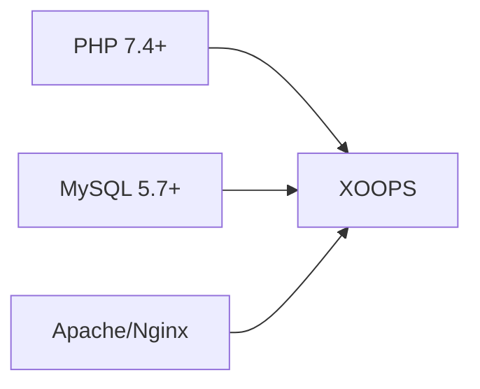
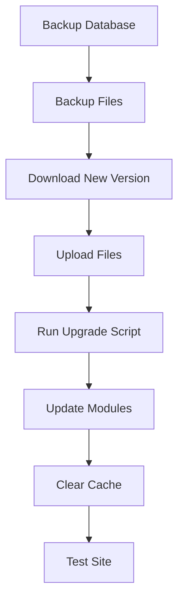

> Pertanyaan dan jawaban umum tentang menginstal XOOPS.

---

## Pra-Instalasi

### Q: Berapa persyaratan minimum servernya?

**A:** XOOPS 2.5.x memerlukan:
- PHP 7.4 atau lebih tinggi (disarankan PHP 8.x)
- MySQL 5.7+ atau MariaDB 10.3+
- Apache dengan mod_rewrite atau Nginx
- Setidaknya batas memori PHP 64MB (disarankan 128MB+)



### Q: Bisakah saya menginstal XOOPS di shared hosting?

**A:** Ya, XOOPS berfungsi dengan baik di sebagian besar hosting bersama yang memenuhi persyaratan. Periksa apakah host Anda menyediakan:
- PHP dengan ekstensi yang diperlukan (mysqli, gd, curl, json, mbstring)
- Akses basis data MySQL
- Kemampuan mengunggah file
- Dukungan .htaccess (untuk Apache)

### T: Ekstensi PHP manakah yang diperlukan?

**A:** Ekstensi yang diperlukan:
- `mysqli` - Konektivitas basis data
- `gd` - Pemrosesan gambar
- `json` - Penanganan JSON
- `mbstring` - Dukungan string multibita

Direkomendasikan:
- `curl` - Panggilan API eksternal
- `zip` - Pemasangan module
- `intl` - Internasionalisasi

---

## Proses Instalasi

### T: Wizard instalasi menampilkan halaman kosong

**A:** Ini biasanya merupakan kesalahan PHP. Coba:

1. Aktifkan tampilan kesalahan sementara:
```php
// Add to htdocs/install/index.php at the top
error_reporting(E_ALL);
ini_set('display_errors', 1);
```

2. Periksa log kesalahan PHP
3. Verifikasi kompatibilitas versi PHP
4. Pastikan semua ekstensi yang diperlukan telah dimuat

### T: Saya mendapat pesan "Tidak dapat menulis ke mainfile.php"

**A:** Tetapkan izin menulis sebelum instalasi:

```bash
chmod 666 mainfile.php
# After installation, secure it:
chmod 444 mainfile.php
```

### T: Tabel database tidak dibuat

**J:** Periksa:

1. Pengguna MySQL memiliki hak istimewa CREATE TABLE:
```sql
GRANT ALL PRIVILEGES ON xoopsdb.* TO 'xoopsuser'@'localhost';
FLUSH PRIVILEGES;
```

2. Basis data ada:
```sql
CREATE DATABASE xoopsdb CHARACTER SET utf8mb4 COLLATE utf8mb4_unicode_ci;
```

3. Kredensial di wizard cocok dengan pengaturan database

### T: Instalasi selesai tetapi situs menunjukkan kesalahan

**A:** Perbaikan umum pasca instalasi:

1. Hapus atau ganti nama direktori instalasi:
```bash
mv htdocs/install htdocs/install.bak
```

2. Tetapkan izin yang tepat:
```bash
chmod -R 755 htdocs/
chmod -R 777 xoops_data/
chmod 444 mainfile.php
```

3. Hapus tembolok:
```bash
rm -rf xoops_data/caches/smarty_cache/*
rm -rf xoops_data/caches/smarty_compile/*
```

---

## Konfigurasi

### Q: Dimana file konfigurasinya?

**A:** Konfigurasi utama ada di `mainfile.php` di root XOOPS. Pengaturan kunci:

```php
define('XOOPS_ROOT_PATH', '/path/to/htdocs');
define('XOOPS_VAR_PATH', '/path/to/xoops_data');
define('XOOPS_URL', 'https://yoursite.com');
define('XOOPS_DB_HOST', 'localhost');
define('XOOPS_DB_USER', 'username');
define('XOOPS_DB_PASS', 'password');
define('XOOPS_DB_NAME', 'database');
define('XOOPS_DB_PREFIX', 'xoops');
```

### T: Bagaimana cara mengubah situs URL?

**J:** Sunting `mainfile.php`:

```php
define('XOOPS_URL', 'https://newdomain.com');
```

Kemudian hapus cache dan perbarui semua URL hardcode di database.

### T: Bagaimana cara memindahkan XOOPS ke direktori lain?

**J:**

1. Pindahkan file ke lokasi baru
2. Perbarui jalur di `mainfile.php`:
```php
define('XOOPS_ROOT_PATH', '/new/path/to/htdocs');
define('XOOPS_VAR_PATH', '/new/path/to/xoops_data');
```
3. Perbarui database jika diperlukan
4. Hapus semua cache

---

## Peningkatan

### T: Bagaimana cara mengupgrade XOOPS?

**J:**



1. **Cadangkan semuanya** (database + file)
2. Unduh versi XOOPS baru
3. Upload file (jangan timpa `mainfile.php`)
4. Jalankan `htdocs/upgrade/` jika tersedia
5. Perbarui module melalui panel admin
6. Hapus semua cache
7. Uji secara menyeluruh

### T: Bisakah saya melewati versi saat melakukan upgrade?

**J:** Umumnya tidak. Tingkatkan versi secara berurutan melalui versi utama untuk memastikan migrasi database berjalan dengan benar. Periksa catatan rilis untuk panduan spesifik.

### T: module saya berhenti berfungsi setelah peningkatan

**J:**

1. Periksa kompatibilitas module dengan versi XOOPS yang baru
2. Perbarui module ke versi terbaru
3. Regenerasi template: Admin → Sistem → Pemeliharaan → Template
4. Hapus semua cache
5. Periksa log kesalahan PHP untuk kesalahan tertentu

---

## Pemecahan masalah

### Q: Saya lupa password adminnya

**A:** Reset melalui database:

```sql
-- Generate new password hash
UPDATE xoops_users
SET pass = MD5('newpassword')
WHERE uname = 'admin';
```

Atau gunakan fitur pengaturan ulang kata sandi jika email dikonfigurasi.

### Q: Situs sangat lambat setelah instalasi

**J:**

1. Aktifkan caching di Admin → Sistem → Preferensi
2. Optimalkan basis data:
```sql
OPTIMIZE TABLE xoops_session;
OPTIMIZE TABLE xoops_online;
```
3. Periksa kueri lambat dalam mode debug
4. Aktifkan PHP OpCache

### T: Images/CSS tidak memuat

**J:**

1. Periksa izin file (644 untuk file, 755 untuk direktori)
2. Verifikasi `XOOPS_URL` sudah benar di `mainfile.php`
3. Periksa .htaccess untuk konflik penulisan ulang
4. Periksa konsol browser untuk kesalahan 404

---## Dokumentasi Terkait

- Panduan Instalasi
- Konfigurasi Dasar
- Layar Putih Kematian

---

#xoops #faq #instalasi #pemecahan masalah
