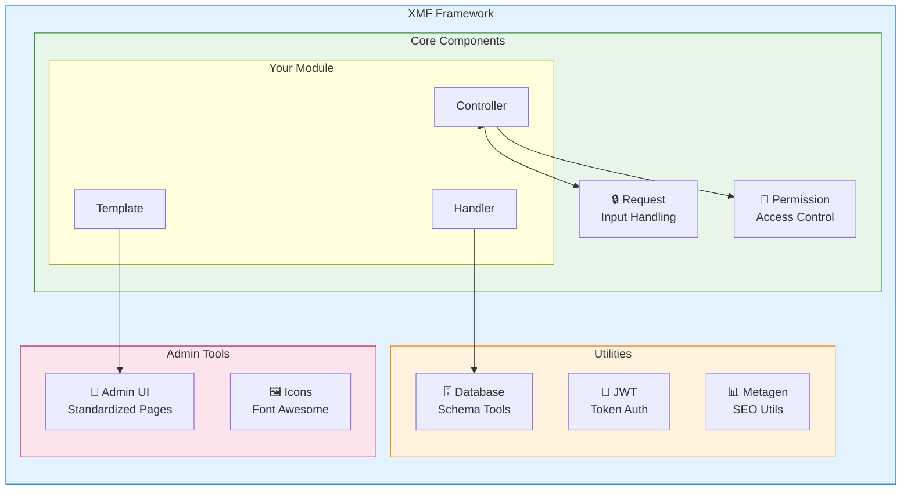
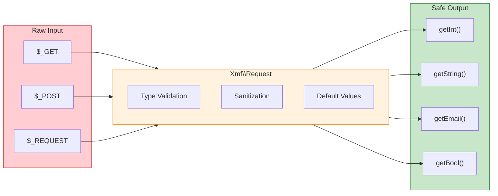

<span class="version-badge version-25x">2.5.x ✅</span> <span class="version-badge version-40x">4.0.x ✅</span>

:::tip[Jembatan Menuju XOOPS Modern]
XMF berfungsi di **XOOPS 2.5.x dan XOOPS 4.0.x**. Ini adalah cara yang disarankan untuk memodernisasi module Anda hari ini sambil mempersiapkan XOOPS 4.0. XMF menyediakan pemuatan otomatis PSR-4, namespace, dan pembantu yang memperlancar transisi.
:::

**XOOPS Module Framework (XMF)** adalah perpustakaan canggih yang dirancang untuk menyederhanakan dan menstandarkan pengembangan module XOOPS. XMF menyediakan praktik PHP modern termasuk namespace, pemuatan otomatis, dan serangkaian kelas pembantu komprehensif yang mengurangi kode boilerplate dan meningkatkan kemudahan perawatan.

## Apa itu XMF?

XMF adalah kumpulan kelas dan utilitas yang menyediakan:

- **Dukungan PHP modern** - Dukungan namespace lengkap dengan pemuatan otomatis PSR-4
- **Penanganan Permintaan** - Validasi dan sanitasi input yang aman
- **Pembantu module** - Akses yang disederhanakan ke konfigurasi module dan objek
- **Sistem Izin** - Manajemen izin yang mudah digunakan
- **Utilitas Basis Data** - Migrasi skema dan alat manajemen tabel
- **Dukungan JWT** - Implementasi Token Web JSON untuk autentikasi yang aman
- **Pembuatan Metadata** - SEO dan utilitas ekstraksi konten
- **Antarmuka Admin** - Halaman administrasi module standar

### Ikhtisar Komponen XMF



## Fitur Utama

### namespace dan Pemuatan Otomatis

Semua kelas XMF berada di namespace `Xmf`. Kelas dimuat secara otomatis saat direferensikan - tidak diperlukan manual yang disertakan.

```php
use Xmf\Request;
use Xmf\Module\Helper;

// Classes load automatically when used
$input = Request::getString('input', '');
$helper = Helper::getHelper('mymodule');
```

### Penanganan Permintaan Aman

[Kelas Permintaan](../05-XMF-Framework/Basics/XMF-Request.md) menyediakan akses aman tipe ke data permintaan HTTP dengan sanitasi bawaan:



```php
use Xmf\Request;

$id = Request::getInt('id', 0);
$name = Request::getString('name', '');
$email = Request::getEmail('email', '');
```

### Sistem Pembantu module

[Module Helper](../05-XMF-Framework/Basics/XMF-Module-Helper.md) menyediakan akses mudah ke fungsionalitas terkait module:

```php
$helper = \Xmf\Module\Helper::getHelper('mymodule');

// Access module configuration
$configValue = $helper->getConfig('setting_name', 'default');

// Get module object
$module = $helper->getModule();

// Access handlers
$handler = $helper->getHandler('items');
```

### Manajemen Izin

[Permission-Helper](../05-XMF-Framework/Recipes/Permission-Helper.md) menyederhanakan penanganan izin XOOPS:

```php
$permHelper = new \Xmf\Module\Helper\Permission();

// Check user permission
if ($permHelper->checkPermission('view', $itemId)) {
    // User has permission
}
```

## Struktur Dokumentasi

### Dasar-dasar

- [Memulai-dengan-XMF](../05-XMF-Framework/Basics/Getting-Started-with-XMF.md) - Instalasi dan penggunaan dasar
- [XMF-Request](../05-XMF-Framework/Basics/XMF-Request.md) - Penanganan permintaan dan validasi input
- [XMF-Module-Helper](../05-XMF-Framework/Basics/XMF-Module-Helper.md) - Penggunaan kelas pembantu module

### Resep

- [Izin-Pembantu](../05-XMF-Framework/Recipes/Permission-Helper.md) - Bekerja dengan izin
- [Module-Admin-Pages](../05-XMF-Framework/Recipes/Module-Admin-Pages.md) - Membuat antarmuka admin standar

### Referensi

- [JWT](../05-XMF-Framework/Reference/JWT.md) - Implementasi Token Web JSON
- [Database](../05-XMF-Framework/Reference/Database.md) - Utilitas database dan manajemen skema
- [Metagen](Reference/Metagen.md) - Metadata dan utilitas SEO

## Persyaratan

- XOOPS 2.5.8 atau lebih baru
- PHP 7.2 atau lebih baru (disarankan PHP 8.x)

## Instalasi

XMF disertakan dengan XOOPS 2.5.8 dan versi yang lebih baru. Untuk versi sebelumnya atau instalasi manual:

1. Unduh paket XMF dari repositori XOOPS
2. Ekstrak ke direktori XOOPS `/class/xmf/` Anda
3. Pemuat otomatis akan menangani pemuatan kelas secara otomatis

## Contoh Mulai Cepat

Berikut adalah contoh lengkap yang menunjukkan pola penggunaan umum XMF:

```php
<?php
use Xmf\Request;
use Xmf\Module\Helper;
use Xmf\Module\Helper\Permission;

// Get module helper
$helper = Helper::getHelper('mymodule');

// Get configuration values
$itemsPerPage = $helper->getConfig('items_per_page', 10);

// Handle request input
$op = Request::getCmd('op', 'list');
$id = Request::getInt('id', 0);

// Check permissions
$permHelper = new Permission();
if (!$permHelper->checkPermission('view', $id)) {
    redirect_header('index.php', 3, 'Access denied');
}

// Process based on operation
switch ($op) {
    case 'view':
        $handler = $helper->getHandler('items');
        $item = $handler->get($id);
        // ... display item
        break;
    case 'list':
    default:
        // ... list items
        break;
}
```

## Sumber Daya

- [Repositori GitHub XMF](https://github.com/XOOPS/XMF)
- [Situs Web Proyek XOOPS](https://xoops.org)

---

#xmf #xoops #framework #php #pengembangan module
