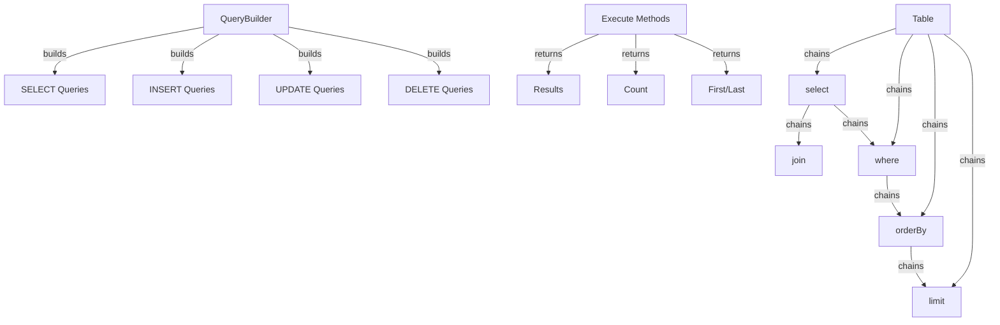

Il Query Builder XOOPS fornisce un'interfaccia fluente e moderna per costruire query SQL. Aiuta a prevenire SQL injection, migliora la leggibilità e fornisce astrazione database per sistemi database multipli.

## Architettura Query Builder



## Classe QueryBuilder

Classe principale query builder con interfaccia fluente.

### Panoramica Classe

```php
namespace Xoops\Database;

class QueryBuilder
{
    protected string $table = '';
    protected string $type = 'SELECT';
    protected array $selects = [];
    protected array $joins = [];
    protected array $wheres = [];
    protected array $orders = [];
    protected int $limit = 0;
    protected int $offset = 0;
    protected array $bindings = [];
}
```

### Metodi Statici

#### table

Crea un nuovo query builder per una tabella.

```php
public static function table(string $table): QueryBuilder
```

**Parametri:**

| Parametro | Tipo | Descrizione |
|-----------|------|-------------|
| `$table` | string | Nome tabella (con o senza prefisso) |

**Restituisce:** `QueryBuilder` - Istanza query builder

**Esempio:**
```php
$query = QueryBuilder::table('users');
$query = QueryBuilder::table('xoops_users'); // Con prefisso
```

## Query SELECT

### select

Specifica le colonne da selezionare.

```php
public function select(...$columns): self
```

**Parametri:**

| Parametro | Tipo | Descrizione |
|-----------|------|-------------|
| `...$columns` | array | Nomi colonne o espressioni |

**Restituisce:** `self` - Per method chaining

**Esempio:**
```php
// Select semplice
QueryBuilder::table('users')
    ->select('id', 'username', 'email')
    ->get();

// Select con alias
QueryBuilder::table('users')
    ->select('id as user_id', 'username as name')
    ->get();

// Select tutte colonne
QueryBuilder::table('users')
    ->select('*')
    ->get();

// Select con espressioni
QueryBuilder::table('orders')
    ->select('id', 'COUNT(*) as total_items')
    ->groupBy('id')
    ->get();
```

### where

Aggiunge una condizione WHERE.

```php
public function where(string $column, string $operator = '=', mixed $value = null): self
```

**Parametri:**

| Parametro | Tipo | Descrizione |
|-----------|------|-------------|
| `$column` | string | Nome colonna |
| `$operator` | string | Operatore di confronto |
| `$value` | mixed | Valore per il confronto |

**Restituisce:** `self` - Per method chaining

**Operatori:**

| Operatore | Descrizione | Esempio |
|----------|-------------|---------|
| `=` | Uguale | `->where('status', '=', 'active')` |
| `!=` o `<>` | Non uguale | `->where('status', '!=', 'deleted')` |
| `>` | Maggiore di | `->where('price', '>', 100)` |
| `<` | Minore di | `->where('price', '<', 100)` |
| `>=` | Maggiore o uguale | `->where('age', '>=', 18)` |
| `<=` | Minore o uguale | `->where('age', '<=', 65)` |
| `LIKE` | Pattern match | `->where('name', 'LIKE', '%john%')` |
| `IN` | In lista | `->where('status', 'IN', ['active', 'pending'])` |
| `NOT IN` | Non in lista | `->where('id', 'NOT IN', [1, 2, 3])` |
| `BETWEEN` | Range | `->where('age', 'BETWEEN', [18, 65])` |
| `IS NULL` | È null | `->where('deleted_at', 'IS NULL')` |
| `IS NOT NULL` | Non null | `->where('deleted_at', 'IS NOT NULL')` |

**Esempio:**
```php
// Singola condizione
QueryBuilder::table('users')
    ->select('*')
    ->where('status', '=', 'active')
    ->get();

// Condizioni multiple (AND)
QueryBuilder::table('users')
    ->select('*')
    ->where('status', '=', 'active')
    ->where('age', '>=', 18)
    ->get();

// Operatore IN
QueryBuilder::table('products')
    ->select('*')
    ->where('category_id', 'IN', [1, 2, 3])
    ->get();

// Operatore LIKE
QueryBuilder::table('users')
    ->select('*')
    ->where('email', 'LIKE', '%@example.com')
    ->get();

// Controllo NULL
QueryBuilder::table('users')
    ->select('*')
    ->where('deleted_at', 'IS NULL')
    ->get();
```

### orWhere

Aggiunge una condizione OR.

```php
public function orWhere(string $column, string $operator = '=', mixed $value = null): self
```

**Esempio:**
```php
QueryBuilder::table('users')
    ->select('*')
    ->where('status', '=', 'active')
    ->orWhere('premium', '=', 1)
    ->get();
    // SELECT * FROM users WHERE status = 'active' OR premium = 1
```

### whereIn / whereNotIn

Metodi di convenienza per IN/NOT IN.

```php
public function whereIn(string $column, array $values): self
public function whereNotIn(string $column, array $values): self
```

**Esempio:**
```php
QueryBuilder::table('posts')
    ->select('*')
    ->whereIn('status', ['published', 'scheduled'])
    ->get();

QueryBuilder::table('comments')
    ->select('*')
    ->whereNotIn('spam_score', [8, 9, 10])
    ->get();
```

### whereNull / whereNotNull

Metodi di convenienza per controlli NULL.

```php
public function whereNull(string $column): self
public function whereNotNull(string $column): self
```

**Esempio:**
```php
QueryBuilder::table('users')
    ->select('*')
    ->whereNotNull('verified_at')
    ->get();
```

### whereBetween

Verifica se il valore è tra due valori.

```php
public function whereBetween(string $column, array $values): self
```

**Esempio:**
```php
QueryBuilder::table('products')
    ->select('*')
    ->whereBetween('price', [10, 100])
    ->get();

QueryBuilder::table('orders')
    ->select('*')
    ->whereBetween('created_at', ['2024-01-01', '2024-12-31'])
    ->get();
```

### join

Aggiunge un INNER JOIN.

```php
public function join(
    string $table,
    string $first,
    string $operator = '=',
    string $second = null
): self
```

**Esempio:**
```php
QueryBuilder::table('posts')
    ->select('posts.*', 'users.username', 'categories.name')
    ->join('users', 'posts.user_id', '=', 'users.id')
    ->join('categories', 'posts.category_id', '=', 'categories.id')
    ->where('posts.published', '=', 1)
    ->get();
```

### leftJoin / rightJoin

Tipi di join alternativi.

```php
public function leftJoin(
    string $table,
    string $first,
    string $operator = '=',
    string $second = null
): self

public function rightJoin(
    string $table,
    string $first,
    string $operator = '=',
    string $second = null
): self
```

**Esempio:**
```php
QueryBuilder::table('users')
    ->select('users.*', 'COUNT(posts.id) as post_count')
    ->leftJoin('posts', 'users.id', '=', 'posts.user_id')
    ->groupBy('users.id')
    ->get();
```

### groupBy

Raggruppa risultati per colonna(e).

```php
public function groupBy(...$columns): self
```

**Esempio:**
```php
QueryBuilder::table('orders')
    ->select('user_id', 'COUNT(*) as order_count', 'SUM(total) as total_spent')
    ->groupBy('user_id')
    ->get();

QueryBuilder::table('sales')
    ->select('department', 'region', 'SUM(amount) as total')
    ->groupBy('department', 'region')
    ->get();
```

### having

Aggiunge una condizione HAVING.

```php
public function having(string $column, string $operator = '=', mixed $value = null): self
```

**Esempio:**
```php
QueryBuilder::table('orders')
    ->select('user_id', 'COUNT(*) as order_count')
    ->groupBy('user_id')
    ->having('order_count', '>', 5)
    ->get();
```

### orderBy

Ordina i risultati.

```php
public function orderBy(string $column, string $direction = 'ASC'): self
```

**Parametri:**

| Parametro | Tipo | Descrizione |
|-----------|------|-------------|
| `$column` | string | Colonna da ordinare |
| `$direction` | string | `ASC` o `DESC` |

**Esempio:**
```php
// Ordine singolo
QueryBuilder::table('users')
    ->select('*')
    ->orderBy('created_at', 'DESC')
    ->get();

// Ordini multipli
QueryBuilder::table('posts')
    ->select('*')
    ->orderBy('category_id', 'ASC')
    ->orderBy('created_at', 'DESC')
    ->get();

// Ordine casuale
QueryBuilder::table('quotes')
    ->select('*')
    ->orderBy('RAND()')
    ->get();
```

### limit / offset

Limita e fa l'offset sui risultati.

```php
public function limit(int $limit): self
public function offset(int $offset): self
```

**Esempio:**
```php
// Limit semplice
QueryBuilder::table('posts')
    ->select('*')
    ->limit(10)
    ->get();

// Paginazione
$page = 2;
$perPage = 20;
$offset = ($page - 1) * $perPage;

QueryBuilder::table('posts')
    ->select('*')
    ->limit($perPage)
    ->offset($offset)
    ->get();
```

## Metodi di Esecuzione

### get

Esegue query e restituisce tutti i risultati.

```php
public function get(): array
```

**Restituisce:** `array` - Array di righe di risultato

**Esempio:**
```php
$users = QueryBuilder::table('users')
    ->select('id', 'username', 'email')
    ->where('status', '=', 'active')
    ->orderBy('username')
    ->get();

foreach ($users as $user) {
    echo $user['username'] . ' (' . $user['email'] . ')' . "\n";
}
```

### first

Ottiene il primo risultato.

```php
public function first(): ?array
```

**Restituisce:** `?array` - Prima riga o null

**Esempio:**
```php
$user = QueryBuilder::table('users')
    ->select('*')
    ->where('id', '=', 123)
    ->first();

if ($user) {
    echo 'Trovato: ' . $user['username'];
}
```

### last

Ottiene l'ultimo risultato.

```php
public function last(): ?array
```

**Esempio:**
```php
$latestPost = QueryBuilder::table('posts')
    ->select('*')
    ->orderBy('created_at', 'DESC')
    ->last();
```

### count

Ottiene il conteggio dei risultati.

```php
public function count(): int
```

**Restituisce:** `int` - Numero di righe

**Esempio:**
```php
$activeUsers = QueryBuilder::table('users')
    ->where('status', '=', 'active')
    ->count();

echo "Utenti attivi: $activeUsers";
```

### exists

Verifica se la query restituisce risultati.

```php
public function exists(): bool
```

**Restituisce:** `bool` - True se esistono risultati

**Esempio:**
```php
if (QueryBuilder::table('users')->where('email', '=', 'test@example.com')->exists()) {
    echo 'L\'utente esiste già';
}
```

### aggregate

Ottiene valori aggregati.

```php
public function aggregate(string $function, string $column): mixed
```

**Esempio:**
```php
$maxPrice = QueryBuilder::table('products')
    ->aggregate('MAX', 'price');

$avgAge = QueryBuilder::table('users')
    ->aggregate('AVG', 'age');

$totalSales = QueryBuilder::table('orders')
    ->aggregate('SUM', 'total');
```

## Query INSERT

### insert

Inserisce una riga.

```php
public function insert(array $values): bool
```

**Esempio:**
```php
QueryBuilder::table('users')->insert([
    'username' => 'john',
    'email' => 'john@example.com',
    'password' => password_hash('secret', PASSWORD_BCRYPT),
    'created_at' => date('Y-m-d H:i:s')
]);
```

### insertMany

Inserisce righe multiple.

```php
public function insertMany(array $rows): bool
```

**Esempio:**
```php
QueryBuilder::table('log_entries')->insertMany([
    ['action' => 'login', 'user_id' => 1, 'timestamp' => time()],
    ['action' => 'logout', 'user_id' => 2, 'timestamp' => time()],
    ['action' => 'update', 'user_id' => 3, 'timestamp' => time()]
]);
```

## Query UPDATE

### update

Aggiorna righe.

```php
public function update(array $values): int
```

**Restituisce:** `int` - Numero di righe interessate

**Esempio:**
```php
// Aggiorna singolo utente
QueryBuilder::table('users')
    ->where('id', '=', 123)
    ->update([
        'email' => 'newemail@example.com',
        'updated_at' => date('Y-m-d H:i:s')
    ]);

// Aggiorna righe multiple
QueryBuilder::table('posts')
    ->where('status', '=', 'draft')
    ->where('created_at', '<', date('Y-m-d', strtotime('-30 days')))
    ->update([
        'status' => 'archived'
    ]);
```

### increment / decrement

Incrementa o decrementa una colonna.

```php
public function increment(string $column, int $amount = 1): int
public function decrement(string $column, int $amount = 1): int
```

**Esempio:**
```php
// Incrementa conteggio visualizzazioni
QueryBuilder::table('posts')
    ->where('id', '=', 123)
    ->increment('views');

// Decrementa stock
QueryBuilder::table('products')
    ->where('id', '=', 456)
    ->decrement('stock', 5);
```

## Query DELETE

### delete

Elimina righe.

```php
public function delete(): int
```

**Restituisce:** `int` - Numero di righe eliminate

**Esempio:**
```php
// Elimina singolo record
QueryBuilder::table('comments')
    ->where('id', '=', 789)
    ->delete();

// Elimina record multipli
QueryBuilder::table('log_entries')
    ->where('created_at', '<', date('Y-m-d', strtotime('-30 days')))
    ->delete();
```

### truncate

Elimina tutte le righe dalla tabella.

```php
public function truncate(): bool
```

**Esempio:**
```php
// Cancella tutte le sessioni
QueryBuilder::table('sessions')->truncate();
```

## Caratteristiche Avanzate

### Espressioni Raw

```php
QueryBuilder::table('products')
    ->select('id', 'name', QueryBuilder::raw('price * quantity as total'))
    ->get();
```

### Subquery

```php
$recentPostIds = QueryBuilder::table('posts')
    ->select('id')
    ->where('created_at', '>', date('Y-m-d', strtotime('-7 days')))
    ->toSql();

$comments = QueryBuilder::table('comments')
    ->select('*')
    ->whereIn('post_id', $recentPostIds)
    ->get();
```

### Ottieni l'SQL

```php
public function toSql(): string
```

**Esempio:**
```php
$sql = QueryBuilder::table('users')
    ->select('id', 'username')
    ->where('status', '=', 'active')
    ->toSql();

echo $sql;
// SELECT id, username FROM xoops_users WHERE status = ?
```

## Migliori Pratiche

1. **Usa Query Parametrizzate** - QueryBuilder gestisce il binding dei parametri automaticamente
2. **Concatena Metodi** - Sfrutta l'interfaccia fluente per codice leggibile
3. **Testa Output SQL** - Usa `toSql()` per verificare le query generate
4. **Usa Indici** - Assicurati che le colonne frequentemente query siano indicizzate
5. **Limita Risultati** - Usa sempre `limit()` per dataset grandi
6. **Usa Aggregati** - Lascia che il database faccia il conteggio/somma invece di PHP
7. **Escapi Output** - Sempre escapa i dati visualizzati con `htmlspecialchars()`
8. **Monitora Performance** - Monitora query lente e ottimizza di conseguenza

## Documentazione Correlata

- XoopsDatabase - Livello database e connessioni
- Criteria - Sistema Criteria legacy per query
- ../Core/XoopsObject - Persistenza oggetto dati
- ../Module/Module-System - Operazioni database modulo

---

*Vedi anche: [API Database XOOPS](https://github.com/XOOPS/XoopsCore27/tree/master/htdocs/class)*
