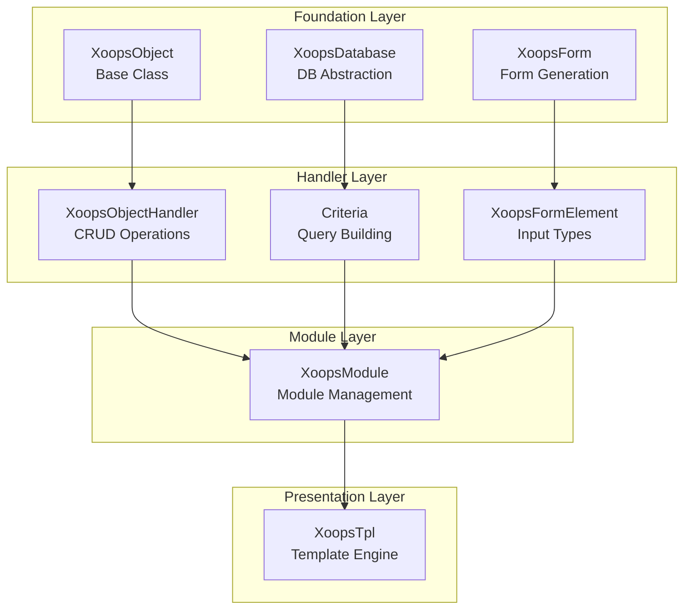
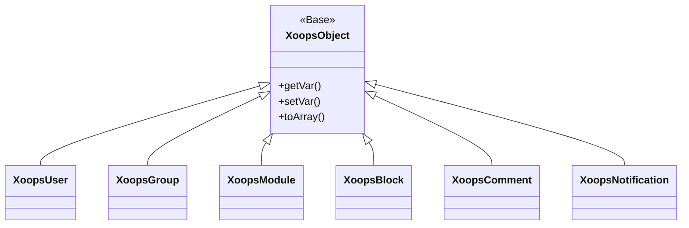
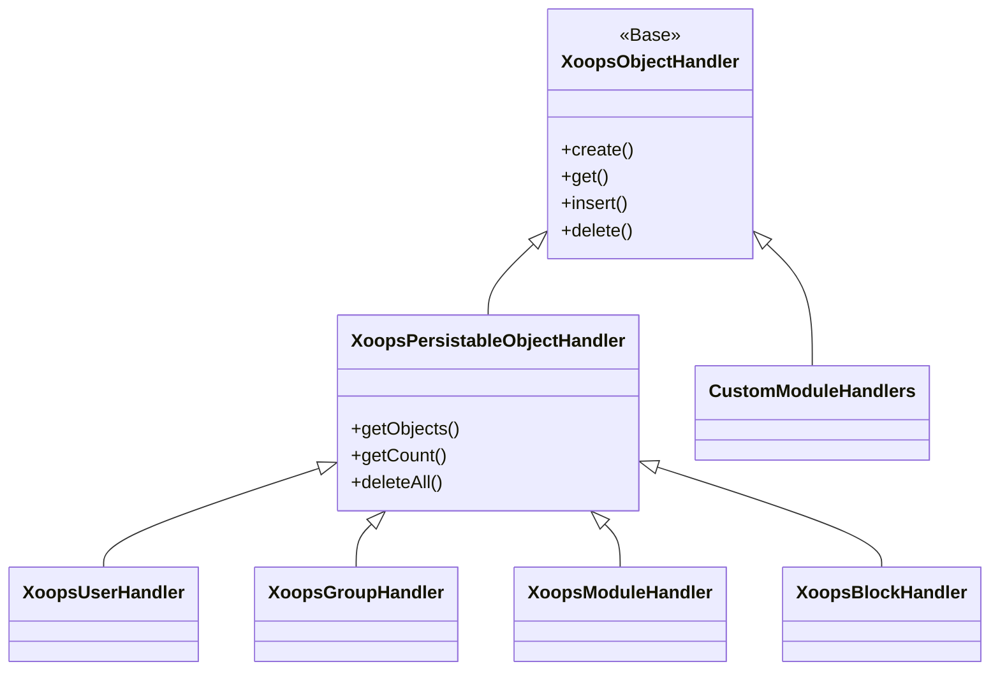
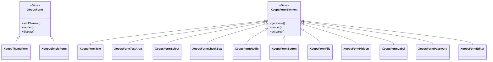

Benvenuto nella documentazione completa del Riferimento API XOOPS. Questa sezione fornisce documentazione dettagliata per tutte le classi core, i metodi e i sistemi che compongono il Sistema di Gestione dei Contenuti XOOPS.

## Panoramica

L'API XOOPS è organizzata in diversi sottosistemi principali, ciascuno responsabile di un aspetto specifico della funzionalità del CMS. Comprendere queste API è essenziale per sviluppare moduli, temi ed estensioni per XOOPS.

## Sezioni API

### Classi Core

Le classi fondamentali su cui si costruiscono tutti gli altri componenti XOOPS.

| Documentazione | Descrizione |
|--------------|-------------|
| XoopsObject | Classe base per tutti gli oggetti dati in XOOPS |
| XoopsObjectHandler | Pattern handler per operazioni CRUD |

### Livello Database

Astrazione del database e utilità di costruzione query.

| Documentazione | Descrizione |
|--------------|-------------|
| XoopsDatabase | Livello di astrazione del database |
| Sistema Criteria | Criteri di query e condizioni |
| QueryBuilder | Costruzione query fluente moderna |

### Sistema Form

Generazione e validazione di form HTML.

| Documentazione | Descrizione |
|--------------|-------------|
| XoopsForm | Contenitore form e rendering |
| Elementi Form | Tutti i tipi di elemento form disponibili |

### Classi Kernel

Componenti di sistema core e servizi.

| Documentazione | Descrizione |
|--------------|-------------|
| Classi Kernel | Kernel di sistema e componenti core |

### Sistema Moduli

Gestione moduli e ciclo di vita.

| Documentazione | Descrizione |
|--------------|-------------|
| Sistema Moduli | Caricamento, installazione e gestione moduli |

### Sistema Template

Integrazione Smarty template.

| Documentazione | Descrizione |
|--------------|-------------|
| Sistema Template | Integrazione Smarty e gestione template |

### Sistema Utenti

Gestione utenti e autenticazione.

| Documentazione | Descrizione |
|--------------|-------------|
| Sistema Utenti | Account utenti, gruppi e permessi |

## Panoramica Architettura



## Gerarchia Classi

### Modello Oggetto



### Modello Handler



### Modello Form



## Pattern di Design

L'API XOOPS implementa diversi pattern di design ben noti:

### Pattern Singleton
Utilizzato per servizi globali come connessioni al database e istanze di contenitori.

```php
$db = XoopsDatabase::getInstance();
$container = XoopsContainer::getInstance();
```

### Pattern Factory
I handler di oggetti creano oggetti di dominio in modo coerente.

```php
$handler = xoops_getHandler('user');
$user = $handler->create();
```

### Pattern Composite
I form contengono più elementi form; i criteri possono contenere criteri annidati.

```php
$criteria = new CriteriaCompo();
$criteria->add(new Criteria('status', 1));
$criteria->add(new CriteriaCompo(...)); // Annidato
```

### Pattern Observer
Il sistema di eventi consente un accoppiamento debole tra moduli.

```php
$dispatcher->addListener('module.news.article_published', $callback);
```

## Esempi di Avvio Rapido

### Creazione e Salvataggio di un Oggetto

```php
// Ottieni l'handler
$handler = xoops_getHandler('user');

// Crea un nuovo oggetto
$user = $handler->create();
$user->setVar('uname', 'newuser');
$user->setVar('email', 'user@example.com');

// Salva nel database
$handler->insert($user);
```

### Query con Criteria

```php
// Crea criteri
$criteria = new CriteriaCompo();
$criteria->add(new Criteria('level', 0, '>'));
$criteria->setSort('uname');
$criteria->setOrder('ASC');
$criteria->setLimit(10);

// Ottieni oggetti
$handler = xoops_getHandler('user');
$users = $handler->getObjects($criteria);
```

### Creazione di un Form

```php
$form = new XoopsThemeForm('Profilo Utente', 'userform', 'save.php', 'post', true);
$form->addElement(new XoopsFormText('Nome Utente', 'uname', 50, 255, $user->getVar('uname')));
$form->addElement(new XoopsFormTextArea('Bio', 'bio', $user->getVar('bio')));
$form->addElement(new XoopsFormButton('', 'submit', _SUBMIT, 'submit'));
echo $form->render();
```

## Convenzioni API

### Convenzioni di Denominazione

| Tipo | Convenzione | Esempio |
|------|-----------|---------|
| Classi | PascalCase | `XoopsUser`, `CriteriaCompo` |
| Metodi | camelCase | `getVar()`, `setVar()` |
| Proprietà | camelCase (protette) | `$_vars`, `$_handler` |
| Costanti | UPPER_SNAKE_CASE | `XOBJ_DTYPE_INT` |
| Tabelle Database | snake_case | `users`, `groups_users_link` |

### Tipi di Dati

XOOPS definisce tipi di dati standard per le variabili di oggetto:

| Costante | Tipo | Descrizione |
|----------|------|-------------|
| `XOBJ_DTYPE_TXTBOX` | String | Input testo (bonificato) |
| `XOBJ_DTYPE_TXTAREA` | String | Contenuto textarea |
| `XOBJ_DTYPE_INT` | Integer | Valori numerici |
| `XOBJ_DTYPE_URL` | String | Validazione URL |
| `XOBJ_DTYPE_EMAIL` | String | Validazione email |
| `XOBJ_DTYPE_ARRAY` | Array | Array serializzati |
| `XOBJ_DTYPE_OTHER` | Mixed | Gestione personalizzata |
| `XOBJ_DTYPE_SOURCE` | String | Codice sorgente (bonifica minima) |
| `XOBJ_DTYPE_STIME` | Integer | Timestamp breve |
| `XOBJ_DTYPE_MTIME` | Integer | Timestamp medio |
| `XOBJ_DTYPE_LTIME` | Integer | Timestamp lungo |

## Metodi di Autenticazione

L'API supporta molteplici metodi di autenticazione:

### Autenticazione API Key
```
X-API-Key: your-api-key
```

### Token OAuth Bearer
```
Authorization: Bearer your-oauth-token
```

### Autenticazione Basata su Sessione
Utilizza la sessione XOOPS esistente quando accedi.

## Endpoint REST API

Quando l'API REST è abilitata:

| Endpoint | Metodo | Descrizione |
|----------|--------|-------------|
| `/api.php/rest/users` | GET | Elenca utenti |
| `/api.php/rest/users/{id}` | GET | Ottieni utente per ID |
| `/api.php/rest/users` | POST | Crea utente |
| `/api.php/rest/users/{id}` | PUT | Aggiorna utente |
| `/api.php/rest/users/{id}` | DELETE | Elimina utente |
| `/api.php/rest/modules` | GET | Elenca moduli |

## Documentazione Correlata

- Guida Sviluppo Moduli
- Guida Sviluppo Temi
- Configurazione Sistema
- Migliori Pratiche di Sicurezza

## Cronologia Versioni

| Versione | Modifiche |
|---------|---------|
| 2.5.11 | Versione stabile attuale |
| 2.5.10 | Aggiunto supporto API GraphQL |
| 2.5.9 | Sistema Criteria migliorato |
| 2.5.8 | Supporto autoloading PSR-4 |

---

*Questa documentazione fa parte della Knowledge Base XOOPS. Per gli ultimi aggiornamenti, visita il [repository GitHub XOOPS](https://github.com/XOOPS).*
