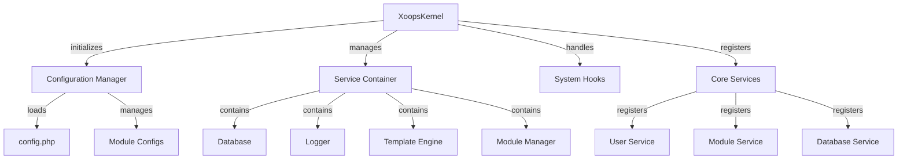

Il Kernel XOOPS fornisce il framework fondamentale per il bootstrapping del sistema, la gestione delle configurazioni, la gestione degli eventi di sistema e l'offerta di utilità di base. Queste classi formano la spina dorsale dell'applicazione XOOPS.

## Architettura di Sistema



## Classe XoopsKernel

La classe kernel principale che inizializza e gestisce il sistema XOOPS.

### Panoramica Classe

```php
namespace Xoops;

class XoopsKernel
{
    private static ?XoopsKernel $instance = null;
    protected ServiceContainer $services;
    protected ConfigurationManager $config;
    protected array $modules = [];
    protected bool $isLoaded = false;
}
```

### Costruttore

```php
private function __construct()
```

Il costruttore privato applica il pattern singleton.

### getInstance

Recupera l'istanza singleton del kernel.

```php
public static function getInstance(): XoopsKernel
```

**Restituisce:** `XoopsKernel` - L'istanza singleton del kernel

**Esempio:**
```php
$kernel = XoopsKernel::getInstance();
```

### Processo di Boot

Il processo di boot del kernel segue questi step:

1. **Inizializzazione** - Imposta gestori errori, definisce costanti
2. **Configurazione** - Carica file di configurazione
3. **Registrazione Servizi** - Registra servizi di base
4. **Rilevamento Moduli** - Scansiona e identifica moduli attivi
5. **Inizializzazione Database** - Connette al database
6. **Pulizia** - Prepara per la gestione delle richieste

```php
public function boot(): void
```

**Esempio:**
```php
$kernel = XoopsKernel::getInstance();
$kernel->boot();
```

### Metodi Service Container

#### registerService

Registra un servizio nel service container.

```php
public function registerService(
    string $name,
    callable|object $definition
): void
```

**Parametri:**

| Parametro | Tipo | Descrizione |
|-----------|------|-------------|
| `$name` | string | Identificatore servizio |
| `$definition` | callable\|object | Factory servizio o istanza |

**Esempio:**
```php
$kernel->registerService('custom.handler', function($c) {
    return new CustomHandler();
});
```

#### getService

Recupera un servizio registrato.

```php
public function getService(string $name): mixed
```

**Parametri:**

| Parametro | Tipo | Descrizione |
|-----------|------|-------------|
| `$name` | string | Identificatore servizio |

**Restituisce:** `mixed` - Il servizio richiesto

**Esempio:**
```php
$database = $kernel->getService('database');
$logger = $kernel->getService('logger');
```

#### hasService

Verifica se un servizio è registrato.

```php
public function hasService(string $name): bool
```

**Esempio:**
```php
if ($kernel->hasService('cache')) {
    $cache = $kernel->getService('cache');
}
```

## Gestore Configurazione

Gestisce la configurazione dell'applicazione e le impostazioni dei moduli.

### Panoramica Classe

```php
namespace Xoops\Core;

class ConfigurationManager
{
    protected array $config = [];
    protected array $defaults = [];
    protected string $configPath;
}
```

### Metodi

#### load

Carica configurazione da file o array.

```php
public function load(string|array $source): void
```

**Parametri:**

| Parametro | Tipo | Descrizione |
|-----------|------|-------------|
| `$source` | string\|array | Percorso file configurazione o array |

**Esempio:**
```php
$config = $kernel->getService('config');
$config->load(XOOPS_ROOT_PATH . '/include/config.php');
$config->load(['sitename' => 'My Site', 'admin_email' => 'admin@example.com']);
```

#### get

Recupera un valore di configurazione.

```php
public function get(string $key, mixed $default = null): mixed
```

**Parametri:**

| Parametro | Tipo | Descrizione |
|-----------|------|-------------|
| `$key` | string | Chiave configurazione (notazione puntata) |
| `$default` | mixed | Valore default se non trovato |

**Restituisce:** `mixed` - Valore di configurazione

**Esempio:**
```php
$siteName = $config->get('sitename');
$adminEmail = $config->get('admin.email', 'admin@example.com');
```

#### set

Imposta un valore di configurazione.

```php
public function set(string $key, mixed $value): void
```

**Parametri:**

| Parametro | Tipo | Descrizione |
|-----------|------|-------------|
| `$key` | string | Chiave configurazione |
| `$value` | mixed | Valore configurazione |

**Esempio:**
```php
$config->set('sitename', 'New Site Name');
$config->set('features.cache_enabled', true);
```

#### getModuleConfig

Ottiene configurazione per un modulo specifico.

```php
public function getModuleConfig(
    string $moduleName
): array
```

**Parametri:**

| Parametro | Tipo | Descrizione |
|-----------|------|-------------|
| `$moduleName` | string | Nome directory modulo |

**Restituisce:** `array` - Array di configurazione modulo

**Esempio:**
```php
$publisherConfig = $config->getModuleConfig('publisher');
```

## Hook di Sistema

Gli hook di sistema permettono ai moduli e plugin di eseguire codice in punti specifici del ciclo di vita dell'applicazione.

### Classe HookManager

```php
namespace Xoops\Core;

class HookManager
{
    protected array $hooks = [];
    protected array $listeners = [];
}
```

### Metodi

#### addHook

Registra un punto hook.

```php
public function addHook(string $name): void
```

**Parametri:**

| Parametro | Tipo | Descrizione |
|-----------|------|-------------|
| `$name` | string | Identificatore hook |

**Esempio:**
```php
$hooks = $kernel->getService('hooks');
$hooks->addHook('system.startup');
$hooks->addHook('user.login');
$hooks->addHook('module.install');
```

#### listen

Allega un listener a un hook.

```php
public function listen(
    string $hookName,
    callable $callback,
    int $priority = 10
): void
```

**Parametri:**

| Parametro | Tipo | Descrizione |
|-----------|------|-------------|
| `$hookName` | string | Identificatore hook |
| `$callback` | callable | Funzione da eseguire |
| `$priority` | int | Priorità esecuzione (superiore eseguito prima) |

**Esempio:**
```php
$hooks->listen('user.login', function($user) {
    error_log('User ' . $user->uname . ' logged in');
}, 10);

$hooks->listen('module.install', function($module) {
    // Custom module installation logic
    echo "Installing " . $module->getName();
}, 5);
```

#### trigger

Esegue tutti i listener per un hook.

```php
public function trigger(
    string $hookName,
    mixed $arguments = null
): array
```

**Parametri:**

| Parametro | Tipo | Descrizione |
|-----------|------|-------------|
| `$hookName` | string | Identificatore hook |
| `$arguments` | mixed | Dati da passare ai listener |

**Restituisce:** `array` - Risultati da tutti i listener

**Esempio:**
```php
$results = $hooks->trigger('system.startup');
$results = $hooks->trigger('user.created', $newUser);
```

## Panoramica Servizi di Base

Il kernel registra diversi servizi di base durante il boot:

| Servizio | Classe | Scopo |
|---------|-------|---------|
| `database` | XoopsDatabase | Livello di astrazione database |
| `config` | ConfigurationManager | Gestione configurazione |
| `logger` | Logger | Logging applicazione |
| `template` | XoopsTpl | Engine template |
| `user` | UserManager | Servizio gestione utenti |
| `module` | ModuleManager | Gestione moduli |
| `cache` | CacheManager | Livello caching |
| `hooks` | HookManager | Hook eventi di sistema |

## Esempio di Utilizzo Completo

```php
<?php
/**
 * Processo di boot modulo personalizzato utilizzando il kernel
 */

// Ottieni istanza kernel
$kernel = XoopsKernel::getInstance();

// Boot del sistema
$kernel->boot();

// Ottieni servizi
$config = $kernel->getService('config');
$database = $kernel->getService('database');
$logger = $kernel->getService('logger');
$hooks = $kernel->getService('hooks');

// Accedi configurazione
$siteName = $config->get('sitename');
$adminEmail = $config->get('admin.email');

// Registra hook specifici del modulo
$hooks->listen('user.login', function($user) {
    // Registra accesso utente
    $logger->info('User login: ' . $user->uname);

    // Traccia in database
    $database->query(
        'INSERT INTO ' . $database->prefix('event_log') .
        ' (type, user_id, message, timestamp) VALUES (?, ?, ?, ?)',
        ['login', $user->uid(), 'User login', time()]
    );
});

$hooks->listen('module.install', function($module) {
    $logger->info('Module installed: ' . $module->getName());
});

// Attiva hook
$hooks->trigger('system.startup');

// Usa servizio database
$result = $database->query(
    'SELECT * FROM ' . $database->prefix('users') .
    ' LIMIT 10'
);

while ($row = $database->fetchArray($result)) {
    echo "User: " . htmlspecialchars($row['uname']) . "\n";
}

// Registra servizio personalizzato
$kernel->registerService('custom.repository', function($c) {
    return new CustomRepository($c->getService('database'));
});

// Accedi successivamente al servizio personalizzato
$repo = $kernel->getService('custom.repository');
```

## Costanti di Base

Il kernel definisce diverse costanti importanti durante il boot:

```php
// Percorsi di sistema
define('XOOPS_ROOT_PATH', '/var/www/xoops');
define('XOOPS_HTDOCS_PATH', XOOPS_ROOT_PATH . '/htdocs');
define('XOOPS_MODULES_PATH', XOOPS_ROOT_PATH . '/htdocs/modules');
define('XOOPS_THEMES_PATH', XOOPS_ROOT_PATH . '/htdocs/themes');

// Percorsi web
define('XOOPS_URL', 'http://example.com');
define('XOOPS_HTDOCS_URL', XOOPS_URL . '/htdocs');

// Database
define('XOOPS_DB_PREFIX', 'xoops_');
```

## Gestione Errori

Il kernel configura gestori errori durante il boot:

```php
// Imposta gestore errore personalizzato
set_error_handler(function($errno, $errstr, $errfile, $errline) {
    $kernel->getService('logger')->error(
        "Error: $errstr in $errfile:$errline"
    );
});

// Imposta gestore eccezione
set_exception_handler(function($exception) {
    $kernel->getService('logger')->critical(
        "Exception: " . $exception->getMessage()
    );
});
```

## Migliori Pratiche

1. **Boot Singolo** - Chiama `boot()` una sola volta durante l'avvio dell'applicazione
2. **Usa Service Container** - Registra e recupera servizi tramite il kernel
3. **Gestisci Hook Presto** - Registra listener hook prima di attivarli
4. **Registra Eventi Importanti** - Usa il servizio logger per il debug
5. **Memorizza Configurazione** - Carica config una volta e riutilizza
6. **Gestisci Errori** - Sempre configura gestori errori prima di elaborare richieste

## Documentazione Correlata

- ../Module/Module-System - Sistema moduli e ciclo di vita
- ../Template/Template-System - Integrazione engine template
- ../User/User-System - Autenticazione e gestione utenti
- ../Database/XoopsDatabase - Livello database

---

*Vedi anche: [Codice Sorgente Kernel XOOPS](https://github.com/XOOPS/XoopsCore27/tree/master/htdocs/class)*
