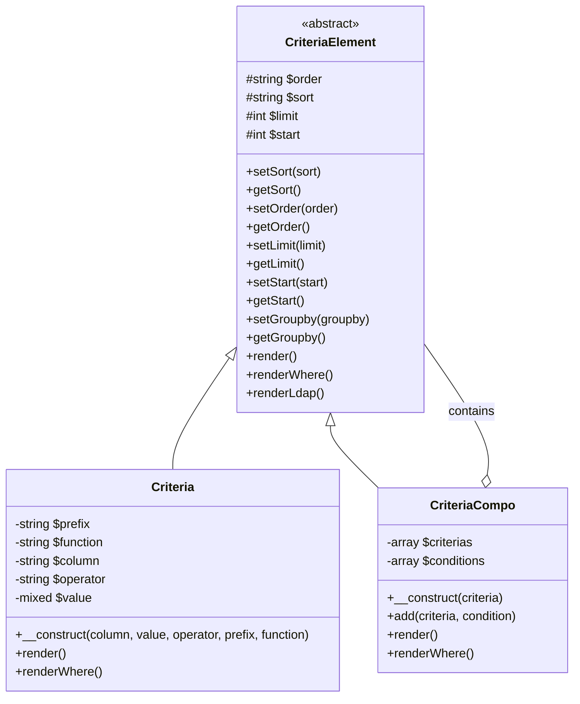
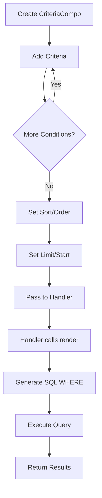
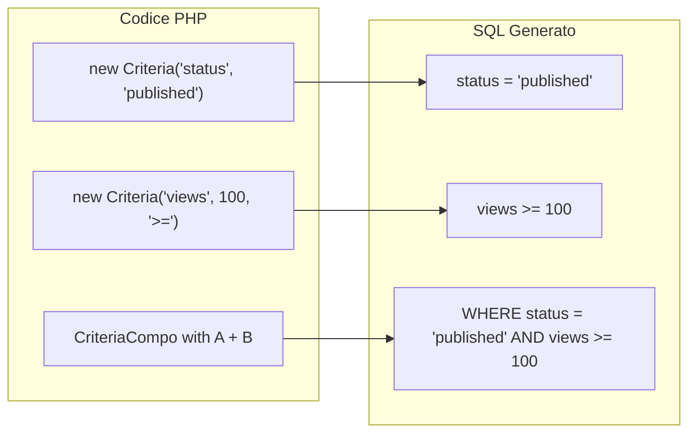
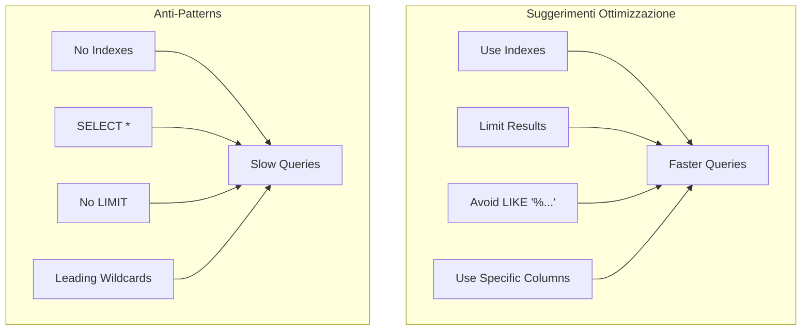

> Documentazione API completa per il sistema di query building Criteria di XOOPS.

---

## Architettura Sistema Criteria



---

## Classe Criteria

### Costruttore

```php
public function __construct(
    string $column,           // Nome colonna
    mixed $value = '',        // Valore da confrontare
    string $operator = '=',   // Operatore confronto
    string $prefix = '',      // Prefisso tabella
    string $function = ''     // Wrapper funzione SQL
)
```

### Operatori

| Operatore | Esempio | Output SQL |
|----------|---------|------------|
| `=` | `new Criteria('status', 1)` | `status = 1` |
| `!=` | `new Criteria('status', 0, '!=')` | `status != 0` |
| `<>` | `new Criteria('status', 0, '<>')` | `status <> 0` |
| `<` | `new Criteria('age', 18, '<')` | `age < 18` |
| `<=` | `new Criteria('age', 18, '<=')` | `age <= 18` |
| `>` | `new Criteria('age', 18, '>')` | `age > 18` |
| `>=` | `new Criteria('age', 18, '>=')` | `age >= 18` |
| `LIKE` | `new Criteria('title', '%php%', 'LIKE')` | `title LIKE '%php%'` |
| `NOT LIKE` | `new Criteria('title', '%spam%', 'NOT LIKE')` | `title NOT LIKE '%spam%'` |
| `IN` | `new Criteria('id', '(1,2,3)', 'IN')` | `id IN (1,2,3)` |
| `NOT IN` | `new Criteria('id', '(1,2,3)', 'NOT IN')` | `id NOT IN (1,2,3)` |
| `IS NULL` | `new Criteria('deleted', null, 'IS NULL')` | `deleted IS NULL` |
| `IS NOT NULL` | `new Criteria('email', null, 'IS NOT NULL')` | `email IS NOT NULL` |
| `BETWEEN` | `new Criteria('created', '1000 AND 2000', 'BETWEEN')` | `created BETWEEN 1000 AND 2000` |

### Esempi di Utilizzo

```php
// Uguaglianza semplice
$criteria = new Criteria('status', 'published');

// Confronto numerico
$criteria = new Criteria('views', 100, '>=');

// Pattern matching
$criteria = new Criteria('title', '%XOOPS%', 'LIKE');

// Con prefisso tabella
$criteria = new Criteria('uid', 1, '=', 'u');
// Renderizza: u.uid = 1

// Con funzione SQL
$criteria = new Criteria('title', '', '!=', '', 'LOWER');
// Renderizza: LOWER(title) != ''
```

---

## Classe CriteriaCompo

### Costruttore & Metodi

```php
// Crea compo vuoto
$criteria = new CriteriaCompo();

// O con criteria iniziale
$criteria = new CriteriaCompo(new Criteria('status', 'active'));

// Aggiungi criteria (AND di default)
$criteria->add(new Criteria('views', 10, '>='));

// Aggiungi con OR
$criteria->add(new Criteria('featured', 1), 'OR');

// Annidamento
$subCriteria = new CriteriaCompo();
$subCriteria->add(new Criteria('author', 1));
$subCriteria->add(new Criteria('author', 2), 'OR');
$criteria->add($subCriteria); // (author = 1 OR author = 2)
```

### Ordinamento e Paginazione

```php
$criteria = new CriteriaCompo();
$criteria->add(new Criteria('status', 'published'));

// Ordinamento singolo
$criteria->setSort('created');
$criteria->setOrder('DESC');

// Più colonne ordinamento
$criteria->setSort('category_id, created');
$criteria->setOrder('ASC, DESC');

// Paginazione
$criteria->setLimit(10);    // Elementi per pagina
$criteria->setStart(0);     // Offset (pagina * limite)

// Group by
$criteria->setGroupby('category_id');
```

---

## Flusso Query Building



---

## Esempi Query Complesse

### Ricerca con Più Condizioni

```php
$criteria = new CriteriaCompo();

// Lo stato deve essere pubblicato
$criteria->add(new Criteria('status', 'published'));

// La categoria è 1, 2, o 3
$criteria->add(new Criteria('category_id', '(1, 2, 3)', 'IN'));

// Creato negli ultimi 30 giorni
$thirtyDaysAgo = time() - (30 * 24 * 60 * 60);
$criteria->add(new Criteria('created', $thirtyDaysAgo, '>='));

// Termine ricerca in titolo O contenuto
$searchCriteria = new CriteriaCompo();
$searchCriteria->add(new Criteria('title', '%' . $searchTerm . '%', 'LIKE'));
$searchCriteria->add(new Criteria('content', '%' . $searchTerm . '%', 'LIKE'), 'OR');
$criteria->add($searchCriteria);

// Ordina per visualizzazioni decrescente
$criteria->setSort('views');
$criteria->setOrder('DESC');

// Pagina
$criteria->setLimit($perPage);
$criteria->setStart($page * $perPage);

// Esegui
$items = $itemHandler->getObjects($criteria);
$total = $itemHandler->getCount($criteria);
```

### Query Intervallo Data

```php
$criteria = new CriteriaCompo();

// Tra due date
$startDate = strtotime('2024-01-01');
$endDate = strtotime('2024-12-31');

$criteria->add(new Criteria('created', $startDate, '>='));
$criteria->add(new Criteria('created', $endDate, '<='));

// O usando BETWEEN
$criteria->add(new Criteria('created', "$startDate AND $endDate", 'BETWEEN'));
```

### Filtro Permesso Utente

```php
$criteria = new CriteriaCompo();
$criteria->add(new Criteria('status', 'published'));

// Se non admin, mostra solo elementi propri o pubblici
if (!$xoopsUser || !$xoopsUser->isAdmin()) {
    $permCriteria = new CriteriaCompo();
    $permCriteria->add(new Criteria('visibility', 'public'));

    if (is_object($xoopsUser)) {
        $permCriteria->add(new Criteria('author_id', $xoopsUser->getVar('uid')), 'OR');
    }

    $criteria->add($permCriteria);
}
```

### Query Simile a Join

```php
// Ottieni elementi dove categoria è attiva
// (Usando approccio subquery)
$categoryHandler = xoops_getHandler('category');
$activeCatCriteria = new Criteria('status', 'active');
$activeCategories = $categoryHandler->getIds($activeCatCriteria);

if (!empty($activeCategories)) {
    $criteria->add(new Criteria('category_id', '(' . implode(',', $activeCategories) . ')', 'IN'));
}
```

---

## Visualizzazione Criteria a SQL



---

## Integrazione Handler

```php
// Metodi handler standard che accettano Criteria

// Ottieni più oggetti
$objects = $handler->getObjects($criteria);
$objects = $handler->getObjects($criteria, true);  // Come array
$objects = $handler->getObjects($criteria, true, true); // Come array, id come chiave

// Ottieni conteggio
$count = $handler->getCount($criteria);

// Ottieni lista (id => identificatore)
$list = $handler->getList($criteria);

// Cancella corrispondenti
$deleted = $handler->deleteAll($criteria);

// Aggiorna corrispondenti
$handler->updateAll('status', 'archived', $criteria);
```

---

## Considerazioni Performance



### Migliori Pratiche

1. **Sempre imposta LIMIT** per tabelle grandi
2. **Usa indici** su colonne utilizzate in criteria
3. **Evita wildcard iniziali** in LIKE (`'%term'` è lento)
4. **Pre-filtro in PHP** quando possibile per logica complessa
5. **Usa COUNT con parsimonia** - memorizza in cache risultati quando possibile

---

## Documentazione Correlata

- Database Layer
- API XoopsObjectHandler
- Prevenzione SQL Injection

---

#xoops #api #criteria #database #query #reference
