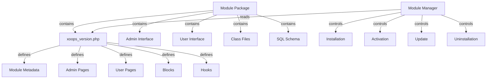

Il Sistema Moduli XOOPS fornisce un framework completo per sviluppare, installare, gestire e estendere la funzionalità dei moduli. I moduli sono pacchetti auto-contenuti che estendono XOOPS con funzionalità e capacità aggiuntive.

## Architettura Moduli



## Struttura Moduli

Struttura directory standard modulo XOOPS:

```
mymodule/
├── xoops_version.php          # Manifest e configurazione modulo
├── admin.php                  # Pagina principale admin
├── index.php                  # Pagina principale utente
├── admin/                     # Directory pagine admin
│   ├── main.php
│   ├── manage.php
│   └── settings.php
├── class/                     # Classi modulo
│   ├── Handler/
│   │   ├── ItemHandler.php
│   │   └── CategoryHandler.php
│   └── Objects/
│       ├── Item.php
│       └── Category.php
├── sql/                       # Schemi database
│   ├── mysql.sql
│   └── postgres.sql
├── include/                   # File include
│   ├── common.inc.php
│   └── functions.php
├── templates/                 # Template modulo
│   ├── admin/
│   │   └── main.tpl
│   └── user/
│       ├── index.tpl
│       └── item.tpl
├── blocks/                    # Block modulo
│   └── blocks.php
├── tests/                     # Unit test
├── language/                  # File lingua
│   ├── english/
│   │   └── main.php
│   └── spanish/
│       └── main.php
└── docs/                      # Documentazione
```

## Classe XoopsModule

La classe XoopsModule rappresenta un modulo XOOPS installato.

### Panoramica Classe

```php
namespace Xoops\Core\Module;

class XoopsModule extends XoopsObject
{
    protected int $moduleid = 0;
    protected string $name = '';
    protected string $dirname = '';
    protected string $version = '';
    protected string $description = '';
    protected array $config = [];
    protected array $blocks = [];
    protected array $adminPages = [];
    protected array $userPages = [];
}
```

### Proprietà

| Proprietà | Tipo | Descrizione |
|----------|------|-------------|
| `$moduleid` | int | ID modulo univoco |
| `$name` | string | Nome visualizzazione modulo |
| `$dirname` | string | Nome directory modulo |
| `$version` | string | Versione modulo corrente |
| `$description` | string | Descrizione modulo |
| `$config` | array | Configurazione modulo |
| `$blocks` | array | Block modulo |
| `$adminPages` | array | Pagine pannello admin |
| `$userPages` | array | Pagine rivolte agli utenti |

### Costruttore

```php
public function __construct()
```

Crea una nuova istanza modulo e inizializza le variabili.

### Metodi di Base

#### getName

Ottiene il nome visualizzazione del modulo.

```php
public function getName(): string
```

**Restituisce:** `string` - Nome visualizzazione modulo

**Esempio:**
```php
$module = new XoopsModule();
$module->setVar('name', 'Publisher');
echo $module->getName(); // "Publisher"
```

#### getDirname

Ottiene il nome directory del modulo.

```php
public function getDirname(): string
```

**Restituisce:** `string` - Nome directory modulo

**Esempio:**
```php
echo $module->getDirname(); // "publisher"
```

#### getVersion

Ottiene la versione modulo corrente.

```php
public function getVersion(): string
```

**Restituisce:** `string` - Stringa versione

**Esempio:**
```php
echo $module->getVersion(); // "2.1.0"
```

#### getDescription

Ottiene la descrizione del modulo.

```php
public function getDescription(): string
```

**Restituisce:** `string` - Descrizione modulo

**Esempio:**
```php
$desc = $module->getDescription();
```

#### getConfig

Recupera configurazione modulo.

```php
public function getConfig(string $key = null): mixed
```

**Parametri:**

| Parametro | Tipo | Descrizione |
|-----------|------|-------------|
| `$key` | string | Chiave configurazione (null per tutto) |

**Restituisce:** `mixed` - Valore configurazione o array

**Esempio:**
```php
$config = $module->getConfig();
$itemsPerPage = $module->getConfig('items_per_page');
```

#### setConfig

Imposta configurazione modulo.

```php
public function setConfig(string $key, mixed $value): void
```

**Parametri:**

| Parametro | Tipo | Descrizione |
|-----------|------|-------------|
| `$key` | string | Chiave configurazione |
| `$value` | mixed | Valore configurazione |

**Esempio:**
```php
$module->setConfig('items_per_page', 20);
$module->setConfig('enable_cache', true);
```

#### getPath

Ottiene il percorso file system completo del modulo.

```php
public function getPath(): string
```

**Restituisce:** `string` - Percorso directory modulo assoluto

**Esempio:**
```php
$path = $module->getPath(); // "/var/www/xoops/modules/publisher"
$classPath = $module->getPath() . '/class';
```

#### getUrl

Ottiene l'URL del modulo.

```php
public function getUrl(): string
```

**Restituisce:** `string` - URL modulo

**Esempio:**
```php
$url = $module->getUrl(); // "http://example.com/modules/publisher"
```

## Processo Installazione Moduli

### Funzione xoops_module_install

La funzione installazione modulo definita in `xoops_version.php`:

```php
function xoops_module_install_modulename($module)
{
    // $module è un'istanza XoopsModule

    // Crea tabelle database
    // Inizializza configurazione default
    // Crea cartelle default
    // Imposta permessi file

    return true; // Successo
}
```

**Parametri:**

| Parametro | Tipo | Descrizione |
|-----------|------|-------------|
| `$module` | XoopsModule | Il modulo che si sta installando |

**Restituisce:** `bool` - True su successo, false su fallimento

**Esempio:**
```php
function xoops_module_install_publisher($module)
{
    // Ottieni percorso modulo
    $modulePath = $module->getPath();

    // Crea directory caricamenti
    $uploadsPath = XOOPS_ROOT_PATH . '/uploads/publisher';
    if (!is_dir($uploadsPath)) {
        mkdir($uploadsPath, 0755, true);
    }

    // Ottieni connessione database
    global $xoopsDB;

    // Esegui script installazione SQL
    $sqlFile = $modulePath . '/sql/mysql.sql';
    if (file_exists($sqlFile)) {
        $sqlQueries = file_get_contents($sqlFile);
        // Esegui query (semplificato)
        $xoopsDB->queryFromFile($sqlFile);
    }

    // Imposta configurazione default
    $module->setConfig('items_per_page', 10);
    $module->setConfig('enable_comments', true);

    return true;
}
```

### Funzione xoops_module_uninstall

La funzione disinstallazione modulo:

```php
function xoops_module_uninstall_modulename($module)
{
    // Elimina tabelle database
    // Rimuovi file caricati
    // Pulisci configurazione

    return true;
}
```

**Esempio:**
```php
function xoops_module_uninstall_publisher($module)
{
    global $xoopsDB;

    // Elimina tabelle
    $tables = ['publisher_items', 'publisher_categories', 'publisher_comments'];
    foreach ($tables as $table) {
        $xoopsDB->query('DROP TABLE IF EXISTS ' . $xoopsDB->prefix($table));
    }

    // Rimuovi cartella caricamenti
    $uploadsPath = XOOPS_ROOT_PATH . '/uploads/publisher';
    if (is_dir($uploadsPath)) {
        // Cancellazione directory ricorsiva
        $this->recursiveRemoveDir($uploadsPath);
    }

    return true;
}
```

## Hook Moduli

Gli hook moduli permettono ai moduli di integrarsi con altri moduli e il sistema.

### Dichiarazione Hook

In `xoops_version.php`:

```php
$modversion['hooks'] = [
    'system.page.footer' => [
        'function' => 'publisher_page_footer'
    ],
    'user.profile.view' => [
        'function' => 'publisher_user_articles'
    ],
];
```

### Implementazione Hook

```php
// In un file modulo (es. include/hooks.php)

function publisher_page_footer()
{
    // Restituisci HTML per footer
    return '<div class="publisher-footer">Publisher Footer Content</div>';
}

function publisher_user_articles($user_id)
{
    global $xoopsDB;

    // Ottieni articoli utente
    $result = $xoopsDB->query(
        'SELECT * FROM ' . $xoopsDB->prefix('publisher_articles') .
        ' WHERE author_id = ? ORDER BY published DESC LIMIT 5',
        [$user_id]
    );

    $articles = [];
    while ($row = $xoopsDB->fetchAssoc($result)) {
        $articles[] = $row;
    }

    return $articles;
}
```

### Hook di Sistema Disponibili

| Hook | Parametri | Descrizione |
|------|-----------|-------------|
| `system.page.header` | Nessuno | Output intestazione pagina |
| `system.page.footer` | Nessuno | Output piè di pagina |
| `user.login.success` | oggetto $user | Dopo login utente |
| `user.logout` | oggetto $user | Dopo logout utente |
| `user.profile.view` | $user_id | Visualizzazione profilo utente |
| `module.install` | oggetto $module | Installazione modulo |
| `module.uninstall` | oggetto $module | Disinstallazione modulo |

## Servizio Gestore Moduli

Il servizio ModuleManager gestisce le operazioni modulo.

### Metodi

#### getModule

Recupera un modulo per nome.

```php
public function getModule(string $dirname): ?XoopsModule
```

**Parametri:**

| Parametro | Tipo | Descrizione |
|-----------|------|-------------|
| `$dirname` | string | Nome directory modulo |

**Restituisce:** `?XoopsModule` - Istanza modulo o null

**Esempio:**
```php
$moduleManager = $kernel->getService('module');
$publisher = $moduleManager->getModule('publisher');
if ($publisher) {
    echo $publisher->getName();
}
```

#### getAllModules

Ottiene tutti i moduli installati.

```php
public function getAllModules(bool $activeOnly = true): array
```

**Parametri:**

| Parametro | Tipo | Descrizione |
|-----------|------|-------------|
| `$activeOnly` | bool | Solo restituisci moduli attivi |

**Restituisce:** `array` - Array di oggetti XoopsModule

**Esempio:**
```php
$activeModules = $moduleManager->getAllModules(true);
foreach ($activeModules as $module) {
    echo $module->getName() . " - " . $module->getVersion() . "\n";
}
```

#### isModuleActive

Verifica se un modulo è attivo.

```php
public function isModuleActive(string $dirname): bool
```

**Esempio:**
```php
if ($moduleManager->isModuleActive('publisher')) {
    // Modulo Publisher è attivo
}
```

#### activateModule

Attiva un modulo.

```php
public function activateModule(string $dirname): bool
```

**Esempio:**
```php
if ($moduleManager->activateModule('publisher')) {
    echo "Publisher attivato";
}
```

#### deactivateModule

Disattiva un modulo.

```php
public function deactivateModule(string $dirname): bool
```

**Esempio:**
```php
if ($moduleManager->deactivateModule('publisher')) {
    echo "Publisher disattivato";
}
```

## Configurazione Moduli (xoops_version.php)

Esempio manifest modulo completo:

```php
<?php
/**
 * Manifest modulo per Publisher
 */

$modversion = [
    'name' => 'Publisher',
    'version' => '2.1.0',
    'description' => 'Professional content publishing module',
    'author' => 'XOOPS Community',
    'credits' => 'Based on original work by...',
    'license' => 'GPL v2',
    'official' => 1,
    'image' => 'images/logo.png',
    'dirname' => 'publisher',
    'onInstall' => 'xoops_module_install_publisher',
    'onUpdate' => 'xoops_module_update_publisher',
    'onUninstall' => 'xoops_module_uninstall_publisher',

    // Pagine admin
    'hasAdmin' => 1,
    'adminindex' => 'admin/main.php',
    'adminmenu' => [
        [
            'title' => 'Dashboard',
            'link' => 'admin/main.php',
            'icon' => 'dashboard.png'
        ],
        [
            'title' => 'Manage Items',
            'link' => 'admin/items.php',
            'icon' => 'items.png'
        ],
        [
            'title' => 'Settings',
            'link' => 'admin/settings.php',
            'icon' => 'settings.png'
        ]
    ],

    // Pagine utente
    'hasMain' => 1,
    'main_file' => 'index.php',

    // Block
    'blocks' => [
        [
            'file' => 'blocks/recent.php',
            'name' => 'Recent Articles',
            'description' => 'Display recent published articles',
            'show_func' => 'publisher_recent_show',
            'edit_func' => 'publisher_recent_edit',
            'options' => '5|0|0',
            'template' => 'publisher_block_recent.tpl'
        ],
        [
            'file' => 'blocks/featured.php',
            'name' => 'Featured Articles',
            'description' => 'Display featured articles',
            'show_func' => 'publisher_featured_show',
            'edit_func' => 'publisher_featured_edit'
        ]
    ],

    // Hook moduli
    'hooks' => [
        'system.page.footer' => [
            'function' => 'publisher_page_footer'
        ],
        'user.profile.view' => [
            'function' => 'publisher_user_articles'
        ]
    ],

    // Elemento configurazione
    'config' => [
        [
            'name' => 'items_per_page',
            'title' => '_MI_PUBLISHER_ITEMS_PER_PAGE',
            'description' => '_MI_PUBLISHER_ITEMS_PER_PAGE_DESC',
            'formtype' => 'text',
            'valuetype' => 'int',
            'default' => '10'
        ],
        [
            'name' => 'enable_comments',
            'title' => '_MI_PUBLISHER_ENABLE_COMMENTS',
            'description' => '_MI_PUBLISHER_ENABLE_COMMENTS_DESC',
            'formtype' => 'yesno',
            'valuetype' => 'int',
            'default' => '1'
        ]
    ]
];

function xoops_module_install_publisher($module)
{
    // Logica installazione
    return true;
}

function xoops_module_update_publisher($module)
{
    // Logica aggiornamento
    return true;
}

function xoops_module_uninstall_publisher($module)
{
    // Logica disinstallazione
    return true;
}
```

## Migliori Pratiche

1. **Metti in Namespace le Tue Classi** - Usa namespace specifici del modulo per evitare conflitti

2. **Usa Handler** - Usa sempre classi handler per operazioni database

3. **Internazionalizza i Contenuti** - Usa costanti lingua per tutte le stringhe visibili agli utenti

4. **Crea Script Installazione** - Fornisci schemi SQL per tabelle database

5. **Documenta gli Hook** - Documenta chiaramente quali hook il tuo modulo fornisce

6. **Versiona il Tuo Modulo** - Incrementa numeri versione con rilasci

7. **Testa l'Installazione** - Testa approfonditamente i processi installazione/disinstallazione

8. **Gestisci Permessi** - Verifica i permessi utente prima di consentire azioni

## Esempio Modulo Completo

```php
<?php
/**
 * Pagina Principale Modulo Articolo Personalizzato
 */

include __DIR__ . '/include/common.inc.php';

// Ottieni istanza modulo
$module = xoops_getModuleByDirname('mymodule');

// Verifica se modulo è attivo
if (!$module) {
    die('Module not found');
}

// Ottieni configurazione modulo
$itemsPerPage = $module->getConfig('items_per_page');

// Ottieni item handler
$itemHandler = xoops_getModuleHandler('item', 'mymodule');

// Recupera elementi con paginazione
$criteria = new CriteriaCompo();
$criteria->add(new Criteria('status', 1));
$items = $itemHandler->getObjects($criteria, $itemsPerPage);

// Prepara template
$xoopsTpl->assign('items', $items);
$xoopsTpl->assign('module_name', $module->getName());
$xoopsTpl->display($module->getPath() . '/templates/user/index.tpl');
```

## Documentazione Correlata

- ../Kernel/Kernel-Classes - Inizializzazione kernel e servizi di base
- ../Template/Template-System - Template moduli e integrazione tema
- ../Database/QueryBuilder - Query building database
- ../Core/XoopsObject - Classe oggetto base

---

*Vedi anche: [Guida Sviluppo Moduli XOOPS](https://github.com/XOOPS/XoopsCore27/wiki/Module-Development)*
