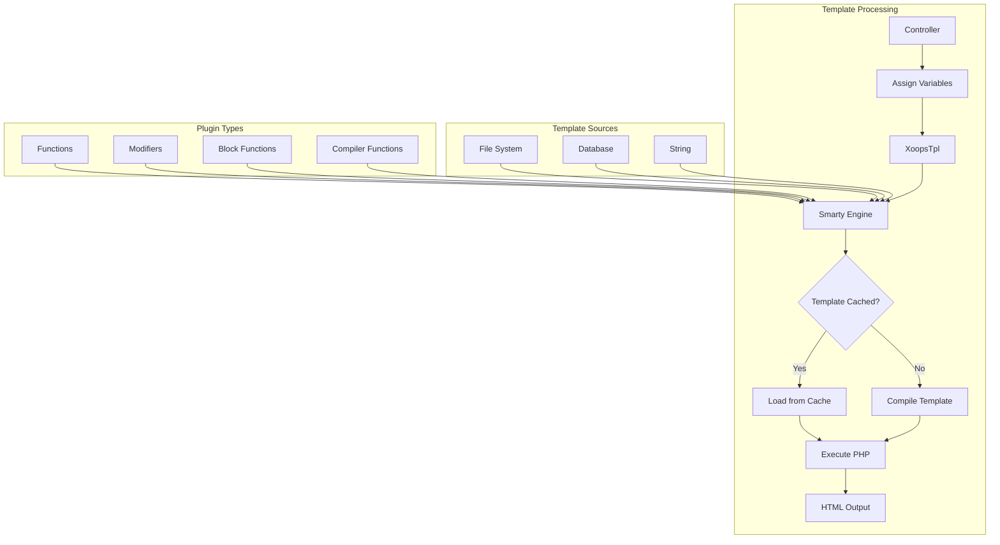
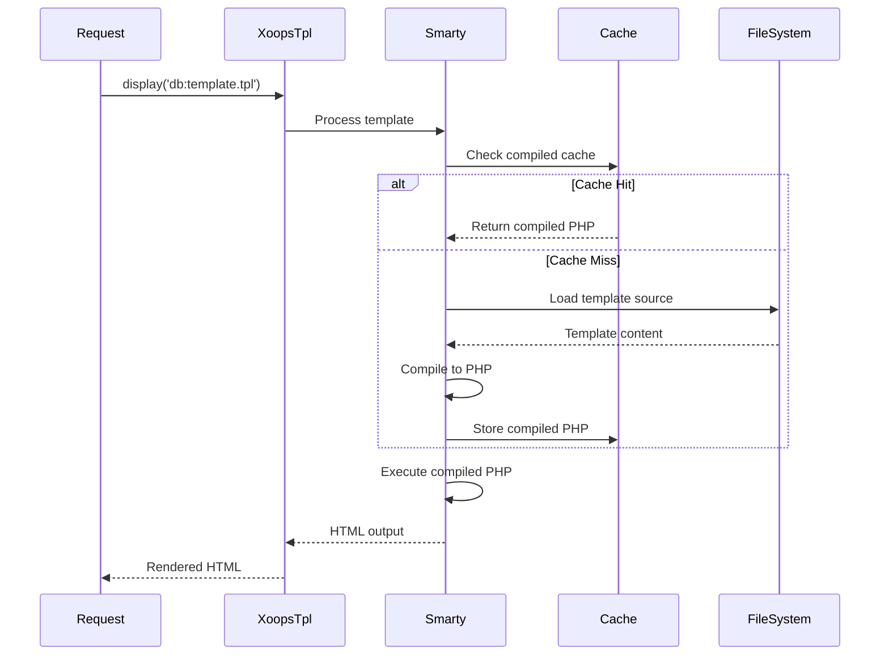
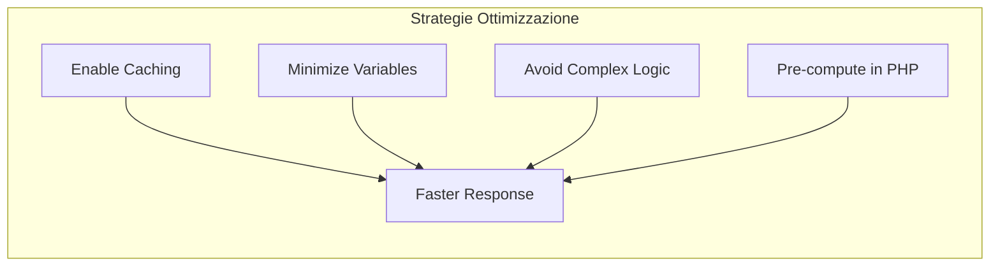

> Documentazione API completa per il templating Smarty in XOOPS.

---

## Architettura Template Engine



---

## Classe XoopsTpl

### Inizializzazione

```php
// Oggetto template globale
global $xoopsTpl;

// O ottieni nuova istanza
$tpl = new XoopsTpl();

// Disponibile nei moduli
$GLOBALS['xoopsTpl']->assign('myvar', $value);
```

### Metodi di Base

| Metodo | Parametri | Descrizione |
|--------|------------|-------------|
| `assign` | `string $name, mixed $value` | Assegna variabile a template |
| `assignByRef` | `string $name, mixed &$value` | Assegna per riferimento |
| `append` | `string $name, mixed $value, bool $merge = false` | Aggiungi a variabile array |
| `display` | `string $template` | Renderizza e mostra template |
| `fetch` | `string $template` | Renderizza e restituisci template |
| `clearAssign` | `string $name` | Cancella variabile assegnata |
| `clearAllAssign` | - | Cancella tutte le variabili |
| `getTemplateVars` | `string $name = null` | Ottieni variabili assegnate |
| `templateExists` | `string $template` | Verifica se template esiste |
| `isCached` | `string $template` | Verifica se template è memorizzato in cache |
| `clearCache` | `string $template = null` | Cancella cache template |

### Assegnazione Variabili

```php
// Assegnazione semplice
$xoopsTpl->assign('title', 'My Page Title');
$xoopsTpl->assign('count', 42);
$xoopsTpl->assign('is_admin', true);

// Assegnazione array
$xoopsTpl->assign('items', [
    ['id' => 1, 'name' => 'Item 1'],
    ['id' => 2, 'name' => 'Item 2'],
]);

// Assegnazione oggetto
$xoopsTpl->assign('user', $xoopsUser);

// Assegnazioni multiple
$xoopsTpl->assign([
    'title' => 'My Title',
    'content' => 'My Content',
    'author' => 'John Doe'
]);

// Aggiungi a array
$xoopsTpl->append('items', ['id' => 3, 'name' => 'Item 3']);
```

### Caricamento Template

```php
// Da database (compilato)
$xoopsTpl->display('db:mymodule_index.tpl');

// Da file system
$xoopsTpl->display('file:' . XOOPS_ROOT_PATH . '/modules/mymodule/templates/custom.tpl');

// Recupera senza output
$html = $xoopsTpl->fetch('db:mymodule_item.tpl');

// Da stringa
$template = '<h1>{$title}</h1><p>{$content}</p>';
$html = $xoopsTpl->fetch('string:' . $template);
```

---

## Riferimento Sintassi Smarty

### Variabili

```smarty
{* Variabile semplice *}
<{$title}>

{* Accesso array *}
<{$item.name}>
<{$item['name']}>

{* Proprietà oggetto *}
<{$user->name}>
<{$user->getVar('uname')}>

{* Variabile config *}
<{$xoops_sitename}>

{* Costante *}
<{$smarty.const._MD_MYMODULE_TITLE}>

{* Variabili server *}
<{$smarty.server.REQUEST_URI}>
<{$smarty.get.id}>
<{$smarty.post.name}>
```

### Modificatori

```smarty
{* Modificatori stringhe *}
<{$title|upper}>
<{$title|lower}>
<{$title|capitalize}>
<{$title|truncate:50:"..."}>
<{$content|strip_tags}>
<{$content|nl2br}>
<{$text|escape:'html'}>
<{$text|escape:'url'}>

{* Formattazione data *}
<{$timestamp|date_format:"%Y-%m-%d"}>
<{$timestamp|date_format:"%B %e, %Y"}>

{* Formattazione numero *}
<{$price|number_format:2:".":","}>

{* Valore default *}
<{$optional|default:"N/A"}>

{* Modificatori concatenati *}
<{$title|strip_tags|truncate:50|escape}>

{* Conta array *}
<{$items|@count}>
```

### Strutture Controllo

```smarty
{* If/else *}
<{if $is_admin}>
    <p>Admin content</p>
<{elseif $is_moderator}>
    <p>Moderator content</p>
<{else}>
    <p>User content</p>
<{/if}>

{* Loop foreach *}
<{foreach from=$items item=item key=key}>
    <li><{$key}>: <{$item.name}></li>
<{/foreach}>

{* Foreach con proprietà *}
<{foreach from=$items item=item name=itemLoop}>
    <{if $smarty.foreach.itemLoop.first}>
        <ul>
    <{/if}>

    <li class="<{if $smarty.foreach.itemLoop.iteration is odd}>odd<{else}>even<{/if}>">
        <{$smarty.foreach.itemLoop.iteration}>. <{$item.name}>
    </li>

    <{if $smarty.foreach.itemLoop.last}>
        </ul>
        <p>Total: <{$smarty.foreach.itemLoop.total}></p>
    <{/if}>
<{/foreach}>

{* Loop for *}
<{for $i=1 to 10}>
    <{$i}>
<{/for}>

{* Loop while *}
<{while $count < 10}>
    <{$count}>
    <{$count = $count + 1}>
<{/while}>
```

### Include

```smarty
{* Includi un altro template *}
<{include file="db:mymodule_header.tpl"}>

{* Includi con variabili *}
<{include file="db:mymodule_item.tpl" item=$currentItem showAuthor=true}>

{* Includi da tema *}
<{include file="$theme_template_set/header.tpl"}>
```

### Commenti

```smarty
{* Questo è un commento Smarty - non renderizzato in output *}

{*
    Commento su più righe
    che spiega il template
*}
```

---

## Funzioni Specifiche XOOPS

### Rendering Block

```smarty
{* Renderizza block per ID *}
<{xoBlock id=5}>

{* Renderizza block per nome *}
<{xoBlock name="mymodule_recent"}>

{* Renderizza tutti i block in posizione *}
<{foreach item=block from=$xoBlocks.canvas_left}>
    <div class="block">
        <h3><{$block.title}></h3>
        <{$block.content}>
    </div>
<{/foreach}>
```

### Gestione Immagini e Risorse

```smarty
{* Immagine modulo *}
/modules/<{$xoops_dirname}>/assets/images/logo.png">

{* Immagine tema *}
icon.png">

{* Directory caricamenti *}
/<{$item.image}>">
```

### Generazione URL

```smarty
{* URL modulo *}
<a href="<{$xoops_url}>/modules/<{$xoops_dirname}>/item.php?id=<{$item.id}>">
    <{$item.title}>
</a>

{* Con URL SEO-friendly (se abilitato) *}
<a href="<{$item.url}>"><{$item.title}></a>
```

---

## Flusso Compilazione Template



---

## Plugin Smarty Personalizzati

### Plugin Funzione

```php
// plugins/function.myfunction.php
function smarty_function_myfunction($params, $smarty)
{
    $name = $params['name'] ?? 'World';
    return "Hello, {$name}!";
}

// Utilizzo in template:
// <{myfunction name="John"}>
```

### Plugin Modificatore

```php
// plugins/modifier.timeago.php
function smarty_modifier_timeago($timestamp)
{
    $diff = time() - $timestamp;

    if ($diff < 60) {
        return 'just now';
    } elseif ($diff < 3600) {
        $mins = floor($diff / 60);
        return "{$mins} minute(s) ago";
    } elseif ($diff < 86400) {
        $hours = floor($diff / 3600);
        return "{$hours} hour(s) ago";
    } else {
        $days = floor($diff / 86400);
        return "{$days} day(s) ago";
    }
}

// Utilizzo in template:
// <{$item.created|timeago}>
```

### Plugin Block

```php
// plugins/block.cache.php
function smarty_block_cache($params, $content, $smarty, &$repeat)
{
    if ($repeat) {
        // Opening tag
        return '';
    } else {
        // Closing tag - process content
        $ttl = $params['ttl'] ?? 3600;
        $key = md5($content);

        // Check cache...
        return $content;
    }
}

// Utilizzo in template:
// <{cache ttl=3600}>
//     Expensive content here
// <{/cache}>
```

---

## Suggerimenti Performance



### Migliori Pratiche

1. **Abilita caching template** in produzione
2. **Assegna solo variabili necessarie** - non passare interi oggetti
3. **Usa modificatori con parsimonia** - pre-formatta in PHP quando possibile
4. **Evita loop annidati** - ristruttura i dati in PHP
5. **Memorizza in cache block costosi** - usa block caching per query complesse

---

## Documentazione Correlata

- Nozioni Base Smarty
- Sviluppo Tema
- Migrazione Smarty 4

---

#xoops #api #smarty #templates #reference
