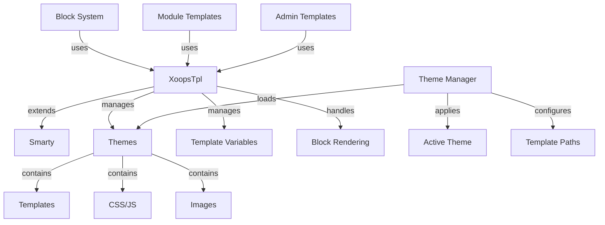

Il Sistema Template XOOPS è costruito sul potente engine template Smarty, fornendo un modo flessibile ed estensibile per separare la logica di presentazione dalla logica di business. Gestisce tema, rendering template, assegnazione variabili e generazione contenuto dinamico.

## Architettura Template



## Classe XoopsTpl

La classe principale template engine che estende Smarty.

### Panoramica Classe

```php
namespace Xoops\Core;

class XoopsTpl extends Smarty
{
    protected array $vars = [];
    protected string $currentTheme = '';
    protected array $blocks = [];
    protected bool $isAdmin = false;
}
```

### Estensione di Smarty

```php
use Xoops\Core\XoopsTpl;

class XoopsTpl extends Smarty
{
    private static ?XoopsTpl $instance = null;

    private function __construct()
    {
        parent::__construct();
        $this->configureDirectories();
        $this->registerPlugins();
    }

    public static function getInstance(): XoopsTpl
    {
        if (!isset(self::$instance)) {
            self::$instance = new self();
        }
        return self::$instance;
    }
}
```

### Metodi di Base

#### getInstance

Ottiene l'istanza singleton del template.

```php
public static function getInstance(): XoopsTpl
```

**Restituisce:** `XoopsTpl` - Istanza singleton

**Esempio:**
```php
$xoopsTpl = XoopsTpl::getInstance();
```

#### assign

Assegna una variabile al template.

```php
public function assign(
    string|array $tplVar,
    mixed $value = null
): void
```

**Parametri:**

| Parametro | Tipo | Descrizione |
|-----------|------|-------------|
| `$tplVar` | string\|array | Nome variabile o array associativo |
| `$value` | mixed | Valore variabile |

**Esempio:**
```php
$xoopsTpl->assign('page_title', 'Welcome');
$xoopsTpl->assign('user_name', 'John Doe');

// Assegnazioni multiple
$xoopsTpl->assign([
    'items' => $items,
    'total_count' => count($items),
    'show_pagination' => true
]);
```

#### appendAssign

Aggiunge valori a variabili array template.

```php
public function appendAssign(
    string $tplVar,
    mixed $value
): void
```

**Parametri:**

| Parametro | Tipo | Descrizione |
|-----------|------|-------------|
| `$tplVar` | string | Nome variabile |
| `$value` | mixed | Valore da aggiungere |

**Esempio:**
```php
$xoopsTpl->assign('breadcrumbs', ['Home']);
$xoopsTpl->appendAssign('breadcrumbs', 'Blog');
$xoopsTpl->appendAssign('breadcrumbs', 'Posts');
// breadcrumbs = ['Home', 'Blog', 'Posts']
```

#### getAssignedVars

Ottiene tutte le variabili template assegnate.

```php
public function getAssignedVars(): array
```

**Restituisce:** `array` - Variabili assegnate

**Esempio:**
```php
$vars = $xoopsTpl->getAssignedVars();
foreach ($vars as $name => $value) {
    echo "$name = " . var_export($value, true) . "\n";
}
```

#### display

Renderizza un template e mostra al browser.

```php
public function display(
    string $resource,
    string|array $cache_id = null,
    string $compile_id = null,
    object $parent = null
): void
```

**Parametri:**

| Parametro | Tipo | Descrizione |
|-----------|------|-------------|
| `$resource` | string | Percorso file template |
| `$cache_id` | string\|array | Identificatore cache |
| `$compile_id` | string | Identificatore compilazione |
| `$parent` | object | Oggetto template genitore |

**Esempio:**
```php
$xoopsTpl->assign('page_title', 'Home');
$xoopsTpl->display('user:index.tpl');

// Con percorso assoluto
$xoopsTpl->display(XOOPS_ROOT_PATH . '/templates/user/index.tpl');
```

#### fetch

Renderizza un template e restituisce come stringa.

```php
public function fetch(
    string $resource,
    string|array $cache_id = null,
    string $compile_id = null,
    object $parent = null
): string
```

**Restituisce:** `string` - Contenuto template renderizzato

**Esempio:**
```php
$xoopsTpl->assign('message', 'Hello World');
$html = $xoopsTpl->fetch('user:message.tpl');
echo $html;

// Usa per email template
$emailContent = $xoopsTpl->fetch('mail:notification.tpl');
mail($to, $subject, $emailContent);
```

#### loadTheme

Carica un tema specifico.

```php
public function loadTheme(string $themeName): bool
```

**Parametri:**

| Parametro | Tipo | Descrizione |
|-----------|------|-------------|
| `$themeName` | string | Nome directory tema |

**Restituisce:** `bool` - True su successo

**Esempio:**
```php
if ($xoopsTpl->loadTheme('bluemoon')) {
    echo "Theme loaded successfully";
}
```

#### getCurrentTheme

Ottiene il nome del tema attualmente attivo.

```php
public function getCurrentTheme(): string
```

**Restituisce:** `string` - Nome tema

**Esempio:**
```php
$currentTheme = $xoopsTpl->getCurrentTheme();
echo "Active theme: $currentTheme";
```

#### setOutputFilter

Aggiunge un filtro output per elaborare il template output.

```php
public function setOutputFilter(string $function): void
```

**Parametri:**

| Parametro | Tipo | Descrizione |
|-----------|------|-------------|
| `$function` | string | Nome funzione filtro |

**Esempio:**
```php
// Rimuovi spazi bianchi da output
$xoopsTpl->setOutputFilter('trim');

// Filtro personalizzato
function my_output_filter($output) {
    // Minifica HTML
    $output = preg_replace('/\s+/', ' ', $output);
    return trim($output);
}
$xoopsTpl->setOutputFilter('my_output_filter');
```

#### registerPlugin

Registra un plugin Smarty personalizzato.

```php
public function registerPlugin(
    string $type,
    string $name,
    callable $callback
): void
```

**Parametri:**

| Parametro | Tipo | Descrizione |
|-----------|------|-------------|
| `$type` | string | Tipo plugin (modifier, block, function) |
| `$name` | string | Nome plugin |
| `$callback` | callable | Funzione callback |

**Esempio:**
```php
// Registra modificatore personalizzato
$xoopsTpl->registerPlugin('modifier', 'markdown', function($text) {
    return markdown_parse($text);
});

// Usa in template: {$content|markdown}

// Registra tag block personalizzato
$xoopsTpl->registerPlugin('block', 'permission', function($params, $content, $smarty, &$repeat) {
    if ($repeat) return;

    // Verifica permesso
    if (has_permission($params['name'])) {
        return $content;
    }
    return '';
});

// Usa in template: {permission name="admin"}...{/permission}
```

## Sistema Tema

### Struttura Tema

Struttura directory tema XOOPS standard:

```
bluemoon/
├── style.css              # Foglio di stile principale
├── admin.css              # Foglio di stile admin
├── theme.html             # Template pagina principale
├── admin.html             # Template pagina admin
├── blocks/                # Template block
│   ├── block_left.tpl
│   └── block_right.tpl
├── modules/               # Template moduli
│   ├── publisher/
│   │   ├── index.tpl
│   │   └── item.tpl
│   └── news/
│       └── index.tpl
├── images/                # Immagini tema
│   ├── logo.png
│   └── banner.png
├── js/                    # JavaScript tema
│   └── script.js
└── readme.txt             # Documentazione tema
```

### Classe Theme Manager

```php
namespace Xoops\Core\Theme;

class ThemeManager
{
    protected array $themes = [];
    protected string $activeTheme = '';
    protected string $themeDirectory = '';

    public function getActiveTheme(): string {}
    public function setActiveTheme(string $theme): bool {}
    public function getThemeList(): array {}
    public function themeExists(string $name): bool {}
}
```

## Variabili Template

### Variabili Globali Standard

XOOPS assegna automaticamente diverse variabili template globali:

| Variabile | Tipo | Descrizione |
|----------|------|-------------|
| `$xoops_url` | string | URL installazione XOOPS |
| `$xoops_user` | XoopsUser\|null | Oggetto utente corrente |
| `$xoops_uname` | string | Nome utente corrente |
| `$xoops_isadmin` | bool | L'utente è admin |
| `$xoops_banner` | string | HTML banner |
| `$xoops_notification` | string | Markup notificazione |
| `$xoops_version` | string | Versione XOOPS |

### Variabili Specifiche Block

Durante il rendering dei block:

| Variabile | Tipo | Descrizione |
|----------|------|-------------|
| `$block` | array | Informazioni block |
| `$block.title` | string | Titolo block |
| `$block.content` | string | Contenuto block |
| `$block.id` | int | ID Block |
| `$block.module` | string | Nome modulo |

### Variabili Template Modulo

I moduli generalmente assegnano:

| Variabile | Tipo | Descrizione |
|----------|------|-------------|
| `$module_name` | string | Nome visualizzazione modulo |
| `$module_dir` | string | Directory modulo |
| `$xoops_module_header` | string | CSS/JS modulo |

## Configurazione Smarty

### Modificatori Smarty Comuni

| Modificatore | Descrizione | Esempio |
|----------|-------------|---------|
| `capitalize` | Maiuscolizza prima lettera | `{$title\|capitalize}` |
| `count_characters` | Conteggio caratteri | `{$text\|count_characters}` |
| `date_format` | Formatta timestamp | `{$timestamp\|date_format:'%Y-%m-%d'}` |
| `escape` | Escapa caratteri speciali | `{$html\|escape:'html'}` |
| `nl2br` | Converti newline a `<br>` | `{$text\|nl2br}` |
| `strip_tags` | Rimuovi tag HTML | `{$content\|strip_tags}` |
| `truncate` | Limita lunghezza stringa | `{$text\|truncate:100}` |
| `upper` | Converti a maiuscole | `{$name\|upper}` |
| `lower` | Converti a minuscole | `{$name\|lower}` |

### Strutture Controllo

```smarty
{* Istruzione if *}
{if $user->isAdmin()}
    <p>Admin content</p>
{else}
    <p>User content</p>
{/if}

{* Loop for *}
{foreach $items as $item}
    <div class="item">{$item.title}</div>
{/foreach}

{* Loop for con contatore *}
{foreach $items as $item name=item_loop}
    {$smarty.foreach.item_loop.iteration}: {$item.title}
{/foreach}

{* Loop while *}
{while $condition}
    <!-- content -->
{/while}

{* Istruzione switch *}
{switch $status}
    {case 'draft'}<span class="draft">Draft</span>{break}
    {case 'published'}<span class="published">Published</span>{break}
    {default}<span class="unknown">Unknown</span>
{/switch}
```

## Esempio Template Completo

### Codice PHP

```php
<?php
/**
 * Pagina Elenco Articoli Modulo
 */

include __DIR__ . '/include/common.inc.php';

$xoopsTpl = XoopsTpl::getInstance();

// Verifica se modulo è attivo
$module = xoops_getModuleByDirname('articles');
if (!$module) {
    redirect_header(XOOPS_URL, 3, 'Module not found');
}

// Ottieni item handler
$itemHandler = xoops_getModuleHandler('item', 'articles');

// Ottieni parametri paginazione
$page = !empty($_GET['page']) ? (int)$_GET['page'] : 1;
$perPage = $module->getConfig('items_per_page') ?: 10;
$offset = ($page - 1) * $perPage;

// Costruisci criteria
$criteria = new CriteriaCompo();
$criteria->add(new Criteria('status', 1));
$criteria->setSort('published', 'DESC');
$criteria->setLimit($perPage);
$criteria->setStart($offset);

// Recupera elementi
$items = $itemHandler->getObjects($criteria);
$total = $itemHandler->getCount(new Criteria('status', 1));

// Calcola paginazione
$pages = ceil($total / $perPage);

// Assegna variabili template
$xoopsTpl->assign([
    'module_name' => $module->getName(),
    'items' => $items,
    'total_items' => $total,
    'current_page' => $page,
    'total_pages' => $pages,
    'items_per_page' => $perPage,
    'show_pagination' => $pages > 1
]);

// Aggiungi breadcrumbs
$xoopsTpl->assign('xoops_breadcrumbs', [
    ['url' => XOOPS_URL, 'title' => 'Home'],
    ['url' => $module->getUrl(), 'title' => $module->getName()],
    ['title' => 'Articles']
]);

// Mostra template
$xoopsTpl->display($module->getPath() . '/templates/user/list.tpl');
```

### File Template (list.tpl)

```smarty
<div id="articles-list">
    <h1>{$module_name|escape}</h1>

    {if $items}
        <div class="articles-container">
            {foreach $items as $item}
                <article class="article-item">
                    <header>
                        <h2>
                            <a href="{$item.url|escape}">
                                {$item.title|escape}
                            </a>
                        </h2>
                        <div class="meta">
                            <span class="author">By {$item.author|escape}</span>
                            <span class="date">
                                {$item.published|date_format:'%B %d, %Y'}
                            </span>
                        </div>
                    </header>

                    <div class="content">
                        <p>{$item.summary|truncate:150}</p>
                    </div>

                    <footer>
                        <a href="{$item.url|escape}" class="read-more">
                            Read More »
                        </a>
                    </footer>
                </article>
            {/foreach}
        </div>

        {* Paginazione *}
        {if $show_pagination}
            <nav class="pagination">
                {if $current_page > 1}
                    <a href="?page=1" class="first">« First</a>
                    <a href="?page={$current_page - 1}" class="prev">‹ Previous</a>
                {/if}

                {for $i=1 to $total_pages}
                    {if $i == $current_page}
                        <span class="current">{$i}</span>
                    {else}
                        <a href="?page={$i}">{$i}</a>
                    {/if}
                {/for}

                {if $current_page < $total_pages}
                    <a href="?page={$current_page + 1}" class="next">Next ›</a>
                    <a href="?page={$total_pages}" class="last">Last »</a>
                {/if}
            </nav>
        {/if}
    {else}
        <p class="no-items">No articles found.</p>
    {/if}
</div>
```

## Funzioni Smarty Personalizzate

### Creazione di una Funzione Block Personalizzata

```php
<?php
/**
 * Funzione block Smarty personalizzata per verifica permesso
 */

function smarty_block_permission($params, $content, $smarty, &$repeat)
{
    if ($repeat) return;

    if (!isset($params['name'])) {
        return 'Permission name required';
    }

    $permName = $params['name'];
    $user = $GLOBALS['xoopsUser'];

    // Verifica se utente ha permesso
    if ($user && $user->isAdmin()) {
        return $content;
    }

    if ($user && check_user_permission($user->uid(), $permName)) {
        return $content;
    }

    return '';
}
```

Registra e usa:

```php
$xoopsTpl->registerPlugin('block', 'permission', 'smarty_block_permission');
```

Template:

```smarty
{permission name="edit_articles"}
    <button>Edit Article</button>
{/permission}
```

## Migliori Pratiche

1. **Escapa Contenuto Utente** - Sempre usa `|escape` per contenuto generato da utente
2. **Usa Percorsi Template** - Riferisci template relativi al tema
3. **Separa Logica dalla Presentazione** - Mantieni logica complessa in PHP
4. **Memorizza Template in Cache** - Abilita caching template in produzione
5. **Usa Modificatori Correttamente** - Applica filtri appropriati per contesto
6. **Organizza Block** - Posiziona template block in directory dedicata
7. **Documenta Variabili** - Documenta tutte le variabili template in PHP

## Documentazione Correlata

- ../Module/Module-System - Sistema moduli e hook
- ../Kernel/Kernel-Classes - Kernel e configurazione
- ../Core/XoopsObject - Classe oggetto base

---

*Vedi anche: [Documentazione Smarty](https://www.smarty.net/docs) | [API Template XOOPS](https://github.com/XOOPS/XoopsCore27/tree/master/htdocs/class)*
