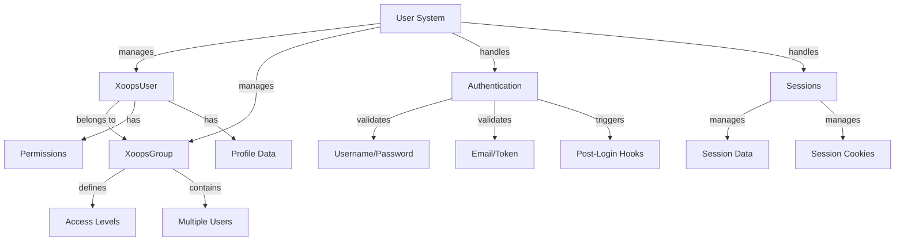

Il Sistema Utenti XOOPS gestisce account utente, autenticazione, autorizzazione, appartenenza a gruppi e gestione delle sessioni. Fornisce un framework robusto per proteggere la tua applicazione e controllare l'accesso degli utenti.

## Architettura Sistema Utenti



## Classe XoopsUser

La classe oggetto utente principale che rappresenta un account utente.

### Panoramica Classe

```php
namespace Xoops\Core\User;

class XoopsUser extends XoopsObject
{
    protected int $uid = 0;
    protected string $uname = '';
    protected string $email = '';
    protected string $pass = '';
    protected int $uregdate = 0;
    protected int $ulevel = 0;
    protected array $groups = [];
    protected array $permissions = [];
}
```

### Costruttore

```php
public function __construct(int $uid = null)
```

Crea un nuovo oggetto utente, caricando opzionalmente da database per ID.

**Parametri:**

| Parametro | Tipo | Descrizione |
|-----------|------|-------------|
| `$uid` | int | ID Utente da caricare (opzionale) |

**Esempio:**
```php
// Crea nuovo utente
$user = new XoopsUser();

// Carica utente esistente
$user = new XoopsUser(123);
```

### Proprietà di Base

| Proprietà | Tipo | Descrizione |
|----------|------|-------------|
| `uid` | int | ID Utente |
| `uname` | string | Nome utente |
| `email` | string | Indirizzo email |
| `pass` | string | Hash password |
| `uregdate` | int | Timestamp registrazione |
| `ulevel` | int | Livello utente (9=admin, 1=utente) |
| `groups` | array | ID Gruppi |
| `permissions` | array | Flag permessi |

### Metodi di Base

#### getID / getUid

Ottiene l'ID dell'utente.

```php
public function getID(): int
public function getUid(): int  // Alias
```

**Restituisce:** `int` - ID Utente

**Esempio:**
```php
$user = new XoopsUser(1);
echo $user->getID(); // 1
echo $user->getUid(); // 1
```

#### getUnameReal

Ottiene il nome visualizzazione dell'utente.

```php
public function getUnameReal(): string
```

**Restituisce:** `string` - Nome reale utente

**Esempio:**
```php
$realName = $user->getUnameReal();
echo "Hello, $realName";
```

#### getEmail

Ottiene l'indirizzo email dell'utente.

```php
public function getEmail(): string
```

**Restituisce:** `string` - Indirizzo email

**Esempio:**
```php
$email = $user->getEmail();
mail($email, 'Welcome', 'Welcome to XOOPS');
```

#### getVar / setVar

Ottiene o imposta una variabile utente.

```php
public function getVar(string $key, string $format = 's'): mixed
public function setVar(string $key, mixed $value, bool $notGpc = false): bool
```

**Esempio:**
```php
// Ottieni valori
$username = $user->getVar('uname');
$email = $user->getVar('email', 's'); // Formattato per visualizzazione

// Imposta valori
$user->setVar('uname', 'newusername');
$user->setVar('email', 'user@example.com');
```

#### getGroups

Ottiene le appartenenze a gruppi dell'utente.

```php
public function getGroups(): array
```

**Restituisce:** `array` - Array di ID gruppi

**Esempio:**
```php
$groups = $user->getGroups();
echo "Member of " . count($groups) . " groups";
```

#### isInGroup

Verifica se l'utente appartiene a un gruppo.

```php
public function isInGroup(int $groupId): bool
```

**Parametri:**

| Parametro | Tipo | Descrizione |
|-----------|------|-------------|
| `$groupId` | int | ID Gruppo da verificare |

**Restituisce:** `bool` - True se in gruppo

**Esempio:**
```php
if ($user->isInGroup(1)) { // 1 = Webmasters
    echo 'User is a webmaster';
}
```

#### isAdmin

Verifica se l'utente è un amministratore.

```php
public function isAdmin(): bool
```

**Restituisce:** `bool` - True se admin

**Esempio:**
```php
if ($user->isAdmin()) {
    // Mostra controlli admin
    echo '<a href="admin/">Admin Panel</a>';
}
```

#### getProfile

Ottiene le informazioni di profilo utente.

```php
public function getProfile(): array
```

**Restituisce:** `array` - Dati profilo

**Esempio:**
```php
$profile = $user->getProfile();
echo 'Bio: ' . $profile['bio'];
```

#### isActive

Verifica se l'account utente è attivo.

```php
public function isActive(): bool
```

**Restituisce:** `bool` - True se attivo

**Esempio:**
```php
if ($user->isActive()) {
    // Consenti accesso utente
} else {
    // Limita accesso
}
```

#### updateLastLogin

Aggiorna il timestamp dell'ultimo login dell'utente.

```php
public function updateLastLogin(): bool
```

**Restituisce:** `bool` - True su successo

**Esempio:**
```php
if ($user->updateLastLogin()) {
    echo 'Login recorded';
}
```

## Classe XoopsGroup

Gestisce gruppi utenti e permessi.

### Panoramica Classe

```php
namespace Xoops\Core\User;

class XoopsGroup extends XoopsObject
{
    protected int $groupid = 0;
    protected string $name = '';
    protected string $description = '';
    protected int $group_type = 0;
    protected array $users = [];
}
```

### Costanti

| Costante | Valore | Descrizione |
|----------|-------|-------------|
| `TYPE_NORMAL` | 0 | Gruppo utente normale |
| `TYPE_ADMIN` | 1 | Gruppo amministrativo |
| `TYPE_SYSTEM` | 2 | Gruppo di sistema |

### Metodi

#### getName

Ottiene il nome del gruppo.

```php
public function getName(): string
```

**Restituisce:** `string` - Nome gruppo

**Esempio:**
```php
$group = new XoopsGroup(1);
echo $group->getName(); // "Webmasters"
```

#### getDescription

Ottiene la descrizione del gruppo.

```php
public function getDescription(): string
```

**Restituisce:** `string` - Descrizione

**Esempio:**
```php
echo $group->getDescription();
```

#### getUsers

Ottiene i membri del gruppo.

```php
public function getUsers(): array
```

**Restituisce:** `array` - Array di ID utenti

**Esempio:**
```php
$users = $group->getUsers();
echo "Group has " . count($users) . " members";
```

#### addUser

Aggiunge un utente al gruppo.

```php
public function addUser(int $uid): bool
```

**Parametri:**

| Parametro | Tipo | Descrizione |
|-----------|------|-------------|
| `$uid` | int | ID Utente |

**Restituisce:** `bool` - True su successo

**Esempio:**
```php
$group = new XoopsGroup(2); // Editors
$group->addUser(123);
$groupHandler->insert($group);
```

#### removeUser

Rimuove un utente dal gruppo.

```php
public function removeUser(int $uid): bool
```

**Esempio:**
```php
$group->removeUser(123);
```

## Autenticazione Utenti

### Processo Login

```php
/**
 * Login utente
 */
function xoops_user_login(string $uname, string $pass, bool $rememberMe = false): ?XoopsUser
{
    global $xoopsDB;

    // Sanifica nome utente
    $uname = trim($uname);

    // Ottieni utente da database
    $query = $xoopsDB->prepare(
        'SELECT * FROM ' . $xoopsDB->prefix('users') .
        ' WHERE uname = ? AND active = 1'
    );
    $query->bind_param('s', $uname);
    $query->execute();
    $result = $query->get_result();

    if ($result->num_rows === 0) {
        return null; // User not found
    }

    $row = $result->fetch_assoc();

    // Verifica password
    if (!password_verify($pass, $row['pass'])) {
        return null; // Invalid password
    }

    // Carica oggetto utente
    $user = new XoopsUser($row['uid']);

    // Aggiorna ultimo login
    $user->updateLastLogin();

    // Gestisci "Remember Me"
    if ($rememberMe) {
        // Imposta cookie persistente
        setcookie(
            'xoops_user_remember',
            $user->uid(),
            time() + (30 * 24 * 60 * 60), // 30 days
            '/',
            $_SERVER['HTTP_HOST'] ?? ''
        );
    }

    return $user;
}
```

### Gestione Password

```php
/**
 * Effettua hash della password in modo sicuro
 */
function xoops_hash_password(string $password): string
{
    return password_hash($password, PASSWORD_BCRYPT, [
        'cost' => 12
    ]);
}

/**
 * Verifica password
 */
function xoops_verify_password(string $password, string $hash): bool
{
    return password_verify($password, $hash);
}

/**
 * Verifica se password ha bisogno di rehashing
 */
function xoops_password_needs_rehash(string $hash): bool
{
    return password_needs_rehash($hash, PASSWORD_BCRYPT, [
        'cost' => 12
    ]);
}
```

## Gestione Sessioni

### Classe Session

```php
namespace Xoops\Core;

class SessionManager
{
    protected array $data = [];
    protected string $sessionId = '';

    public function start(): void {}
    public function get(string $key): mixed {}
    public function set(string $key, mixed $value): void {}
    public function destroy(): void {}
}
```

### Metodi Sessione

#### Avvia Sessione

```php
<?php
session_start();

// Rigenera ID sessione per sicurezza
session_regenerate_id(true);

// Imposta timeout sessione
ini_set('session.gc_maxlifetime', 3600); // 1 hour

// Memorizzia utente in sessione
if ($user) {
    $_SESSION['xoops_user'] = $user;
    $_SESSION['xoops_uid'] = $user->getID();
    $_SESSION['xoops_uname'] = $user->getVar('uname');
}
```

#### Verifica Sessione

```php
/**
 * Ottieni utente corrente dalla sessione
 */
function xoops_get_current_user(): ?XoopsUser
{
    if (isset($_SESSION['xoops_user']) && $_SESSION['xoops_user'] instanceof XoopsUser) {
        return $_SESSION['xoops_user'];
    }
    return null;
}

/**
 * Verifica se utente è loggato
 */
function xoops_is_user_logged_in(): bool
{
    return isset($_SESSION['xoops_uid']) && $_SESSION['xoops_uid'] > 0;
}
```

#### Distruggi Sessione

```php
/**
 * Logout utente
 */
function xoops_user_logout()
{
    global $xoopsUser;

    // Registra logout
    if ($xoopsUser) {
        error_log('User ' . $xoopsUser->getVar('uname') . ' logged out');
    }

    // Distruggi dati sessione
    $_SESSION = [];

    // Cancella cookie sessione
    if (ini_get('session.use_cookies')) {
        $params = session_get_cookie_params();
        setcookie(
            session_name(),
            '',
            time() - 42000,
            $params['path'],
            $params['domain'],
            $params['secure'],
            $params['httponly']
        );
    }

    // Distruggi sessione
    session_destroy();
}
```

## Sistema Permessi

### Costanti Permessi

| Costante | Valore | Descrizione |
|----------|-------|-------------|
| `XOOPS_PERMISSION_NONE` | 0 | Nessun permesso |
| `XOOPS_PERMISSION_VIEW` | 1 | Visualizza contenuto |
| `XOOPS_PERMISSION_SUBMIT` | 2 | Invia contenuto |
| `XOOPS_PERMISSION_EDIT` | 4 | Modifica contenuto |
| `XOOPS_PERMISSION_DELETE` | 8 | Cancella contenuto |
| `XOOPS_PERMISSION_ADMIN` | 16 | Accesso admin |

### Verifica Permessi

```php
/**
 * Verifica se utente ha permesso
 */
function xoops_check_permission($user, $resource, $permission)
{
    if (!$user) {
        return false;
    }

    // Gli admin hanno tutti i permessi
    if ($user->isAdmin()) {
        return true;
    }

    // Verifica permessi gruppo
    $groups = $user->getGroups();
    foreach ($groups as $groupId) {
        if (xoops_group_has_permission($groupId, $resource, $permission)) {
            return true;
        }
    }

    return false;
}
```

## User Handler

L'UserHandler gestisce le operazioni di persistenza utente.

```php
/**
 * Ottieni user handler
 */
$userHandler = xoops_getHandler('user');

/**
 * Crea nuovo utente
 */
$user = new XoopsUser();
$user->setVar('uname', 'newuser');
$user->setVar('email', 'user@example.com');
$user->setVar('pass', xoops_hash_password('password123'));
$user->setVar('uregdate', time());
$user->setVar('uactive', 1);

if ($userHandler->insert($user)) {
    echo 'User created with ID: ' . $user->getID();
}

/**
 * Aggiorna utente
 */
$user = $userHandler->get(123);
$user->setVar('email', 'newemail@example.com');
$userHandler->insert($user);

/**
 * Ottieni utente per nome
 */
$user = $userHandler->findByUsername('john');

/**
 * Cancella utente
 */
$userHandler->delete($user);

/**
 * Cerca utenti
 */
$criteria = new CriteriaCompo();
$criteria->add(new Criteria('uname', '%admin%', 'LIKE'));
$users = $userHandler->getObjects($criteria);
```

## Esempio Gestione Utenti Completo

```php
<?php
/**
 * Esempio autenticazione e profilo utente completo
 */

require_once XOOPS_ROOT_PATH . '/include/common.inc.php';

$xoopsUser = $GLOBALS['xoopsUser'];

// Verifica se utente è loggato
if (!$xoopsUser || !$xoopsUser->isActive()) {
    redirect_header(XOOPS_URL, 3, 'Please login');
}

// Ottieni user handler
$userHandler = xoops_getHandler('user');

// Ottieni utente corrente con dati aggiornati
$currentUser = $userHandler->get($xoopsUser->getID());

// Pagina profilo utente
echo '<h1>Profile: ' . htmlspecialchars($currentUser->getVar('uname')) . '</h1>';

echo '<div class="user-profile">';
echo '<p><strong>Username:</strong> ' . htmlspecialchars($currentUser->getVar('uname')) . '</p>';
echo '<p><strong>Email:</strong> ' . htmlspecialchars($currentUser->getVar('email')) . '</p>';
echo '<p><strong>Registered:</strong> ' . date('Y-m-d H:i:s', $currentUser->getVar('uregdate')) . '</p>';
echo '<p><strong>Groups:</strong> ';

$groupHandler = xoops_getHandler('group');
$groups = $currentUser->getGroups();
$groupNames = [];
foreach ($groups as $groupId) {
    $group = $groupHandler->get($groupId);
    if ($group) {
        $groupNames[] = htmlspecialchars($group->getName());
    }
}
echo implode(', ', $groupNames);
echo '</p>';

// Status admin
if ($currentUser->isAdmin()) {
    echo '<p><strong>Status:</strong> Administrator</p>';
}

echo '</div>';

// Modulo cambio password
if ($_SERVER['REQUEST_METHOD'] === 'POST' && !empty($_POST['change_password'])) {
    $oldPassword = $_POST['old_password'] ?? '';
    $newPassword = $_POST['new_password'] ?? '';
    $confirmPassword = $_POST['confirm_password'] ?? '';

    // Verifica password vecchia
    if (!password_verify($oldPassword, $currentUser->getVar('pass'))) {
        echo '<div class="error">Current password is incorrect</div>';
    } elseif ($newPassword !== $confirmPassword) {
        echo '<div class="error">New passwords do not match</div>';
    } elseif (strlen($newPassword) < 6) {
        echo '<div class="error">Password must be at least 6 characters</div>';
    } else {
        // Aggiorna password
        $currentUser->setVar('pass', xoops_hash_password($newPassword));
        if ($userHandler->insert($currentUser)) {
            echo '<div class="success">Password changed successfully</div>';
        } else {
            echo '<div class="error">Failed to update password</div>';
        }
    }
}

// Modulo cambio password
echo '<form method="post">';
echo '<h3>Change Password</h3>';
echo '<div class="form-group">';
echo '<label>Current Password:</label>';
echo '<input type="password" name="old_password" required>';
echo '</div>';
echo '<div class="form-group">';
echo '<label>New Password:</label>';
echo '<input type="password" name="new_password" required>';
echo '</div>';
echo '<div class="form-group">';
echo '<label>Confirm Password:</label>';
echo '<input type="password" name="confirm_password" required>';
echo '</div>';
echo '<button type="submit" name="change_password">Change Password</button>';
echo '</form>';
```

## Migliori Pratiche

1. **Effettua Hash della Password** - Usa sempre bcrypt o argon2 per effettuare hash della password
2. **Valida Input** - Valida e sanifica tutto l'input utente
3. **Verifica Permessi** - Verifica sempre i permessi utente prima di azioni
4. **Usa Sessioni in Modo Sicuro** - Rigenera ID sessioni su login
5. **Registra Attività** - Registra login, logout e azioni critiche
6. **Rate Limiting** - Implementa limitazione tentativi di login
7. **Solo HTTPS** - Usa sempre HTTPS per autenticazione
8. **Gestione Gruppi** - Usa gruppi per organizzazione permessi

## Documentazione Correlata

- ../Kernel/Kernel-Classes - Servizi kernel e bootstrapping
- ../Database/QueryBuilder - Query database per dati utente
- ../Core/XoopsObject - Classe oggetto base

---

*Vedi anche: [API Utenti XOOPS](https://github.com/XOOPS/XoopsCore27/tree/master/htdocs/class) | [Sicurezza PHP](https://www.php.net/manual/en/book.password.php)*
