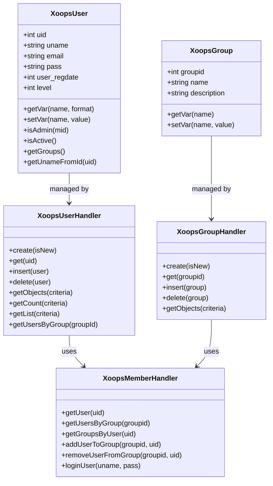
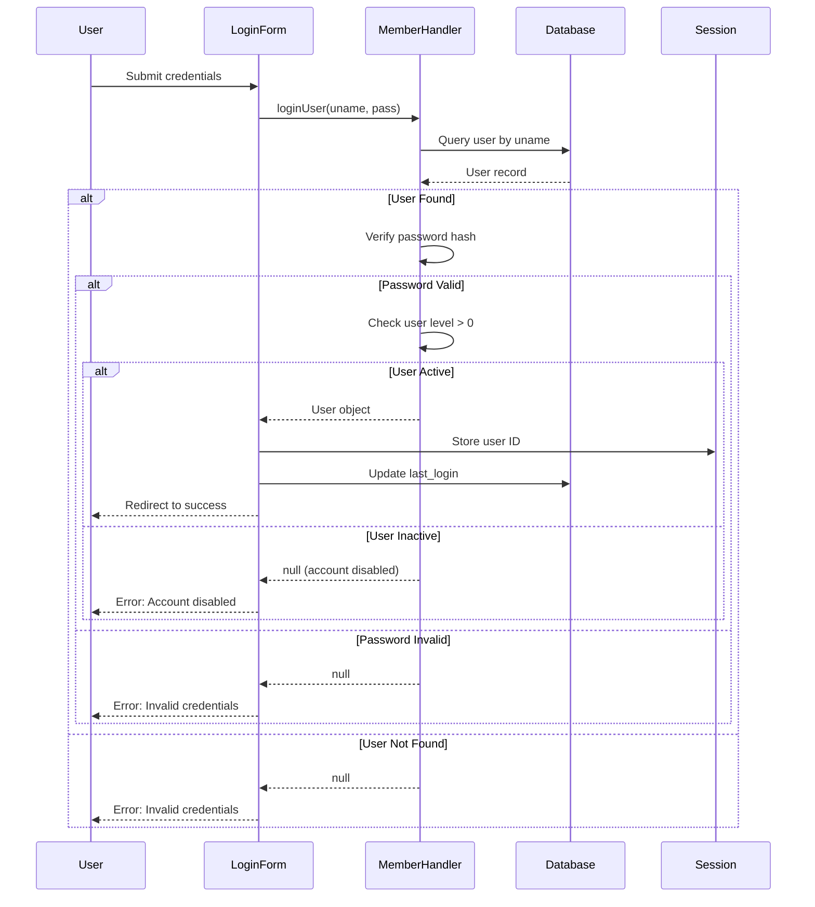
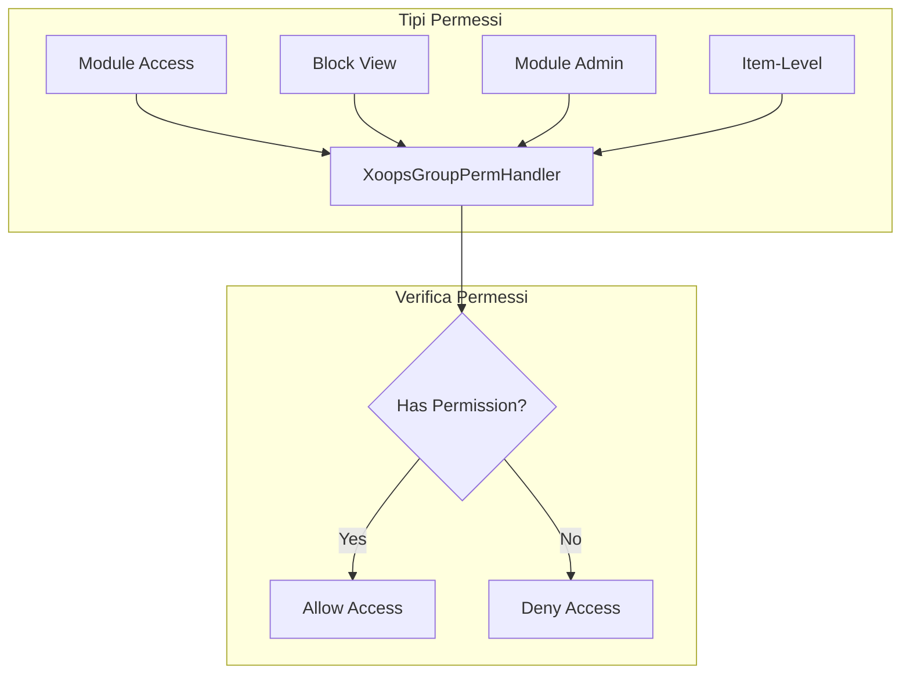
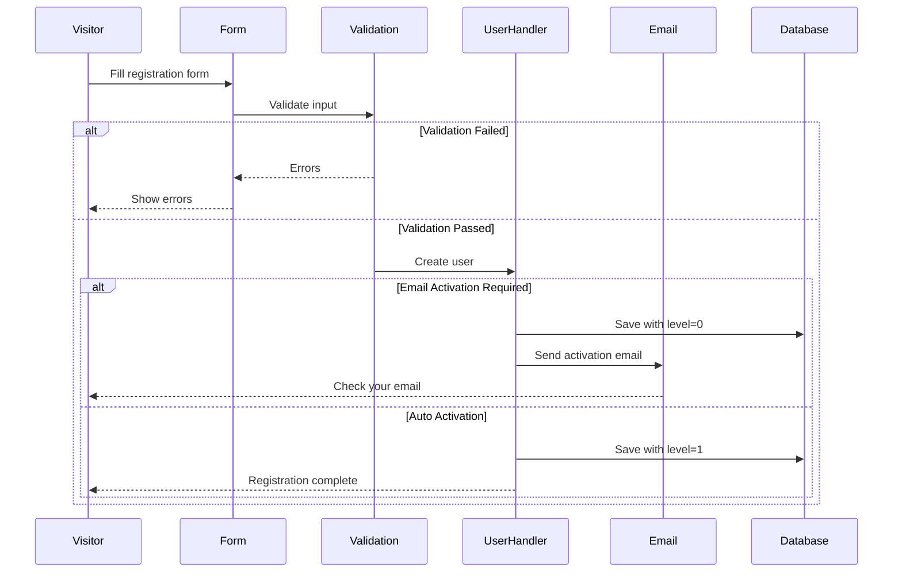

> Documentazione API completa per il sistema utenti XOOPS.

---

## Architettura Sistema Utenti



---

## Classe XoopsUser

### Proprietà

| Proprietà | Tipo | Descrizione |
|----------|------|-------------|
| `uid` | int | ID Utente (chiave primaria) |
| `uname` | string | Nome utente |
| `name` | string | Nome reale |
| `email` | string | Indirizzo email |
| `pass` | string | Hash password |
| `url` | string | URL sito web |
| `user_avatar` | string | Nome file avatar |
| `user_regdate` | int | Timestamp registrazione |
| `user_from` | string | Posizione |
| `user_sig` | string | Firma |
| `user_occ` | string | Professione |
| `user_intrest` | string | Interessi |
| `bio` | string | Biografia |
| `posts` | int | Conteggio post |
| `rank` | int | Rango utente |
| `level` | int | Livello utente (0=inattivo, 1=attivo) |
| `theme` | string | Tema preferito |
| `timezone` | float | Offset fuso orario |
| `last_login` | int | Timestamp ultimo login |

### Metodi di Base

```php
// Ottieni utente corrente
global $xoopsUser;

// Verifica se loggato
if (is_object($xoopsUser)) {
    // Utente è loggato
    $uid = $xoopsUser->getVar('uid');
    $username = $xoopsUser->getVar('uname');
}

// Ottieni valori formattati
$uname = $xoopsUser->getVar('uname');           // Valore raw
$unameDisplay = $xoopsUser->getVar('uname', 's'); // Sanificato per visualizzazione
$unameEdit = $xoopsUser->getVar('uname', 'e');    // Per modifica form

// Verifica se admin
$isAdmin = $xoopsUser->isAdmin();              // Admin sito
$isModuleAdmin = $xoopsUser->isAdmin($mid);    // Admin modulo

// Ottieni gruppi utente
$groups = $xoopsUser->getGroups();             // Array ID gruppi

// Verifica se attivo
$isActive = $xoopsUser->isActive();
```

---

## XoopsUserHandler

### Operazioni CRUD Utenti

```php
// Ottieni handler
$userHandler = xoops_getHandler('user');

// Crea nuovo utente
$user = $userHandler->create();
$user->setVar('uname', 'newuser');
$user->setVar('email', 'user@example.com');
$user->setVar('pass', password_hash('password123', PASSWORD_DEFAULT));
$user->setVar('user_regdate', time());
$user->setVar('level', 1);

if ($userHandler->insert($user)) {
    $newUid = $user->getVar('uid');
}

// Ottieni utente per ID
$user = $userHandler->get(123);

// Aggiorna utente
$user->setVar('email', 'newemail@example.com');
$userHandler->insert($user);

// Cancella utente
$userHandler->delete($user);
```

### Interroga Utenti

```php
// Ottieni tutti gli utenti attivi
$criteria = new Criteria('level', 1);
$users = $userHandler->getObjects($criteria);

// Ottieni utenti per criteria
$criteria = new CriteriaCompo();
$criteria->add(new Criteria('level', 1));
$criteria->add(new Criteria('posts', 10, '>='));
$criteria->setSort('posts');
$criteria->setOrder('DESC');
$criteria->setLimit(10);
$activePosters = $userHandler->getObjects($criteria);

// Ottieni conteggio utenti
$count = $userHandler->getCount($criteria);

// Ottieni lista utenti (uid => uname)
$userList = $userHandler->getList($criteria);

// Cerca utenti
$criteria = new CriteriaCompo();
$criteria->add(new Criteria('uname', '%john%', 'LIKE'));
$criteria->add(new Criteria('email', '%john%', 'LIKE'), 'OR');
$searchResults = $userHandler->getObjects($criteria);
```

---

## XoopsMemberHandler

### Gestione Gruppi

```php
$memberHandler = xoops_getHandler('member');

// Ottieni utente con gruppi
$user = $memberHandler->getUser($uid);
$groups = $memberHandler->getGroupsByUser($uid);

// Ottieni utenti in gruppo
$users = $memberHandler->getUsersByGroup($groupId);
$users = $memberHandler->getUsersByGroup($groupId, true); // Oggetti
$users = $memberHandler->getUsersByGroup($groupId, false); // Solo UID

// Aggiungi utente a gruppo
$memberHandler->addUserToGroup($groupId, $uid);

// Rimuovi utente da gruppo
$memberHandler->removeUserFromGroup($groupId, $uid);
```

### Autenticazione

```php
// Accedi utente
$user = $memberHandler->loginUser($username, $password);

if ($user) {
    // Login riuscito
    $_SESSION['xoopsUserId'] = $user->getVar('uid');
    $user->setVar('last_login', time());
    $userHandler->insert($user);
} else {
    // Login fallito
}

// Logout
$_SESSION = [];
session_destroy();
redirect_header(XOOPS_URL, 3, 'Logged out');
```

---

## Flusso Autenticazione



---

## Sistema Gruppi

### Gruppi Default

| ID Gruppo | Nome | Descrizione |
|----------|------|-------------|
| 1 | Webmasters | Accesso amministrativo completo |
| 2 | Registered Users | Utenti registrati standard |
| 3 | Anonymous | Visitatori non loggati |

### Permessi Gruppo



### Verifica Permessi

```php
$gpermHandler = xoops_getHandler('groupperm');

// Verifica accesso modulo
$groups = is_object($xoopsUser) ? $xoopsUser->getGroups() : [XOOPS_GROUP_ANONYMOUS];
$hasAccess = $gpermHandler->checkRight('module_read', $moduleId, $groups);

// Verifica admin modulo
$isAdmin = $gpermHandler->checkRight('module_admin', $moduleId, $groups);

// Verifica permesso personalizzato
$hasPermission = $gpermHandler->checkRight(
    'item_view',      // Nome permesso
    $itemId,          // ID elemento
    $groups,          // ID gruppi
    $moduleId         // ID modulo
);

// Ottieni elementi a cui l'utente può accedere
$itemIds = $gpermHandler->getItemIds('item_view', $groups, $moduleId);
```

---

## Flusso Registrazione Utenti



---

## Esempio Completo

```php
<?php
require_once __DIR__ . '/mainfile.php';

use Xmf\Request;

$memberHandler = xoops_getHandler('member');
$userHandler = xoops_getHandler('user');

// Gestore registrazione
if (Request::hasVar('register', 'POST')) {
    // Verifica CSRF
    if (!$GLOBALS['xoopsSecurity']->check()) {
        redirect_header('register.php', 3, 'Security error');
    }

    $uname = Request::getString('uname', '', 'POST');
    $email = Request::getEmail('email', '', 'POST');
    $pass = Request::getString('pass', '', 'POST');
    $passConfirm = Request::getString('pass_confirm', '', 'POST');

    $errors = [];

    // Valida nome utente
    if (strlen($uname) < 3 || strlen($uname) > 25) {
        $errors[] = 'Username must be 3-25 characters';
    }

    // Verifica se nome utente esiste
    $criteria = new Criteria('uname', $uname);
    if ($userHandler->getCount($criteria) > 0) {
        $errors[] = 'Username already taken';
    }

    // Valida email
    if (!filter_var($email, FILTER_VALIDATE_EMAIL)) {
        $errors[] = 'Invalid email address';
    }

    // Verifica se email esiste
    $criteria = new Criteria('email', $email);
    if ($userHandler->getCount($criteria) > 0) {
        $errors[] = 'Email already registered';
    }

    // Valida password
    if (strlen($pass) < 8) {
        $errors[] = 'Password must be at least 8 characters';
    }

    if ($pass !== $passConfirm) {
        $errors[] = 'Passwords do not match';
    }

    if (empty($errors)) {
        // Crea utente
        $user = $userHandler->create();
        $user->setVar('uname', $uname);
        $user->setVar('email', $email);
        $user->setVar('pass', password_hash($pass, PASSWORD_DEFAULT));
        $user->setVar('user_regdate', time());
        $user->setVar('level', 1); // Auto-attiva

        if ($userHandler->insert($user)) {
            // Aggiungi al gruppo Registered Users
            $memberHandler->addUserToGroup(XOOPS_GROUP_USERS, $user->getVar('uid'));

            redirect_header('index.php', 3, 'Registration successful!');
        } else {
            $errors[] = 'Error creating account';
        }
    }
}

// Mostra modulo registrazione
require_once XOOPS_ROOT_PATH . '/header.php';

if (!empty($errors)) {
    foreach ($errors as $error) {
        echo "<div class='errorMsg'>$error</div>";
    }
}

// Modulo registrazione qui...

require_once XOOPS_ROOT_PATH . '/footer.php';
```

---

## Documentazione Correlata

- Guida Gestione Utenti
- Sistema Permessi
- Autenticazione

---

#xoops #api #user #authentication #reference
