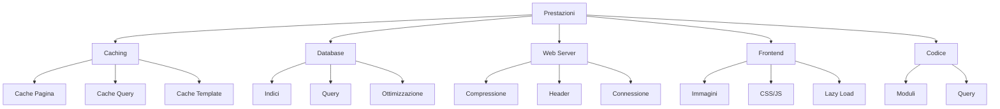

# Ottimizzazione delle Prestazioni di XOOPS

Guida completa all'ottimizzazione di XOOPS per massima velocità ed efficienza.

## Panoramica Ottimizzazione Prestazioni



## Configurazione Caching

Il caching è il modo più veloce per migliorare le prestazioni.

### Caching a Livello di Pagina

Abilita cache pagina intera in XOOPS:

**Pannello Admin > Sistema > Preferenze > Impostazioni Cache**

```
Abilita Caching: Yes
Tipo Cache: File Cache (o APCu/Memcache)
Durata Cache: 3600 secondi (1 ora)
Cache Elenco Moduli: Yes
Cache Configurazione: Yes
Cache Risultati Ricerca: Yes
```

### Caching basato su File

Configura ubicazione cache file:

```bash
# Crea directory cache fuori dalla root web (più sicuro)
mkdir -p /var/cache/xoops
chown www-data:www-data /var/cache/xoops
chmod 755 /var/cache/xoops

# Modifica mainfile.php
define('XOOPS_CACHE_PATH', '/var/cache/xoops/');
```

### Caching APCu

APCu fornisce caching in-memory (molto veloce):

```bash
# Installa APCu
apt-get install php-apcu

# Verifica installazione
php -m | grep apcu

# Configura in php.ini
apc.enabled = 1
apc.memory_size = 128M
apc.ttl = 0
apc.user_ttl = 3600
apc.shm_size = 128
```

Abilita in XOOPS:

**Pannello Admin > Sistema > Preferenze > Impostazioni Cache**

```
Tipo Cache: APCu
```

### Caching Memcache/Redis

Caching distribuito per siti ad alto traffico:

**Installa Memcache:**

```bash
# Installa server Memcache
apt-get install memcached

# Avvia servizio
systemctl start memcached
systemctl enable memcached

# Verifica in esecuzione
netstat -tlnp | grep memcached
# Deve mostrarsi in ascolto sulla porta 11211
```

**Configura in XOOPS:**

Modifica mainfile.php:

```php
// Configurazione Memcache
define('XOOPS_CACHE_TYPE', 'memcache');
define('XOOPS_CACHE_HOST', 'localhost');
define('XOOPS_CACHE_PORT', 11211);
define('XOOPS_CACHE_TIMEOUT', 0);
```

Oppure nel pannello admin:

```
Tipo Cache: Memcache
Host Memcache: localhost:11211
```

### Caching Template

Compila e caccia template XOOPS:

```bash
# Assicura che templates_c sia scrivibile
chmod 777 /var/www/html/xoops/templates_c/

# Cancella template cached vecchi
rm -rf /var/www/html/xoops/templates_c/*
```

Configura nel tema:

```html
<!-- Nel tema xoops_version.php -->
{smarty.const.XOOPS_VAR_PATH|constant}
<{$xoops_meta}>

<!-- Template usano caching -->
{cache}
    [Contenuto cached qui]
{/cache}
```

## Ottimizzazione Database

### Aggiungi Indici Database

Un database propriamente indicizzato esegue query molto più velocemente.

```sql
-- Controlla indici attuali
SHOW INDEXES FROM xoops_users;

-- Indici comuni da aggiungere
ALTER TABLE xoops_users ADD INDEX idx_uname (uname);
ALTER TABLE xoops_users ADD INDEX idx_email (email);
ALTER TABLE xoops_users ADD INDEX idx_uid_active (uid, user_actkey);

-- Aggiungi indici a tabelle post/contenuti
ALTER TABLE xoops_posts ADD INDEX idx_post_published (post_published);
ALTER TABLE xoops_posts ADD INDEX idx_post_uid (post_uid);
ALTER TABLE xoops_posts ADD INDEX idx_post_created (post_created);

-- Verifica indici creati
SHOW INDEXES FROM xoops_users\G
```

### Ottimizza Tabelle

L'ottimizzazione regolare delle tabelle migliora le prestazioni:

```sql
-- Ottimizza tutte le tabelle
OPTIMIZE TABLE xoops_users;
OPTIMIZE TABLE xoops_posts;
OPTIMIZE TABLE xoops_config;
OPTIMIZE TABLE xoops_comments;

-- Oppure tutto in una volta
REPAIR TABLE xoops_users;
OPTIMIZE TABLE xoops_users;
REPAIR TABLE xoops_posts;
OPTIMIZE TABLE xoops_posts;
```

Crea script di ottimizzazione automatizzata:

```bash
#!/bin/bash
# Script di ottimizzazione database

echo "Ottimizzazione database XOOPS..."

mysql -u xoops_user -p xoops_db << EOF
-- Ottimizza tutte le tabelle
OPTIMIZE TABLE xoops_users;
OPTIMIZE TABLE xoops_posts;
OPTIMIZE TABLE xoops_config;
OPTIMIZE TABLE xoops_comments;
OPTIMIZE TABLE xoops_users_online;

-- Mostra dimensione database
SELECT table_schema,
       ROUND(SUM(data_length + index_length) / 1024 / 1024, 2) as total_mb
FROM information_schema.tables
WHERE table_schema = 'xoops_db'
GROUP BY table_schema;
EOF

echo "Ottimizzazione database completata!"
```

Pianifica con cron:

```bash
# Ottimizzazione settimanale
crontab -e
# Aggiungi: 0 3 * * 0 /usr/local/bin/optimize-xoops-db.sh
```

### Ottimizzazione Query

Rivedi query lente:

```sql
-- Abilita log query lente
SET GLOBAL slow_query_log = 'ON';
SET GLOBAL long_query_time = 2;

-- Visualizza query lente
SELECT * FROM mysql.slow_log;

-- Oppure controlla file log slow
tail -100 /var/log/mysql/slow.log
```

Tecniche di ottimizzazione comuni:

```php
// LENTO - Evita query non necessarie in loop
foreach ($users as $user) {
    $profile = getUserProfile($user['uid']);  // Query in loop!
    echo $profile['name'];
}

// VELOCE - Ottieni tutti i dati in una volta
$profiles = getAllUserProfiles($user_ids);
foreach ($users as $user) {
    echo $profiles[$user['uid']]['name'];
}
```

### Aumenta Buffer Pool

Configura MySQL per miglior caching:

Modifica `/etc/mysql/mysql.conf.d/mysqld.cnf`:

```ini
# InnoDB Buffer Pool (50-80% della RAM di sistema)
innodb_buffer_pool_size = 1G

# Query Cache (opzionale, può essere disabilitato in MySQL 5.7+)
query_cache_size = 64M
query_cache_type = 1

# Max Connessioni
max_connections = 500

# Max Allowed Packet
max_allowed_packet = 256M

# Timeout connessione
connect_timeout = 10
```

Riavvia MySQL:

```bash
systemctl restart mysql
```

## Ottimizzazione Web Server

### Abilita Compressione Gzip

Comprimi risposte per ridurre la larghezza di banda:

**Configurazione Apache:**

```apache
<IfModule mod_deflate.c>
    AddOutputFilterByType DEFLATE text/html text/plain text/xml text/css text/javascript application/javascript application/json

    # Non comprimere immagini e file già compressi
    SetEnvIfNoCase Request_URI \.(jpg|jpeg|png|gif|zip|gzip)$ no-gzip dont-vary

    # Log risposte compresse
    DeflateBufferSize 8096
</IfModule>
```

**Configurazione Nginx:**

```nginx
gzip on;
gzip_types text/html text/plain text/css text/javascript application/javascript application/json;
gzip_min_length 1000;
gzip_vary on;
gzip_comp_level 6;

# Non comprimere formati già compressi
gzip_disable "msie6";
```

Verifica compressione:

```bash
# Controlla se risposta è gzippata
curl -I -H "Accept-Encoding: gzip" http://your-domain.com/xoops/

# Deve mostrare:
# Content-Encoding: gzip
```

### Header Cache Browser

Imposta scadenza cache per asset statici:

**Apache:**

```apache
<IfModule mod_expires.c>
    ExpiresActive On

    # Cache immagini per 30 giorni
    ExpiresByType image/jpeg "access plus 30 days"
    ExpiresByType image/gif "access plus 30 days"
    ExpiresByType image/png "access plus 30 days"
    ExpiresByType image/svg+xml "access plus 30 days"

    # Cache CSS/JS per 30 giorni
    ExpiresByType text/css "access plus 30 days"
    ExpiresByType application/javascript "access plus 30 days"
    ExpiresByType text/javascript "access plus 30 days"

    # Cache font per 1 anno
    ExpiresByType font/eot "access plus 1 year"
    ExpiresByType font/ttf "access plus 1 year"
    ExpiresByType font/woff "access plus 1 year"
    ExpiresByType font/woff2 "access plus 1 year"

    # Non cachare HTML
    ExpiresByType text/html "access plus 1 hour"
</IfModule>
```

**Nginx:**

```nginx
location ~* \.(jpg|jpeg|png|gif|ico|svg|woff|woff2|ttf|eot)$ {
    expires 30d;
    add_header Cache-Control "public, immutable";
}

location ~* \.(css|js)$ {
    expires 30d;
    add_header Cache-Control "public";
}

location ~ \.html$ {
    expires 1h;
    add_header Cache-Control "public";
}
```

### Connessione Keep-Alive

Abilita connessioni HTTP persistenti:

**Apache:**

```apache
<IfModule mod_http.c>
    KeepAlive On
    KeepAliveTimeout 15
    MaxKeepAliveRequests 100
</IfModule>
```

**Nginx:**

```nginx
keepalive_timeout 15s;
keepalive_requests 100;
```

## Ottimizzazione Frontend

### Ottimizza Immagini

Riduci dimensioni file immagini:

```bash
# Comprimi batch immagini JPEG
for img in *.jpg; do
    convert "$img" -quality 85 "optimized_$img"
done

# Comprimi batch immagini PNG
for img in *.png; do
    optipng -o2 "$img"
done

# Oppure usa imagemin CLI
npm install -g imagemin-cli
imagemin images/ --out-dir=images-optimized
```

### Minifica CSS e JavaScript

Riduci dimensioni file CSS/JS:

**Usando strumenti Node.js:**

```bash
# Installa minificatori
npm install -g uglify-js clean-css-cli

# Minifica JavaScript
uglifyjs script.js -o script.min.js

# Minifica CSS
cleancss style.css -o style.min.css
```

**Usando strumenti online:**
- CSS Minifier: https://cssminifier.com/
- JavaScript Minifier: https://www.minifycode.com/javascript-minifier/

### Lazy Load Immagini

Carica immagini solo quando necessario:

```html
<!-- Aggiungi attributo loading="lazy" -->


<!-- Oppure usa libreria JavaScript per browser più vecchi -->


<script src="https://cdnjs.cloudflare.com/ajax/libs/vanilla-lazyload/17.1.2/lazyload.min.js"></script>
<script>
    var lazyLoad = new LazyLoad({
        elements_selector: ".lazy"
    });
</script>
```

### Riduci Risorse di Blocking Render

Carica CSS/JS strategicamente:

```html
<!-- Carica CSS critico inline -->
<style>
    /* Stili critici per above-the-fold */
</style>

<!-- Rinvia CSS non critico -->
<link rel="stylesheet" href="style.css" media="print" onload="this.media='all'">

<!-- Rinvia JavaScript -->
<script src="script.js" defer></script>

<!-- Oppure usa async per script non critici -->
<script src="analytics.js" async></script>
```

## Integrazione CDN

Usa Content Delivery Network per accesso globale più veloce.

### CDN Popolari

| CDN | Costo | Caratteristiche |
|---|---|---|
| Cloudflare | Gratuito/Pagato | DDoS, DNS, Cache, Analytics |
| AWS CloudFront | Pagato | High performance, globale |
| Bunny CDN | Economico | Storage, video, cache |
| jsDelivr | Gratuito | Librerie JavaScript |
| cdnjs | Gratuito | Librerie popolari |

### Setup Cloudflare

1. Registrati su https://www.cloudflare.com/
2. Aggiungi il tuo dominio
3. Aggiorna nameserver con quelli di Cloudflare
4. Abilita opzioni caching:
   - Cache Level: Aggressive
   - Caching su everything: On
   - Browser Caching TTL: 1 mese

5. In XOOPS, aggiorna il tuo dominio per usare DNS Cloudflare

### Configura CDN in XOOPS

Aggiorna URL immagini verso CDN:

Modifica template tema:

```html
<!-- Originale -->


<!-- Con CDN -->

```

Oppure imposta in PHP:

```php
// In mainfile.php o config
define('XOOPS_CDN_URL', 'https://cdn.your-domain.com');

// Nel template

```

## Monitoraggio Prestazioni

### Test PageSpeed Insights

Testa le prestazioni del tuo sito:

1. Visita Google PageSpeed Insights: https://pagespeed.web.dev/
2. Inserisci URL XOOPS
3. Rivedi raccomandazioni
4. Implementa miglioramenti suggeriti

### Monitoraggio Prestazioni Server

Monitora metriche server in tempo reale:

```bash
# Installa strumenti di monitoraggio
apt-get install htop iotop nethogs

# Monitora CPU e memoria
htop

# Monitora I/O disco
iotop

# Monitora rete
nethogs
```

### Profiling Prestazioni PHP

Identifica codice PHP lento:

```php
<?php
// Usa Xdebug per profiling
xdebug_start_trace('profile');

// Tuo codice qui
$result = someExpensiveFunction();

xdebug_stop_trace();
?>
```

### Monitoraggio Query MySQL

Traccia query lente:

```bash
# Abilita query logging
mysql -u root -p

SET GLOBAL general_log = 'ON';
SET GLOBAL log_output = 'FILE';
SET GLOBAL general_log_file = '/var/log/mysql/query.log';

# Rivedi query lente
tail -f /var/log/mysql/slow.log

# Analizza query con EXPLAIN
EXPLAIN SELECT * FROM xoops_users WHERE uid = 1\G
```

## Checklist Ottimizzazione Prestazioni

Implementa questi per le migliori prestazioni:

- [ ] **Caching:** Abilita file/APCu/Memcache caching
- [ ] **Database:** Aggiungi indici, ottimizza tabelle
- [ ] **Compressione:** Abilita compressione Gzip
- [ ] **Browser Cache:** Imposta header cache
- [ ] **Immagini:** Ottimizza e comprimi
- [ ] **CSS/JS:** Minifica file
- [ ] **Lazy Loading:** Implementa per immagini
- [ ] **CDN:** Usa per asset statici
- [ ] **Keep-Alive:** Abilita connessioni persistenti
- [ ] **Moduli:** Disabilita moduli non usati
- [ ] **Temi:** Usa temi leggeri, ottimizzati
- [ ] **Monitoraggio:** Traccia metriche prestazioni
- [ ] **Manutenzione Regolare:** Cancella cache, ottimizza DB

## Script Ottimizzazione Prestazioni

Ottimizzazione automatizzata:

```bash
#!/bin/bash
# Script di ottimizzazione prestazioni

echo "=== Ottimizzazione Prestazioni XOOPS ==="

# Cancella cache
echo "Cancellazione cache..."
rm -rf /var/www/html/xoops/cache/*
rm -rf /var/www/html/xoops/templates_c/*

# Ottimizza database
echo "Ottimizzazione database..."
mysql -u xoops_user -p xoops_db << EOF
OPTIMIZE TABLE xoops_users;
OPTIMIZE TABLE xoops_posts;
OPTIMIZE TABLE xoops_config;
OPTIMIZE TABLE xoops_comments;
EOF

# Controlla permessi file
echo "Verifica permessi file..."
find /var/www/html/xoops -type f -exec chmod 644 {} \;
find /var/www/html/xoops -type d -exec chmod 755 {} \;
chmod 777 /var/www/html/xoops/cache
chmod 777 /var/www/html/xoops/templates_c
chmod 777 /var/www/html/xoops/uploads
chmod 777 /var/www/html/xoops/var

# Genera report prestazioni
echo "Ottimizzazione Prestazioni Completata!"
echo ""
echo "Prossimi passaggi:"
echo "1. Testa sito su https://pagespeed.web.dev/"
echo "2. Monitora prestazioni nel pannello admin"
echo "3. Considera CDN per asset statici"
echo "4. Rivedi query lente in MySQL"
```

## Metriche Prima e Dopo

Traccia miglioramenti:

```
Prima dell'Ottimizzazione:
- Tempo Caricamento Pagina: 3.5 secondi
- Query Database: 45
- Cache Hit Rate: 0%
- Dimensione Database: 250MB

Dopo l'Ottimizzazione:
- Tempo Caricamento Pagina: 0.8 secondi (77% più veloce)
- Query Database: 8 (cached)
- Cache Hit Rate: 85%
- Dimensione Database: 120MB (ottimizzato)
```

## Prossimi Passi

1. Rivedi configurazione di base
2. Assicura misure di sicurezza
3. Implementa caching
4. Monitora prestazioni con strumenti
5. Adatta in base a metriche

---

**Tag:** #prestazioni #ottimizzazione #caching #database #cdn

**Articoli Correlati:**
- ../../06-Publisher-Module/User-Guide/Basic-Configuration
- System-Settings
- Security-Configuration
- ../Installation/Server-Requirements
