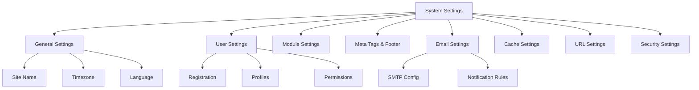

# Impostazioni di Sistema XOOPS

Questa guida copre le impostazioni di sistema complete disponibili nel pannello admin di XOOPS, organizzate per categoria.

## Architettura Impostazioni di Sistema



## Accesso alle Impostazioni di Sistema

### Ubicazione

**Pannello Admin > Sistema > Preferenze**

Oppure naviga direttamente:

```
http://your-domain.com/xoops/admin/index.php?fct=preferences
```

### Requisiti di Permesso

- Solo gli amministratori (webmaster) possono accedere alle impostazioni di sistema
- Le modifiche influiscono su tutto il sito
- La maggior parte delle modifiche ha effetto immediato

## Impostazioni Generali

La configurazione fondamentale per la tua installazione XOOPS.

### Informazioni di Base

```
Nome Sito: [Nome Tuo Sito]
Descrizione Predefinita: [Breve descrizione del tuo sito]
Slogan Sito: [Slogan accattivante]
Email Admin: admin@your-domain.com
Nome Webmaster: Nome Amministratore
Email Webmaster: admin@your-domain.com
```

### Impostazioni Aspetto

```
Tema Predefinito: [Seleziona tema]
Lingua Predefinita: Italiano (o lingua preferita)
Elementi Per Pagina: 15 (tipicamente 10-25)
Parole in Snippet: 25 (per risultati ricerca)
Permesso Caricamento Tema: Disabilitato (sicurezza)
```

### Impostazioni Regionali

```
Timezone Predefinito: [Tuo timezone]
Formato Data: %d-%m-%Y (GG-MM-AAAA)
Formato Ora: %H:%M:%S (OO:MM:SS)
Ora Legale: [Auto/Manuale/Nessuno]
```

**Tabella Formato Timezone:**

| Regione | Timezone | Offset UTC |
|---|---|---|
| US Orientale | America/New_York | -5 / -4 |
| US Centrale | America/Chicago | -6 / -5 |
| US Montagna | America/Denver | -7 / -6 |
| US Pacifico | America/Los_Angeles | -8 / -7 |
| UK/Londra | Europe/London | 0 / +1 |
| Francia/Germania | Europe/Paris | +1 / +2 |
| Giappone | Asia/Tokyo | +9 |
| Cina | Asia/Shanghai | +8 |
| Australia/Sydney | Australia/Sydney | +10 / +11 |

### Configurazione Ricerca

```
Abilita Ricerca: Sì
Ricerca Pagine Admin: Sì/No
Ricerca Archivi: Sì
Tipo Ricerca Predefinito: Tutto / Solo Pagine
Parole Escluse dalla Ricerca: [Lista separata da virgola]
```

**Parole comuni escluse:** il, la, lo, di, da, a, in, su, per, con, tra, fra, etc.

## Impostazioni Utente

Controlla il comportamento dell'account utente e il processo di registrazione.

### Registrazione Utente

```
Consenti Registrazione Utente: Sì/No
Tipo Registrazione:
  ☐ Auto-attiva (Accesso istantaneo)
  ☐ Approvazione Admin (Admin deve approvare)
  ☐ Verifica Email (Utente deve verificare email)

Notifica agli Utenti: Sì/No
Verifica Email Utente: Richiesta/Opzionale
```

### Configurazione Nuovo Utente

```
Auto-login Nuovi Utenti: Sì/No
Assegna Gruppo Utente Predefinito: Sì
Gruppo Utente Predefinito: [Seleziona gruppo]
Crea Avatar Utente: Sì/No
Avatar Predefinito Iniziale: [Seleziona predefinito]
```

### Impostazioni Profilo Utente

```
Consenti Profili Utente: Sì
Mostra Elenco Membri: Sì
Mostra Statistiche Utente: Sì
Mostra Ultimo Orario Online: Sì
Consenti Avatar Utente: Sì
Dimensione Max Avatar: 100KB
Dimensioni Avatar: 100x100 pixel
```

### Impostazioni Email Utente

```
Consenti Utenti di Nascondere Email: Sì
Mostra Email su Profilo: Sì
Intervallo Email Notifica: Immediatamente/Giornaliera/Settimanale/Mai
```

### Tracciamento Attività Utente

```
Traccia Attività Utente: Sì
Registra Accessi Utente: Sì
Registra Accessi Non Riusciti: Sì
Traccia Indirizzo IP: Sì
Cancella Log Attività Più Vecchi Di: 90 giorni
```

### Limiti Account

```
Consenti Email Duplicate: No
Lunghezza Minima Nome Utente: 3 caratteri
Lunghezza Massima Nome Utente: 15 caratteri
Lunghezza Minima Password: 6 caratteri
Richiedi Caratteri Speciali: Sì
Richiedi Numeri: Sì
Scadenza Password: 90 giorni (o Mai)
Elimina Account Inattivi per Giorni: 365 giorni
```

## Impostazioni Moduli

Configura il comportamento dei singoli moduli.

### Opzioni Modulo Comuni

Per ogni modulo installato, puoi impostare:

```
Stato Modulo: Attivo/Inattivo
Visualizza in Menu: Sì/No
Peso Modulo: [1-999] (superiore = più basso nella visualizzazione)
Homepage Predefinita: Questo modulo mostra quando visiti /
Accesso Admin: [Gruppi utente consentiti]
Accesso Utente: [Gruppi utente consentiti]
```

### Impostazioni Modulo Sistema

```
Mostra Homepage Come: Portale / Modulo / Pagina Statica
Modulo Homepage Predefinito: [Seleziona modulo]
Mostra Menu Footer: Sì
Colore Footer: [Selettore colore]
Mostra Statistiche Sistema: Sì
Mostra Utilizzo Memoria: Sì
```

### Configurazione per Modulo

Ogni modulo può avere impostazioni specifiche del modulo:

**Esempio - Modulo Pagina:**
```
Abilita Commenti: Sì/No
Moderazione Commenti: Sì/No
Commenti Per Pagina: 10
Abilita Valutazioni: Sì
Consenti Valutazioni Anonime: Sì
```

**Esempio - Modulo Utente:**
```
Cartella Caricamento Avatar: ./uploads/
Dimensione Caricamento Massima: 100KB
Consenti Caricamento File: Sì
Tipi File Consentiti: jpg, gif, png
```

Accedi alle impostazioni specifiche del modulo:
- **Admin > Moduli > [Nome Modulo] > Preferenze**

## Meta Tag e Impostazioni SEO

Configura meta tag per l'ottimizzazione dei motori di ricerca.

### Meta Tag Globali

```
Meta Parole Chiave: xoops, cms, sistema gestione contenuti
Meta Descrizione: Un potente sistema di gestione dei contenuti per la costruzione di siti web dinamici
Meta Autore: Tuo Nome
Meta Copyright: Copyright 2025, Tua Azienda
Meta Robots: index, follow
Meta Revisita: 30 giorni
```

### Best Practice Meta Tag

| Tag | Scopo | Consiglio |
|---|---|---|
| Parole Chiave | Termini ricerca | 5-10 parole chiave rilevanti, separate da virgola |
| Descrizione | Elenco ricerca | 150-160 caratteri |
| Autore | Creatore pagina | Tuo nome o azienda |
| Copyright | Legale | La tua avviso di copyright |
| Robots | Istruzioni crawler | index, follow (consenti indicizzazione) |

### Impostazioni Footer

```
Mostra Footer: Sì
Colore Footer: Scuro/Chiaro
Sfondo Footer: [Codice colore]
Testo Footer: [HTML consentito]
Link Footer Aggiuntivi: [Coppie URL e testo]
```

**Sample HTML Footer:**
```html
<p>Copyright &copy; 2025 Tua Azienda. Tutti i diritti riservati.</p>
<p><a href="/privacy">Informativa Privacy</a> | <a href="/terms">Termini di Utilizzo</a></p>
```

### Meta Tag Social (Open Graph)

```
Abilita Open Graph: Sì
Facebook App ID: [App ID]
Tipo Twitter Card: summary / summary_large_image / player
Immagine Condivisione Predefinita: [URL Immagine]
```

## Impostazioni Email

Configura la consegna email e il sistema di notifica.

### Metodo Consegna Email

```
Usa SMTP: Sì/No

Se SMTP:
  Host SMTP: smtp.gmail.com
  Porta SMTP: 587 (TLS) o 465 (SSL)
  Sicurezza SMTP: TLS / SSL / Nessuno
  Nome Utente SMTP: [email@example.com]
  Password SMTP: [password]
  Autenticazione SMTP: Sì/No
  Timeout SMTP: 10 secondi

Se PHP mail():
  Percorso Sendmail: /usr/sbin/sendmail -t -i
```

### Configurazione Email

```
Indirizzo Da: noreply@your-domain.com
Nome Da: Nome Tuo Sito
Indirizzo Rispondi A: support@your-domain.com
BCC Email Admin: Sì/No
```

### Impostazioni Notifica

```
Invia Email Benvenuto: Sì/No
Soggetto Email Benvenuto: Benvenuto in [Nome Sito]
Corpo Email Benvenuto: [Messaggio personalizzato]

Invia Email Reset Password: Sì/No
Includi Password Casuale: Sì/No
Scadenza Token: 24 ore
```

### Notifiche Admin

```
Notifica Admin su Registrazione: Sì
Notifica Admin su Commenti: Sì
Notifica Admin su Invii: Sì
Notifica Admin su Errori: Sì
```

### Notifiche Utente

```
Notifica Utente su Registrazione: Sì
Notifica Utente su Commenti: Sì
Notifica Utente su Messaggi Privati: Sì
Consenti Utenti di Disabilitare Notifiche: Sì
Frequenza Notifica Predefinita: Immediatamente
```

### Template Email

Personalizza email di notifica nel pannello admin:

**Percorso:** Sistema > Template Email

Template disponibili:
- Registrazione Utente
- Reset Password
- Notifica Commento
- Messaggio Privato
- Avvisi Sistema
- Email specifiche del modulo

## Impostazioni Cache

Ottimizza le prestazioni tramite caching.

### Configurazione Cache

```
Abilita Caching: Sì/No
Tipo Cache:
  ☐ File Cache
  ☐ APCu (Cache PHP Alternativo)
  ☐ Memcache (Caching Distribuito)
  ☐ Redis (Caching Avanzato)

Durata Cache: 3600 secondi (1 ora)
```

### Opzioni Cache per Tipo

**File Cache:**
```
Cartella Cache: /var/www/html/xoops/cache/
Intervallo Pulizia: Giornaliero
File Cache Massimi: 1000
```

**Cache APCu:**
```
Allocazione Memoria: 128MB
Livello Frammentazione: Basso
```

**Memcache/Redis:**
```
Host Server: localhost
Porta Server: 11211 (Memcache) / 6379 (Redis)
Connessione Persistente: Sì
```

### Cosa Viene Cachato

```
Cache Elenco Moduli: Sì
Cache Dati Configurazione: Sì
Cache Dati Template: Sì
Cache Dati Sessione Utente: Sì
Cache Risultati Ricerca: Sì
Cache Query Database: Sì
Cache Feed RSS: Sì
Cache Immagini: Sì
```

## Impostazioni URL

Configura la riscrittura URL e la formattazione.

### Impostazioni URL Amichevoli

```
Abilita URL Amichevoli: Sì/No
Tipo URL Amichevole:
  ☐ Path Info: /page/about
  ☐ Query String: /index.php?p=about

Barra Finale: Includi / Ometti
Maiuscole URL: Minuscole / Sensibile Maiuscole
```

### Regole Riscrittura URL

```
Regole .htaccess: [Visualizza Attuali]
Regole Nginx: [Visualizza Attuali se Nginx]
Regole IIS: [Visualizza Attuali se IIS]
```

## Impostazioni Sicurezza

Controlla la configurazione relativa alla sicurezza.

### Sicurezza Password

```
Politica Password:
  ☐ Richiedi lettere maiuscole
  ☐ Richiedi lettere minuscole
  ☐ Richiedi numeri
  ☐ Richiedi caratteri speciali

Lunghezza Minima Password: 8 caratteri
Scadenza Password: 90 giorni
Cronologia Password: Ricorda ultime 5 password
Forza Cambio Password: Al prossimo accesso
```

### Sicurezza Accesso

```
Blocca Account Dopo Tentativi Falliti: 5 tentativi
Durata Blocco: 15 minuti
Registra Tutti i Tentativi di Accesso: Sì
Registra Accessi Non Riusciti: Sì
Avviso Accesso Admin: Invia email su accesso admin
Autenticazione Due Fattori: Disabilitata/Abilitata
```

### Sicurezza Caricamento File

```
Consenti Caricamento File: Sì/No
Dimensione File Massima: 128MB
Tipi File Consentiti: jpg, gif, png, pdf, zip, doc, docx
Scansiona Caricamenti per Malware: Sì (se disponibile)
Metti in Quarantena File Sospetti: Sì
```

### Sicurezza Sessione

```
Gestione Sessione: Database/File
Timeout Sessione: 1800 secondi (30 min)
Durata Cookie Sessione: 0 (fino alla chiusura browser)
Cookie Sicuro: Sì (solo HTTPS)
Cookie Solo HTTP: Sì (previeni accesso JavaScript)
```

### Impostazioni CORS

```
Consenti Richieste Cross-Origin: No
Origini Consentite: [Elenco domini]
Consenti Credenziali: No
Metodi Consentiti: GET, POST
```

## Impostazioni Avanzate

Opzioni di configurazione aggiuntive per utenti avanzati.

### Modalità Debug

```
Modalità Debug: Disabilitata/Abilitata
Livello Log: Errore / Avviso / Info / Debug
File Log Debug: /var/log/xoops_debug.log
Visualizza Errori: Disabilitato (produzione)
```

### Ottimizzazione Prestazioni

```
Ottimizza Query Database: Sì
Usa Cache Query: Sì
Comprimi Output: Sì
Minimizza CSS/JavaScript: Sì
Caricamento Lazy Immagini: Sì
```

### Impostazioni Contenuto

```
Consenti HTML in Post: Sì/No
Tag HTML Consentiti: [Configura]
Rimuovi Codice Dannoso: Sì
Consenti Embed: Sì/No
Moderazione Contenuto: Automatica/Manuale
Rilevamento Spam: Sì
```

## Esportazione/Importazione Impostazioni

### Backup Impostazioni

Esporta impostazioni attuali:

**Pannello Admin > Sistema > Strumenti > Esporta Impostazioni**

```bash
# Impostazioni esportate come file JSON
# Scarica e conserva in sicurezza
```

### Ripristina Impostazioni

Importa impostazioni precedentemente esportate:

**Pannello Admin > Sistema > Strumenti > Importa Impostazioni**

```bash
# Carica file JSON
# Verifica modifiche prima di confermare
```

## Gerarchia Configurazione

Gerarchia impostazioni XOOPS (da alto a basso - prima corrispondenza vince):

```
1. mainfile.php (Costanti)
2. Configurazione specifica modulo
3. Impostazioni Sistema Admin
4. Configurazione tema
5. Preferenze utente (per impostazioni specifiche dell'utente)
```

## Script Backup Impostazioni

Crea un backup delle impostazioni attuali:

```php
<?php
// Script di backup: /var/www/html/xoops/backup-settings.php
require_once __DIR__ . '/mainfile.php';

$config_handler = xoops_getHandler('config');
$configs = $config_handler->getConfigs();

$backup = [
    'exported_date' => date('Y-m-d H:i:s'),
    'xoops_version' => XOOPS_VERSION,
    'php_version' => PHP_VERSION,
    'settings' => []
];

foreach ($configs as $config) {
    $backup['settings'][$config->getVar('conf_name')] = [
        'value' => $config->getVar('conf_value'),
        'description' => $config->getVar('conf_desc'),
        'type' => $config->getVar('conf_type'),
    ];
}

// Salva in file JSON
file_put_contents(
    '/backups/xoops_settings_' . date('YmdHis') . '.json',
    json_encode($backup, JSON_PRETTY_PRINT)
);

echo "Impostazioni sottoposte a backup con successo!";
?>
```

## Modifiche Impostazioni Comuni

### Cambia Nome Sito

1. Admin > Sistema > Preferenze > Impostazioni Generali
2. Modifica "Nome Sito"
3. Fai clic su "Salva"

### Abilita/Disabilita Registrazione

1. Admin > Sistema > Preferenze > Impostazioni Utente
2. Attiva/Disattiva "Consenti Registrazione Utente"
3. Scegli tipo di registrazione
4. Fai clic su "Salva"

### Cambia Tema Predefinito

1. Admin > Sistema > Preferenze > Impostazioni Generali
2. Seleziona "Tema Predefinito"
3. Fai clic su "Salva"
4. Cancella cache per far sì che le modifiche abbiano effetto

### Aggiorna Email di Contatto

1. Admin > Sistema > Preferenze > Impostazioni Generali
2. Modifica "Email Admin"
3. Modifica "Email Webmaster"
4. Fai clic su "Salva"

## Checklist Verifica

Dopo la configurazione delle impostazioni di sistema, verifica:

- [ ] Nome sito visualizzato correttamente
- [ ] Timezone mostra ora corretta
- [ ] Notifiche email inviate correttamente
- [ ] Registrazione utente funziona come configurato
- [ ] Homepage visualizza predefinito selezionato
- [ ] Funzionalità ricerca funziona
- [ ] Cache migliora tempo caricamento pagina
- [ ] URL amichevoli funzionano (se abilitati)
- [ ] Meta tag appaiono nell'origine pagina
- [ ] Notifiche admin ricevute
- [ ] Impostazioni di sicurezza applicate

## Risoluzione Problemi Impostazioni

### Impostazioni Non Si Salvano

**Soluzione:**
```bash
# Controlla i permessi dei file sulla cartella config
chmod 755 /var/www/html/xoops/var/

# Verifica che database sia scrivibile
# Prova a salvare di nuovo nel pannello admin
```

### Modifiche Non Hanno Effetto

**Soluzione:**
```bash
# Cancella cache
rm -rf /var/www/html/xoops/cache/*
rm -rf /var/www/html/xoops/templates_c/*

# Se ancora non funziona, riavvia web server
systemctl restart apache2
```

### Email Non Viene Inviata

**Soluzione:**
1. Verifica credenziali SMTP nelle impostazioni email
2. Testa con pulsante "Invia Email Test"
3. Controlla log degli errori
4. Prova a utilizzare PHP mail() invece di SMTP

## Prossimi Passi

Dopo la configurazione delle impostazioni di sistema:

1. Configura impostazioni di sicurezza
2. Ottimizza prestazioni
3. Esplora le funzionalità del pannello admin
4. Configura gestione utenti

---

**Tag:** #system-settings #configuration #preferences #admin-panel

**Articoli Correlati:**
- ../../06-Publisher-Module/User-Guide/Basic-Configuration
- Security-Configuration
- Performance-Optimization
- ../First-Steps/Admin-Panel-Overview
