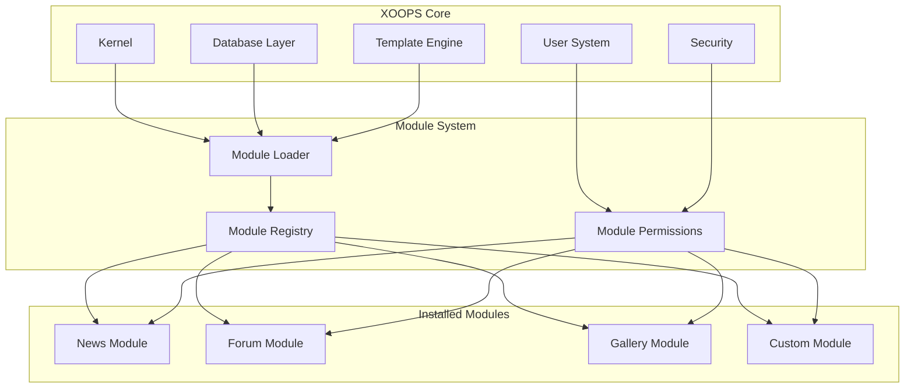
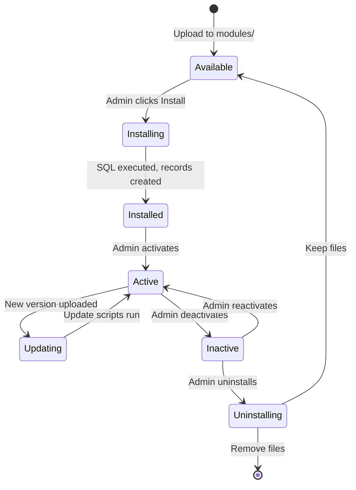

# ADR-001: Architettura Modulare

> Record di Decisione Architettura per la filosofia di design modulare del core di XOOPS.

---

## Stato

**Accettato** - Decisione fondamentale sin dalla creazione di XOOPS

---

## Contesto

XOOPS (eXtensible Object-Oriented Portal System) aveva bisogno di un'architettura che potesse:

1. Permettere agli sviluppatori di terze parti di estendere la funzionalità
2. Consentire agli amministratori del sito di personalizzare senza codifica
3. Supportare sviluppo e aggiornamenti indipendenti
4. Fornire isolamento tra diverse funzionalità
5. Scalare da blog semplici a portali complessi

Il paesaggio dei CMS dei primi anni 2000 offriva sistemi monolitici che erano difficili da personalizzare ed estendere.

---

## Diagramma Decisione



---

## Decisione

Implementeremo un'**architettura modulare** dove:

### 1. Il Core Fornisce Infrastruttura
- Astrazione database
- Autenticazione utente e permessi
- Rendering template (Smarty)
- Utilità di sicurezza
- Generazione form
- Utilità comuni

### 2. I Moduli Sono Autonomi
Ogni modulo:
- Ha la propria struttura di directory
- Contiene le proprie classi, template, SQL
- Definisce la propria configurazione
- Può essere installato/disinstallato indipendentemente
- Ha tracciamento versione

### 3. Struttura Modulo Standard
```
modules/modulename/
├── admin/                  # Interfaccia admin
│   ├── index.php
│   └── menu.php
├── class/                  # Classi PHP
├── include/                # File Include
├── language/               # Traduzioni
├── sql/                    # Schema database
├── templates/              # Template Smarty
├── blocks/                 # Definizioni blocchi
├── xoops_version.php       # Manifest modulo
├── index.php               # Punto ingresso
└── header.php              # Bootstrap modulo
```

### 4. Manifest Modulo (xoops_version.php)
```php
<?php
$modversion['name']        = 'Module Name';
$modversion['version']     = '1.0.0';
$modversion['description'] = 'Module description';
$modversion['dirname']     = basename(__DIR__);
$modversion['hasMain']     = 1;
$modversion['hasAdmin']    = 1;
$modversion['sqlfile']['mysql'] = 'sql/mysql.sql';
$modversion['tables']      = ['modulename_table1'];
$modversion['templates']   = [...];
$modversion['config']      = [...];
$modversion['blocks']      = [...];
```

### 5. Comunicazione Moduli
- Attraverso API core (handler, event)
- Relazioni database
- Preload hook
- Servizi condivisi

---

## Ciclo Vita Modulo



---

## Conseguenze

### Positivo

1. **Estensibilità**: Migliaia di moduli creati dalla comunità
2. **Indipendenza**: I moduli possono essere sviluppati separatamente
3. **Flessibilità**: I siti possono mischiare e abbinare funzionalità
4. **Manutenibilità**: Gli aggiornamenti non influenzano altri moduli
5. **Marketplace**: L'ecosistema dei moduli è emerso
6. **Curva di apprendimento**: Gli sviluppatori imparano un modello

### Negativo

1. **Sovraccarico**: Ogni modulo ha costo bootstrap
2. **Duplicazione**: Il codice comune può essere ripetuto
3. **Integrazione**: Le funzionalità cross-modulo richiedono un design attentato
4. **Controllo versione**: La gestione della compatibilità dei moduli è necessaria
5. **Varianza qualità**: La qualità del modulo di terze parti varia

### Neutrale

1. **Database**: Ogni modulo gestisce le proprie tabelle
2. **Template**: Il tema deve adattarsi a vari moduli
3. **Aggiornamenti**: Core e moduli si aggiornano indipendentemente

---

## Alternative Considerate

### 1. Architettura Monolitica
**Rifiutato** - Troppo rigido, difficile da personalizzare

### 2. Architettura Plugin (stile WordPress)
**Parzialmente adottato** - I blocchi e i preload forniscono hook simili a plugin all'interno dei moduli

### 3. Architettura Componenti (stile Joomla)
**Rifiutato** - Più complesso, meno user-friendly per gli sviluppatori

### 4. Microservizi
**Non applicabile** - Troppo complesso per l'era dell'hosting condiviso

---

## Decisioni Correlate

- ADR-002: Accesso Database Orientato agli Oggetti
- ADR-003: Motore Template Smarty
- ADR-005: Sistema Permessi

---

## Riferimenti

- Cronologia Progetto XOOPS
- Pattern di Architettura Applicazione PHP
- Studi Confronto CMS (2001-2005)

---

#xoops #architecture #adr #modules #design-decision
