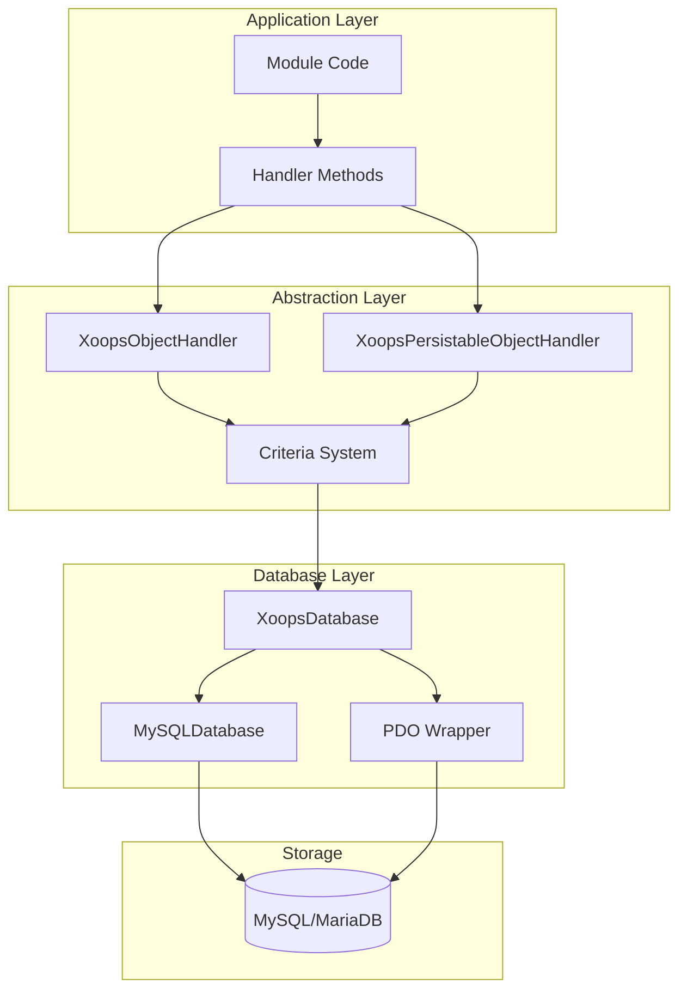
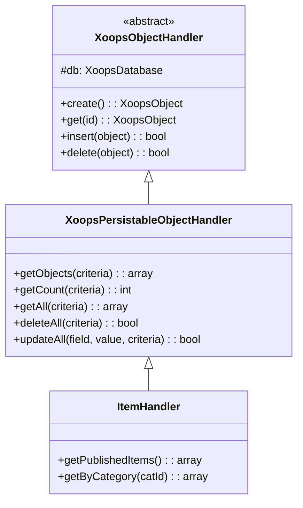
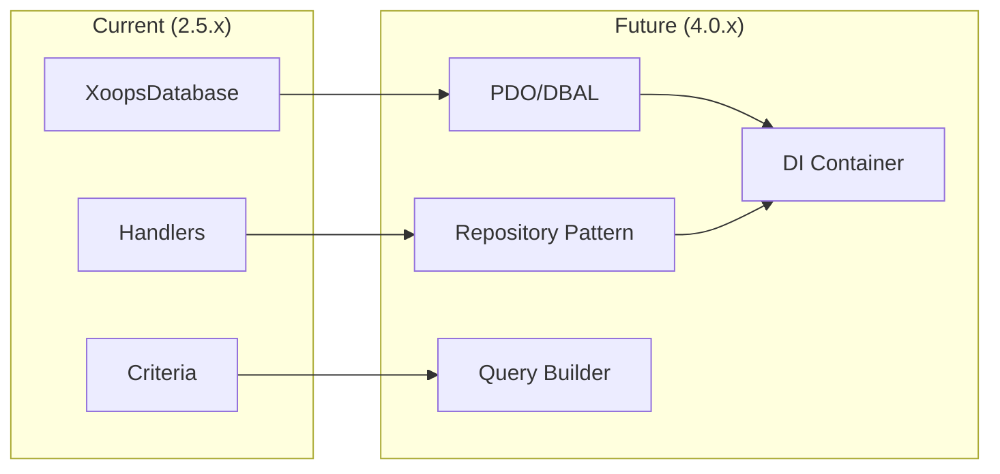

# ADR-002: Astrazione Database

> Record di Decisione Architettura per il pattern di accesso database orientato agli oggetti di XOOPS.

---

## Stato

**Accettato** - Pattern core dal XOOPS 2.0

---

## Contesto

XOOPS aveva bisogno di una strategia di interazione database che potesse:

1. Astrarre la sintassi SQL specifica del database
2. Fornire operazioni CRUD coerenti in tutti i moduli
3. Abilitare la sanitizzazione e l'escaping automatici dei dati
4. Supportare i futuri cambiamenti del motore database
5. Semplificare le operazioni comuni per gli sviluppatori

Le alternative erano:
- SQL grezzo in tutto il codebase
- ORM completo (Doctrine, Eloquent)
- Astrazione personalizzata leggera

---

## Diagramma Decisione



---

## Decisione

Implementeremo un **Handler Pattern** con:

### 1. XoopsObject - Contenitore Dati

Ogni entità dati estende XoopsObject:

```php
class Item extends XoopsObject
{
    public function __construct()
    {
        $this->initVar('id', XOBJ_DTYPE_INT, null, false);
        $this->initVar('title', XOBJ_DTYPE_TXTBOX, '', true, 255);
        $this->initVar('content', XOBJ_DTYPE_TXTAREA, '', false);
        $this->initVar('status', XOBJ_DTYPE_INT, 0, false);
    }
}
```

### 2. Handler - Gestore Operazioni

Ogni oggetto ha un handler corrispondente:

```php
class ItemHandler extends XoopsPersistableObjectHandler
{
    public function __construct($db)
    {
        parent::__construct($db, 'mymodule_items', Item::class, 'id', 'title');
    }

    // Metodi CRUD ereditati:
    // - create(), get(), insert(), delete()
    // - getObjects(), getCount(), getAll()
}
```

### 3. Criteria - Query Builder

Condizioni query orientate agli oggetti:

```php
$criteria = new CriteriaCompo();
$criteria->add(new Criteria('status', 1));
$criteria->add(new Criteria('created', time() - 86400, '>='));
$criteria->setSort('created');
$criteria->setOrder('DESC');
$criteria->setLimit(10);

$items = $handler->getObjects($criteria);
```

---

## Costanti Tipo Dati

```php
// Tipi di variabile con sanitizzazione automatica
XOBJ_DTYPE_INT       // Integer
XOBJ_DTYPE_TXTBOX    // Testo una linea (escaped)
XOBJ_DTYPE_TXTAREA   // Testo multilinea (escaped)
XOBJ_DTYPE_EMAIL     // Validazione email
XOBJ_DTYPE_URL       // Validazione URL
XOBJ_DTYPE_ARRAY     // Array serializzato
XOBJ_DTYPE_OTHER     // Nessuna elaborazione
XOBJ_DTYPE_FLOAT     // Virgola mobile
```

---

## Eredità Handler



---

## Conseguenze

### Positivo

1. **Coerenza**: Tutti i moduli usano lo stesso pattern
2. **Sicurezza**: L'escaping automatico previene l'iniezione SQL
3. **Semplicità**: Le operazioni comuni richiedono codice minimo
4. **Manutenibilità**: I cambiamenti al livello database non influenzano i moduli
5. **Testabilità**: I handler possono essere mock per il test

### Negativo

1. **Prestazioni**: Sovraccarico di astrazione extra
2. **Complessità**: Curva di apprendimento per nuovi sviluppatori
3. **Limitazioni**: Le query complesse possono necessitare SQL grezzo
4. **Problema N+1**: Nessun caricamento eager incorporato

### Mitigazioni

- **Prestazioni**: Memorizza nella cache gli oggetti frequentemente accessibili
- **Query complesse**: Consenti SQL grezzo quando necessario
- **N+1**: Usa getAll() con criterio appropriato

---

## Evoluzione a XOOPS 4.0



Piani XOOPS 4.0:
- Doctrine DBAL per astrazione database
- Pattern Repository che sostituisce i handler
- Query builder per query complesse
- Integrazione contenitore PSR-11 completa

---

## Esempi di Codice

### CRUD Base

```php
$helper = Helper::getInstance();
$handler = $helper->getHandler('Item');

// Create
$item = $handler->create();
$item->setVar('title', 'New Item');
$handler->insert($item);

// Read
$item = $handler->get($id);
$title = $item->getVar('title');

// Update
$item->setVar('title', 'Updated Title');
$handler->insert($item);

// Delete
$handler->delete($item);
```

### Query Complessa

```php
$criteria = new CriteriaCompo();
$criteria->add(new Criteria('status', 'published'));
$criteria->add(new Criteria('category_id', '(1,2,3)', 'IN'));
$criteria->add(new Criteria('created', strtotime('-30 days'), '>='));
$criteria->setSort('views');
$criteria->setOrder('DESC');
$criteria->setLimit(10);
$criteria->setStart(0);

$items = $handler->getObjects($criteria);
$total = $handler->getCount($criteria);
```

---

## Decisioni Correlate

- ADR-001: Architettura Modulare
- ADR-003: Motore Template Smarty

---

## Riferimenti

- Martin Fowler - Patterns of Enterprise Application Architecture
- Concetti Domain-Driven Design
- Pattern Active Record vs Data Mapper

---

#xoops #architecture #adr #database #handler #design-decision
