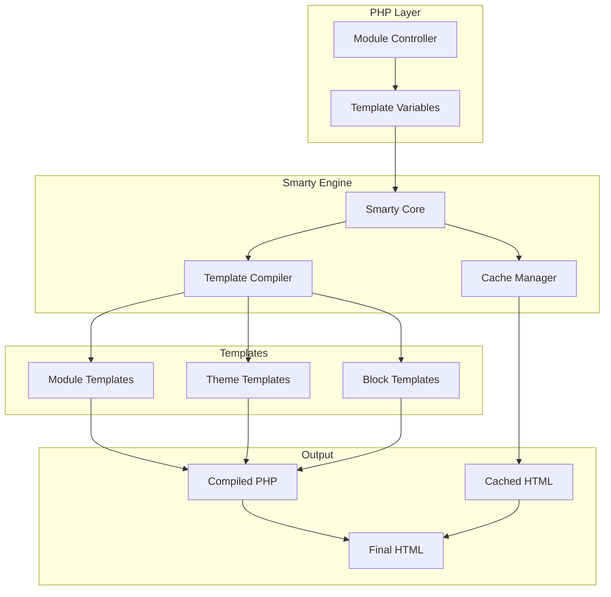
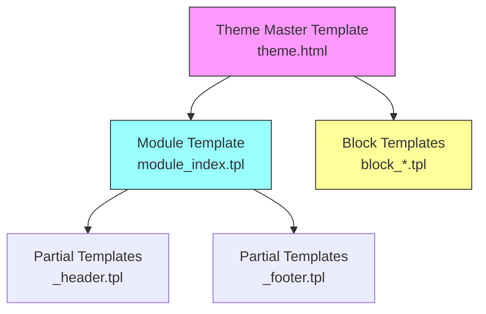
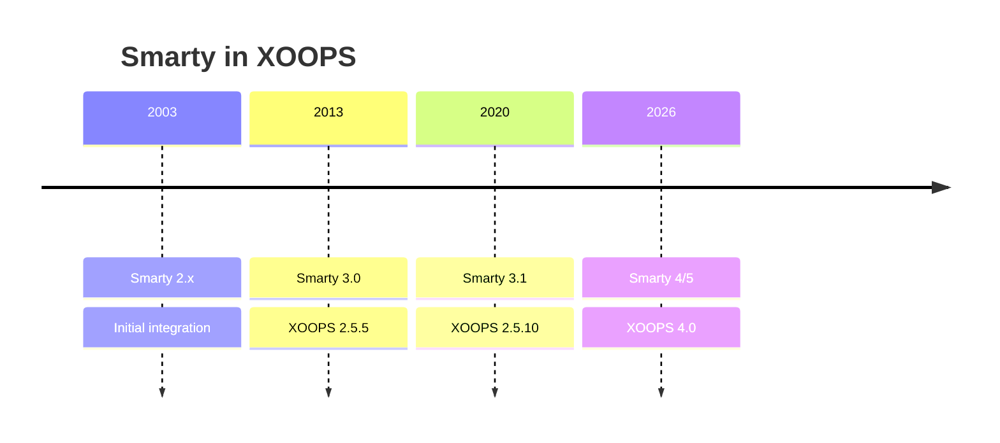

# ADR-003: Motore Template (Smarty)

> Record di Decisione Architettura per l'adozione del motore template Smarty di XOOPS.

---

## Stato

**Accettato** - Decisione core dal XOOPS 2.0

**In Evoluzione** - Migrazione a Smarty 4/5 pianificata per XOOPS 4.0

---

## Contesto

XOOPS aveva bisogno di una soluzione di templating che potesse:

1. Separare la presentazione dalla logica di business
2. Consentire ai designer di temi di lavorare senza conoscenze PHP
3. Supportare l'ereditarietà dei template e gli include
4. Fornire caching per le prestazioni
5. Abilitare template personalizzabili dall'utente
6. Supportare l'internazionalizzazione

---

## Diagramma Decisione



---

## Decisione

Utilizzeremo **Smarty** come motore template perché:

### 1. Separazione dei Compiti

```php
// PHP (Controller) - Logica di business
$items = $itemHandler->getPublishedItems();
$xoopsTpl->assign('items', $items);

// Smarty (View) - Presentazione
// templates/items.tpl
```

```smarty
{* Template Smarty - Nessuna logica PHP *}
<{foreach item=item from=$items}>
    <article>
        <h2><{$item.title}></h2>
        <p><{$item.summary}></p>
    </article>
<{/foreach}>
```

### 2. Delimitatori XOOPS

XOOPS usa `<{` e `}>` invece del standard `{` `}`:

```smarty
{* Smarty Standard *}
{$variable}

{* Smarty XOOPS - Evita conflitti JavaScript *}
<{$variable}>
```

### 3. Gerarchia Template



### 4. Memorizzazione Template

- **Database**: Template personalizzati memorizzati per capacità di ripristino
- **File System**: Template originali in directory moduli
- **Cache**: Template compilati per prestazioni

---

## Configurazione Smarty

```php
// Inizializzazione Smarty XOOPS
$xoopsTpl = new XoopsTpl();

// Delimitatori personalizzati
$xoopsTpl->left_delim = '<{';
$xoopsTpl->right_delim = '}>';

// Caching
$xoopsTpl->caching = XOOPS_TEMPLATE_CACHE;
$xoopsTpl->cache_lifetime = 3600;

// Sicurezza
$xoopsTpl->security_policy = new Smarty_Security($xoopsTpl);
$xoopsTpl->security_policy->php_functions = [];
$xoopsTpl->security_policy->php_modifiers = ['escape', 'count'];
```

---

## Funzionalità Template Utilizzate

### Variabili

```smarty
{* Variabile semplice *}
<{$title}>

{* Proprietà oggetto *}
<{$item.title}>

{* Con modificatore *}
<{$content|truncate:200:'...'}>

{* Output escaped *}
<{$userInput|escape:'html'}>
```

### Strutture di Controllo

```smarty
{* Condizionale *}
<{if $isAdmin}>
    <a href="admin.php">Admin</a>
<{elseif $isUser}>
    <a href="profile.php">Profile</a>
<{else}>
    <a href="login.php">Login</a>
<{/if}>

{* Loop *}
<{foreach item=item from=$items name=itemloop}>
    <{$smarty.foreach.itemloop.index}>: <{$item.title}>
<{/foreach}>
```

### Include

```smarty
{* Includi un altro template *}
<{include file="db:mymodule_header.tpl"}>

{* Includi con variabili *}
<{include file="db:mymodule_item.tpl" item=$currentItem}>

{* Includi da tema *}
<{include file="file:$theme_path/partials/sidebar.tpl"}>
```

---

## Conseguenze

### Positivo

1. **Amichevole per Designer**: Sintassi simile a HTML
2. **Caching**: Caching template incorporato
3. **Sicurezza**: Isolamento codice PHP
4. **Flessibilità**: Modificatori, funzioni, plugin
5. **Personalizzazione**: Gli utenti possono modificare i template
6. **Comunità**: Grande ecosistema Smarty

### Negativo

1. **Curva di apprendimento**: Sintassi specifica di Smarty
2. **Sovraccarico**: Passo di compilazione richiesto
3. **Debug**: Gli errori di template possono essere criptici
4. **Problemi versione**: Modifiche di rilievo tra le versioni

### Mitigazioni

- **Apprendimento**: Documentazione completa
- **Prestazioni**: Caching aggressivo
- **Debug**: Console debug, messaggi di errore chiari
- **Versioni**: Livello di compatibilità in XOOPS

---

## Cronologia Versioni



---

## Migrazione: Smarty 3 a 4/5

### Modifiche di Rilievo

```smarty
{* Smarty 3 - Deprecato *}
<{php}>echo date('Y');<{/php}>

{* Smarty 4+ - Usa modificatori o assegna da PHP *}
<{$current_year}>

{* Smarty 3 - {section} deprecato *}
<{section name=i loop=$items}>
    <{$items[i].title}>
<{/section}>

{* Smarty 4+ - Usa {foreach} *}
<{foreach $items as $item}>
    <{$item.title}>
<{/foreach}>
```

### Livello di Compatibilità

XOOPS fornisce un livello di compatibilità per transizioni fluide:

```php
// XoopsTpl estende Smarty con metodi di compatibilità
class XoopsTpl extends Smarty
{
    public function assign($tpl_var, $value = null)
    {
        // Gestisce sia la sintassi Smarty 3 che 4
        return parent::assign($tpl_var, $value);
    }
}
```

---

## Alternative Considerate

### 1. Twig
**Pro**: Moderno, ecosistema Symfony
**Contro**: Sintassi diversa, sforzo di migrazione
**Decisione**: Possibile opzione futura per XOOPS 3.x

### 2. Blade (Laravel)
**Pro**: Sintassi pulita, popolare
**Contro**: Specifico di Laravel
**Decisione**: Non adatto per uso autonomo

### 3. Template PHP Nativi
**Pro**: Nessuna curva di apprendimento, veloce
**Contro**: Rischi di sicurezza, nessuna separazione
**Decisione**: Rifiutato per manutenibilità

---

## Decisioni Correlate

- ADR-001: Architettura Modulare
- ADR-002: Astrazione Database

---

## Riferimenti

- Documentazione Smarty: https://www.smarty.net/docs/en/
- Guida Sistema Template XOOPS
- Pattern MVC nelle Applicazioni Web

---

#xoops #architecture #adr #smarty #templates #design-decision
