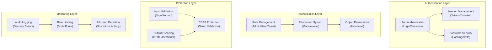

# ADR-004: Architettura Sistema Sicurezza

> Architettura di sicurezza completa per XOOPS CMS che protegge dalle minacce moderne.

---

## Stato

**Accettato** - Livello di sicurezza core dal XOOPS 2.5

---

## Contesto

### Dichiarazione del Problema

XOOPS ha bisogno di un sistema di sicurezza robusto che:

1. **Proteggi dalle vulnerabilità web comuni** (OWASP Top 10)
2. **Fornisci controllo permessi granulare** sui moduli
3. **Abilita autenticazione utente sicura** con standard moderni
4. **Previeni violazioni dati** e accesso non autorizzato
5. **Supporta controllo accesso multi-livello** (admin, moderatore, utente, ospite)
6. **Si integra con tutti i moduli** senza problemi

### Minacce Attuali

Gli attacchi web moderni includono:

- **Iniezione SQL** - SQL malevolo nell'input utente
- **XSS (Cross-Site Scripting)** - JavaScript iniettato nelle pagine
- **CSRF (Cross-Site Request Forgery)** - Invii modulo non autorizzati
- **Bypass autenticazione** - Gestione sessione/password debole
- **Bypass autorizzazione** - Escalation privilegi
- **Esposizione dati** - Dati sensibili in URL, log o cache

### Requisiti Sicurezza XOOPS

1. Autenticazione utente e gestione sessione
2. Controllo accesso basato su ruolo (RBAC)
3. Sistema permessi per moduli e oggetti
4. Validazione input e output escaping
5. Protezione contro attacchi comuni
6. Logging audit di eventi di sicurezza
7. Gestione password sicura
8. Protezione token CSRF

---

## Decisione

### Architettura Sicurezza Core



---

## Componenti Sicurezza

### 1. Sistema Autenticazione

**Processo Login Utente:**

```php
<?php
// 1. Valida credenziali
$user = $userHandler->findByLogin($username);
if (!$user || !password_verify($password, $user->getVar('pass'))) {
    throw new AuthenticationException('Invalid credentials');
}

// 2. Controlla se account è attivo
if (!$user->getVar('uactive')) {
    throw new AuthenticationException('Account inactive');
}

// 3. Crea sessione sicura
session_regenerate_id(true);
$_SESSION['uid'] = $user->getVar('uid');
$_SESSION['token'] = bin2hex(random_bytes(32));
$_SESSION['created'] = time();

// 4. Registra il login
$this->auditLog('USER_LOGIN', $user->getVar('uid'));
```

**Sicurezza Password:**

```php
<?php
// Usa password_hash (non MD5 o SHA1)
$hashed = password_hash($password, PASSWORD_BCRYPT, [
    'cost' => 12, // Costo alto = brute force lento
]);

// Verifica password
if (!password_verify($inputPassword, $hashed)) {
    throw new Exception('Invalid password');
}

// Rehash se algoritmo o costo è cambiato
if (password_needs_rehash($hashed, PASSWORD_BCRYPT, ['cost' => 12])) {
    $newHash = password_hash($password, PASSWORD_BCRYPT, ['cost' => 12]);
    $user->setVar('pass', $newHash);
    $userHandler->insert($user);
}
```

### 2. Gestione Sessione

**Gestione Sessione Sicura:**

```php
<?php
// Configurazione sessione
ini_set('session.cookie_httponly', true);  // Nessun accesso JS
ini_set('session.cookie_secure', true);     // Solo HTTPS
ini_set('session.cookie_samesite', 'Strict'); // Protezione CSRF
ini_set('session.gc_maxlifetime', 3600);   // Timeout 1 ora
ini_set('session.sid_length', 64);         // ID sessione 64-char

// Valida sessione
function validateSession() {
    // Controlla timeout
    if (time() - $_SESSION['created'] > 3600) {
        session_destroy();
        throw new SessionExpiredException();
    }

    // Valida user agent (previeni session hijacking)
    if ($_SESSION['user_agent'] !== $_SERVER['HTTP_USER_AGENT']) {
        throw new SessionInvalidException();
    }

    // Valida IP (opzionale, può essere troppo severo)
    if (!in_array($_SERVER['REMOTE_ADDR'], $_SESSION['ips'])) {
        $_SESSION['ips'][] = $_SERVER['REMOTE_ADDR'];
    }
}
```

### 3. Autorizzazione (RBAC)

**Controllo Accesso Basato su Ruolo:**

```php
<?php
class XoopsUser {
    public function hasPermission(string $permissionName): bool
    {
        // Ottieni gruppi utente
        $groups = $this->getGroups();

        // Controlla se un gruppo ha permesso
        foreach ($groups as $groupId) {
            if ($this->checkGroupPermission($groupId, $permissionName)) {
                return true;
            }
        }

        return false;
    }

    /**
     * Gruppi utente e loro permessi
     * Admin: Accesso completo
     * Moderator: Gestione contenuti
     * User: Crea contenuti propri
     * Guest: Accesso solo lettura
     */
    private function checkGroupPermission(int $groupId, string $permission): bool
    {
        $permissions = [
            1 => ['admin_access'],                 // Gruppo Admin
            2 => ['moderate_content', 'edit_own'], // Gruppo Moderator
            3 => ['create_content', 'edit_own'],   // Gruppo User
            4 => [],                               // Gruppo Guest (no permissions)
        ];

        return in_array($permission, $permissions[$groupId] ?? []);
    }
}
```

### 4. Validazione Input

**Previeni Iniezione SQL e Errori Tipo:**

```php
<?php
// Usa sempre prepared statement
$sql = 'SELECT * FROM users WHERE id = ?';
$result = $db->query($sql, [$userId]); // ✅ Sicuro

// Validazione input
function validateUserInput(array $data): array
{
    return [
        'email' => filter_var($data['email'] ?? '', FILTER_VALIDATE_EMAIL),
        'age' => filter_var($data['age'] ?? 0, FILTER_VALIDATE_INT),
        'website' => filter_var($data['website'] ?? '', FILTER_VALIDATE_URL),
        'title' => substr(trim($data['title'] ?? ''), 0, 255),
    ];
}

// Classe Safe Input XOOPS
$safe = \Xmf\Request::getHtmlRequest('var_name', '');
$int = \Xmf\Request::getInt('page', 1);
```

### 5. Output Escaping

**Previeni Attacchi XSS:**

```php
<?php
// In template PHP
echo htmlspecialchars($userInput, ENT_QUOTES, 'UTF-8');

// In template Smarty (escaping automatico)
<{$user_input}>  {* Escaped di default *}
<{$html|escape:false}>  {* Solo quando necessario *}

// Contesto JavaScript
<script>
var message = "<{$userMessage|escape:'javascript'}>";
</script>

// Contesto URL
<a href="<{$url|escape:'url'}>">Link</a>
```

### 6. Protezione CSRF

**Prevenzione Cross-Site Request Forgery:**

```php
<?php
// Genera token CSRF
session_start();
if (empty($_SESSION['csrf_token'])) {
    $_SESSION['csrf_token'] = bin2hex(random_bytes(32));
}

// In form
<form method="POST">
    <input type="hidden" name="csrf_token" value="<{$csrf_token}>">
    <button type="submit">Submit</button>
</form>

// Valida token
if ($_SERVER['REQUEST_METHOD'] === 'POST') {
    if (hash_equals($_SESSION['csrf_token'], $_POST['csrf_token'] ?? '')) {
        // Processa form
    } else {
        throw new InvalidTokenException('CSRF token invalid');
    }
}
```

---

## Conseguenze

### Effetti Positivi

1. **Protezione Completa** - Copre classi di vulnerabilità principali
2. **Sicurezza a Livelli** - Molteplici livelli di difesa
3. **RBAC Flessibile** - Controllo permessi fine-grained
4. **Traccia Audit** - Traccia eventi di sicurezza
5. **Standard Industria** - Si allinea con raccomandazioni OWASP
6. **Integrazione Moduli** - Facile per i moduli di usare API sicurezza

### Effetti Negativi

1. **Complessità** - Più codice e configurazione necessaria
2. **Prestazioni** - Hashing e validazione aggiungono overhead
3. **Esperienza Utente** - La sicurezza è a volte scomoda
4. **Manutenzione** - Richiede aggiornamenti di sicurezza continui
5. **Training Richiesto** - Gli sviluppatori devono seguire le pratiche

### Rischi e Mitigazioni

| Rischio | Gravità | Mitigazione |
|------|----------|-----------|
| Sviluppatore ignora sicurezza | Alta | Code review, formazione sicurezza |
| Nuove vulnerabilità scoperte | Media | Audit di sicurezza regolari, aggiornamenti |
| Impatto prestazioni | Bassa | Ottimizza percorsi caldi, caching |
| Permessi eccessivamente complessi | Media | Documentazione chiara, esempi |

---

## Best Practice Sicurezza

### Per Sviluppatori Moduli

```php
<?php
// ✅ FARE: Usa prepared statement
$result = $db->prepare('SELECT * FROM table WHERE id = ?')->execute([$id]);

// ❌ NON FARE: Concatena query
$result = $db->query("SELECT * FROM table WHERE id = $id");

// ✅ FARE: Esegui output escape
echo htmlspecialchars($user_input, ENT_QUOTES, 'UTF-8');

// ❌ NON FARE: Restituisci dati utente grezzo
echo $user_input;

// ✅ FARE: Controlla permessi
if (!$user->hasPermission('edit_content')) {
    throw new PermissionException();
}

// ❌ NON FARE: Confida nei ruoli utente direttamente
if ($_POST['is_admin']) {
    // Rendi utente admin - SECURITY HOLE!
}

// ✅ FARE: Valida tipi input
$page = (int)$_GET['page'];

// ❌ NON FARE: Usa valori non fiduciosi direttamente
$sql .= " LIMIT " . $_GET['limit'];
```

---

## Alternative Considerate

### OAuth/OpenID Connect

**Perché non scelto inizialmente:** Troppo complesso per ambiente shared hosting, ma buono per futura integrazione con sistemi auth esterni.

### Autenticazione Due Fattori (2FA)

**Stato:** Accettato come estensione, non requisito core, vedi ADR-006

### HTTP-only Session Cookie

**Stato:** Implementato - previene accesso JavaScript ai dati sessione

---

## Decisioni Correlate

- ADR-001: Architettura Modulare - I moduli implementano sicurezza
- ADR-005: Sistema Permessi Modulo
- ADR-006: Autenticazione Due Fattori (futuro)

---

## Riferimenti

### Standard Sicurezza

- [OWASP Top 10](https://owasp.org/www-project-top-ten/)
- [Framework Cibersicurezza NIST](https://www.nist.gov/cyberframework)
- [CWE Top 25](https://cwe.mitre.org/top25/)

### Sicurezza PHP

- [Manuale Sicurezza PHP](https://www.php.net/manual/en/security.php)
- [Documentazione password_hash()](https://www.php.net/manual/en/function.password-hash.php)
- [Sicurezza Sessione](https://www.php.net/manual/en/session.security.php)

### Strumenti

- [OWASP ZAP](https://www.zaproxy.org/) - Test di sicurezza
- [Snyk](https://snyk.io/) - Scansione vulnerabilità
- [SonarQube](https://www.sonarqube.org/) - Qualità codice

---

## Checklist Implementazione

- [ ] Sistema autenticazione utente
- [ ] Gestione sessione
- [ ] Password hashing (bcrypt)
- [ ] Controllo accesso basato su ruolo
- [ ] Permessi modulo
- [ ] Framework validazione input
- [ ] Output escaping (PHP + Smarty)
- [ ] Protezione token CSRF
- [ ] Logging audit sicurezza
- [ ] Rate limiting
- [ ] Header di sicurezza

---

## Cronologia Versioni

| Versione | Data | Modifiche |
|---------|------|---------|
| 1.0.0 | 2024-01-28 | Documento iniziale |

---

#xoops #adr #security #architecture #authentication #authorization #rbac
