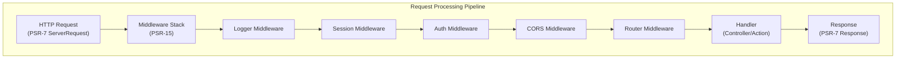

# ADR-005: Modello Middleware PSR-15 per XOOPS 4.0

> Adottare gestori di richieste HTTP PSR-15 (middleware) per una pipeline di elaborazione delle richieste migliorata.

:::caution[Proposta XOOPS 4.0 — Non disponibile in 2.5.x]
Questo ADR descrive un'**architettura proposta per XOOPS 4.0**. Il middleware PSR-15 **non è disponibile in XOOPS 2.5.x**. I moduli attuali di 2.5.x utilizzano il modello Page Controller con bootstrap `mainfile.php`. Vedere XOOPS Architecture per il ciclo di vita attuale della richiesta.
:::

---

## Stato

**Proposto** - In fase di valutazione per la release XOOPS 4.0

---

## Contesto

### Approccio Attuale

XOOPS 2.5 utilizza un approccio monolitico di gestione delle richieste:

```php
// Attuale: Elaborazione sequenziale
require_once 'mainfile.php';
// → Inizializzazione del kernel
// → Autenticazione utente
// → Caricamento moduli
// → Rendering pagina

// Tutto in un flusso, preoccupazioni miste
```

### Problemi con l'Approccio Attuale

1. **Preoccupazioni Miste** - Autenticazione, logging, routing tutti intrecciati
2. **Difficile da Testare** - Difficile testare in unità i singoli step di elaborazione delle richieste
3. **Difficile da Estendere** - I moduli possono solo agganciarsi via preload/events
4. **Scarsa Separazione** - Logica di elaborazione delle richieste dispersa nel codebase
5. **Non Componibile** - Non è facile concatenare o riordinare i step di elaborazione

### Cos'è il Middleware PSR-15?

PSR-15 definisce un'interfaccia standard per il middleware HTTP:

```php
<?php
interface RequestHandlerInterface {
    public function handle(ServerRequestInterface $request): ResponseInterface;
}

interface MiddlewareInterface {
    public function process(
        ServerRequestInterface $request,
        RequestHandlerInterface $handler
    ): ResponseInterface;
}
```

**Catena di Middleware:**

```
Richiesta
  ↓
[Logger] → registra richiesta
  ↓
[Auth] → convalida sessione utente
  ↓
[CORS] → controlla cross-origin
  ↓
[Router] → invia a handler
  ↓
[Handler] → genera risposta
  ↓
Risposta
```

---

## Decisione

### Adottare lo Stack Middleware PSR-15 per XOOPS 4.0

Implementare una pipeline di elaborazione delle richieste basata su middleware seguendo lo standard PSR-15.

### Panoramica dell'Architettura



### Componenti Middleware Principali

#### 1. Middleware dell'Applicazione (Livello Centrale)

```php
<?php
declare(strict_types=1);

namespace XoopsCore;

use Psr\Http\Message\ResponseInterface;
use Psr\Http\Message\ServerRequestInterface;
use Psr\Http\Server\MiddlewareInterface;
use Psr\Http\Server\RequestHandlerInterface;

class SessionMiddleware implements MiddlewareInterface
{
    public function process(
        ServerRequestInterface $request,
        RequestHandlerInterface $handler
    ): ResponseInterface {
        // 1. Recupera sessione (o avvia nuova)
        $sessionId = $request->getCookieParams()['PHPSESSID'] ?? null;
        $session = $this->sessionManager->load($sessionId);

        // 2. Allega sessione alla richiesta
        $request = $request->withAttribute('session', $session);

        // 3. Passa al prossimo middleware
        $response = $handler->handle($request);

        // 4. Imposta cookie di sessione se necessario
        if ($session->isModified()) {
            $response = $response->withAddedHeader(
                'Set-Cookie',
                'PHPSESSID=' . $session->getId() . '; HttpOnly; SameSite=Strict'
            );
        }

        return $response;
    }
}
```

#### 2. Middleware di Autenticazione

```php
<?php
class AuthMiddleware implements MiddlewareInterface
{
    public function process(
        ServerRequestInterface $request,
        RequestHandlerInterface $handler
    ): ResponseInterface {
        // Ottiene sessione dal middleware precedente
        $session = $request->getAttribute('session');

        // Autentica utente dalla sessione
        $user = $this->authenticate($session);

        // Allega utente alla richiesta
        $request = $request->withAttribute('user', $user);

        return $handler->handle($request);
    }

    private function authenticate(?Session $session): User
    {
        if ($session && $session->has('uid')) {
            return $this->userRepository->findById($session->get('uid'));
        }

        return new AnonymousUser();
    }
}
```

#### 3. Middleware di Autorizzazione

```php
<?php
class AuthorizationMiddleware implements MiddlewareInterface
{
    public function __construct(private AuthorizationChecker $checker)
    {
    }

    public function process(
        ServerRequestInterface $request,
        RequestHandlerInterface $handler
    ): ResponseInterface {
        $user = $request->getAttribute('user');
        $route = $request->getAttribute('route');

        // Controlla se l'utente ha autorizzazione per questa rotta
        if (!$this->checker->isGranted($user, $route)) {
            return new JsonResponse(
                ['error' => 'Unauthorized'],
                403
            );
        }

        return $handler->handle($request);
    }
}
```

#### 4. Middleware di Modulo

```php
<?php
// I moduli possono fornire il loro proprio middleware
class PublisherAccessMiddleware implements MiddlewareInterface
{
    public function process(
        ServerRequestInterface $request,
        RequestHandlerInterface $handler
    ): ResponseInterface {
        $user = $request->getAttribute('user');

        // Controllo accesso specifico del modulo
        if (!$user->hasPermission('publisher_view')) {
            return new HtmlResponse('Access denied', 403);
        }

        return $handler->handle($request);
    }
}
```

### Esempio di Implementazione

```php
<?php
// bootstrap.php - Configurazione applicazione

use Psr\Http\Message\ServerRequestInterface;
use Psr\Http\Server\RequestHandlerInterface;
use Xoops\Core\Middleware\{
    LoggerMiddleware,
    SessionMiddleware,
    AuthMiddleware,
    CorsMiddleware,
    ErrorHandlingMiddleware
};

// Crea pipeline middleware
$middlewareStack = [
    // 1. Gestione errori (più esterna)
    new ErrorHandlingMiddleware(),

    // 2. Logging
    new LoggerMiddleware($logger),

    // 3. Gestione CORS
    new CorsMiddleware($corsConfig),

    // 4. Gestione sessione
    new SessionMiddleware($sessionManager),

    // 5. Autenticazione
    new AuthMiddleware($userRepository),

    // 6. Autorizzazione
    new AuthorizationMiddleware($authChecker),

    // 7. Routing e dispatching
    new RoutingMiddleware($router),

    // 8. Middleware modulo (dinamico)
    ...$this->loadModuleMiddleware(),
];

// Elabora richiesta attraverso stack middleware
$request = ServerRequestFactory::fromGlobals();
$dispatcher = new MiddlewareDispatcher($middlewareStack);
$response = $dispatcher->dispatch($request);

// Invia risposta
http_response_code($response->getStatusCode());
foreach ($response->getHeaders() as $name => $values) {
    foreach ($values as $value) {
        header("$name: $value", false);
    }
}
echo $response->getBody();
```

### Integrazione Moduli

I moduli possono fornire middleware:

```php
<?php
// Modulo Publisher - xoops_version.php

$modversion['middleware'] = [
    'PublisherAccessMiddleware' => true,      // Caricamento automatico
    'PublisherLogMiddleware' => true,
];

// O personalizzato:
$modversion['middleware_factory'] = function() {
    return [
        new PublisherCacheMiddleware(),
        new PublisherPermissionMiddleware(),
    ];
};
```

---

## Conseguenze

### Effetti Positivi

1. **Separazione delle Preoccupazioni** - Ogni middleware gestisce una responsabilità
2. **Testabilità** - Facile testare in unità singoli componenti middleware
3. **Componibilità** - Il middleware può essere miscelato e riordinato
4. **Conforme ai Standard** - Utilizza standard PSR-15 e PSR-7
5. **Estensibilità** - I moduli possono facilmente aggiungere middleware personalizzato
6. **Debug** - Flusso di richiesta chiaro attraverso la pipeline
7. **Performance** - Possibilità di ottimizzare specifici livelli middleware
8. **Interoperabilità** - Può usare middleware PSR-15 di terze parti

### Effetti Negativi

1. **Curva di Apprendimento** - Gli sviluppatori devono comprendere PSR-15
2. **Overhead Performance** - Più chiamate di funzione nella pipeline
3. **Complessità** - Più parti mobili rispetto all'approccio monolitico
4. **Sforzo di Migrazione** - Richiede refactoring del codice esistente
5. **Dipendenze** - Richiede libreria HTTP PSR-7

### Rischi e Mitigazioni

| Rischio | Gravità | Mitigazione |
|------|----------|-----------|
| Catene middleware complesse | Media | Documentazione chiara, esempi |
| Degradazione performance | Media | Benchmark, ottimizzare hot path |
| Utilizzo scorretto dagli sviluppatori | Media | Code review, guida best practices |
| Cambios critici alla migrazione | Alta | Periodo deprecazione, helper |
| Problemi ordine middleware | Media | Grafo dipendenze chiaro |

---

## Piano di Implementazione

### Fase 1: Fondazione (Q2 2026)

- [ ] Implementare wrapper messaggio HTTP PSR-7
- [ ] Creare MiddlewareDispatcher
- [ ] Implementare middleware centrale (sessione, auth)
- [ ] Aggiornare kernel per usare middleware

### Fase 2: Integrazione (Q3 2026)

- [ ] Migrare funzionalità esistenti a middleware
- [ ] Aggiungere supporto middleware modulo
- [ ] Creare utility di test middleware
- [ ] Scrivere documentazione completa

### Fase 3: Migrazione (Q4 2026)

- [ ] Fornire livello compatibilità per codice precedente
- [ ] Aiutare moduli ad aggiornare a nuovo middleware
- [ ] Ottimizzazione performance
- [ ] Audit di sicurezza

### Fase 4: Release (Q1 2027)

- [ ] Release XOOPS 4.0 con middleware
- [ ] Deprecare sistema preload/hook precedente
- [ ] Feedback comunità e aggiornamenti

---

## Criteri di Successo

- [ ] Tutta la funzionalità centrale migrata a middleware
- [ ] Copertura test 90%+ per middleware
- [ ] Documentazione completa con esempi
- [ ] Performance entro 10% della versione precedente
- [ ] Moduli utilizzano con successo nuovo sistema middleware
- [ ] Tasso adozione comunità >80%

---

## Best Practices Middleware

### Da Fare

- Mantenere middleware focalizzato (responsabilità singola)
- Usare immutabilità (creare nuova richiesta/risposta)
- Gestire errori con grazia
- Documentare dipendenze
- Aggiungere type hints
- Scrivere test per middleware
- Usare interfacce standard PSR-15

### Da Non Fare

- Non modificare oggetti richiesta/risposta condivisi
- Non accedere direttamente a globali
- Non creare dipendenze sull'ordine middleware
- Non catturare tutte le eccezioni
- Non mescolare logica affari con middleware
- Non far fare troppo al middleware

---

## Esempi

### Middleware Personalizzato

```php
<?php
// Esempio: middleware rate limiting

use Psr\Http\Message\ResponseInterface;
use Psr\Http\Message\ServerRequestInterface;
use Psr\Http\Server\MiddlewareInterface;
use Psr\Http\Server\RequestHandlerInterface;

class RateLimitMiddleware implements MiddlewareInterface
{
    public function __construct(
        private RateLimiter $limiter,
        private int $limit = 100,
        private int $window = 3600
    ) {
    }

    public function process(
        ServerRequestInterface $request,
        RequestHandlerInterface $handler
    ): ResponseInterface {
        $user = $request->getAttribute('user');
        $identifier = $user->getId() ?? $request->getClientIp();

        // Controlla rate limit
        $remaining = $this->limiter->check($identifier, $this->limit, $this->window);

        if ($remaining < 0) {
            return new JsonResponse(
                ['error' => 'Rate limit exceeded'],
                429
            );
        }

        // Aggiungi header rate limit
        $response = $handler->handle($request);
        return $response
            ->withAddedHeader('X-RateLimit-Limit', (string)$this->limit)
            ->withAddedHeader('X-RateLimit-Remaining', (string)$remaining);
    }
}
```

---

## Decisioni Correlate

- ADR-001: Architettura Modulare - Fondazione
- ADR-004: Sistema di Sicurezza - Utilizza middleware per auth
- ADR-006: Autenticazione Doppio Fattore - Può essere middleware

---

## Riferimenti

### Standard PSR

- [PSR-7: HTTP Message Interface](https://www.php-fig.org/psr/psr-7/)
- [PSR-15: HTTP Server Request Handlers](https://www.php-fig.org/psr/psr-15/)

### Framework Middleware

- [Slim Framework](https://www.slimframework.com/) - Esempi middleware
- [Zend Expressive](https://docs.zendframework.com/zend-expressive/) - Framework PSR-15
- [Guzzle](https://docs.guzzlephp.org/) - Middleware client HTTP

### Strumenti

- [RelayPHP](https://relayphp.com/) - Libreria middleware
- [PSR-15 Middleware](https://github.com/middlewares) - Collezione middleware

---

## Cronologia Versioni

| Versione | Data | Cambiamenti |
|---------|------|---------|
| 1.0.0 | 2024-01-28 | Proposta iniziale |

---

#xoops #adr #psr-15 #middleware #architecture #psr-7
