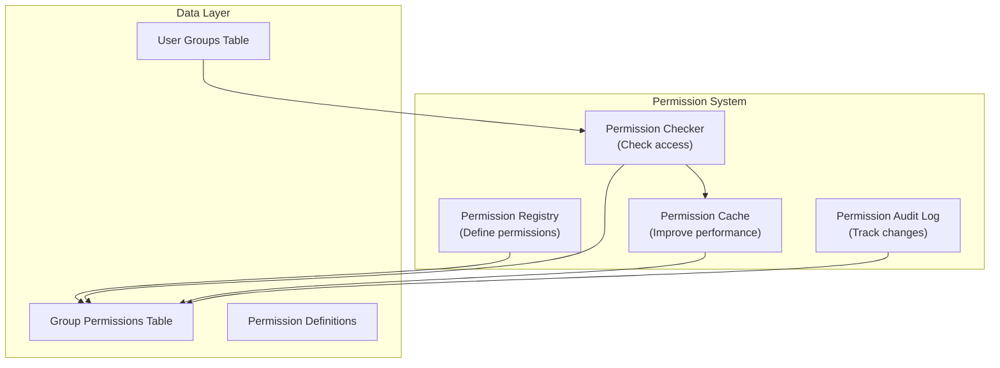

# ADR-006: Sistema Permessi Moduli

> Sistema di permessi gerarchico fine-grained per moduli XOOPS che abilita il controllo di accesso granulare.

---

## Stato

**Accettato** - Implementato in XOOPS 2.5.x e esteso in XOOPS 4.0

---

## Contesto

### Dichiarazione del Problema

I moduli XOOPS hanno bisogno di controlli permessi flessibili che consentano:

1. **Permessi a livello di modulo** - L'utente può accedere a questo modulo?
2. **Permessi a livello di oggetto** - L'utente può accedere a questo elemento specifico?
3. **Permessi a livello di azione** - L'utente può eseguire questa azione?
4. **Permessi personalizzati** - I moduli possono definire i propri permessi?

### Stato Attuale

XOOPS 2.5 usa il sistema XoopsGroupPermission:

```php
<?php
$perm_handler = xoops_getHandler('groupperm');
$isAllowed = $perm_handler->checkRight(
    'modulename',
    'action',
    $itemId,
    $groupId
);
```

### Sfide

1. **Query Complesse** - I controlli permessi richiedono join database
2. **Gerarchia Limitata** - Difficile creare gruppi di permessi
3. **Scarso Caching** - Nessun caching permessi incorporato
4. **Variazioni Modulo** - Ogni modulo implementa diversamente
5. **Prestazioni** - Molteplici query DB per i controlli permessi

---

## Decisione

### Implementare Sistema Permessi Gerarchico

Creare un sistema di permessi standardizzato, cachato che supporti:

1. **Permessi Gerarchici** - Eredità dai gruppi genitori
2. **Accesso Basato sui Ruoli** - Mappa permessi ai ruoli (admin, moderatore, utente, ospite)
3. **Permessi Oggetto** - Controllo fine-grained per elemento
4. **Caching** - Memorizza nella cache i permessi per ridurre le query
5. **Permessi Personalizzati** - I moduli definiscono i loro
6. **Traccia Audit** - Registra i cambiamenti dei permessi

### Gerarchia Permessi

```
User
  └── Group 1 (Admin)
      └── Permission: admin_module
      └── Permission: edit_all_items
      └── Permission: delete_all_items
  └── Group 2 (Moderator)
      └── Permission: moderate_comments
      └── Permission: edit_own_items
  └── Group 3 (User)
      └── Permission: view_published_items
      └── Permission: edit_own_items
  └── Group 4 (Guest)
      └── Permission: view_published_items
```

### Architettura



---

## Componenti Core

### 1. Definizione Permesso

```php
<?php
// Modulo definisce i suoi permessi in xoops_version.php

$modversion['permissions'] = [
    [
        'name' => 'module_view',
        'description' => 'Can view module',
        'level' => 'module',
    ],
    [
        'name' => 'item_view',
        'description' => 'Can view items',
        'level' => 'item',
    ],
    [
        'name' => 'item_create',
        'description' => 'Can create items',
        'level' => 'item',
    ],
    [
        'name' => 'item_edit',
        'description' => 'Can edit items',
        'level' => 'item',
    ],
    [
        'name' => 'item_delete',
        'description' => 'Can delete items',
        'level' => 'item',
    ],
    [
        'name' => 'admin_manage',
        'description' => 'Can manage module',
        'level' => 'admin',
    ],
];

// Permessi predefiniti per gruppo
$modversion['group_permissions'] = [
    // Gruppo Admin ottiene tutti i permessi
    '1' => [
        'module_view' => 1,
        'item_view' => 1,
        'item_create' => 1,
        'item_edit' => 1,
        'item_delete' => 1,
        'admin_manage' => 1,
    ],
    // Gruppo User
    '3' => [
        'module_view' => 1,
        'item_view' => 1,
        'item_create' => 1,
        'item_edit' => 0,
        'item_delete' => 0,
        'admin_manage' => 0,
    ],
    // Gruppo Guest
    '4' => [
        'module_view' => 1,
        'item_view' => 1,
        'item_create' => 0,
        'item_edit' => 0,
        'item_delete' => 0,
        'admin_manage' => 0,
    ],
];
```

### 2. Controllore Permessi

```php
<?php
declare(strict_types=1);

namespace XoopsCore\Permission;

class PermissionChecker
{
    private PermissionCache $cache;
    private PermissionRepository $repository;

    public function hasPermission(
        User $user,
        string $permissionName,
        ?int $itemId = null
    ): bool {
        // Controlla cache per primo
        $cacheKey = "perm_{$user->getId()}_{$permissionName}_{$itemId}";
        if ($this->cache->has($cacheKey)) {
            return $this->cache->get($cacheKey);
        }

        $hasPermission = false;

        // Controlla tutti i gruppi utente
        foreach ($user->getGroups() as $group) {
            if ($this->checkGroupPermission($group, $permissionName, $itemId)) {
                $hasPermission = true;
                break;
            }
        }

        // Memorizza nella cache il risultato
        $this->cache->set($cacheKey, $hasPermission, 3600);

        // Registra i controlli di accesso di alto livello
        if ($hasPermission && $this->shouldAuditLog($permissionName)) {
            $this->auditLog('PERMISSION_CHECKED', [
                'user_id' => $user->getId(),
                'permission' => $permissionName,
                'item_id' => $itemId,
                'result' => 'ALLOWED',
            ]);
        }

        return $hasPermission;
    }

    private function checkGroupPermission(
        Group $group,
        string $permissionName,
        ?int $itemId = null
    ): bool {
        $sql = 'SELECT COUNT(*) FROM ' . $this->table . '
                WHERE groupid = ?
                AND permission = ?
                AND itemid = ?
                AND granted = 1';

        $stmt = $this->db->prepare($sql);
        $stmt->execute([$group->getId(), $permissionName, $itemId ?? 0]);

        return $stmt->fetchColumn() > 0;
    }
}
```

### 3. Livelli Permessi

```php
<?php
// Diversi livelli di permessi con diversi ambiti

class PermissionLevel
{
    // Livello modulo: Influisce l'intero modulo
    public const LEVEL_MODULE = 'module';

    // Livello admin: Accesso pannello admin
    public const LEVEL_ADMIN = 'admin';

    // Livello elemento: Oggetti/elementi specifici
    public const LEVEL_ITEM = 'item';

    // Livello campo: Campi oggetto specifici
    public const LEVEL_FIELD = 'field';

    // Livello azione: Azioni/operazioni specifiche
    public const LEVEL_ACTION = 'action';
}
```

### 4. Permessi a Livello di Oggetto

```php
<?php
// Controllo fine-grained per elementi specifici

class Item extends XoopsObject
{
    /**
     * Controlla se l'utente può visualizzare questo elemento
     */
    public function canView(User $user): bool
    {
        // Gli elementi pubblici chiunque può visualizzare
        if ($this->getVar('status') === 'published') {
            return true;
        }

        // Il proprietario può sempre visualizzare i suoi elementi
        if ($this->getVar('user_id') === $user->getId()) {
            return true;
        }

        // Controlla i permessi del gruppo
        $permChecker = xoops_getActiveModule()->getPermissionChecker();
        return $permChecker->hasPermission(
            $user,
            'item_view',
            $this->getVar('id')
        );
    }

    public function canEdit(User $user): bool
    {
        // Il proprietario può modificare i suoi elementi
        if ($this->getVar('user_id') === $user->getId()) {
            return $permChecker->hasPermission($user, 'item_edit', $this->getVar('id'));
        }

        // Controlla se l'utente può modificare tutti gli elementi
        return $permChecker->hasPermission($user, 'item_edit_all', $this->getVar('id'));
    }

    public function canDelete(User $user): bool
    {
        return $permChecker->hasPermission($user, 'item_delete', $this->getVar('id'));
    }
}
```

### 5. Uso nei Controllori

```php
<?php
// Esempio: Controllore articolo

class ArticleController
{
    private PermissionChecker $permChecker;

    public function view(int $id, User $user): Response
    {
        $article = $this->repository->find($id);

        // Controlla permesso
        if (!$article->canView($user)) {
            throw new AccessDeniedException('Cannot view this article');
        }

        return new HtmlResponse($this->renderArticle($article));
    }

    public function edit(int $id, User $user): Response
    {
        $article = $this->repository->find($id);

        // Controlla permesso
        if (!$article->canEdit($user)) {
            throw new AccessDeniedException('Cannot edit this article');
        }

        // Gestisci invio modulo
        if ($this->request->isMethod('POST')) {
            $article->setVar('title', $this->request->getPost('title'));
            $article->setVar('content', $this->request->getPost('content'));
            $this->repository->insert($article);

            $this->auditLog('ARTICLE_EDITED', ['id' => $id, 'user_id' => $user->getId()]);

            // Invalida cache permessi
            $this->permChecker->clearCache($user->getId());

            return new RedirectResponse('/article/' . $id);
        }

        return new HtmlResponse($this->renderForm($article));
    }

    public function delete(int $id, User $user): Response
    {
        $article = $this->repository->find($id);

        if (!$article->canDelete($user)) {
            throw new AccessDeniedException('Cannot delete this article');
        }

        $this->repository->delete($article);

        $this->auditLog('ARTICLE_DELETED', ['id' => $id, 'user_id' => $user->getId()]);

        // Invalida cache
        $this->permChecker->clearCache($user->getId());

        return new JsonResponse(['success' => true]);
    }
}
```

---

## Conseguenze

### Effetti Positivi

1. **Controllo Granulare** - Gestione permessi fine-tuned
2. **Standardizzato** - Coerente tra i moduli
3. **Cachato** - Prestazioni migliorate con caching
4. **Controllabile** - Traccia chi ha cambiato cosa
5. **Flessibile** - Supporta permessi personalizzati
6. **Scalabile** - Gestisce gerarchie permessi complesse
7. **Testabile** - Facile da unit test

### Effetti Negativi

1. **Complessità** - Più codice da gestire
2. **Sovraccarico Database** - Più tabelle e join
3. **Invalidamento Cache** - Deve cancellare cache su modifiche
4. **Curva di Apprendimento** - Gli sviluppatori devono comprendere il sistema
5. **Prestazioni** - Se cache non correttamente configurato

### Rischi e Mitigazioni

| Rischio | Gravità | Mitigazione |
|------|----------|-----------|
| Permessi eccessivamente complessi | Media | Buoni predefiniti, documentazione |
| Cache dati stantii | Alta | TTL, invalidazione intelligente |
| Regressione prestazioni | Media | Benchmark, ottimizza query |
| Bypass permessi | Alta | Audit sicurezza, test |

---

## Pattern Design Permessi

### Pattern 1: Permessi Basati su Proprietario

```php
<?php
// L'utente può modificare i suoi elementi ma non quelli altrui

public function canEdit(User $user): bool
{
    // Il proprietario può sempre modificare
    if ($this->isOwner($user)) {
        return true;
    }

    // Controlla permessi gruppo per modificare elementi altrui
    return $this->permChecker->hasPermission($user, 'edit_all_items');
}

private function isOwner(User $user): bool
{
    return $this->getVar('user_id') === $user->getId();
}
```

### Pattern 2: Permessi Basati su Stato

```php
<?php
// Diversi permessi basati su stato

public function canView(User $user): bool
{
    switch ($this->getVar('status')) {
        case 'published':
            // Chiunque con permesso modulo può visualizzare
            return $this->permChecker->hasPermission($user, 'item_view');

        case 'draft':
            // Solo proprietario o admin possono visualizzare
            return $this->isOwner($user) ||
                   $this->permChecker->hasPermission($user, 'admin_manage');

        case 'archived':
            // Solo admin può visualizzare
            return $this->permChecker->hasPermission($user, 'admin_manage');

        default:
            return false;
    }
}
```

### Pattern 3: Permessi Basati su Ruoli

```php
<?php
// Controlla contro ruoli specifici

public function hasAdminRole(User $user): bool
{
    return $user->getGroups()->contains('admin_group');
}

public function hasModeratorRole(User $user): bool
{
    return $user->getGroups()->contains('moderator_group') ||
           $this->hasAdminRole($user);
}

public function canModerate(User $user): bool
{
    return $this->hasModeratorRole($user);
}
```

---

## Decisioni Correlate

- ADR-001: Architettura Modulare - I moduli definiscono permessi
- ADR-004: Sistema Sicurezza - Fondazione per la sicurezza
- ADR-005: Middleware - Può applicare permessi

---

## Riferimenti

### Modelli Permessi

- [RBAC (Role-Based Access Control)](https://en.wikipedia.org/wiki/Role-based_access_control)
- [ABAC (Attribute-Based Access Control)](https://en.wikipedia.org/wiki/Attribute-based_access_control)
- [ACL (Access Control List)](https://en.wikipedia.org/wiki/Access-control_list)

### Implementazione

- [Symfony Security](https://symfony.com/doc/current/security.html)
- [Laravel Authorization](https://laravel.com/docs/authorization)

---

## Checklist Implementazione

- [ ] Definisci livelli di permessi standard
- [ ] Crea classe PermissionChecker
- [ ] Implementa strategia caching
- [ ] Aggiungi logging audit
- [ ] Crea funzioni helper
- [ ] Scrivi test completi
- [ ] Documenta per sviluppatori
- [ ] Aggiorna tutti i moduli
- [ ] Ottimizzazione prestazioni
- [ ] Revisione sicurezza

---

## Cronologia Versioni

| Versione | Data | Modifiche |
|---------|------|---------|
| 1.0.0 | 2024-01-28 | Documento iniziale |

---

#xoops #adr #permissions #authorization #rbac #security
