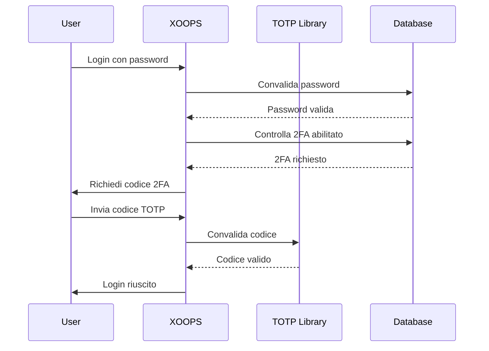

## Stato

Proposto

## Contesto

XOOPS ha bisogno di sicurezza migliorata per l'autenticazione utente. L'autenticazione doppio fattore (2FA) fornisce un livello di sicurezza aggiuntivo oltre le password, proteggendo gli account anche se le password sono compromesse.

Considerazioni chiave:
- Compatibilità retroattiva con autenticazione esistente
- Supporto per multipli metodi 2FA
- Esperienza utente durante setup e login
- Meccanismi di recupero per dispositivi smarriti
- Integrazione con sistema autorizzazioni esistente

## Decisione

Implementeremo TOTP (Time-based One-Time Password) come metodo 2FA primario con supporto per codici di backup.

### Approccio di Implementazione



### Schema Database

```sql
CREATE TABLE `{PREFIX}_users_2fa` (
    `user_id` INT(11) NOT NULL,
    `secret` VARCHAR(32) NOT NULL,
    `enabled` TINYINT(1) DEFAULT 0,
    `backup_codes` TEXT,
    `last_used` INT(11),
    `created` INT(11) NOT NULL,
    PRIMARY KEY (`user_id`),
    FOREIGN KEY (`user_id`) REFERENCES `{PREFIX}_users`(`uid`)
);
```

### Interfaccia Servizio

```php
interface TwoFactorAuthInterface
{
    public function enable(int $userId): TwoFactorSetup;
    public function disable(int $userId): void;
    public function verify(int $userId, string $code): bool;
    public function generateBackupCodes(int $userId): array;
    public function isEnabled(int $userId): bool;
}
```

### Integrazione Middleware

```php
class TwoFactorMiddleware implements MiddlewareInterface
{
    public function process(
        ServerRequestInterface $request,
        RequestHandlerInterface $handler
    ): ResponseInterface {
        $session = $request->getAttribute('session');

        if ($session->has('pending_2fa_user_id')) {
            // Utente deve completare 2FA
            if ($this->isVerificationRequest($request)) {
                return $handler->handle($request);
            }
            return new RedirectResponse('/2fa/verify');
        }

        return $handler->handle($request);
    }
}
```

## Conseguenze

### Positivi

- Sicurezza account significativamente migliorata
- Compatibilità standard industriale TOTP (Google Authenticator, Authy, ecc.)
- Codici di backup prevengono blocco account
- Facoltativo per utente - non forza adozione
- Middleware PSR-15 permette integrazione pulita

### Negativi

- Step login aggiuntivo impatta esperienza utente
- Utenti devono gestire app autenticatori
- Dispositivi smarriti richiedono processo di recupero
- Storage database aggiuntivo e query
- Richiede dipendenza libreria crittografica

### Percorso Migrazione

1. Aggiungere tabella database per dati 2FA
2. Implementare servizio TOTP con dipendenza libreria
3. Aggiungere middleware alla catena autenticazione
4. Creare UI setup e verifica
5. Opzione admin per richiedere 2FA per gruppi specifici

## Alternative Considerate

### OTP Basato su SMS

Rifiutato per:
- Vulnerabilità SIM swapping
- Costo gateway SMS
- Complessità verifica numero di telefono
- Preoccupazioni privacy

### Chiavi di Sicurezza Hardware (WebAuthn)

Differito per ADR futuro:
- Implementazione più complessa
- Supporto browser storicamente limitato
- Costo utente più alto
- Potrebbe essere aggiunto insieme a TOTP dopo

### OTP Basato su Email

Rifiutato per:
- Compromissione account email sconfitta
- Ritardi consegna impattano UX
- Problemi filtri spam

## Riferimenti

- [RFC 6238 - TOTP](https://tools.ietf.org/html/rfc6238)
- [Google Authenticator Key Format](https://github.com/google/google-authenticator/wiki/Key-Uri-Format)
- ../../02-Core-Concepts/Security/Security-Best-Practices - Linee guida sicurezza
- ../../02-Core-Concepts/Users-Permissions/Authentication - Documentazione sistema auth
