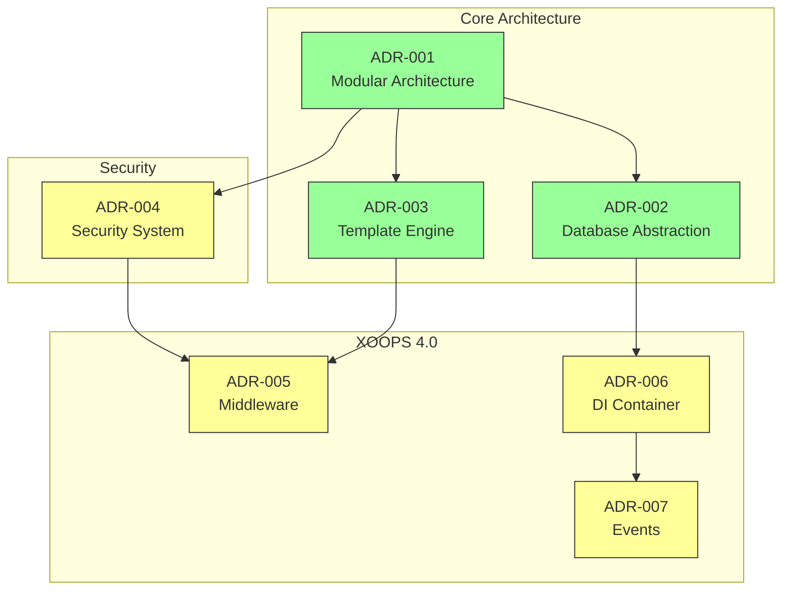
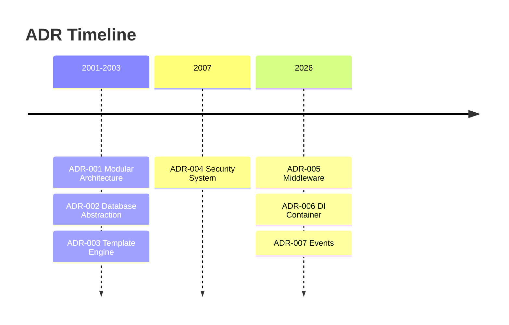

# 📋 Indice dei Record di Decisione Architettura

> Indice completo delle decisioni architettoniche che hanno modellato XOOPS CMS.

---

## Cosa sono i Record ADR?

I Record di Decisione Architettura (ADR) documentano significative decisioni architettoniche prese durante lo sviluppo di XOOPS. Catturano il contesto, la decisione e le conseguenze di ogni scelta, fornendo un contesto storico prezioso per i manutentori e i contributori.

---

## Legenda Stato ADR

| Stato | Significato |
|--------|---------|
| **Proposto** | In discussione, non ancora accettato |
| **Accettato** | La decisione è stata adottata |
| **Deprecato** | Non più consigliato |
| **Sostituito** | Sostituito da un altro ADR |

---

## ADR Attuali

### Decisioni Fondamentali

| ADR | Titolo | Stato | Impatto |
|-----|-------|--------|--------|
| ADR-001 | Architettura Modulare | Accettato | Core |
| ADR-002 | Accesso Database Orientato agli Oggetti | Accettato | Core |
| ADR-003 | Motore Template Smarty | Accettato | Core |

### ADR Pianificati (XOOPS 4.0)

| ADR | Titolo | Stato | Impatto |
|-----|-------|--------|--------|
| ADR-004 | Design Sistema Sicurezza | Proposto | Sicurezza |
| ADR-005 | Middleware PSR-15 | Proposto | Architettura |
| ADR-006 | Contenitore Dependency Injection | Proposto | Architettura |
| ADR-007 | Redesign Sistema Eventi | Proposto | Architettura |

---

## Relazioni ADR



---

## Sequenza Temporale



---

## Creazione di Nuovi ADR

Quando proponi una nuova decisione architetturale:

1. Copia il Modello ADR
2. Compila tutte le sezioni
3. Invia come Pull Request
4. Discussione in GitHub Issues
5. Aggiorna lo stato dopo la decisione

### Struttura Modello ADR

```markdown
# ADR-XXX: Titolo

## Stato
Proposto | Accettato | Deprecato | Sostituito

## Contesto
Quale è il problema che motiva questa decisione?

## Decisione
Quale è il cambiamento che stiamo proponendo?

## Conseguenze
Cosa diventa più facile o più difficile come risultato?

## Alternative Considerate
Quali altre opzioni sono state valutate?
```

---

## 🔗 Documentazione Correlata

- Concetti Core
- Linee Guida Contribuzione
- Roadmap XOOPS 4.0

---

#xoops #adr #architecture #index #decisions
