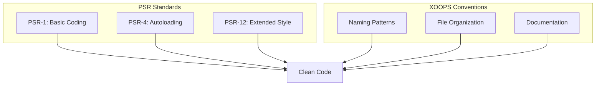

# Standard PHP

> XOOPS segue standard di codifica PSR-1, PSR-4, e PSR-12 con convenzioni specifiche di XOOPS.

---

## Panoramica Standard



---

## Struttura File

### PHP Tag

```php
<?php
// Usa sempre tag PHP completi, mai short tag
// Ometti tag di chiusura ?> in file PHP puri

declare(strict_types=1);

namespace XoopsModules\MyModule;

// Codice qui...
```

### Header File

```php
<?php

declare(strict_types=1);

/**
 * XOOPS - PHP Content Management System
 *
 * @package    XoopsModules\MyModule
 * @subpackage Class
 * @author     Your Name <email@example.com>
 * @copyright  2026 XOOPS Project
 * @license    GPL-2.0-or-later
 * @link       https://xoops.org
 */

namespace XoopsModules\MyModule;

use XoopsObject;
use XoopsPersistableObjectHandler;
```

---

## Convenzioni Naming

### Classi

```php
// PascalCase per nomi classe
class ItemHandler extends XoopsPersistableObjectHandler
{
    // ...
}

// Interfacce terminano con "Interface"
interface RepositoryInterface
{
    public function find(int $id): ?object;
}

// Trait terminano con "Trait"
trait TimestampTrait
{
    public function getCreatedAt(): \DateTimeInterface
    {
        // ...
    }
}

// Classi astratte prefisso "Abstract"
abstract class AbstractEntity
{
    // ...
}
```

### Metodi e Funzioni

```php
// camelCase per metodi
public function getActiveItems(): array
{
    // ...
}

// Verbi per metodi azione
public function createItem(array $data): Item
public function updateItem(int $id, array $data): bool
public function deleteItem(int $id): bool
public function findById(int $id): ?Item
public function hasPermission(string $permission): bool
public function isActive(): bool
public function canEdit(): bool
```

### Variabili e Proprietà

```php
class Item
{
    // camelCase per proprietà
    private int $itemId;
    private string $itemTitle;
    private bool $isPublished;
    private array $categoryIds;

    // camelCase per variabili
    public function process(): void
    {
        $itemCount = 0;
        $activeItems = [];
        $isValid = true;
    }
}
```

### Costanti

```php
// UPPER_SNAKE_CASE per costanti
class Config
{
    public const DEFAULT_ITEMS_PER_PAGE = 10;
    public const MAX_UPLOAD_SIZE = 10485760;
    public const CACHE_LIFETIME = 3600;
}

// O nelle chiamate define()
define('XOOPS_ROOT_PATH', '/path/to/xoops');
define('MYMODULE_VERSION', '1.0.0');
```

---

## Struttura Classe

```php
<?php

declare(strict_types=1);

namespace XoopsModules\MyModule;

use XoopsDatabase;
use XoopsPersistableObjectHandler;

/**
 * Handler per oggetti Item
 *
 * @package XoopsModules\MyModule
 */
class ItemHandler extends XoopsPersistableObjectHandler
{
    // 1. Costanti
    public const TABLE_NAME = 'mymodule_items';

    // 2. Proprietà (ordine visibilità: public, protected, private)
    public int $defaultLimit = 10;

    protected string $table;

    private XoopsDatabase $db;

    // 3. Costruttore
    public function __construct(?XoopsDatabase $db = null)
    {
        $this->db = $db ?? \XoopsDatabaseFactory::getDatabaseConnection();
        parent::__construct($this->db, self::TABLE_NAME, Item::class, 'id', 'title');
    }

    // 4. Metodi pubblici
    public function getPublishedItems(int $limit = 10): array
    {
        $criteria = new \CriteriaCompo();
        $criteria->add(new \Criteria('status', 'published'));
        $criteria->setLimit($limit);

        return $this->getObjects($criteria);
    }

    public function findBySlug(string $slug): ?Item
    {
        $criteria = new \Criteria('slug', $slug);
        $items = $this->getObjects($criteria);

        return $items[0] ?? null;
    }

    // 5. Metodi protetti
    protected function validateItem(Item $item): bool
    {
        // Logica validazione
        return true;
    }

    // 6. Metodi privati
    private function sanitizeInput(string $input): string
    {
        return htmlspecialchars($input, ENT_QUOTES, 'UTF-8');
    }
}
```

---

## Regole Formattazione

### Indentazione e Spacing

```php
// Usa 4 spazi per indentazione (non tab)
class Example
{
    public function method(): void
    {
        if ($condition) {
            // 4 spazi
            foreach ($items as $item) {
                // 8 spazi
                $this->process($item);
            }
        }
    }
}

// Una linea bianca tra metodi
public function methodOne(): void
{
    // ...
}

public function methodTwo(): void
{
    // ...
}

// Nessuno spazio finale
// File termina con singolo newline
```

### Lunghezza Linea

```php
// Massimo 120 caratteri per linea
// Spezza lunghe linee logicamente

// Lunghe chiamate metodo
$result = $this->someHandler->processComplexOperation(
    $parameter1,
    $parameter2,
    $parameter3,
    $parameter4
);

// Array lunghi
$config = [
    'option1' => 'value1',
    'option2' => 'value2',
    'option3' => 'value3',
];

// Lunghi condizionali
if ($condition1
    && $condition2
    && $condition3
) {
    // ...
}
```

### Strutture di Controllo

```php
// if/elseif/else
if ($condition) {
    // code
} elseif ($otherCondition) {
    // code
} else {
    // code
}

// switch
switch ($value) {
    case 1:
        doSomething();
        break;

    case 2:
        doSomethingElse();
        break;

    default:
        doDefault();
        break;
}

// try/catch
try {
    $result = $this->riskyOperation();
} catch (SpecificException $e) {
    $this->handleSpecific($e);
} catch (\Exception $e) {
    $this->handleGeneral($e);
} finally {
    $this->cleanup();
}

// foreach
foreach ($items as $key => $value) {
    // code
}

// for
for ($i = 0; $i < $count; $i++) {
    // code
}
```

---

## Dichiarazioni Tipo

```php
<?php

declare(strict_types=1);

class TypeExample
{
    // Tipi proprietà (PHP 7.4+)
    private int $id;
    private string $title;
    private ?string $description = null;
    private array $tags = [];
    private bool $isActive = false;

    // Costruttore con parametri tipizzati
    public function __construct(
        int $id,
        string $title,
        ?string $description = null
    ) {
        $this->id = $id;
        $this->title = $title;
        $this->description = $description;
    }

    // Dichiarazioni tipo ritorno
    public function getId(): int
    {
        return $this->id;
    }

    public function getTitle(): string
    {
        return $this->title;
    }

    // Tipo ritorno nullable
    public function getDescription(): ?string
    {
        return $this->description;
    }

    // Union type (PHP 8.0+)
    public function getValue(): int|string
    {
        return $this->value;
    }

    // Tipo ritorno void
    public function setTitle(string $title): void
    {
        $this->title = $title;
    }

    // Array ritorno con docblock per contenuti
    /**
     * @return Item[]
     */
    public function getItems(): array
    {
        return $this->items;
    }
}
```

---

## Documentazione

### DocBlock Classe

```php
/**
 * Gestisce operazioni CRUD per entità Article
 *
 * Questo handler fornisce metodi per creare, leggere, aggiornare,
 * e eliminare articoli dal database.
 *
 * @package    XoopsModules\Publisher
 * @subpackage Handler
 * @author     XOOPS Development Team
 * @since      1.0.0
 */
class ArticleHandler extends XoopsPersistableObjectHandler
{
```

### DocBlock Metodo

```php
/**
 * Recupera articoli per categoria
 *
 * Recupera articoli pubblicati appartenenti a categoria specifica,
 * ordinati per data creazione decrescente.
 *
 * @param int  $categoryId Identificativo categoria
 * @param int  $limit      Massimo articoli da ritornare
 * @param int  $offset     Offset iniziale per paginazione
 * @param bool $published  Ritorna solo articoli pubblicati
 *
 * @return Article[] Array di oggetti Article
 *
 * @throws \InvalidArgumentException Se ID categoria non è valido
 *
 * @since 1.0.0
 */
public function getByCategory(
    int $categoryId,
    int $limit = 10,
    int $offset = 0,
    bool $published = true
): array {
```

---

## Configurazione Strumenti

### PHP CS Fixer

```php
// .php-cs-fixer.php
<?php

$finder = PhpCsFixer\Finder::create()
    ->in(__DIR__ . '/class')
    ->in(__DIR__ . '/src');

return (new PhpCsFixer\Config())
    ->setRules([
        '@PSR12' => true,
        'array_syntax' => ['syntax' => 'short'],
        'ordered_imports' => ['sort_algorithm' => 'alpha'],
        'no_unused_imports' => true,
        'declare_strict_types' => true,
    ])
    ->setFinder($finder);
```

### PHPStan

```yaml
# phpstan.neon
parameters:
    level: 6
    paths:
        - class/
        - src/
    ignoreErrors:
        - '#Call to an undefined method XoopsObject::#'
```

---

## Documentazione Correlata

- Standard JavaScript
- Organizzazione Codice
- Linee Guida Pull Request

---

#xoops #php #coding-standards #psr #best-practices
