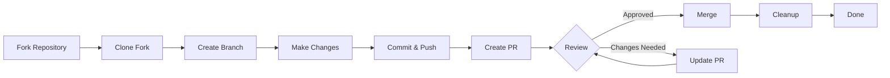

> Questa guida ti porta attraverso il processo completo di contribuzione a XOOPS, dal setup iniziale alla pull request unita.

---

## Prerequisiti

Prima di iniziare a contribuire, assicurati di avere:

- **Git** installato e configurato
- **Account GitHub** (gratuito)
- **PHP 7.4+** per sviluppo XOOPS
- **Composer** per gestione dipendenze
- Conoscenza base del workflow Git
- Familiarità con Codice di Condotta

---

## Step 1: Fai Fork del Repository

### Su Interfaccia Web GitHub

1. Naviga al repository (es. `XOOPS/XoopsCore27`)
2. Clicca il bottone **Fork** nell'angolo in alto a destra
3. Seleziona dove fare il fork (tuo account personale)
4. Aspetta che il fork sia completato

### Perché Fare Fork?

- Ottieni la tua copia su cui lavorare
- I manutentori non devono gestire molti branch
- Hai il controllo totale del tuo fork
- Le Pull Request riferiscono il tuo fork e il repository upstream

---

## Step 2: Clona il Tuo Fork Localmente

```bash
# Clona il tuo fork (sostituisci YOUR_USERNAME)
git clone https://github.com/YOUR_USERNAME/XoopsCore27.git
cd XoopsCore27

# Aggiungi remote upstream per tracciare il repository originale
git remote add upstream https://github.com/XOOPS/XoopsCore27.git

# Verifica che i remote siano impostati correttamente
git remote -v
# origin    https://github.com/YOUR_USERNAME/XoopsCore27.git (fetch)
# origin    https://github.com/YOUR_USERNAME/XoopsCore27.git (push)
# upstream  https://github.com/XOOPS/XoopsCore27.git (fetch)
# upstream  https://github.com/XOOPS/XoopsCore27.git (nofetch)
```

---

## Step 3: Configura Ambiente di Sviluppo

### Installa Dipendenze

```bash
# Installa dipendenze Composer
composer install

# Installa dipendenze di sviluppo
composer install --dev

# Per sviluppo modulo
cd modules/mymodule
composer install
```

### Configura Git

```bash
# Imposta la tua identità Git
git config user.name "Your Name"
git config user.email "your.email@example.com"

# Opzionale: Imposta configurazione Git globale
git config --global user.name "Your Name"
git config --global user.email "your.email@example.com"
```

### Esegui Test

```bash
# Assicurati che i test passano in stato pulito
./vendor/bin/phpunit

# Esegui suite test specifica
./vendor/bin/phpunit --testsuite unit
```

---

## Step 4: Crea Branch Feature

### Convenzione Naming Branch

Segui questo pattern: `<type>/<description>`

**Tipi:**
- `feature/` - Nuova funzionalità
- `fix/` - Bug fix
- `docs/` - Solo documentazione
- `refactor/` - Refactoring codice
- `test/` - Aggiunte test
- `chore/` - Manutenzione, tooling

**Esempi:**
```bash
# Branch feature
git checkout -b feature/add-two-factor-auth

# Branch bug fix
git checkout -b fix/prevent-xss-in-forms

# Branch documentazione
git checkout -b docs/update-api-guide

# Sempre branchia da upstream/main (o develop)
git checkout -b feature/my-feature upstream/main
```

### Mantieni Branch Aggiornato

```bash
# Prima di iniziare il lavoro, sincronizza con upstream
git fetch upstream
git merge upstream/main

# Dopo, se upstream è cambiato
git fetch upstream
git rebase upstream/main
```

---

## Step 5: Fai i Tuoi Cambiamenti

### Pratiche di Sviluppo

1. **Scrivi codice** seguendo Standard PHP
2. **Scrivi test** per nuova funzionalità
3. **Aggiorna documentazione** se necessario
4. **Esegui linter** e code formatter

### Controlli Qualità Codice

```bash
# Esegui tutti i test
./vendor/bin/phpunit

# Esegui con coverage
./vendor/bin/phpunit --coverage-html coverage/

# Esegui PHP CS Fixer
./vendor/bin/php-cs-fixer fix --dry-run

# Esegui analisi statica PHPStan
./vendor/bin/phpstan analyse class/ src/
```

### Commit Buoni Cambiamenti

```bash
# Controlla cosa hai cambiato
git status
git diff

# Stage file specifici
git add class/MyClass.php
git add tests/MyClassTest.php

# O stage tutti i cambiamenti
git add .

# Commit con messaggio descrittivo
git commit -m "feat(auth): add two-factor authentication support"
```

---

## Step 6: Mantieni Branch in Sync

Mentre lavori sulla tua feature, il main branch potrebbe avanzare:

```bash
# Recupera ultimi cambiamenti da upstream
git fetch upstream

# Opzione A: Rebase (preferito per storia pulita)
git rebase upstream/main

# Opzione B: Merge (più semplice ma aggiunge commit merge)
git merge upstream/main

# Se si verificano conflitti, risolvili poi:
git add .
git rebase --continue  # oppure git merge --continue
```

---

## Step 7: Push al Tuo Fork

```bash
# Pushes il tuo branch al tuo fork
git push origin feature/my-feature

# Su push successivi
git push

# Se hai rebasato, potresti aver bisogno di force push (usa con cautela!)
git push --force-with-lease origin feature/my-feature
```

---

## Step 8: Crea Pull Request

### Su Interfaccia Web GitHub

1. Vai al tuo fork su GitHub
2. Vedrai una notifica per creare una PR dal tuo branch
3. Clicca **"Compare & pull request"**
4. Oppure clicca manualmente **"New pull request"** e seleziona il tuo branch

### Titolo e Descrizione PR

**Formato Titolo:**
```
<type>(<scope>): <subject>
```

Esempi:
```
feat(auth): add two-factor authentication
fix(forms): prevent XSS in text input
docs: update installation guide
refactor(core): improve performance
```

**Template Descrizione:**

```markdown
## Descrizione
Breve spiegazione di cosa fa questa PR.

## Cambiamenti
- Cambiato X da A a B
- Aggiunto feature Y
- Corretto bug Z

## Type di Cambiamento
- [ ] Nuova funzionalità (aggiunge nuova funzionalità)
- [ ] Bug fix (corregge un problema)
- [ ] Breaking change (cambiamento API/comportamento)
- [ ] Aggiornamento documentazione

## Testing
- [ ] Aggiunti test per nuova funzionalità
- [ ] Tutti i test esistenti passano
- [ ] Testing manuale eseguito

## Screenshot (se applicabile)
Includi screenshot prima/dopo per cambiamenti UI.

## Problemi Correlati
Closes #123
Related to #456

## Checklist
- [ ] Codice segue linee guida style
- [ ] Auto-review del proprio codice
- [ ] Aggiunto commento al codice complesso
- [ ] Documentazione aggiornata
- [ ] Nessun nuovo avviso generato
- [ ] Test passano localmente
```

### Checklist Revisione PR

Prima di inviare, assicurati:

- [ ] Codice segue Standard PHP
- [ ] Test inclusi e passano
- [ ] Documentazione aggiornata (se necessario)
- [ ] Nessun conflitto merge
- [ ] Commit message sono chiari
- [ ] Problemi correlati sono riferiti
- [ ] Descrizione PR è dettagliata
- [ ] Nessun codice debug o console.log

---

## Step 9: Rispondi al Feedback

### Durante Code Review

1. **Leggi i commenti attentamente** - Comprendi il feedback
2. **Fai domande** - Se poco chiaro, chiedi chiarimento
3. **Discuti alternative** - Dibattiti rispettosamente gli approcci
4. **Fai i cambiamenti richiesti** - Aggiorna il tuo branch
5. **Force-push i commit aggiornati** - Se riscrivi la storia

```bash
# Fai cambiamenti
git add .
git commit --amend  # Modifica ultimo commit
git push --force-with-lease origin feature/my-feature

# Oppure aggiungi nuovi commit
git commit -m "Address feedback on PR review"
git push origin feature/my-feature
```

### Aspettati Iterazione

- La maggior parte dei PR richiedono multipli round di revisione
- Sii paziente e costruttivo
- Vedi il feedback come opportunità di apprendimento
- I manutentori potrebbero suggerire refactor

---

## Step 10: Merge e Cleanup

### Dopo Approvazione

Una volta che i manutentori approvano e uniscono:

1. **GitHub auto-merge** o il manutentore clicca merge
2. **Il tuo branch è eliminato** (solitamente automatico)
3. **I cambiamenti sono nel repository upstream**

### Local Cleanup

```bash
# Passa al main branch
git checkout main

# Aggiorna main con cambiamenti uniti
git fetch upstream
git merge upstream/main

# Elimina local feature branch
git branch -d feature/my-feature

# Elimina dal tuo fork (se non eliminato automaticamente)
git push origin --delete feature/my-feature
```

---

## Workflow Diagram



---

## Scenari Comuni

### Sincronizza Prima di Iniziare

```bash
# Inizia sempre fresco
git fetch upstream
git checkout -b feature/new-thing upstream/main
```

### Aggiungi Più Commit

```bash
# Semplicemente pushes di nuovo
git add .
git commit -m "feat: additional changes"
git push origin feature/new-thing
```

### Correggi Errori

```bash
# Ultimo commit ha messaggio sbagliato
git commit --amend -m "Correct message"
git push --force-with-lease

# Revert a stato precedente (attenzione!)
git reset --soft HEAD~1  # Mantieni cambiamenti
git reset --hard HEAD~1  # Scarta cambiamenti
```

### Gestisci Conflitti Merge

```bash
# Rebase e risolvi conflitti
git fetch upstream
git rebase upstream/main

# Modifica file con conflitti per risolvere
# Poi continua
git add .
git rebase --continue
git push --force-with-lease
```

---

## Best Practice

### Da Fare

- Mantieni branch focalizzati su singoli problemi
- Fai piccoli, logici commit
- Scrivi commit message descrittivi
- Aggiorna il tuo branch frequentemente
- Testa prima di pushare
- Documenta cambiamenti
- Sii responsivo al feedback

### Da Non Fare

- Non lavorare direttamente su main/master branch
- Non mescolare cambiamenti non correlati in una PR
- Non commitare file generati o node_modules
- Non fare force push dopo che PR è pubblica (usa --force-with-lease)
- Non ignorare feedback code review
- Non creare PR massicce (spezza in più piccole)
- Non commitare dati sensibili (API key, password)

---

## Consigli per il Successo

### Comunica

- Fai domande nei problemi prima di iniziare il lavoro
- Chiedi guida su cambiamenti complessi
- Discuti approccio nella descrizione PR
- Rispondi al feedback prontamente

### Segui Standard

- Rivedi Standard PHP
- Controlla linee guida Issue Reporting
- Leggi Panoramica Contribuzione
- Segui Linee Guida Pull Request

### Impara il Codebase

- Leggi il codice esistente
- Studia implementazioni simili
- Comprendi l'architettura
- Controlla Core Concept

---

## Documentazione Correlata

- Codice di Condotta
- Linee Guida Pull Request
- Segnalazione Problemi
- Standard Codifica PHP
- Panoramica Contribuzione

---

#xoops #git #github #contributing #workflow #pull-request
