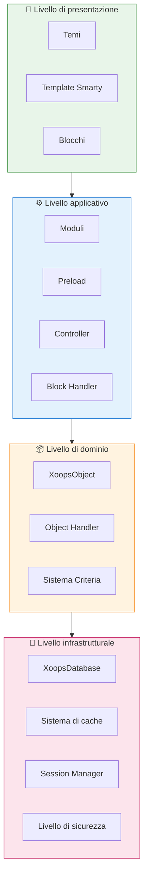
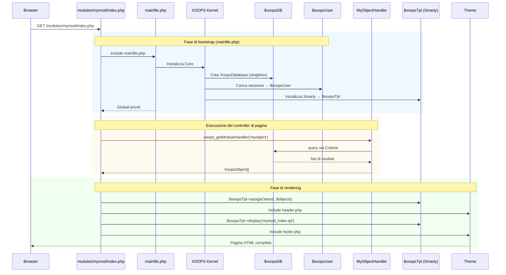

:::note[About This Document]
Questa pagina descrive l'**architettura concettuale** di XOOPS che si applica sia alle versioni attuali (2.5.x) che future (4.0.x). Alcuni diagrammi mostrano la visione del design a strati.

**Per dettagli specifici della versione:**
- **XOOPS 2.5.x Oggi:** Utilizza `mainfile.php`, globali (`$xoopsDB`, `$xoopsUser`), preload e pattern handler
- **XOOPS 4.0 Obiettivo:** Middleware PSR-15, contenitore DI, router - vedi [Roadmap](../../07-XOOPS-4.0/XOOPS-4.0-Roadmap.md)
:::

Questo documento fornisce una panoramica completa dell'architettura del sistema XOOPS, spiegando come i vari componenti lavorano insieme per creare un sistema di gestione dei contenuti flessibile ed estensibile.

## Panoramica

XOOPS segue un'architettura modulare che separa i compiti in strati distinti. Il sistema è costruito attorno a diversi principi principali:

- **Modularità**: La funzionalità è organizzata in moduli indipendenti e installabili
- **Estensibilità**: Il sistema può essere esteso senza modificare il codice principale
- **Astrazione**: I livelli di database e presentazione sono astratti dalla logica aziendale
- **Sicurezza**: Meccanismi di sicurezza integrati proteggono dalle vulnerabilità comuni

## Strati del sistema



### 1. Livello di presentazione

Il livello di presentazione gestisce il rendering dell'interfaccia utente utilizzando il motore di template Smarty.

**Componenti principali:**
- **Temi**: Stile visivo e layout
- **Template Smarty**: Rendering del contenuto dinamico
- **Blocchi**: Widget di contenuto riutilizzabili

### 2. Livello applicativo

Il livello applicativo contiene la logica aziendale, i controller e la funzionalità del modulo.

**Componenti principali:**
- **Moduli**: Pacchetti di funzionalità autonomi
- **Handler**: Classi di manipolazione dei dati
- **Preload**: Listener di eventi e hook

### 3. Livello di dominio

Il livello di dominio contiene gli oggetti di dominio principale e le regole.

**Componenti principali:**
- **XoopsObject**: Classe base per tutti gli oggetti di dominio
- **Handler**: Operazioni CRUD per gli oggetti di dominio

### 4. Livello infrastrutturale

Il livello infrastrutturale fornisce servizi principali come l'accesso ai database e la memorizzazione nella cache.

## Ciclo di vita della richiesta

Comprendere il ciclo di vita della richiesta è fondamentale per lo sviluppo XOOPS efficace.

### Flusso del controller di pagina XOOPS 2.5.x

XOOPS 2.5.x attuale utilizza un pattern di **Page Controller** dove ogni file PHP gestisce la propria richiesta. I globali (`$xoopsDB`, `$xoopsUser`, `$xoopsTpl`, ecc.) sono inizializzati durante il bootstrap e disponibili durante tutta l'esecuzione.



### Globali principali in 2.5.x

| Globale | Tipo | Inizializzato | Scopo |
|--------|------|-------------|---------|
| `$xoopsDB` | `XoopsDatabase` | Bootstrap | Connessione al database (singleton) |
| `$xoopsUser` | `XoopsUser\|null` | Caricamento sessione | Utente attualmente collegato |
| `$xoopsTpl` | `XoopsTpl` | Inizializzazione template | Motore di template Smarty |
| `$xoopsModule` | `XoopsModule` | Caricamento modulo | Contesto del modulo attuale |
| `$xoopsConfig` | `array` | Caricamento config | Configurazione del sistema |

:::note[Confronto XOOPS 4.0]
In XOOPS 4.0, il pattern Page Controller è sostituito da una **PSR-15 Middleware Pipeline** e routing basato su router. I globali sono sostituiti dall'iniezione di dipendenze. Vedi [Contratto di modalità ibrida](../../07-XOOPS-4.0/Specifications/Hybrid-Mode-Contract.md) per le garanzie di compatibilità durante la migrazione.
:::

### 1. Fase di bootstrap

```php
// mainfile.php è il punto di ingresso
include_once XOOPS_ROOT_PATH . '/mainfile.php';

// Inizializzazione principale
$xoops = Xoops::getInstance();
$xoops->boot();
```

**Passaggi:**
1. Caricare la configurazione (`mainfile.php`)
2. Inizializzare l'autoloader
3. Impostare la gestione degli errori
4. Stabilire la connessione al database
5. Caricare la sessione utente
6. Inizializzare il motore di template Smarty

### 2. Fase di routing

```php
// Routing delle richieste al modulo appropriato
$module = $GLOBALS['xoopsModule'];
$controller = $module->getController();
$controller->dispatch($request);
```

**Passaggi:**
1. Analizzare l'URL della richiesta
2. Identificare il modulo di destinazione
3. Caricare la configurazione del modulo
4. Controllare i permessi
5. Instradare al gestore appropriato

### 3. Fase di esecuzione

```php
// Esecuzione del controller
$data = $handler->getObjects($criteria);
$xoopsTpl->assign('items', $data);
```

**Passaggi:**
1. Eseguire la logica del controller
2. Interagire con il livello dati
3. Elaborare le regole aziendali
4. Preparare i dati della vista

### 4. Fase di rendering

```php
// Rendering del template
include XOOPS_ROOT_PATH . '/header.php';
$xoopsTpl->display('db:module_template.tpl');
include XOOPS_ROOT_PATH . '/footer.php';
```

**Passaggi:**
1. Applicare il layout del tema
2. Rendering del template del modulo
3. Elaborare i blocchi
4. Emettere la risposta

## Componenti principali

### XoopsObject

La classe base per tutti gli oggetti dati in XOOPS.

```php
<?php
class MyModuleItem extends XoopsObject
{
    public function __construct()
    {
        $this->initVar('id', XOBJ_DTYPE_INT, null, false);
        $this->initVar('title', XOBJ_DTYPE_TXTBOX, '', true, 255);
        $this->initVar('content', XOBJ_DTYPE_TXTAREA, '', false);
        $this->initVar('created', XOBJ_DTYPE_INT, time(), false);
    }
}
```

**Metodi principali:**
- `initVar()` - Definire le proprietà dell'oggetto
- `getVar()` - Recuperare i valori delle proprietà
- `setVar()` - Impostare i valori delle proprietà
- `assignVars()` - Assegnazione bulk da array

### XoopsPersistableObjectHandler

Gestisce le operazioni CRUD per le istanze XoopsObject.

```php
<?php
class MyModuleItemHandler extends XoopsPersistableObjectHandler
{
    public function __construct(\XoopsDatabase $db)
    {
        parent::__construct($db, 'mymodule_items', 'MyModuleItem', 'id', 'title');
    }

    public function getActiveItems($limit = 10)
    {
        $criteria = new CriteriaCompo();
        $criteria->add(new Criteria('status', 1));
        $criteria->setSort('created');
        $criteria->setOrder('DESC');
        $criteria->setLimit($limit);

        return $this->getObjects($criteria);
    }
}
```

**Metodi principali:**
- `create()` - Creare una nuova istanza dell'oggetto
- `get()` - Recuperare l'oggetto per ID
- `insert()` - Salvare l'oggetto nel database
- `delete()` - Rimuovere l'oggetto dal database
- `getObjects()` - Recuperare più oggetti
- `getCount()` - Contare gli oggetti corrispondenti

### Struttura del modulo

Ogni modulo XOOPS segue una struttura di directory standard:

```
modules/mymodule/
├── class/                  # Classi PHP
│   ├── MyModuleItem.php
│   └── MyModuleItemHandler.php
├── include/                # File di inclusione
│   ├── common.php
│   └── functions.php
├── templates/              # Template Smarty
│   ├── mymodule_index.tpl
│   └── mymodule_item.tpl
├── admin/                  # Area amministrazione
│   ├── index.php
│   └── menu.php
├── language/               # Traduzioni
│   └── english/
│       ├── main.php
│       └── modinfo.php
├── sql/                    # Schema del database
│   └── mysql.sql
├── xoops_version.php       # Info sul modulo
├── index.php               # Entry del modulo
└── header.php              # Header del modulo
```

## Contenitore di iniezione di dipendenze

Lo sviluppo moderno di XOOPS può sfruttare l'iniezione di dipendenze per una migliore testabilità.

### Implementazione del contenitore di base

```php
<?php
class XoopsDependencyContainer
{
    private array $services = [];

    public function register(string $name, callable $factory): void
    {
        $this->services[$name] = $factory;
    }

    public function resolve(string $name): mixed
    {
        if (!isset($this->services[$name])) {
            throw new \InvalidArgumentException("Service not found: $name");
        }

        $factory = $this->services[$name];

        if (is_callable($factory)) {
            return $factory($this);
        }

        return $factory;
    }

    public function has(string $name): bool
    {
        return isset($this->services[$name]);
    }
}
```

### Contenitore compatibile PSR-11

```php
<?php
namespace Xmf\Di;

use Psr\Container\ContainerInterface;

class BasicContainer implements ContainerInterface
{
    protected array $definitions = [];

    public function set(string $id, mixed $value): void
    {
        $this->definitions[$id] = $value;
    }

    public function get(string $id): mixed
    {
        if (!$this->has($id)) {
            throw new \InvalidArgumentException("Service not found: $id");
        }

        $entry = $this->definitions[$id];

        if (is_callable($entry)) {
            return $entry($this);
        }

        return $entry;
    }

    public function has(string $id): bool
    {
        return isset($this->definitions[$id]);
    }
}
```

### Esempio di utilizzo

```php
<?php
// Registrazione del servizio
$container = new XoopsDependencyContainer();

$container->register('database', function () {
    return XoopsDatabaseFactory::getDatabaseConnection();
});

$container->register('userHandler', function ($c) {
    return new XoopsUserHandler($c->resolve('database'));
});

// Risoluzione del servizio
$userHandler = $container->resolve('userHandler');
$user = $userHandler->get($userId);
```

## Punti di estensione

XOOPS fornisce diversi meccanismi di estensione:

### 1. Preload

I Preload consentono ai moduli di agganciarsi agli eventi principali.

```php
<?php
// modules/mymodule/preloads/core.php
class MymoduleCorePreload extends XoopsPreloadItem
{
    public static function eventCoreHeaderEnd($args)
    {
        // Esegui quando l'elaborazione dell'header termina
    }

    public static function eventCoreFooterStart($args)
    {
        // Esegui quando il rendering del footer inizia
    }
}
```

### 2. Plugin

I Plugin estendono funzionalità specifiche all'interno dei moduli.

```php
<?php
// modules/mymodule/plugins/notify.php
class MymoduleNotifyPlugin
{
    public function onItemCreate($item)
    {
        // Inviare una notifica quando l'elemento viene creato
    }
}
```

### 3. Filtri

I filtri modificano i dati mentre passano attraverso il sistema.

```php
<?php
// Esempio di filtro dei contenuti
$myts = MyTextSanitizer::getInstance();
$content = $myts->displayTarea($rawContent, 1, 1, 1);
```

## Best practice

### Organizzazione del codice

1. **Usare gli spazi dei nomi** per il nuovo codice:
   ```php
   namespace XoopsModules\MyModule;

   class Item extends \XoopsObject
   {
       // Implementazione
   }
   ```

2. **Seguire l'autoloading PSR-4**:
   ```json
   {
       "autoload": {
           "psr-4": {
               "XoopsModules\\MyModule\\": "class/"
           }
       }
   }
   ```

3. **Separare i compiti**:
   - Logica di dominio in `class/`
   - Presentazione in `templates/`
   - Controller nella radice del modulo

### Prestazioni

1. **Usare la cache** per operazioni costose
2. **Caricare in modo pigro** le risorse quando possibile
3. **Minimizzare le query al database** usando batch di criteria
4. **Ottimizzare i template** evitando logica complessa

### Sicurezza

1. **Convalidare tutto l'input** usando `Xmf\Request`
2. **Escapare l'output** nei template
3. **Usare dichiarazioni preparate** per le query al database
4. **Controllare i permessi** prima delle operazioni sensibili

## Documentazione correlata

- [Design-Patterns](Design-Patterns.md) - Pattern di design utilizzati in XOOPS
- [Database Layer](../Database/Database-Layer.md) - Dettagli di astrazione del database
- [Smarty Basics](../Templates/Smarty-Basics.md) - Documentazione del sistema di template
- [Security Best Practices](../Security/Security-Best-Practices.md) - Linee guida sulla sicurezza

---

#xoops #architettura #core #design #system-design
