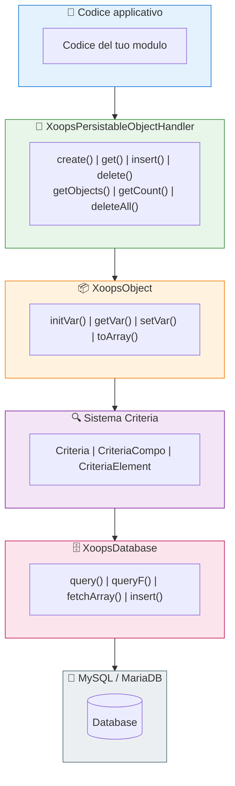

# 🗄️ Livello database

<span class="version-badge version-25x">2.5.x ✅</span> <span class="version-badge version-40x">4.0.x ✅</span>

> Comprensione dell'astrazione del database XOOPS, della persistenza degli oggetti e della costruzione delle query.

:::tip[Assicura il tuo accesso ai dati per il futuro]
Il pattern handler/Criteria funziona in entrambe le versioni. Per prepararti a XOOPS 4.0, considera di wrappare i handler in [classi Repository](../../03-Module-Development/Patterns/Repository-Pattern.md) per una migliore testabilità. Vedi [Scelta di un pattern di accesso ai dati](../../03-Module-Development/Choosing-Data-Access-Pattern.md).
:::

---

## Panoramica

Il livello database di XOOPS fornisce un'astrazione robusta su MySQL/MariaDB, con le seguenti caratteristiche:

- **Pattern Factory** - Gestione centralizzata della connessione al database
- **Object-Relational Mapping** - XoopsObject e handler
- **Query Building** - Sistema Criteria per query complesse
- **Riutilizzo della connessione** - Singola connessione tramite factory singleton (non pooling)

---

## 🏗️ Architettura



---

## 🔌 Connessione al database

### Ottenere la connessione

```php
// Consigliato: Usa l'istanza del database globale
$db = \XoopsDatabaseFactory::getDatabaseConnection();

// Legacy: Variabile globale (ancora funziona)
global $xoopsDB;
```

### XoopsDatabaseFactory

Il pattern factory assicura che una singola connessione al database sia riutilizzata:

```php
<?php

class XoopsDatabaseFactory
{
    private static ?XoopsDatabase $instance = null;

    public static function getDatabaseConnection(): XoopsDatabase
    {
        if (self::$instance === null) {
            self::$instance = new XoopsMySQLDatabase();
        }
        return self::$instance;
    }
}
```

---

## 📦 XoopsObject

La classe base per tutti gli oggetti dati in XOOPS.

### Definizione di un oggetto

```php
<?php

namespace XoopsModules\MyModule;

class Article extends \XoopsObject
{
    public function __construct()
    {
        $this->initVar('article_id', \XOBJ_DTYPE_INT, null, false);
        $this->initVar('category_id', \XOBJ_DTYPE_INT, 0, true);
        $this->initVar('title', \XOBJ_DTYPE_TXTBOX, '', true, 255);
        $this->initVar('content', \XOBJ_DTYPE_TXTAREA, '', false);
        $this->initVar('author_id', \XOBJ_DTYPE_INT, 0, true);
        $this->initVar('status', \XOBJ_DTYPE_TXTBOX, 'draft', true, 20);
        $this->initVar('views', \XOBJ_DTYPE_INT, 0, false);
        $this->initVar('created', \XOBJ_DTYPE_INT, time(), false);
        $this->initVar('updated', \XOBJ_DTYPE_INT, 0, false);
    }
}
```

### Tipi di dati

| Costante | Tipo | Descrizione |
|----------|------|-------------|
| `XOBJ_DTYPE_INT` | Integer | Valori numerici |
| `XOBJ_DTYPE_TXTBOX` | String | Testo breve (< 255 caratteri) |
| `XOBJ_DTYPE_TXTAREA` | Text | Contenuto di testo lungo |
| `XOBJ_DTYPE_EMAIL` | Email | Indirizzi email |
| `XOBJ_DTYPE_URL` | URL | Indirizzi web |
| `XOBJ_DTYPE_FLOAT` | Float | Numeri decimali |
| `XOBJ_DTYPE_ARRAY` | Array | Array serializzati |
| `XOBJ_DTYPE_OTHER` | Mixed | Dati grezzi |

### Lavoro con gli oggetti

```php
// Crea nuovo oggetto
$article = new Article();

// Imposta valori
$article->setVar('title', 'My Article');
$article->setVar('content', 'Article content here...');
$article->setVar('category_id', 5);
$article->setVar('author_id', $xoopsUser->getVar('uid'));

// Ottieni valori
$title = $article->getVar('title');           // Valore grezzo
$titleDisplay = $article->getVar('title', 'e'); // Per la modifica (entità HTML)
$titleShow = $article->getVar('title', 's');    // Per la visualizzazione (sanificato)

// Assegnazione bulk da array
$article->assignVars([
    'title' => 'New Title',
    'status' => 'published'
]);

// Converti in array
$data = $article->toArray();
```

---

## 🔧 Gestori di oggetti

### XoopsPersistableObjectHandler

La classe handler gestisce le operazioni CRUD per le istanze di XoopsObject.

```php
<?php

namespace XoopsModules\MyModule;

class ArticleHandler extends \XoopsPersistableObjectHandler
{
    public function __construct(\XoopsDatabase $db = null)
    {
        parent::__construct(
            $db,
            'mymodule_articles',  // Table name
            Article::class,       // Object class
            'article_id',         // Primary key
            'title'               // Identifier field
        );
    }
}
```

### Metodi del handler

```php
// Ottieni istanza del handler
$articleHandler = xoops_getModuleHandler('article', 'mymodule');

// Crea nuovo oggetto
$article = $articleHandler->create();

// Ottieni per ID
$article = $articleHandler->get(123);

// Inserisci (crea o aggiorna)
$success = $articleHandler->insert($article);

// Elimina
$success = $articleHandler->delete($article);

// Ottieni più oggetti
$articles = $articleHandler->getObjects($criteria);

// Ottieni conteggio
$count = $articleHandler->getCount($criteria);

// Ottieni come array (chiave => valore)
$list = $articleHandler->getList($criteria);

// Elimina più oggetti
$deleted = $articleHandler->deleteAll($criteria);
```

### Metodi personalizzati del handler

```php
<?php

namespace XoopsModules\MyModule;

class ArticleHandler extends \XoopsPersistableObjectHandler
{
    // ... costruttore

    /**
     * Ottieni articoli pubblicati
     */
    public function getPublished(int $limit = 10, int $start = 0): array
    {
        $criteria = new \CriteriaCompo();
        $criteria->add(new \Criteria('status', 'published'));
        $criteria->setSort('created');
        $criteria->setOrder('DESC');
        $criteria->setLimit($limit);
        $criteria->setStart($start);

        return $this->getObjects($criteria);
    }

    /**
     * Ottieni articoli per categoria
     */
    public function getByCategory(int $categoryId, int $limit = 10): array
    {
        $criteria = new \CriteriaCompo();
        $criteria->add(new \Criteria('category_id', $categoryId));
        $criteria->add(new \Criteria('status', 'published'));
        $criteria->setSort('created');
        $criteria->setOrder('DESC');
        $criteria->setLimit($limit);

        return $this->getObjects($criteria);
    }

    /**
     * Ottieni articoli per autore
     */
    public function getByAuthor(int $authorId): array
    {
        $criteria = new \Criteria('author_id', $authorId);
        return $this->getObjects($criteria);
    }

    /**
     * Incrementa il conteggio delle visualizzazioni
     */
    public function incrementViews(int $articleId): bool
    {
        $sql = sprintf(
            'UPDATE %s SET views = views + 1 WHERE article_id = %d',
            $this->table,
            $articleId
        );
        return $this->db->queryF($sql) !== false;
    }

    /**
     * Ottieni articoli popolari
     */
    public function getPopular(int $limit = 5): array
    {
        $criteria = new \CriteriaCompo();
        $criteria->add(new \Criteria('status', 'published'));
        $criteria->setSort('views');
        $criteria->setOrder('DESC');
        $criteria->setLimit($limit);

        return $this->getObjects($criteria);
    }
}
```

---

## 🔍 Sistema Criteria

Il sistema Criteria fornisce un modo potente e orientato agli oggetti per costruire clausole SQL WHERE.

### Criteria di base

```php
// Uguaglianza semplice
$criteria = new \Criteria('status', 'published');

// Con operatore
$criteria = new \Criteria('views', 100, '>=');

// Confronto colonne
$criteria = new \Criteria('updated', 'created', '>');
```

### CriteriaCompo (Combinazione di Criteria)

```php
$criteria = new \CriteriaCompo();

// Condizioni AND (default)
$criteria->add(new \Criteria('status', 'published'));
$criteria->add(new \Criteria('category_id', 5));

// Condizioni OR
$criteria->add(new \Criteria('featured', 1), 'OR');

// Condizioni nidificate
$subCriteria = new \CriteriaCompo();
$subCriteria->add(new \Criteria('author_id', 1));
$subCriteria->add(new \Criteria('author_id', 2), 'OR');
$criteria->add($subCriteria);
```

### Ordinamento e paginazione

```php
$criteria = new \CriteriaCompo();
$criteria->add(new \Criteria('status', 'published'));

// Ordinamento
$criteria->setSort('created');
$criteria->setOrder('DESC');

// Più campi di ordinamento
$criteria->setSort('category_id, created');
$criteria->setOrder('ASC, DESC');

// Paginazione
$criteria->setLimit(10);    // Elementi per pagina
$criteria->setStart(20);    // Offset

// Raggruppa per
$criteria->setGroupby('category_id');
```

### Operatori

| Operatore | Esempio | Output SQL |
|----------|---------|------------|
| `=` | `new Criteria('status', 'published')` | `status = 'published'` |
| `!=` | `new Criteria('status', 'draft', '!=')` | `status != 'draft'` |
| `>` | `new Criteria('views', 100, '>')` | `views > 100` |
| `>=` | `new Criteria('views', 100, '>=')` | `views >= 100` |
| `<` | `new Criteria('views', 100, '<')` | `views < 100` |
| `<=` | `new Criteria('views', 100, '<=')` | `views <= 100` |
| `LIKE` | `new Criteria('title', '%php%', 'LIKE')` | `title LIKE '%php%'` |
| `NOT LIKE` | `new Criteria('title', '%test%', 'NOT LIKE')` | `title NOT LIKE '%test%'` |
| `IN` | `new Criteria('id', '(1,2,3)', 'IN')` | `id IN (1,2,3)` |
| `NOT IN` | `new Criteria('id', '(1,2,3)', 'NOT IN')` | `id NOT IN (1,2,3)` |

### Esempio complesso

```php
// Trova articoli pubblicati in categorie specifiche,
// con il termine di ricerca nel titolo, ordinati per visualizzazioni
$criteria = new \CriteriaCompo();

// Lo stato deve essere pubblicato
$criteria->add(new \Criteria('status', 'published'));

// Nelle categorie 1, 2 o 3
$criteria->add(new \Criteria('category_id', '(1, 2, 3)', 'IN'));

// Il titolo contiene il termine di ricerca
$searchTerm = '%' . $db->escape($searchQuery) . '%';
$criteria->add(new \Criteria('title', $searchTerm, 'LIKE'));

// Creato negli ultimi 30 giorni
$thirtyDaysAgo = time() - (30 * 24 * 60 * 60);
$criteria->add(new \Criteria('created', $thirtyDaysAgo, '>='));

// Ordina per visualizzazioni in ordine decrescente
$criteria->setSort('views');
$criteria->setOrder('DESC');

// Pagina
$criteria->setLimit(10);
$criteria->setStart($page * 10);

$articles = $articleHandler->getObjects($criteria);
$totalCount = $articleHandler->getCount($criteria);
```

---

## 📝 Query dirette

Per query complesse non possibili con Criteria, usa SQL diretto.

### Query sicure (lettura)

```php
$db = \XoopsDatabaseFactory::getDatabaseConnection();

$sql = sprintf(
    'SELECT a.*, c.category_name
     FROM %s a
     LEFT JOIN %s c ON a.category_id = c.category_id
     WHERE a.status = %s
     ORDER BY a.created DESC
     LIMIT %d',
    $db->prefix('mymodule_articles'),
    $db->prefix('mymodule_categories'),
    $db->quoteString('published'),
    10
);

$result = $db->query($sql);

while ($row = $db->fetchArray($result)) {
    // Elabora riga
    echo $row['title'];
}
```

### Query di scrittura

```php
// Inserisci
$sql = sprintf(
    "INSERT INTO %s (title, content, created) VALUES (%s, %s, %d)",
    $db->prefix('mymodule_articles'),
    $db->quoteString($title),
    $db->quoteString($content),
    time()
);
$db->queryF($sql);
$newId = $db->getInsertId();

// Aggiorna
$sql = sprintf(
    "UPDATE %s SET views = views + 1 WHERE article_id = %d",
    $db->prefix('mymodule_articles'),
    $articleId
);
$db->queryF($sql);
$affectedRows = $db->getAffectedRows();

// Elimina
$sql = sprintf(
    "DELETE FROM %s WHERE article_id = %d",
    $db->prefix('mymodule_articles'),
    $articleId
);
$db->queryF($sql);
```

### Escaping dei valori

```php
// Escaping delle stringhe
$safeString = $db->quoteString($userInput);
// oppure
$safeString = $db->escape($userInput);

// Integer (non è necessario l'escaping, basta il cast)
$safeInt = (int) $userInput;
```

---

## ⚠️ Best practice di sicurezza

### Sempre fare l'escape dell'input dell'utente

```php
// NON farlo mai
$sql = "SELECT * FROM articles WHERE title = '$_GET[title]'"; // SQL Injection!

// FALLO così
$title = $db->escape($_GET['title']);
$sql = "SELECT * FROM articles WHERE title = '$title'";

// O meglio, usa Criteria
$criteria = new \Criteria('title', $db->escape($_GET['title']));
```

### Usa query parametrizzate (XMF)

```php
use Xmf\Database\TableLoad;

// Inserimento bulk sicuro
$tableLoad = new TableLoad('mymodule_articles');
$tableLoad->insert([
    ['title' => 'Article 1', 'content' => 'Content 1'],
    ['title' => 'Article 2', 'content' => 'Content 2'],
]);
```

### Valida i tipi di input

```php
use Xmf\Request;

$id = Request::getInt('id', 0, 'GET');
$title = Request::getString('title', '', 'POST');
```

---

## 📊 Esempio schema database

```sql
-- sql/mysql.sql

CREATE TABLE `{PREFIX}_mymodule_articles` (
    `article_id` INT(11) UNSIGNED NOT NULL AUTO_INCREMENT,
    `category_id` INT(11) UNSIGNED NOT NULL DEFAULT 0,
    `title` VARCHAR(255) NOT NULL DEFAULT '',
    `content` TEXT,
    `author_id` INT(11) UNSIGNED NOT NULL DEFAULT 0,
    `status` VARCHAR(20) NOT NULL DEFAULT 'draft',
    `views` INT(11) UNSIGNED NOT NULL DEFAULT 0,
    `created` INT(11) UNSIGNED NOT NULL DEFAULT 0,
    `updated` INT(11) UNSIGNED NOT NULL DEFAULT 0,
    PRIMARY KEY (`article_id`),
    KEY `category_id` (`category_id`),
    KEY `author_id` (`author_id`),
    KEY `status` (`status`),
    KEY `created` (`created`)
) ENGINE=InnoDB DEFAULT CHARSET=utf8mb4;
```

---

## 🔗 Documentazione correlata

- [Approfondimento del sistema Criteria](../../04-API-Reference/Kernel/Criteria.md)
- [Design Patterns - Factory](../Architecture/Design-Patterns.md)
- [Prevenzione dell'iniezione SQL](../Security/SQL-Injection-Prevention.md)
- [Riferimento API di XoopsDatabase](../../04-API-Reference/Database/XoopsDatabase.md)

---

#xoops #database #orm #criteria #handlers #mysql
