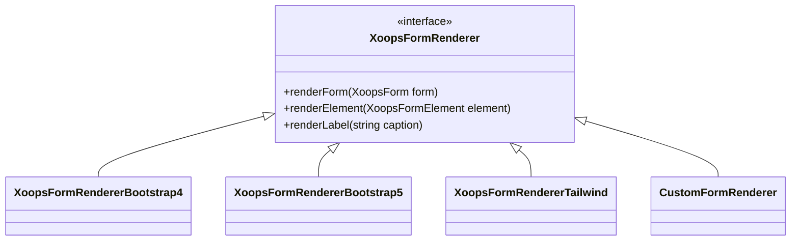

## Panoramica

XOOPS consente la personalizzazione del rendering dei moduli attraverso renderer personalizzati. Ciò consente stili specifici del tema, miglioramenti dell'accessibilità e integrazione con framework frontend come Bootstrap o Tailwind CSS.

## Rendering Predefinito

Per impostazione predefinita, i moduli XOOPS utilizzano la classe `XoopsFormRenderer` che produce HTML di base:

```php
// Rendering predefinito
$form = new XoopsThemeForm('My Form', 'myform', 'submit.php');
$form->addElement(new XoopsFormText('Name', 'name', 50, 255));
echo $form->render();
```

## Architettura del Renderer Personalizzato



## Creazione di un Renderer Personalizzato

### Classe Renderer Basica

```php
namespace Xoops\Modules\MyModule\Form;

use XoopsFormRenderer;
use XoopsForm;
use XoopsFormElement;

class BootstrapRenderer extends XoopsFormRenderer
{
    public function renderFormStart(XoopsForm $form): string
    {
        $class = $form->getExtra() ?: 'needs-validation';
        return sprintf(
            '<form name="%s" id="%s" action="%s" method="%s" class="%s" %s>',
            $form->getName(),
            $form->getName(),
            $form->getAction(),
            $form->getMethod(),
            $class,
            $form->getExtra()
        );
    }

    public function renderFormEnd(): string
    {
        return '</form>';
    }

    public function renderElement(XoopsFormElement $element): string
    {
        $output = '<div class="mb-3">';

        // Etichetta
        if ($element->getCaption()) {
            $output .= sprintf(
                '<label for="%s" class="form-label">%s</label>',
                $element->getName(),
                $element->getCaption()
            );
        }

        // Elemento con classi Bootstrap
        $element->setExtra($element->getExtra() . ' class="form-control"');
        $output .= $element->render();

        // Descrizione
        if ($element->getDescription()) {
            $output .= sprintf(
                '<div class="form-text">%s</div>',
                $element->getDescription()
            );
        }

        $output .= '</div>';

        return $output;
    }

    public function renderButton(XoopsFormElement $button): string
    {
        $type = $button->getType() === 'submit' ? 'btn-primary' : 'btn-secondary';
        return sprintf(
            '<button type="%s" name="%s" class="btn %s">%s</button>',
            $button->getType(),
            $button->getName(),
            $type,
            $button->getValue()
        );
    }
}
```

### Registrazione del Renderer

```php
// Nel file xoops_version.php del tuo modulo o nel bootstrap
$GLOBALS['xoopsOption']['form_renderer'] = new BootstrapRenderer();

// O imposta per un modulo specifico
$form = new XoopsThemeForm('My Form', 'myform', 'submit.php');
$form->setRenderer(new BootstrapRenderer());
```

## Renderer Integrati

### Renderer Bootstrap 4

```php
use Xoops\Form\Renderer\Bootstrap4Renderer;

$form->setRenderer(new Bootstrap4Renderer());
```

### Renderer Bootstrap 5

```php
use Xoops\Form\Renderer\Bootstrap5Renderer;

$form->setRenderer(new Bootstrap5Renderer([
    'floating_labels' => true,
    'validation_style' => 'tooltip'
]));
```

## Rendering di Elementi Specifici

### Renderer Select Personalizzato

```php
public function renderSelect(XoopsFormSelect $select): string
{
    $multiple = $select->isMultiple() ? 'multiple' : '';
    $size = $select->getSize();

    $output = sprintf(
        '<select name="%s%s" id="%s" class="form-select" %s size="%d">',
        $select->getName(),
        $multiple ? '[]' : '',
        $select->getName(),
        $multiple,
        $size
    );

    foreach ($select->getOptions() as $value => $label) {
        $selected = in_array($value, (array)$select->getValue()) ? 'selected' : '';
        $output .= sprintf(
            '<option value="%s" %s>%s</option>',
            htmlspecialchars($value),
            $selected,
            htmlspecialchars($label)
        );
    }

    $output .= '</select>';

    return $output;
}
```

### Renderer File Input Personalizzato

```php
public function renderFile(XoopsFormFile $file): string
{
    return sprintf(
        '<div class="mb-3">
            <label for="%s" class="form-label">%s</label>
            <input type="file" class="form-control" id="%s" name="%s" %s>
        </div>',
        $file->getName(),
        $file->getCaption(),
        $file->getName(),
        $file->getName(),
        $file->getExtra()
    );
}
```

## Integrazione del Tema

### Nel Template del Tema

```smarty
{* Nel template form.tpl del tema *}
{foreach $form.elements as $element}
    <div class="form-group {$element.class}">
        {if $element.caption}
            <label class="control-label">{$element.caption}</label>
        {/if}
        {$element.body}
        {if $element.description}
            <span class="help-block">{$element.description}</span>
        {/if}
    </div>
{/foreach}
```

## Best Practice

1. **Eredita dal renderer di base** - Estendi `XoopsFormRenderer` per la coerenza
2. **Supporta tutti i tipi di elementi** - Gestisci testo, selezione, casella di controllo, radio, ecc.
3. **Accessibilità** - Includi etichette corrette, attributi ARIA
4. **Stili di validazione** - Mostra gli stati di errore in modo appropriato
5. **Design reattivo** - Assicurati che i moduli funzionino su dispositivi mobili

## Documentazione Correlata

- Forms Overview
- Form Elements Reference
- Form Validation
- Theme Development
