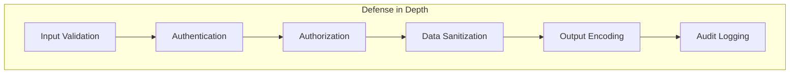

## Panoramica

Questo documento illustra le best practice di sicurezza per lo sviluppo di XOOPS, coprendo la validazione dell'input, la codifica dell'output, l'autenticazione, l'autorizzazione e la protezione contro le vulnerabilità web comuni.

## Principi di Sicurezza



## Validazione dell'Input

### Sanitizzazione delle Richieste

```php
use Xoops\Core\Request;

// Usa sempre i getter tipizzati
$id = Request::getInt('id', 0, 'GET');
$name = Request::getString('name', '', 'POST');
$email = Request::getEmail('email', '', 'POST');
$url = Request::getUrl('website', '', 'POST');

// Non usare mai raw $_GET/$_POST/$_REQUEST
// Cattivo: $id = $_GET['id'];
// Buono: $id = Request::getInt('id', 0, 'GET');
```

### Regole di Validazione

```php
// Valida prima dell'uso
if ($id <= 0) {
    throw new InvalidArgumentException('Invalid ID');
}

if (!preg_match('/^[a-zA-Z0-9_]{3,50}$/', $username)) {
    throw new InvalidArgumentException('Invalid username format');
}

// Usa validazione whitelist per enum
$allowedStatuses = ['draft', 'published', 'archived'];
if (!in_array($status, $allowedStatuses, true)) {
    throw new InvalidArgumentException('Invalid status');
}
```

## Prevenzione delle Iniezioni SQL

### Usa Query Parametrizzate

```php
// BUONO: Query parametrizzata
$sql = "SELECT * FROM {$xoopsDB->prefix('users')} WHERE uid = ?";
$result = $xoopsDB->query($sql, [$userId]);

// CATTIVO: Concatenazione di stringhe (vulnerabile!)
// $sql = "SELECT * FROM users WHERE uid = " . $userId;
```

### Usa Oggetti Criteria

```php
use Criteria;
use CriteriaCompo;

$criteria = new CriteriaCompo();
$criteria->add(new Criteria('status', 'published'));
$criteria->add(new Criteria('uid', $userId, '='));
$criteria->add(new Criteria('created', time() - 86400, '>'));

$articles = $articleHandler->getObjects($criteria);
```

## Prevenzione XSS

### Codifica dell'Output

```php
use Xoops\Core\Text\Sanitizer;

// Contesto HTML
$safeName = htmlspecialchars($userName, ENT_QUOTES, 'UTF-8');

// Nei template (escape automatico)
{$userName|escape}

// Per contenuto ricco
$sanitizer = Sanitizer::getInstance();
$safeContent = $sanitizer->sanitizeForDisplay($content);
```

### Politica di Sicurezza dei Contenuti

```php
// Imposta intestazioni CSP
header("Content-Security-Policy: default-src 'self'; script-src 'self'; style-src 'self' 'unsafe-inline'");
```

## Protezione CSRF

### Implementazione del Token

```php
// Genera token
use Xoops\Core\Security;

$token = Security::createToken();

// Nel modulo
echo '<input type="hidden" name="XOOPS_TOKEN_REQUEST" value="' . $token . '">';

// Verifica durante l'invio
if (!Security::checkToken()) {
    die('Security token mismatch');
}
```

### Usa XoopsForm

```php
// Aggiunge automaticamente il token CSRF
$form = new XoopsThemeForm('Edit Article', 'articleform', 'save.php');
$form->addElement(new XoopsFormHiddenToken());
```

## Autenticazione

### Gestione delle Password

```php
// Hash delle password (PHP 5.5+)
$hashedPassword = password_hash($plainPassword, PASSWORD_ARGON2ID);

// Verifica le password
if (password_verify($plainPassword, $storedHash)) {
    // Password corretta
}

// Verifica se è necessario il rehash
if (password_needs_rehash($storedHash, PASSWORD_ARGON2ID)) {
    $newHash = password_hash($plainPassword, PASSWORD_ARGON2ID);
    // Aggiorna l'hash archiviato
}
```

### Sicurezza della Sessione

```php
// Rigenera l'ID di sessione dopo il login
session_regenerate_id(true);

// Imposta le opzioni sicure dei cookie di sessione
ini_set('session.cookie_httponly', 1);
ini_set('session.cookie_secure', 1);
ini_set('session.cookie_samesite', 'Lax');
```

## Autorizzazione

### Controlli di Permesso

```php
// Verifica admin del modulo
if (!$xoopsUser || !$xoopsUser->isAdmin($xoopsModule->mid())) {
    redirect_header('index.php', 3, 'Access denied');
}

// Verifica i permessi di gruppo
$grouppermHandler = xoops_getHandler('groupperm');
$groups = $xoopsUser ? $xoopsUser->getGroups() : [XOOPS_GROUP_ANONYMOUS];

if (!$grouppermHandler->checkRight('view_item', $itemId, $groups, $moduleId)) {
    throw new AccessDeniedException('Permission denied');
}
```

### Accesso Basato su Ruoli

```php
class PermissionChecker
{
    public function canEdit(Article $article, ?XoopsUser $user): bool
    {
        if (!$user) {
            return false;
        }

        // Admin può modificare tutto
        if ($user->isAdmin()) {
            return true;
        }

        // L'autore può modificare il suo
        if ($article->getAuthorId() === $user->uid()) {
            return true;
        }

        // Verifica il permesso di editor
        return $this->hasPermission($user, 'article_edit');
    }
}
```

## Sicurezza del Caricamento dei File

```php
class SecureUploader
{
    private array $allowedMimeTypes = [
        'image/jpeg',
        'image/png',
        'image/gif'
    ];

    private array $allowedExtensions = ['jpg', 'jpeg', 'png', 'gif'];

    public function validate(array $file): bool
    {
        // Verifica la dimensione del file
        if ($file['size'] > 2 * 1024 * 1024) {
            throw new FileTooLargeException();
        }

        // Verifica il tipo MIME
        $finfo = new finfo(FILEINFO_MIME_TYPE);
        $mimeType = $finfo->file($file['tmp_name']);

        if (!in_array($mimeType, $this->allowedMimeTypes, true)) {
            throw new InvalidFileTypeException();
        }

        // Verifica l'estensione
        $extension = strtolower(pathinfo($file['name'], PATHINFO_EXTENSION));
        if (!in_array($extension, $this->allowedExtensions, true)) {
            throw new InvalidFileTypeException();
        }

        // Genera un nome file sicuro
        return true;
    }

    public function generateSafeFilename(string $original): string
    {
        $extension = strtolower(pathinfo($original, PATHINFO_EXTENSION));
        return bin2hex(random_bytes(16)) . '.' . $extension;
    }
}
```

## Registrazione di Audit

```php
class SecurityLogger
{
    public function logAuthAttempt(string $username, bool $success, string $ip): void
    {
        $data = [
            'username' => $username,
            'success' => $success,
            'ip' => $ip,
            'user_agent' => $_SERVER['HTTP_USER_AGENT'] ?? '',
            'timestamp' => time()
        ];

        // Registra nel database o file
        $this->log('auth', $data);
    }

    public function logSensitiveAction(int $userId, string $action, array $context): void
    {
        $data = [
            'user_id' => $userId,
            'action' => $action,
            'context' => json_encode($context),
            'ip' => $_SERVER['REMOTE_ADDR'],
            'timestamp' => time()
        ];

        $this->log('audit', $data);
    }
}
```

## Intestazioni di Sicurezza

```php
// Intestazioni di sicurezza consigliate
header('X-Content-Type-Options: nosniff');
header('X-Frame-Options: SAMEORIGIN');
header('X-XSS-Protection: 1; mode=block');
header('Referrer-Policy: strict-origin-when-cross-origin');
header('Permissions-Policy: geolocation=(), microphone=(), camera=()');

// HSTS (solo per siti HTTPS)
if (isset($_SERVER['HTTPS']) && $_SERVER['HTTPS'] === 'on') {
    header('Strict-Transport-Security: max-age=31536000; includeSubDomains');
}
```

## Limitazione della Velocità

```php
class RateLimiter
{
    public function check(string $key, int $maxAttempts, int $windowSeconds): bool
    {
        $cacheKey = 'rate_limit:' . $key;
        $attempts = (int) $this->cache->get($cacheKey, 0);

        if ($attempts >= $maxAttempts) {
            return false; // Limitazione della velocità
        }

        $this->cache->increment($cacheKey, 1, $windowSeconds);
        return true;
    }
}

// Utilizzo
$limiter = new RateLimiter();
if (!$limiter->check('login:' . $ip, 5, 300)) {
    throw new TooManyRequestsException('Too many login attempts');
}
```

## Checklist di Sicurezza

- [ ] Tutto l'input dell'utente è validato e sanitizzato
- [ ] Query parametrizzate per tutte le operazioni di database
- [ ] Codifica dell'output per tutto il contenuto generato dall'utente
- [ ] Token CSRF su tutti i moduli che cambiano lo stato
- [ ] Hash sicuro delle password (Argon2id)
- [ ] Sicurezza della sessione configurata
- [ ] Validazione del caricamento dei file
- [ ] Intestazioni di sicurezza impostate
- [ ] Limitazione della velocità implementata
- [ ] Registrazione di audit abilitata
- [ ] I messaggi di errore non trapelano informazioni sensibili

## Documentazione Correlata

- Authentication System
- Permission System
- Input Validation
