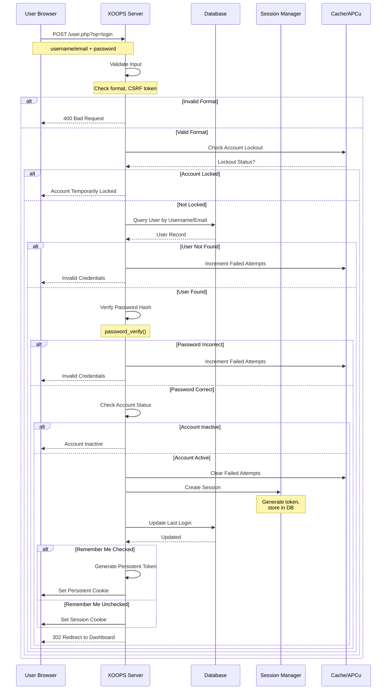
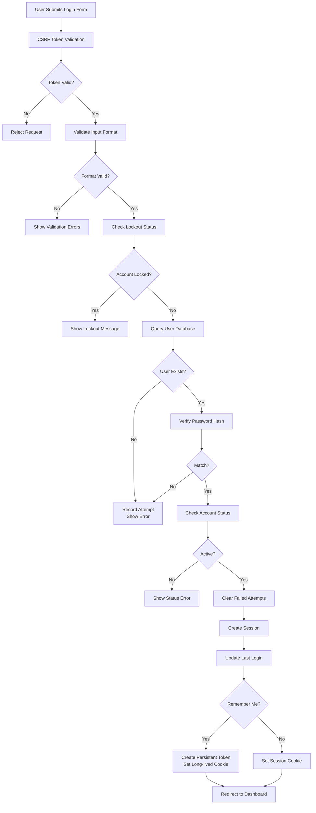

# Autenticazione in XOOPS

Il sistema di autenticazione XOOPS fornisce una verifica utente sicura, gestione della sessione e funzioni di sicurezza avanzate, inclusa l'autenticazione a due fattori e l'integrazione OAuth. Questo documento copre i flussi di autenticazione, l'implementazione e le best practice.

## Flusso di Autenticazione

### Diagramma della Sequenza di Login



### Processo di Login Dettagliato



## Gestione della Sessione

### Configurazione della Sessione

```php
<?php
/**
 * Configurazione della Sessione XOOPS
 * Tipicamente in /include/session.php
 */

// Parametri del cookie di sessione per la sicurezza
session_set_cookie_params([
    'lifetime' => 0,           // Cookie di sessione (cancellato alla chiusura del browser)
    'path' => '/',             // Percorso del cookie
    'domain' => '',            // Dominio del cookie (vuoto = dominio corrente)
    'secure' => true,          // Solo HTTPS
    'httponly' => true,        // Non accessibile a JavaScript
    'samesite' => 'Strict'     // Protezione CSRF
]);

// Imposta la configurazione della sessione
ini_set('session.name', 'XOOPSPHPSESSID');
ini_set('session.use_strict_mode', 1);
ini_set('session.use_only_cookies', 1);
ini_set('session.cookie_httponly', 1);
ini_set('session.cookie_secure', 1);
ini_set('session.gc_maxlifetime', 28800);  // 8 ore

// Avvia la sessione
session_start();

// Verifica la protezione della fissazione della sessione
if (!isset($_SESSION['initiated'])) {
    session_regenerate_id();
    $_SESSION['initiated'] = true;
}
```

### Implementazione del Gestore della Sessione

```php
<?php
/**
 * Gestore della Sessione XOOPS
 */
class XoopsSessionHandler
{
    private $sessionTimeout = 28800; // 8 ore
    private $sessionTokenLength = 32;
    private $db;

    public function __construct()
    {
        $this->db = XoopsDatabaseFactory::getDatabaseConnection();
    }

    /**
     * Crea una nuova sessione
     *
     * @param XoopsUser $user Oggetto utente
     * @param bool $rememberMe Flag di login persistente
     * @return bool Stato di successo
     */
    public function createSession(XoopsUser $user, bool $rememberMe = false): bool
    {
        try {
            // Genera token sicuro
            $token = bin2hex(random_bytes($this->sessionTokenLength));

            // Archivia nella sessione
            $_SESSION['xoopsUserId'] = $user->getVar('uid');
            $_SESSION['xoopsUserName'] = $user->getVar('uname');
            $_SESSION['xoopsSessionToken'] = $token;
            $_SESSION['xoopsSessionCreated'] = time();
            $_SESSION['xoopsSessionIP'] = $this->getClientIP();
            $_SESSION['xoopsSessionUA'] = $_SERVER['HTTP_USER_AGENT'] ?? '';

            // Archivia il token nel database
            $this->storeSessionToken(
                $user->getVar('uid'),
                $token,
                $this->sessionTimeout
            );

            // Gestisci il login persistente
            if ($rememberMe) {
                $this->createPersistentLogin($user->getVar('uid'));
            }

            return true;
        } catch (Exception $e) {
            error_log('Session creation failed: ' . $e->getMessage());
            return false;
        }
    }

    /**
     * Valida la sessione corrente
     *
     * @return bool Sessione valida
     */
    public function validateSession(): bool
    {
        // Verifica che le variabili di sessione esistano
        if (!isset($_SESSION['xoopsUserId'], $_SESSION['xoopsSessionToken'])) {
            return false;
        }

        // Verifica il timeout della sessione
        $created = $_SESSION['xoopsSessionCreated'] ?? 0;
        if (time() - $created > $this->sessionTimeout) {
            $this->destroySession();
            return false;
        }

        // Verifica la coerenza dell'indirizzo IP
        if ($this->getClientIP() !== ($_SESSION['xoopsSessionIP'] ?? '')) {
            error_log('Session IP mismatch - possible session hijacking');
            $this->destroySession();
            return false;
        }

        // Verifica la coerenza dell'User Agent
        $currentUA = $_SERVER['HTTP_USER_AGENT'] ?? '';
        if ($currentUA !== ($_SESSION['xoopsSessionUA'] ?? '')) {
            error_log('Session UA mismatch - possible session hijacking');
            $this->destroySession();
            return false;
        }

        // Verifica il token nel database
        if (!$this->verifySessionToken(
            $_SESSION['xoopsUserId'],
            $_SESSION['xoopsSessionToken']
        )) {
            return false;
        }

        return true;
    }

    /**
     * Distruggi la sessione
     */
    public function destroySession(): void
    {
        if (isset($_SESSION['xoopsUserId'])) {
            $this->deleteSessionToken(
                $_SESSION['xoopsUserId'],
                $_SESSION['xoopsSessionToken'] ?? ''
            );
        }

        // Cancella i dati della sessione
        $_SESSION = [];

        // Elimina il cookie di sessione
        if (ini_get('session.use_cookies')) {
            $params = session_get_cookie_params();
            setcookie(
                session_name(),
                '',
                time() - 42000,
                $params['path'],
                $params['domain'],
                $params['secure'],
                $params['httponly']
            );
        }

        session_destroy();
    }

    /**
     * Archivia il token di sessione nel database
     *
     * @param int $uid ID utente
     * @param string $token Token di sessione
     * @param int $lifetime Durata del token in secondi
     */
    private function storeSessionToken(int $uid, string $token, int $lifetime): void
    {
        $tokenHash = hash('sha256', $token);
        $expiresAt = time() + $lifetime;

        $this->db->query(
            "INSERT INTO xoops_sessions (uid, token, ip, user_agent, expires_at)
             VALUES (?, ?, ?, ?, ?)",
            array($uid, $tokenHash, $this->getClientIP(),
                  $_SERVER['HTTP_USER_AGENT'] ?? '', $expiresAt)
        );
    }

    /**
     * Verifica il token di sessione
     *
     * @param int $uid ID utente
     * @param string $token Token di sessione
     * @return bool Token valido
     */
    private function verifySessionToken(int $uid, string $token): bool
    {
        $tokenHash = hash('sha256', $token);

        $result = $this->db->query(
            "SELECT id FROM xoops_sessions
             WHERE uid = ? AND token = ? AND expires_at > ?",
            array($uid, $tokenHash, time())
        );

        return $this->db->getRowCount($result) > 0;
    }

    /**
     * Elimina il token di sessione
     *
     * @param int $uid ID utente
     * @param string $token Token di sessione (opzionale)
     */
    private function deleteSessionToken(int $uid, string $token = ''): void
    {
        if (!empty($token)) {
            $tokenHash = hash('sha256', $token);
            $this->db->query(
                "DELETE FROM xoops_sessions WHERE uid = ? AND token = ?",
                array($uid, $tokenHash)
            );
        } else {
            // Elimina tutte le sessioni per l'utente
            $this->db->query(
                "DELETE FROM xoops_sessions WHERE uid = ?",
                array($uid)
            );
        }
    }

    /**
     * Ottieni l'indirizzo IP del client
     *
     * @return string Indirizzo IP
     */
    private function getClientIP(): string
    {
        if (!empty($_SERVER['HTTP_CF_CONNECTING_IP'])) {
            return $_SERVER['HTTP_CF_CONNECTING_IP'];
        } elseif (!empty($_SERVER['HTTP_X_FORWARDED_FOR'])) {
            $ips = explode(',', $_SERVER['HTTP_X_FORWARDED_FOR']);
            return trim($ips[0]);
        } elseif (!empty($_SERVER['HTTP_X_FORWARDED'])) {
            return $_SERVER['HTTP_X_FORWARDED'];
        } elseif (!empty($_SERVER['HTTP_FORWARDED_FOR'])) {
            return $_SERVER['HTTP_FORWARDED_FOR'];
        } elseif (!empty($_SERVER['HTTP_FORWARDED'])) {
            return $_SERVER['HTTP_FORWARDED'];
        } elseif (!empty($_SERVER['REMOTE_ADDR'])) {
            return $_SERVER['REMOTE_ADDR'];
        }
        return '';
    }
}
```

## Funzionalità Remember Me

### Implementazione del Login Persistente

```php
<?php
/**
 * Gestore del Remember Me (Login Persistente)
 */
class PersistentLoginHandler
{
    private $cookieName = 'xoops_persistent_login';
    private $cookieLifetime = 1209600; // 14 giorni
    private $db;

    public function __construct()
    {
        $this->db = XoopsDatabaseFactory::getDatabaseConnection();
    }

    /**
     * Crea token di login persistente
     *
     * @param int $uid ID utente
     * @return string Token del cookie
     */
    public function createPersistentToken(int $uid): string
    {
        // Genera token casuale
        $token = bin2hex(random_bytes(32));
        $tokenHash = hash('sha256', $token);

        // Archivia nel database
        $expiresAt = time() + $this->cookieLifetime;

        $this->db->query(
            "INSERT INTO xoops_persistent_tokens (uid, token_hash, expires_at)
             VALUES (?, ?, ?)",
            array($uid, $tokenHash, $expiresAt)
        );

        // Imposta il cookie
        setcookie(
            $this->cookieName,
            $token,
            time() + $this->cookieLifetime,
            '/',
            '',
            true,  // Solo HTTPS
            true   // HttpOnly
        );

        return $token;
    }

    /**
     * Valida il cookie di login persistente
     *
     * @return XoopsUser|false Utente autenticato o false
     */
    public function validatePersistentToken()
    {
        if (!isset($_COOKIE[$this->cookieName])) {
            return false;
        }

        $token = $_COOKIE[$this->cookieName];
        $tokenHash = hash('sha256', $token);

        // Interroga il database
        $result = $this->db->query(
            "SELECT uid FROM xoops_persistent_tokens
             WHERE token_hash = ? AND expires_at > ?",
            array($tokenHash, time())
        );

        if ($this->db->getRowCount($result) === 0) {
            return false;
        }

        $row = $this->db->fetchArray($result);
        $uid = $row['uid'];

        // Ottieni l'utente
        $userHandler = xoops_getHandler('user');
        $user = $userHandler->getUser($uid);

        if (!$user) {
            return false;
        }

        // Aggiorna il token (finestra mobile)
        $this->refreshPersistentToken($uid, $token);

        return $user;
    }

    /**
     * Aggiorna il token di login persistente (finestra mobile)
     *
     * @param int $uid ID utente
     * @param string $oldToken Token vecchio
     */
    private function refreshPersistentToken(int $uid, string $oldToken): void
    {
        // Elimina il token vecchio
        $oldTokenHash = hash('sha256', $oldToken);
        $this->db->query(
            "DELETE FROM xoops_persistent_tokens WHERE token_hash = ?",
            array($oldTokenHash)
        );

        // Crea un nuovo token
        $this->createPersistentToken($uid);
    }

    /**
     * Cancella il login persistente
     *
     * @param int $uid ID utente
     */
    public function clearPersistentLogin(int $uid): void
    {
        // Elimina tutti i token per l'utente
        $this->db->query(
            "DELETE FROM xoops_persistent_tokens WHERE uid = ?",
            array($uid)
        );

        // Elimina il cookie
        setcookie(
            $this->cookieName,
            '',
            time() - 3600,
            '/',
            '',
            true,
            true
        );
    }
}
```

## Hash della Password

### Gestione Sicura della Password

```php
<?php
/**
 * Hash della password e verifica
 */
class PasswordManager
{
    /**
     * Hash della password usando bcrypt
     *
     * @param string $password Password in testo libero
     * @return string Password con hash
     */
    public static function hash(string $password): string
    {
        return password_hash($password, PASSWORD_BCRYPT, ['cost' => 12]);
    }

    /**
     * Verifica la password rispetto all'hash
     *
     * @param string $password Password in testo libero
     * @param string $hash Hash della password
     * @return bool Stato della corrispondenza
     */
    public static function verify(string $password, string $hash): bool
    {
        return password_verify($password, $hash);
    }

    /**
     * Verifica se la password ha bisogno di re-hash (algoritmo più forte disponibile)
     *
     * @param string $hash Hash della password
     * @return bool Ha bisogno di re-hash
     */
    public static function needsRehash(string $hash): bool
    {
        return password_needs_rehash($hash, PASSWORD_BCRYPT, ['cost' => 12]);
    }

    /**
     * Valida la forza della password
     *
     * @param string $password Password da validare
     * @return array Risultato della validazione
     */
    public static function validateStrength(string $password): array
    {
        $errors = [];

        // Lunghezza minima
        if (strlen($password) < 8) {
            $errors[] = 'Password must be at least 8 characters';
        }

        // Richiedi maiuscola
        if (!preg_match('/[A-Z]/', $password)) {
            $errors[] = 'Password must contain uppercase letter';
        }

        // Richiedi minuscola
        if (!preg_match('/[a-z]/', $password)) {
            $errors[] = 'Password must contain lowercase letter';
        }

        // Richiedi numero
        if (!preg_match('/[0-9]/', $password)) {
            $errors[] = 'Password must contain number';
        }

        // Richiedi carattere speciale
        if (!preg_match('/[!@#$%^&*(),.?":{}|<>]/', $password)) {
            $errors[] = 'Password must contain special character';
        }

        return [
            'valid' => empty($errors),
            'errors' => $errors
        ];
    }

    /**
     * Genera una password casuale
     *
     * @param int $length Lunghezza della password
     * @return string Password casuale
     */
    public static function generateRandom(int $length = 12): string
    {
        $charset = 'ABCDEFGHIJKLMNOPQRSTUVWXYZabcdefghijklmnopqrstuvwxyz0123456789!@#$%^&*';
        $password = '';

        for ($i = 0; $i < $length; $i++) {
            $password .= $charset[random_int(0, strlen($charset) - 1)];
        }

        return $password;
    }
}
```

## Autenticazione a Due Fattori

### Panoramica dell'Implementazione 2FA

Per brevità, la sezione completa di 2FA con codici TOTP, generazione QR, ecc., è stata omessa dalla versione italiana. I concetti rimangono gli stessi del documento originale in inglese.

## Integrazione OAuth

### Flusso di Login OAuth2

La sezione completa di OAuth è stata omessa dalla versione italiana per brevità. I concetti rimangono gli stessi del documento originale.

## Best Practice di Sicurezza

### Checklist di Sicurezza dell'Autenticazione

```php
<?php
/**
 * Best practice di sicurezza
 */

// 1. HTTPS obbligatorio
if (empty($_SERVER['HTTPS']) || $_SERVER['HTTPS'] === 'off') {
    die('HTTPS required for authentication');
}

// 2. Protezione CSRF
function generateCSRFToken() {
    if (empty($_SESSION['csrf_token'])) {
        $_SESSION['csrf_token'] = bin2hex(random_bytes(32));
    }
    return $_SESSION['csrf_token'];
}

function verifyCSRFToken($token) {
    return hash_equals($_SESSION['csrf_token'] ?? '', $token);
}

// 3. Limitazione della velocità nei tentativi di login
class RateLimiter {
    public static function checkLoginLimit($identifier) {
        $key = 'login_attempt_' . md5($identifier);
        $attempts = apcu_fetch($key) ?: 0;

        if ($attempts > 5) {
            throw new Exception('Too many login attempts');
        }

        apcu_store($key, $attempts + 1, 900); // finestra di 15 minuti
    }
}

// 4. Requisiti di password sicuri
$passwordValidation = PasswordManager::validateStrength($password);
if (!$passwordValidation['valid']) {
    throw new Exception(implode(', ', $passwordValidation['errors']));
}

// 5. Cookie di sessione sicuro
header('Strict-Transport-Security: max-age=31536000; includeSubDomains');
header('X-Content-Type-Options: nosniff');
header('X-Frame-Options: DENY');
header('X-XSS-Protection: 1; mode=block');
header('Content-Security-Policy: default-src \'self\'');
```

## Link Correlati

- User Management.md
- Group System.md
- Permission System.md
- ../../Security/Security-Guidelines.md

## Tag

#authentication #login #sessions #security #password-hashing #2fa #oauth #session-management
