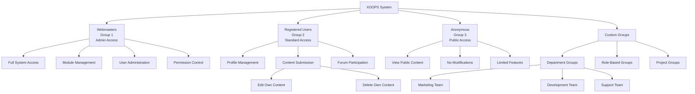
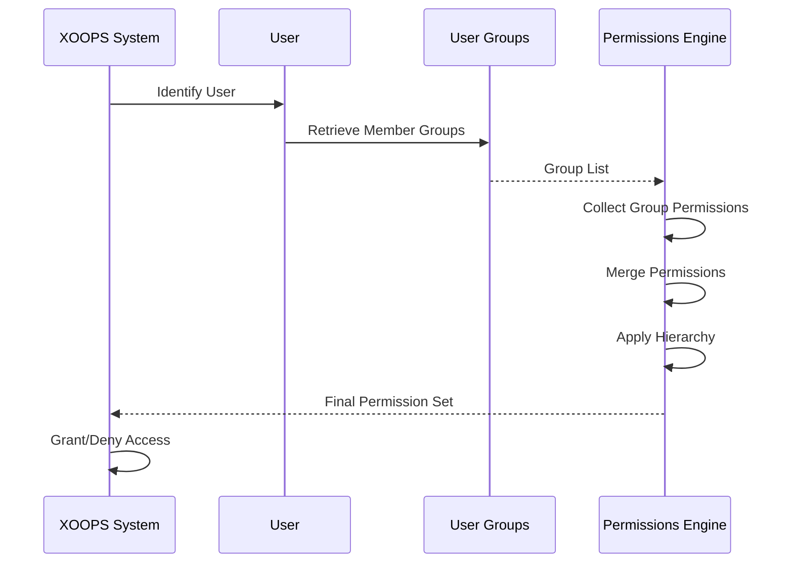

# Sistema di Gruppo in XOOPS

Il Sistema di Gruppo XOOPS fornisce un framework gerarchico per organizzare gli utenti e gestire i permessi collettivi. Questo documento copre i gruppi predefiniti, la creazione di gruppi personalizzati, la gerarchia e l'implementazione pratica.

## Gruppi Predefiniti

XOOPS include tre gruppi fondamentali che vengono creati durante l'installazione del sistema:

### Gruppo Webmaster (ID: 1)

Il gruppo Webmasters rappresenta gli amministratori del sito con accesso completo al sistema.

**Caratteristiche:**
- ID del gruppo: 1
- Livello di privilegio più alto
- Non può essere eliminato
- Accesso completo a tutti i moduli e le funzioni
- Accesso al pannello di amministrazione

```php
<?php
/**
 * Verifica se l'utente è webmaster
 */
$groupHandler = xoops_getHandler('group');
$group = $groupHandler->getGroup(1);
$webmasterUsers = $groupHandler->getUsersByGroup(1);

if ($xoopsUser instanceof XoopsUser) {
    $groups = $xoopsUser->getGroups();
    if (in_array(1, $groups)) {
        // L'utente è un webmaster
        echo "Welcome, Site Administrator!";
    }
}
```

### Gruppo Utenti Registrati (ID: 2)

Il gruppo Utenti Registrati include tutti gli utenti autenticati che non sono anonimi.

**Caratteristiche:**
- ID del gruppo: 2
- Gruppo predefinito per le nuove registrazioni
- Può accedere alle funzioni specifiche dell'utente
- Soggetto a permessi basati sul gruppo
- Può essere personalizzato per le funzioni utente standard

```php
<?php
/**
 * Verifica se l'utente è registrato (non anonimo)
 */
if ($xoopsUser instanceof XoopsUser) {
    // L'utente è connesso
    $groups = $xoopsUser->getGroups();
    if (in_array(2, $groups)) {
        // L'utente è nel gruppo registrato
        echo "Welcome, registered user!";
    }
}
```

### Gruppo Anonimo (ID: 3)

Il gruppo Anonimo rappresenta i visitatori non autenticati del sito.

**Caratteristiche:**
- ID del gruppo: 3
- Gruppo predefinito per gli utenti non connessi
- Accesso limitato di sola lettura tipicamente
- Non può modificare il contenuto
- Permessi di visualizzazione pubblica

```php
<?php
/**
 * Verifica se l'utente è anonimo
 */
if (!$xoopsUser instanceof XoopsUser) {
    // L'utente non è connesso
    echo "Public content only";
}

// Verifica alternativa usando il controllo del gruppo
$anonymousUsers = xoops_getHandler('group')->getUsersByGroup(3);
```

## Struttura del Gruppo

### Schema del Database

```sql
CREATE TABLE xoops_groups (
  group_id INT(11) NOT NULL AUTO_INCREMENT PRIMARY KEY,
  group_name VARCHAR(255) NOT NULL UNIQUE,
  group_description TEXT,
  group_type TINYINT(1) NOT NULL DEFAULT 0,
  group_active TINYINT(1) NOT NULL DEFAULT 1,
  created_at TIMESTAMP DEFAULT CURRENT_TIMESTAMP,
  updated_at TIMESTAMP DEFAULT CURRENT_TIMESTAMP ON UPDATE CURRENT_TIMESTAMP
);

CREATE TABLE xoops_group_users (
  group_id INT(11) NOT NULL,
  uid INT(11) NOT NULL,
  PRIMARY KEY (group_id, uid),
  FOREIGN KEY (group_id) REFERENCES xoops_groups(group_id) ON DELETE CASCADE,
  FOREIGN KEY (uid) REFERENCES xoops_users(uid) ON DELETE CASCADE
);
```

### Proprietà della Classe XoopsGroup

```php
class XoopsGroup
{
    protected $group_id;
    protected $group_name;
    protected $group_description;
    protected $group_type;
    protected $group_active;
    protected $created_at;
    protected $updated_at;
}
```

## Gerarchia del Gruppo

### Diagramma di Gerarchia



### Ereditarietà dei Permessi



## Creazione di Gruppi Personalizzati

### Gestore di Creazione del Gruppo

```php
<?php
/**
 * Gestione Personalizzata del Gruppo
 */
class GroupManager
{
    private $groupHandler;
    private $permissionHandler;

    public function __construct()
    {
        $this->groupHandler = xoops_getHandler('group');
        $this->permissionHandler = xoops_getHandler('permission');
    }

    /**
     * Crea un nuovo gruppo
     *
     * @param array $data Dati del gruppo
     * @return XoopsGroup|false Nuovo gruppo o false
     */
    public function createGroup(array $data)
    {
        // Valida l'input
        if (empty($data['group_name'])) {
            throw new Exception('Group name is required');
        }

        if (strlen($data['group_name']) < 3 || strlen($data['group_name']) > 255) {
            throw new Exception('Group name must be between 3 and 255 characters');
        }

        // Verifica se il gruppo esiste già
        $existing = $this->groupHandler->getByName($data['group_name']);
        if ($existing) {
            throw new Exception('Group already exists');
        }

        // Crea oggetto gruppo
        $group = $this->groupHandler->create();
        $group->setVar('group_name', $data['group_name']);
        $group->setVar('group_description', $data['group_description'] ?? '');
        $group->setVar('group_type', $data['group_type'] ?? 0);
        $group->setVar('group_active', $data['group_active'] ?? 1);

        // Salva il gruppo
        if ($this->groupHandler->insert($group)) {
            return $group;
        }

        return false;
    }

    /**
     * Aggiorna il gruppo
     *
     * @param int $groupId ID del gruppo
     * @param array $data Dati di aggiornamento
     * @return bool Stato di successo
     */
    public function updateGroup(int $groupId, array $data): bool
    {
        $group = $this->groupHandler->get($groupId);
        if (!$group) {
            return false;
        }

        // Impedisci la modifica dei gruppi predefiniti
        if (in_array($groupId, [1, 2, 3])) {
            if (isset($data['group_name']) && $data['group_name'] !== $group->getVar('group_name')) {
                throw new Exception('Cannot rename default groups');
            }
        }

        if (isset($data['group_name'])) {
            $group->setVar('group_name', $data['group_name']);
        }

        if (isset($data['group_description'])) {
            $group->setVar('group_description', $data['group_description']);
        }

        if (isset($data['group_active']) && !in_array($groupId, [1, 2, 3])) {
            $group->setVar('group_active', (int)$data['group_active']);
        }

        if (isset($data['group_type'])) {
            $group->setVar('group_type', (int)$data['group_type']);
        }

        return $this->groupHandler->insert($group);
    }

    /**
     * Aggiungi utente al gruppo
     *
     * @param int $uid ID utente
     * @param int $groupId ID del gruppo
     * @return bool Stato di successo
     */
    public function addUserToGroup(int $uid, int $groupId): bool
    {
        return $this->groupHandler->addUser($uid, $groupId);
    }

    /**
     * Rimuovi utente dal gruppo
     *
     * @param int $uid ID utente
     * @param int $groupId ID del gruppo
     * @return bool Stato di successo
     */
    public function removeUserFromGroup(int $uid, int $groupId): bool
    {
        return $this->groupHandler->removeUser($uid, $groupId);
    }

    /**
     * Ottieni i membri del gruppo
     *
     * @param int $groupId ID del gruppo
     * @return array Array di oggetti utente
     */
    public function getGroupMembers(int $groupId): array
    {
        return $this->groupHandler->getUsersByGroup($groupId);
    }

    /**
     * Ottieni i gruppi dell'utente
     *
     * @param int $uid ID utente
     * @return array Array di oggetti gruppo
     */
    public function getUserGroups(int $uid): array
    {
        return $this->groupHandler->getGroupsByUser($uid);
    }

    /**
     * Elimina il gruppo
     *
     * @param int $groupId ID del gruppo
     * @return bool Stato di successo
     */
    public function deleteGroup(int $groupId): bool
    {
        // Impedisci l'eliminazione dei gruppi predefiniti
        if (in_array($groupId, [1, 2, 3])) {
            throw new Exception('Cannot delete default groups');
        }

        // Rimuovi tutti gli utenti del gruppo prima
        $db = XoopsDatabaseFactory::getDatabaseConnection();
        $db->query("DELETE FROM xoops_group_users WHERE group_id = ?", array($groupId));

        // Elimina i permessi del gruppo
        $db->query("DELETE FROM xoops_group_permission WHERE group_id = ?", array($groupId));

        // Elimina il gruppo
        return $this->groupHandler->delete($groupId);
    }
}
```

## Assegnazione dei Permessi del Gruppo

### Assegnazione dei Permessi ai Gruppi

```php
<?php
/**
 * Assegnazione dei Permessi del Gruppo
 */
class GroupPermissionAssignment
{
    private $permissionHandler;
    private $groupHandler;
    private $moduleHandler;

    public function __construct()
    {
        $this->permissionHandler = xoops_getHandler('groupperm');
        $this->groupHandler = xoops_getHandler('group');
        $this->moduleHandler = xoops_getHandler('module');
    }

    /**
     * Concedi il permesso del modulo al gruppo
     *
     * @param int $groupId ID del gruppo
     * @param string $permission Nome del permesso
     * @param int $moduleId ID del modulo
     * @param array $itemIds ID degli elementi (opzionale)
     * @return bool Stato di successo
     */
    public function grantModulePermission(
        int $groupId,
        string $permission,
        int $moduleId,
        array $itemIds = []
    ): bool
    {
        if (empty($itemIds)) {
            // Concedi il permesso a livello di modulo
            return $this->permissionHandler->addRight(
                $permission,
                $groupId,
                $moduleId
            );
        } else {
            // Concedi i permessi a livello di elemento
            foreach ($itemIds as $itemId) {
                $this->permissionHandler->addRight(
                    $permission,
                    $groupId,
                    $moduleId,
                    $itemId
                );
            }
            return true;
        }
    }

    /**
     * Revoca il permesso del modulo dal gruppo
     *
     * @param int $groupId ID del gruppo
     * @param string $permission Nome del permesso
     * @param int $moduleId ID del modulo
     * @param array $itemIds ID degli elementi (opzionale)
     * @return bool Stato di successo
     */
    public function revokeModulePermission(
        int $groupId,
        string $permission,
        int $moduleId,
        array $itemIds = []
    ): bool
    {
        if (empty($itemIds)) {
            return $this->permissionHandler->deleteRight(
                $permission,
                $groupId,
                $moduleId
            );
        } else {
            foreach ($itemIds as $itemId) {
                $this->permissionHandler->deleteRight(
                    $permission,
                    $groupId,
                    $moduleId,
                    $itemId
                );
            }
            return true;
        }
    }

    /**
     * Verifica se il gruppo ha il permesso
     *
     * @param int $groupId ID del gruppo
     * @param string $permission Nome del permesso
     * @param int $moduleId ID del modulo
     * @param int $itemId ID dell'elemento (opzionale)
     * @return bool Stato del permesso
     */
    public function hasPermission(
        int $groupId,
        string $permission,
        int $moduleId,
        int $itemId = 0
    ): bool
    {
        return $this->permissionHandler->checkRight(
            $permission,
            $groupId,
            $moduleId,
            $itemId
        );
    }

    /**
     * Ottieni tutti i permessi per il gruppo nel modulo
     *
     * @param int $groupId ID del gruppo
     * @param int $moduleId ID del modulo
     * @return array Elenco dei permessi
     */
    public function getGroupModulePermissions(
        int $groupId,
        int $moduleId
    ): array
    {
        return $this->permissionHandler->getGroupPermissions(
            $groupId,
            $moduleId
        );
    }

    /**
     * Assegna più permessi contemporaneamente
     *
     * @param int $groupId ID del gruppo
     * @param array $permissions Dati sui permessi
     * @return bool Stato di successo
     */
    public function assignBulkPermissions(int $groupId, array $permissions): bool
    {
        try {
            foreach ($permissions as $perm) {
                $this->grantModulePermission(
                    $groupId,
                    $perm['permission'],
                    $perm['module_id'],
                    $perm['item_ids'] ?? []
                );
            }
            return true;
        } catch (Exception $e) {
            return false;
        }
    }
}
```

## Esempi Pratici

### Configurazione del Gruppo Reparto

```php
<?php
/**
 * Esempio: Configurazione dei gruppi di reparto
 */

$groupManager = new GroupManager();
$permissionAssigner = new GroupPermissionAssignment();

// Crea il gruppo Reparto Marketing
$marketingGroup = $groupManager->createGroup([
    'group_name' => 'Marketing Department',
    'group_description' => 'Marketing team members',
    'group_type' => 1,
    'group_active' => 1
]);

$marketingId = $marketingGroup->getVar('group_id');

// Crea il gruppo Reparto Sviluppo
$devGroup = $groupManager->createGroup([
    'group_name' => 'Development Department',
    'group_description' => 'Development team members',
    'group_type' => 1,
    'group_active' => 1
]);

$devId = $devGroup->getVar('group_id');

// Aggiungi utenti ai gruppi
$groupManager->addUserToGroup(5, $marketingId);
$groupManager->addUserToGroup(6, $marketingId);
$groupManager->addUserToGroup(7, $devId);
$groupManager->addUserToGroup(8, $devId);

// Assegna i permessi
// Marketing può visualizzare e inviare articoli
$permissionAssigner->grantModulePermission(
    $marketingId,
    'module_view',
    2  // Modulo articoli
);

$permissionAssigner->grantModulePermission(
    $marketingId,
    'module_submit',
    2
);

// Dev può accedere a tutti i strumenti di sviluppo
$permissionAssigner->grantModulePermission(
    $devId,
    'module_view',
    4  // Modulo sviluppatore
);

$permissionAssigner->grantModulePermission(
    $devId,
    'module_admin',
    4
);
```

### Verifica dei Gruppi Utente

```php
<?php
/**
 * Esempio: Verifica dell'appartenenza del gruppo utente
 */

$groupManager = new GroupManager();
$xoopsUser = $GLOBALS['xoopsUser'];

if ($xoopsUser instanceof XoopsUser) {
    $userGroups = $groupManager->getUserGroups($xoopsUser->getVar('uid'));

    // Verifica l'appartenenza a un gruppo specifico
    $isInMarketing = false;
    foreach ($userGroups as $group) {
        if ($group->getVar('group_name') === 'Marketing Department') {
            $isInMarketing = true;
            break;
        }
    }

    if ($isInMarketing) {
        echo "Welcome to Marketing!";
    }

    // Ottieni i nomi dei gruppi
    $groupNames = array_map(function($g) {
        return $g->getVar('group_name');
    }, $userGroups);

    echo "You are member of: " . implode(", ", $groupNames);
}
```

## Best Practice

### Organizzazione del Gruppo

1. **Nomi Chiari**: Usa nomi di gruppo descrittivi e chiari
2. **Documentazione**: Documenta gli scopi del gruppo e i permessi
3. **Principio del Minimo Privilegio**: Concedi solo i permessi necessari
4. **Audit Regolari**: Rivedi periodicamente l'appartenenza al gruppo e i permessi
5. **Gruppi Predefiniti**: Conserva i gruppi predefiniti (Webmaster, Registrato, Anonimo)

### Gestione dei Permessi

```php
<?php
/**
 * Best practice: Funzione di audit dei permessi
 */
class GroupAudit
{
    /**
     * Audit dei permessi del gruppo
     *
     * @param int $groupId ID del gruppo
     * @return array Rapporto di audit
     */
    public function auditGroupPermissions(int $groupId): array
    {
        $permissionHandler = xoops_getHandler('groupperm');
        $groupHandler = xoops_getHandler('group');
        $moduleHandler = xoops_getHandler('module');

        $group = $groupHandler->get($groupId);
        if (!$group) {
            return ['error' => 'Group not found'];
        }

        $modules = $moduleHandler->getList();
        $report = [
            'group_name' => $group->getVar('group_name'),
            'members_count' => count($groupHandler->getUsersByGroup($groupId)),
            'permissions_by_module' => []
        ];

        foreach ($modules as $moduleId => $moduleName) {
            $perms = $permissionHandler->getGroupPermissions($groupId, $moduleId);
            if (!empty($perms)) {
                $report['permissions_by_module'][$moduleName] = $perms;
            }
        }

        return $report;
    }
}
```

## Link Correlati

- User Management.md
- Permission System.md
- Authentication.md
- ../../Security/Security-Guidelines.md

## Tag

#groups #group-management #permissions #access-control #user-organization #hierarchy
