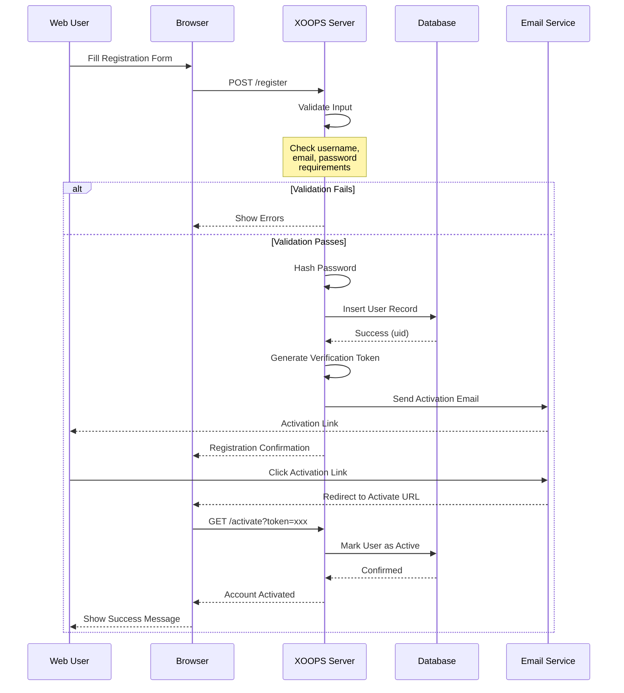
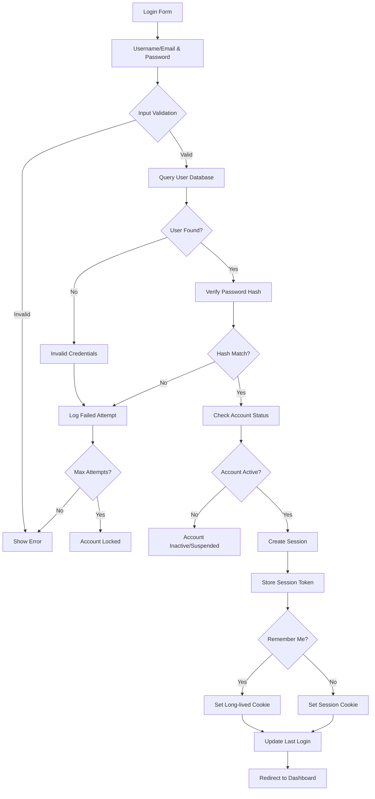

# Gestione dell'Utente in XOOPS

Il sistema di gestione dell'utente XOOPS fornisce un framework completo per la gestione della registrazione dell'utente, l'autenticazione, la gestione del profilo e le preferenze dell'utente. Questo documento copre la struttura dell'oggetto utente, i flussi di registrazione e esempi di implementazione pratica.

## Struttura dell'Oggetto Utente

L'oggetto utente principale in XOOPS è la classe `XoopsUser`, che racchiude tutti i dati dell'utente e i metodi.

### Schema del Database

```sql
CREATE TABLE xoops_users (
  uid INT(11) NOT NULL AUTO_INCREMENT PRIMARY KEY,
  uname VARCHAR(25) NOT NULL UNIQUE,
  email VARCHAR(60) NOT NULL,
  pass VARCHAR(255) NOT NULL,
  pass_expired DATETIME DEFAULT NULL,
  created_at TIMESTAMP DEFAULT CURRENT_TIMESTAMP,
  updated_at TIMESTAMP DEFAULT CURRENT_TIMESTAMP ON UPDATE CURRENT_TIMESTAMP,
  last_login DATETIME DEFAULT NULL,
  login_attempts INT(11) DEFAULT 0,
  user_avatar VARCHAR(255) NOT NULL DEFAULT 'blank.gif',
  user_regdate INT(11) NOT NULL DEFAULT 0,
  user_icq VARCHAR(15) NOT NULL DEFAULT '',
  user_from VARCHAR(100) NOT NULL DEFAULT '',
  user_sig TEXT,
  user_sig_smilies TINYINT(1) NOT NULL DEFAULT 1,
  user_viewemail TINYINT(1) NOT NULL DEFAULT 0,
  user_attachsig TINYINT(1) NOT NULL DEFAULT 0,
  user_theme VARCHAR(32) NOT NULL DEFAULT '',
  user_language VARCHAR(32) NOT NULL DEFAULT '',
  user_openid VARCHAR(255) NOT NULL DEFAULT '',
  user_notify_method TINYINT(1) NOT NULL DEFAULT 0,
  user_notify_interval INT(11) NOT NULL DEFAULT 0
);
```

### Proprietà della Classe XoopsUser

```php
class XoopsUser
{
    protected $uid;
    protected $uname;
    protected $email;
    protected $pass;
    protected $pass_expired;
    protected $created_at;
    protected $updated_at;
    protected $last_login;
    protected $login_attempts;
    protected $user_avatar;
    protected $user_regdate;
    protected $user_icq;
    protected $user_from;
    protected $user_sig;
    protected $user_sig_smilies;
    protected $user_viewemail;
    protected $user_attachsig;
    protected $user_theme;
    protected $user_language;
    protected $user_openid;
    protected $user_notify_method;
    protected $user_notify_interval;
}
```

## Flusso di Registrazione dell'Utente

### Diagramma della Sequenza di Registrazione



### Implementazione della Registrazione

```php
<?php
/**
 * Gestore della Registrazione dell'Utente
 */
class RegistrationHandler
{
    private $userHandler;
    private $configHandler;

    public function __construct()
    {
        $this->userHandler = xoops_getHandler('user');
        $this->configHandler = xoops_getHandler('config');
    }

    /**
     * Valida l'input di registrazione
     *
     * @param array $data Dati del modulo di registrazione
     * @return array Errori di validazione, vuoto se valido
     */
    public function validateInput(array $data): array
    {
        $errors = [];

        // Validazione del nome utente
        if (empty($data['uname'])) {
            $errors[] = 'Username is required';
        } elseif (strlen($data['uname']) < 3) {
            $errors[] = 'Username must be at least 3 characters';
        } elseif (!preg_match('/^[a-zA-Z0-9_-]+$/', $data['uname'])) {
            $errors[] = 'Username contains invalid characters';
        } elseif ($this->userHandler->getUserByName($data['uname'])) {
            $errors[] = 'Username already exists';
        }

        // Validazione dell'email
        if (empty($data['email'])) {
            $errors[] = 'Email is required';
        } elseif (!filter_var($data['email'], FILTER_VALIDATE_EMAIL)) {
            $errors[] = 'Invalid email format';
        } elseif ($this->userHandler->getUserByEmail($data['email'])) {
            $errors[] = 'Email already registered';
        }

        // Validazione della password
        if (empty($data['password'])) {
            $errors[] = 'Password is required';
        } elseif (strlen($data['password']) < 8) {
            $errors[] = 'Password must be at least 8 characters';
        } elseif ($data['password'] !== $data['password_confirm']) {
            $errors[] = 'Passwords do not match';
        }

        return $errors;
    }

    /**
     * Registra un nuovo utente
     *
     * @param array $data Dati di registrazione
     * @return XoopsUser|false Oggetto utente o false in caso di errore
     */
    public function registerUser(array $data)
    {
        // Valida l'input
        $errors = $this->validateInput($data);
        if (!empty($errors)) {
            return false;
        }

        // Crea oggetto utente
        $user = $this->userHandler->create();
        $user->setVar('uname', $data['uname']);
        $user->setVar('email', $data['email']);
        $user->setVar('user_regdate', time());

        // Hash della password usando bcrypt
        $hashedPassword = password_hash(
            $data['password'],
            PASSWORD_BCRYPT,
            ['cost' => 12]
        );
        $user->setVar('pass', $hashedPassword);

        // Imposta le preferenze predefinite
        $user->setVar('user_theme', $this->configHandler->getConfig('default_theme'));
        $user->setVar('user_language', $this->configHandler->getConfig('default_language'));

        // Salva l'utente
        if ($this->userHandler->insertUser($user)) {
            $uid = $user->getVar('uid');

            // Genera token di verifica
            $token = bin2hex(random_bytes(32));
            $this->saveVerificationToken($uid, $token);

            // Invia email di verifica
            $this->sendVerificationEmail($user, $token);

            return $user;
        }

        return false;
    }

    /**
     * Salva il token di verifica
     *
     * @param int $uid ID utente
     * @param string $token Token di verifica
     */
    private function saveVerificationToken(int $uid, string $token): void
    {
        $tokenHandler = xoops_getHandler('usertoken');
        $tokenHandler->saveToken($uid, $token, 'email_verification', 24); // 24 ore
    }

    /**
     * Invia l'email di verifica
     *
     * @param XoopsUser $user Oggetto utente
     * @param string $token Token di verifica
     */
    private function sendVerificationEmail(XoopsUser $user, string $token): void
    {
        global $xoopsConfig;

        $siteUrl = $xoopsConfig['siteurl'];
        $activationUrl = $siteUrl . '/user.php?op=activate&token=' . $token;

        $subject = 'Email Verification - ' . $xoopsConfig['sitename'];
        $body = "Hello " . $user->getVar('uname') . ",\n\n";
        $body .= "Please click the link below to verify your email:\n";
        $body .= $activationUrl . "\n\n";
        $body .= "This link will expire in 24 hours.\n\n";
        $body .= "Regards,\n" . $xoopsConfig['sitename'];

        $mailHandler = xoops_getHandler('mail');
        $mailHandler->send($user->getVar('email'), $subject, $body);
    }
}
```

## Processo di Autenticazione Utente

### Diagramma del Flusso di Autenticazione



### Implementazione dell'Autenticazione

```php
<?php
/**
 * Gestore dell'Autenticazione
 */
class AuthenticationHandler
{
    private $userHandler;
    private $maxLoginAttempts = 5;
    private $lockoutDuration = 900; // 15 minuti

    public function __construct()
    {
        $this->userHandler = xoops_getHandler('user');
    }

    /**
     * Autentica l'utente per nome utente/email e password
     *
     * @param string $username Nome utente o email
     * @param string $password Password in testo libero
     * @param bool $rememberMe Ricorda il login
     * @return XoopsUser|false Utente autenticato o false
     */
    public function authenticate(
        string $username,
        string $password,
        bool $rememberMe = false
    )
    {
        // Verifica il blocco dell'account
        if ($this->isAccountLocked($username)) {
            throw new Exception('Account temporarily locked due to failed login attempts');
        }

        // Trova l'utente per nome utente o email
        $user = $this->userHandler->getUserByName($username);
        if (!$user) {
            $user = $this->userHandler->getUserByEmail($username);
        }

        if (!$user) {
            $this->recordFailedAttempt($username);
            return false;
        }

        // Verifica la password
        if (!password_verify($password, $user->getVar('pass'))) {
            $this->recordFailedAttempt($username);
            return false;
        }

        // Verifica lo stato dell'account
        if ($user->getVar('level') == 0) {
            throw new Exception('Account is inactive');
        }

        // Cancella i tentativi falliti
        $this->clearFailedAttempts($user->getVar('uid'));

        // Aggiorna l'ultimo login
        $user->setVar('last_login', date('Y-m-d H:i:s'));
        $this->userHandler->insertUser($user);

        // Crea la sessione
        $this->createSession($user, $rememberMe);

        return $user;
    }

    /**
     * Crea una sessione autenticata
     *
     * @param XoopsUser $user Oggetto utente
     * @param bool $rememberMe Abilita il login persistente
     */
    private function createSession(XoopsUser $user, bool $rememberMe = false): void
    {
        // Genera token di sessione
        $token = bin2hex(random_bytes(32));

        $_SESSION['xoopsUserId'] = $user->getVar('uid');
        $_SESSION['xoopsUserName'] = $user->getVar('uname');
        $_SESSION['xoopsSessionToken'] = $token;
        $_SESSION['xoopsSessionCreated'] = time();

        // Archivia il token nel database per la validazione
        $this->storeSessionToken($user->getVar('uid'), $token);

        if ($rememberMe) {
            // Crea il cookie di login persistente (14 giorni)
            $cookieToken = bin2hex(random_bytes(32));
            setcookie(
                'xoops_persistent_login',
                $cookieToken,
                time() + (14 * 24 * 60 * 60),
                '/',
                '',
                true,  // Solo HTTPS
                true   // HttpOnly
            );

            // Archivia l'hash del token del cookie
            $this->storePersistentToken(
                $user->getVar('uid'),
                hash('sha256', $cookieToken)
            );
        }
    }

    /**
     * Registra un tentativo di login fallito
     *
     * @param string $username Nome utente o email
     */
    private function recordFailedAttempt(string $username): void
    {
        $key = 'login_attempt_' . md5($username);
        $attempts = apcu_fetch($key) ?: 0;
        apcu_store($key, $attempts + 1, $this->lockoutDuration);
    }

    /**
     * Verifica se l'account è bloccato
     *
     * @param string $username Nome utente o email
     * @return bool True se bloccato
     */
    private function isAccountLocked(string $username): bool
    {
        $key = 'login_attempt_' . md5($username);
        $attempts = apcu_fetch($key) ?: 0;
        return $attempts >= $this->maxLoginAttempts;
    }

    /**
     * Cancella i tentativi falliti
     *
     * @param int $uid ID utente
     */
    private function clearFailedAttempts(int $uid): void
    {
        $user = $this->userHandler->getUser($uid);
        $user->setVar('login_attempts', 0);
        $this->userHandler->insertUser($user);
    }

    /**
     * Archivia il token di sessione
     *
     * @param int $uid ID utente
     * @param string $token Token di sessione
     */
    private function storeSessionToken(int $uid, string $token): void
    {
        // Archivia nel database o cache
        $tokenData = [
            'uid' => $uid,
            'token' => hash('sha256', $token),
            'created' => time(),
            'expires' => time() + (8 * 60 * 60) // 8 ore
        ];

        $db = XoopsDatabaseFactory::getDatabaseConnection();
        $db->query("INSERT INTO xoops_sessions (uid, token, created, expires)
                   VALUES (?, ?, ?, ?)",
                   array($uid, $tokenData['token'], $tokenData['created'], $tokenData['expires']));
    }
}
```

## Gestione del Profilo

### Implementazione dell'Aggiornamento del Profilo

```php
<?php
/**
 * Gestione del Profilo Utente
 */
class ProfileManager
{
    private $userHandler;
    private $avatarHandler;

    public function __construct()
    {
        $this->userHandler = xoops_getHandler('user');
        $this->avatarHandler = xoops_getHandler('avatar');
    }

    /**
     * Aggiorna il profilo utente
     *
     * @param int $uid ID utente
     * @param array $data Dati del profilo
     * @return bool Stato di successo
     */
    public function updateProfile(int $uid, array $data): bool
    {
        $user = $this->userHandler->getUser($uid);
        if (!$user) {
            return false;
        }

        // Aggiorna i campi del profilo
        if (isset($data['email'])) {
            // Verifica che l'email sia unica (escludendo l'utente corrente)
            $existingUser = $this->userHandler->getUserByEmail($data['email']);
            if ($existingUser && $existingUser->getVar('uid') !== $uid) {
                throw new Exception('Email already in use');
            }
            $user->setVar('email', $data['email']);
        }

        if (isset($data['user_icq'])) {
            $user->setVar('user_icq', sanitize_text_field($data['user_icq']));
        }

        if (isset($data['user_from'])) {
            $user->setVar('user_from', sanitize_text_field($data['user_from']));
        }

        if (isset($data['user_sig'])) {
            $sig = $data['user_sig'];
            if (strlen($sig) > 500) {
                throw new Exception('Signature too long');
            }
            $user->setVar('user_sig', $sig);
        }

        if (isset($data['user_sig_smilies'])) {
            $user->setVar('user_sig_smilies', (int)$data['user_sig_smilies']);
        }

        if (isset($data['user_viewemail'])) {
            $user->setVar('user_viewemail', (int)$data['user_viewemail']);
        }

        if (isset($data['user_attachsig'])) {
            $user->setVar('user_attachsig', (int)$data['user_attachsig']);
        }

        if (isset($data['user_theme'])) {
            $user->setVar('user_theme', $data['user_theme']);
        }

        if (isset($data['user_language'])) {
            $user->setVar('user_language', $data['user_language']);
        }

        return $this->userHandler->insertUser($user);
    }

    /**
     * Cambia la password dell'utente
     *
     * @param int $uid ID utente
     * @param string $currentPassword Password attuale
     * @param string $newPassword Nuova password
     * @return bool Stato di successo
     */
    public function changePassword(
        int $uid,
        string $currentPassword,
        string $newPassword
    ): bool
    {
        $user = $this->userHandler->getUser($uid);
        if (!$user) {
            return false;
        }

        // Verifica la password attuale
        if (!password_verify($currentPassword, $user->getVar('pass'))) {
            throw new Exception('Current password is incorrect');
        }

        // Valida la nuova password
        if (strlen($newPassword) < 8) {
            throw new Exception('New password must be at least 8 characters');
        }

        // Hash della nuova password
        $hashedPassword = password_hash($newPassword, PASSWORD_BCRYPT, ['cost' => 12]);
        $user->setVar('pass', $hashedPassword);

        return $this->userHandler->insertUser($user);
    }

    /**
     * Ottieni i dati del profilo utente
     *
     * @param int $uid ID utente
     * @return array Dati del profilo
     */
    public function getProfile(int $uid): array
    {
        $user = $this->userHandler->getUser($uid);
        if (!$user) {
            return [];
        }

        return [
            'uid' => $user->getVar('uid'),
            'uname' => $user->getVar('uname'),
            'email' => $user->getVar('email'),
            'user_regdate' => $user->getVar('user_regdate'),
            'user_icq' => $user->getVar('user_icq'),
            'user_from' => $user->getVar('user_from'),
            'user_sig' => $user->getVar('user_sig'),
            'user_viewemail' => $user->getVar('user_viewemail'),
            'user_attachsig' => $user->getVar('user_attachsig'),
            'user_theme' => $user->getVar('user_theme'),
            'user_language' => $user->getVar('user_language'),
            'last_login' => $user->getVar('last_login'),
            'avatar' => $user->getVar('user_avatar')
        ];
    }
}
```

## Operazioni Utente Comuni

```php
<?php
/**
 * Esempi di operazioni utente comuni
 */

// Ottieni l'utente attualmente connesso
$xoopsUser = $GLOBALS['xoopsUser'];
if ($xoopsUser instanceof XoopsUser) {
    $userId = $xoopsUser->getVar('uid');
    $username = $xoopsUser->getVar('uname');
}

// Ottieni l'utente per ID
$userHandler = xoops_getHandler('user');
$user = $userHandler->getUser(1);
echo $user->getVar('uname');

// Ottieni l'utente per nome utente
$user = $userHandler->getUserByName('admin');
if ($user) {
    echo $user->getVar('email');
}

// Ottieni l'utente per email
$user = $userHandler->getUserByEmail('user@example.com');

// Ottieni tutti gli utenti in un gruppo
$users = $userHandler->getUsersByGroup(1);
foreach ($users as $user) {
    echo $user->getVar('uname') . "\n";
}

// Crea un nuovo utente
$user = $userHandler->create();
$user->setVar('uname', 'newuser');
$user->setVar('email', 'newuser@example.com');
$user->setVar('pass', password_hash('password', PASSWORD_BCRYPT));
$user->setVar('user_regdate', time());

if ($userHandler->insertUser($user)) {
    echo "User created: " . $user->getVar('uid');
}

// Elimina l'utente
$userHandler->deleteUser(123);

// Ottieni l'oggetto utente dall'ID
$user = $userHandler->getUser(5);
$profile = [
    'username' => $user->getVar('uname'),
    'email' => $user->getVar('email'),
    'regdate' => date('Y-m-d', $user->getVar('user_regdate')),
    'avatar' => $user->getVar('user_avatar'),
];
```

## Best Practice di Sicurezza

### Sicurezza della Password

- Usa sempre `password_hash()` con algoritmo `PASSWORD_BCRYPT`
- Usa il parametro cost di 12 per bcrypt
- Non archiviare mai le password in testo libero
- Implementa le politiche di scadenza della password
- Richiedi i cambi di password per gli account compromessi

### Sicurezza della Sessione

```php
<?php
// Configurazione della sessione
session_set_cookie_params([
    'lifetime' => 0,           // Cookie di sessione (cancellato alla chiusura del browser)
    'path' => '/',
    'domain' => '',
    'secure' => true,          // Solo HTTPS
    'httponly' => true,        // Non accessibile a JavaScript
    'samesite' => 'Strict'     // Protezione CSRF
]);

session_start();

// Rigenera l'ID di sessione dopo il login
session_regenerate_id(true);

// Valida il token di sessione
if (!isset($_SESSION['xoopsSessionToken'])) {
    session_destroy();
    redirect('login');
}
```

## Link Correlati

- Group System.md
- Permission System.md
- Authentication.md
- ../../Security/Security-Guidelines.md

## Tag

#users #registration #authentication #profiles #password-security #sessions
